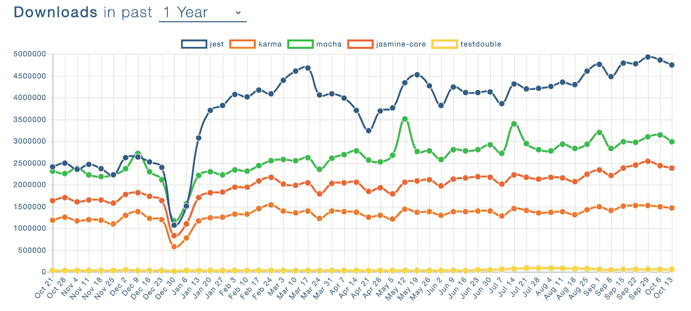

# Jest —如何在 TypeScript 中使用 Extend

> 原文：<https://javascript.plainenglish.io/jest-how-to-use-extend-with-typescript-4011582a2217?source=collection_archive---------1----------------------->


Jest 是目前最流行的 JavaScript 测试库。编写测试代码以确保稳定性和可信性变得越来越重要。



[NPM download counts of Jest with other testing libraries](https://www.npmtrends.com/jest-vs-karma-vs-mocha-vs-jasmine-core-vs-testdouble)

基本上，`jest`允许您测试各种条件，包括异步调用。但是如果你想根据你的条件来检查代码呢？在我的例子中，问题是“我如何确定来自服务器 API 调用的响应是否总是与 JSON 模式相同？”。任何时候都可能不同，这取决于您需要什么类型的数据，尤其是当您调用机票 API 或住宿搜索 API 时。

然后我意识到有一个很有用的特性，叫做`extend`。

# 设置您的项目

好了，现在言归正传！:)

首先，创建包含所有相关文件的项目文件夹。

```
npm init -y
```

安装我们需要的所有软件包。

```
npm i -D jest ts-jest typescript @types/jest// package.json
"scripts": {
  "test": "jest"
}
```

> `[*ts-jest*](https://www.npmjs.com/package/ts-jest)`是一个 TypeScript 预处理器，支持 Jest 的源代码映射，允许你使用 Jest 来测试用 TypeScript 编写的项目。

最后，制作文件夹。

```
mkdir src && cd src
mkdir __tests__
mkdir typings
mkdir example
```

您的项目的层次结构应该如下所示。如果到目前为止您已经很好地遵循了这些步骤，那么现在您已经准备好了！

```
node_modules
src
|--- __tests__
|--- example
|--- typings
package-lock.json
package.json
```

# 编写配置文件

现在，我们应该让 TypeScript 明白，您将在您的测试代码中使用定制的函数。为此，有一些小事要做。

在你的根文件夹中创建`jest.config.js`和`tsconfig.json`。它将在测试运行时被`jest`和`typescript`自动抓取并使用。您可以将这些配置放入您的`package.json`中。更多信息，请点击 [*配置 Jest*](https://jestjs.io/docs/en/configuration#docsNav) 。

```
touch jest.config.js
cd src && touch tsconfig.json
```

# 简单测试代码

现在让我们从我们更熟悉的基本简单测试代码开始。

```
cd src && cd example
touch math.ts
```

并创建测试文件，我们将测试我们刚刚创建的`math.ts`文件。确保文件名中包含`spec`。

```
cd __tests__
touch math.spec.ts
```

`mockedAdd`是一个 spy 函数，我们可以使用它来跟踪其初始函数实现的使用情况，这就是`math.add`。关于 Jest 中间谍功能的更多信息， [*点击此处 Jest Doc*](https://jestjs.io/docs/en/jest-object#jestspyonobject-methodname) 。

注意检查 *expect()* 中的值有不同的方式。您可以使用 spy 函数和从原始实现返回的值，或者使用模拟对象，该模拟对象具有跟踪初始实现的*调用*和*结果*对象。

但是，如果您只希望测试代码在值为奇数时成功，该怎么办呢？应该这样写吗？

```
if (num % 2 === 1) {
  expect(num).toBe(yourOdd);
} else {
  expect(num).not.toBe(yourOdd);
}
```

不建议将`expect`放在 *if-else* 中，这是假设。

在这种情况下，有一个对你有用的功能。

# expect.extend()

`jest`允许您添加额外定制的*匹配器*。为了让`jest`知道你的自定义*匹配器*在哪里，以及应该如何处理它们，我们需要创建一个类型化文件。

我们要做一个函数来检查 *expect()* 中的值是否是奇数。

```
cd src && cd typings
touch index.d.ts
```

所以目录层次应该是这样的。

```
node_modules
src
|--- __tests__
|    |
|    |--- math.spec.ts
|--- example
|    |
|    |--- math.ts
|--- typings
|    |
|    |--- index.d.ts
|
|--- tsconfig.json
jest.config.js
package-lock.json
package.json
```

即使我们在 *typings* 文件夹中创建了类型化文件，类型化文件也不会影响您的测试代码。它只是让`typescript`知道在`jest`的*匹配器*中会有一个名为`toBeOdd`的功能。

我们应该把这个脚本添加到`math.spec.ts`中。

我们新的扩展匹配器`toBeOdd`没有参数，但是*收到了*。收到的参数*指的是你放入 *expect()* 中的值。在这种情况下，每次都是 2 和 3。*

*如果要把一些参数折腾给`toBeOdd`，那么配置应该是这样的。*

```
*// index.d.ts
declare global {
  ...
  interface matchers<R> { 
    toBeOdd(a: number): R;
  }
}// math.spec.ts
expect.extend({
  toBeOdd(received, a) {
    .. do something
  }
});it('..', () => {
  /* *received will be 3, and a will be 2* */
  expect(3).toBeOdd(2);
})*
```

**匹配器*、*消息*和*通过*返回两个值。*

> *消息—一个不带任何参数的函数。当测试失败时，它会显示一条消息。*
> 
> *pass 决定何时在消息函数中显示错误消息的布尔类型值。*

*如果*通过*为真，那么*匹配器*在`expect(value).not.toBeOdd()`失败时将调用*消息*功能，反之，如果*通过*为假，则`expect(value).toBeOdd()`失败时将调用消息功能。*

```
*/*
* pass: false
* Since 2 isn't an odd number, it fails and the error from message 
* function will be 
* expected 2 not to be an odd number
*/
expect(2).toBeOdd();/*
* pass: true
* Since 1 is an odd number, it fails and the error from message 
* function will be 
* expected 1 to be an odd number
*/
expect(1).not.toBeOdd();*
```

# *完整测试代码*

```
*npm run test math*
```

# *结论*

*JavaScript 测试库可以在项目发布之前确保您的代码。但是有时候，在你使用的测试库中，不会有适合你的情况的完美匹配器。所以，这个特性将使你的测试代码更加灵活。*