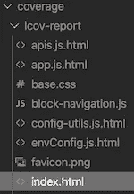
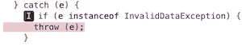
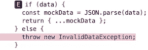
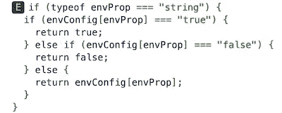
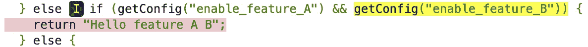

# Jest 测试驱动开发的真实例子

> 原文：<https://javascript.plainenglish.io/jest-in-real-life-e8e9e40e1faa?source=collection_archive---------2----------------------->

## 我们在所有项目中都发现了一些场景。


Photo by [Marvin Meyer](https://unsplash.com/@marvelous?utm_source=unsplash&utm_medium=referral&utm_content=creditCopyText) on [Unsplash](https://unsplash.com/s/photos/tech?utm_source=unsplash&utm_medium=referral&utm_content=creditCopyText)

**测试**测试`**Try-Catch**`

`try-catch`是我们项目中最常用的语句，我们必须测试它们。

让我们举一个例子，当数据无效时，解析 JSON 数据并抛出错误。

```
// @file validation.jsexport class InvalidDataException {
 constructor() {
  this.message = "invalid data";
  this.name = "InvalidDataException";
 }
}export const validateData = (data) => {
 try {
  if (data) {
   const mockData = JSON.parse(data);
   return { ...mockData };
  } else {
   throw new InvalidDataException;
  }
 } catch (e) {
  if (e instanceof InvalidDataException) {
   throw (e);
  } return e;
 }
};
```

*   当数据为`undefined`时，我们抛出一个自定义错误(`InvalidDataException`
*   一个`if`条件为`catch`自定义错误和`return`其他错误。

```
// @file validation.test.jsimport { InvalidDataException, validateData } from “./validation”;describe(“test validateData”, () => {
 it(“should return valid data”, () => {
    const data = JSON.stringify({ "id": "1234" });
    expect(validateData(data)).toMatchObject({ id: "1234" });
 }); it(“should throw and catch error”, () => {
  const errObj = validateData(“hello world”);
  expect(errObj instanceof Error).toBe(true); const validate = () => {
   validateData();
  }; expect(validate).toThrowError(InvalidDataException);
  expect(validate).toThrowError(new Error(“invalid data”));
  expect(validate).toThrowError(“invalid data”);
 });
});
```

*   我们涵盖了 3 个测试，包括有效数据、无效数据和无数据。
*   我们可以用自定义的`Constructor`或`Error Object`或者仅仅是消息来测试`throw ()`。

`**mock()**`**vs**`**doMock()**`

**吊装**
`babel-plugin-jest-hoist: The module factory of `jest.mock()` is not allowed to reference any out-of-scope variables.`

`doMock()`不像`mock()`那样被提升到顶层，这意味着`doMock()`可以访问顶层的变量。

**与** `**jest.resetModules()**`
配合使用时，被模仿的模块需要复位。

**用法**

*   当我们使用`module-factory`进行静态设置并且可以跨多个文件使用时，使用`mock()`。同样，当模块为`auto-mocked`且函数返回单个值时。
*   当我们需要在同一个文件中模拟不同的模块时，使用`doMock()`。

**嘲讽大众** `**modules**`

假设我们想要基于某个浏览器或平台执行特定的任务，并使用公共模块来帮助检测。

```
// @file style-utils.jsimport { Platform } from "react-native";export const getFontSize = () => {
 if (Platform.OS === "android") {
  return { fontSize: 14 };
 } else {
  return { fontSize: 16 };
 }
}
```

*   在上面的例子中，我们有一个函数`getFontSize()`，它返回平台的样式。
*   嘲讽`Platform` API 返回“android”等值。

```
// @file style-utils.test.jsjest.mock("react-native", () => ({
 Platform: {
  OS: "android"
 }
}));import { getFontSize } from "./style-utils";describe("Mocking Platform", () => {
 it("should return fontSize for Android", () => {
  expect(getFontSize()).toMatchObject({ fontSize: 14 });
 });
});
```

*   `jest.mock()`库`react-native`库。
*   将一个显式的`module-factory`传递给`return`“Android”。

请注意，模块的`jest.mock()`可以在一个单独的文件中，然后在 Jest 配置的`setupFiles: []`中使用。

**简单使用** `**mockImplementation()**`

我们都喜欢 API，在网络世界中我们有 Web API。假设我们有一个 API，它返回一个条目列表。

```
// @file apis.jsimport axios from "axios";export const getEmpList = () => axios.get("https://run.mocky.io/v3/f26083fa-a253-48a8-8c4c-cf6bf1b1f98f")
 .then(res => res.data)
 .catch(e => e);
```

对于 HTTP 请求，我们有`[axios](https://github.com/axios/axios)`模块和模拟 API ( [mocky.io](https://designer.mocky.io/) )，它们将返回 3 项。

```
// @file apis.test.jsimport { getEmpList } from "./apis";describe("Test Fetch API", () => {
 beforeEach(() => {
  jest.resetModules();
 }); it("should return 3 items", async () => {
  const response = await(getEmpList());
  expect(response.length).toBe(3);
 });it("should return success response", async () => {
  const { getEmpList } = require("./apis");
  jest.mock("axios"); const axios = require("axios");
  const mockResponse = { data: { greet: "Hello World" } }; axios.get.mockImplementation(() => Promise.resolve(mockResponse));

  const res = await (getEmpList()); 
  expect(res).toMatchObject({ greet: "Hello World" });
 });it("should return error response", async () =>{
  jest.mock("axios");
  const axios = require("axios"); axios.get.mockImplementation(() => Promise.reject(new Error("something went wrong"))); const { getEmpList } = require("./apis");
  const err = await (getEmpList()); expect(err.message).toBe("something went wrong");
 });
});
```

请注意，我们也可以用`doMock()`实现上述测试。

*   我们涵盖了 3 个测试，包括原始调用、模仿成功响应和模仿错误响应。
*   `jest.resetModules()`获得`getEmpList()`的一个新实例，它在每个单独的测试或`it()`中是不同的。

**模拟环境配置**

每个应用程序都使用环境属性或变量。我们可以使用这些属性来呈现不同语言的网页或屏幕，开关来启用或禁用某个功能，设置 API 调用的超时时间等。

```
// @file envConfig.jsexport const envConfig = {
 "enable_feature_A": "false",
 "enable_feature_B": "true",
 "locale": "en-US",
 "country": "US"
};
```

下面是一个示例环境配置和一个返回配置变量值的函数。

```
// @file config-utils.jsexport const getConfig = (envProp) => {
 if (typeof envProp === "string") {
  if (envConfig[envProp] === "true") {
   return true;
  } else if (envConfig[envProp] === "false") {
   return false;
  } else {
   return envConfig[envProp];
  }
 }
};
```

测试环境配置。

```
// @file config-utils.test.jsdescribe("test getConfig", () => {
 beforeEach(() => {
  jest.resetModules();
 }); it("should return undefined", () => {
  const { getConfig } = require("../config-utils");
  expect(getConfig(123)).toBe(undefined);
 });it("should return false for feature_A switch", () => {
  jest.doMock("./envConfig", () => ({
   envConfig: {
    "enable_feature_A": "false"
   }
  })); const { getConfig } = require("./config-utils");
  expect(getConfig("enable_feature_A")).toBe(false);
 });it("should return true for feature_B switch", () => {
  jest.doMock("./envConfig", () => ({
   envConfig: {
    "enable_feature_B": "true"
   }
  }));

  const { getConfig } = require("./config-utils");
  expect(getConfig("enable_feature_B")).toBe(true);
 });
});
```

假设我们有一个名为 App 的组件，这个函数使用`getConfig`基于特性检查返回一些数据。

```
// @file app.jsimport { getConfig } from "../getConfig";export const app = () => {
 if (getConfig("enable_feature_A")) {
  return "Hello feature A";
 } else {
  return "Hello World !!";
 }
};
```

最后测试 app 组件。

```
// @file app.test.jsjest.mock("../config-utils");import { getConfig } from "../config-utils";describe("test app", () => {
 it("should render feature A", () => {
  getConfig.mockReturnValue(true);
  const { app } = require("../app"); expect(app()).toBe("Hello feature A");
 }); it("should render hello world", () => {
  const { app } = require("../app"); getConfig.mockReturnValue(false);
  expect(app()).toBe("Hello World !!");
 });
});
```

*   模仿`getConfig`并返回值。
*   `resetModules()`不是模拟值所必需的，并且`app`实例在单个测试中。
*   函数可以是`auto-mocked`，但是对于模拟值，我们需要`module-factory`。

## **招数&招数**

**覆盖率**
我们都知道如何配置 Jest 覆盖率。但是非 GUI 报告有时信息不够丰富，不能让你深入了解被覆盖和未被覆盖的代码行。



`jest --coverage`在根目录下创建一个名为`coverage`的文件夹，子文件夹`Icov-report`托管`index.html`。这是 HTML 格式的报道，可以在浏览器中查看。

**保险范围中** `**I**` **代表什么？**



*   `I`指“若闭塞不在保障范围内”。
*   该块以红色突出显示。

**保险范围中** `**E**` **代表什么？**



*   `E`表示“其他未覆盖的区块”。
*   该块以红色高亮显示，**如果存在**。



**部分覆盖**



*   当我们承保部分`if`疾病或`ternary`疾病时。
*   未覆盖的代码以黄色突出显示。

## **理想的承保门槛是什么？**

100%?我知道我很乐观，但我相信任何高于 85%的都应该是好的。

就这样！

我想感谢你花时间阅读这篇文章。我一直相信有更好的方法去做事情。因此，如果您留下您的评论/建议，我将不胜感激。