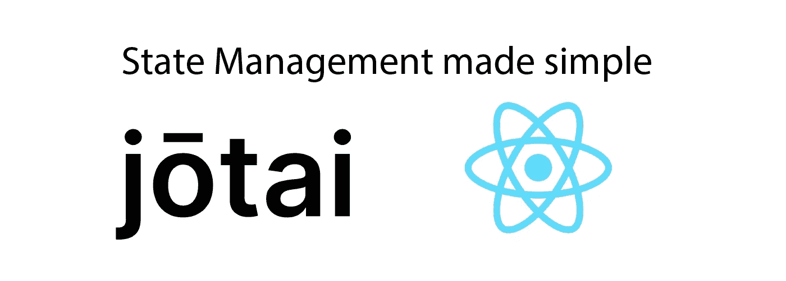

# jotai——React 的简单状态管理

> 原文：<https://javascript.plainenglish.io/jotai-simple-state-management-for-react-b9318b0f7616?source=collection_archive---------1----------------------->

## 快速设置，小巧灵活



Jotai 是 React.js 中一个简单的无状态管理库，它的工作方式类似于 useState Hook，这使得它非常容易使用。它也是打字稿友好的，可以在几秒钟内设置好。

先开始安装 Jotai 吧。

```
*yarn add jotai* 
```

为了能够在整个应用程序中使用状态，我们需要提供者。只需将其添加到 index.js 中，如下所示:

```
*import* { Provider } *from* "jotai"ReactDOM.render(
  <Provider>
    <App />
  </Provider>,
  document.getElementById(‘root’)
);
```

这就是我们目前所需要的。我们可以通过创建一个 atom 来直接开始使用 Jotai。恰当选择的名称是库中最小的单元——每个状态都有自己的原子。对于原子，我们也直接传递状态的默认值。让我们建立一个国家。

# 基础——原子

在 Jotai 中，一个*原子*是一个单一独立的状态。

它应该在组件函数之外定义。此外，还有 *useAtom* 函数，其工作原理类似于钩子。这个函数也依赖于一个原子——它将原子作为参数获取。

这是与*使用状态*挂钩的区别。使用 *useState* 我们直接传递默认值，在 Jotai 中，我们将一个原子传递给 *useAtom* 。

我们应该在构件之外创造原子；从内部，我们可以用类似于使用状态的 *useAtom* 来访问它。

```
*import* { useAtom, atom } *from* “jotai”const inputAtom = atom(“”)function App() {
  const [input, setInput] = useAtom(inputAtom)
  *return* (
    <>
      <p>{input}</p>
      <input type=”text” placeholder=”enter something” />
    </>
  );
}
```

*使用状态*强烈提醒*使用状态*。和 *useState* 一样，第一个元素是状态本身，因为我们可以在 DOM 中输出，它返回的第二个元素是一个函数，它获取新的状态作为参数。

所以现在我们可以写一个函数来改变每个输入的状态。

```
const inputAtom = atom(“”)function App() {
  const [input, setInput] = useAtom(inputAtom) function handleChange(event) {
    setInput(event.target.value)
  } *return* (
    <>
      <p>{input}</p>
      <input type=”text” onChange={handleChange} />
    </>
  );
}
```

由于有了 *onChange* 属性，每次更改输入字段的内容时都会调用 *handleChange* 函数。用户输入总是存储在事件对象中。最后，我们只需用 *useState* 覆盖状态。

因为我们为输入状态定义了 atom，即组件函数外部的 *inputAtom* ，所以我们可以创建其他基于函数的组件并访问其中的状态。
每个函数都有自己的 *useAtom* ，它从 atom *inputAtom 获取状态。*

所以现在，我们构建一个组件来显示状态。

```
const inputAtom = atom(“”)function DisplayInput() {
  const [input, setInput] = useAtom(inputAtom)
  *return* <p>User input: {input}</p>
}
```

我们现在可以在我们的应用程序组件中呈现*显示输入*；它显示当前状态。

# 移出状态—单个文件中的多个组件

到目前为止，一切都很好——但是在现实中，我们很难在一个文件中拥有很多自己的组件。
通常，我们会为每个组件创建一个单独的文件，但仍然希望随时随地访问应用程序的状态。

我们可以通过将原子本身存储在一个文件中来实现这一点。我把这个文件叫做 state.js，它有以下内容:

```
*import* { atom } *from* “jotai”const inputAtom = atom(“”)*export* *default* inputAtom
```

剩下的就简单了。从 state.js 导入 atom，并像以前一样使用它:

```
*import* inputAtom *from* “./state”function App() {
  const [input, setInput] = useAtom(inputAtom) function saveUserinput(event) {
    setInput(event.target.value)
  }
```

由于我们无法获得应用程序组件中原子的状态，我们也可以将其设置为只写。为此，我们只需拿出输入:
`const [, setInput] = useAtom(inputAtom)`

因此，我们也可以在应用程序组件中使用状态。当然，在我们的*显示输入*组件中，我为其创建了一个**。js** 文件同名。

```
*import* { useAtom } *from* “jotai”
*import* inputAtom *from* “./state”const DisplayInput = () => {
  const [input] = useAtom(inputAtom)
  *return* <p>User Input: {input}</p>
}
```

最后，如上所示，我们还可以在 App.js 中包含 *DisplayInput* 组件，并在那里呈现它。

几个组件现在引用同一个状态；一切都很顺利——我们已经实现了一个可以在整个应用程序中访问和更改的状态。超级酷简单吧？而且没有 Redux。

如果您对发现 React.js 的更多库感兴趣:

[](https://medium.com/javascript-in-plain-english/5-awesome-react-packages-you-need-to-try-out-20a156d3d73e) [## 你需要尝试的 5 个很棒的 React 包

### 预渲染，有用的钩子，加载动画，颜色选择器&访问头部区域。由 5 位伟大的…

medium.com](https://medium.com/javascript-in-plain-english/5-awesome-react-packages-you-need-to-try-out-20a156d3d73e) 

[加入我的邮件列表，保持联系](http://eepurl.com/hacY0v)


[Subscribe to Decoded, our official YouTube channel!](https://www.youtube.com/channel/UCtipWUghju290NWcn8jhyAw)