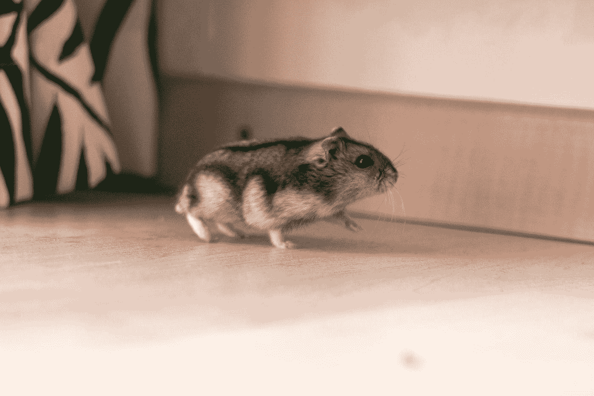

# jQuery 技巧——超薄包，正反两面，复制到剪贴板

> 原文：<https://javascript.plainenglish.io/jquery-tips-slim-package-each-and-reverse-copy-to-clipboard-2b179dd6b3d5?source=collection_archive---------11----------------------->



Photo by [Frenjamin Benklin](https://unsplash.com/@frenjaminbenklin?utm_source=medium&utm_medium=referral) on [Unsplash](https://unsplash.com?utm_source=medium&utm_medium=referral)

尽管年代久远，jQuery 仍然是操纵 DOM 的流行库。

在本文中，我们将了解一些使用 jQuery 的技巧。

# 使用 jQuery。向后迭代的 each()

要调用`each`向后遍历数组，我们可以使用`reverse`方法来反转项目。

例如，我们可以写:

```
$($("li").get().reverse()).each(function() { 
  /* ... */ 
});
```

我们获取所有的 li 元素，用`get`将节点列表转换成一个数组。

然后我们调用`reverse`来反转物品。

现在我们可以调用`each`来逆向遍历每一项。

我们也可以创建自己的`reverse`插件来反转项目。

例如，我们可以写:

```
$.fn.reverse = [].reverse;
$("li").reverse().each(function (i) {
    $(this).text(`item-${i}`);
});
```

我们通过获取数组的`reverse`方法并返回它来创建`reverse` jQuery 插件。

然后我们可以用我们的 jQuery 对象调用`reverse`。

然后返回一个数组，我们可以对它调用`each`。

# 通过 jQuery 对多个元素使用相同的 Click 事件

我们可以通过使用`on`方法向多个元素添加相同的点击处理程序。

例如，我们可以写:

```
$('.foo, .bar').on('click', onClick);
```

其中`onClick`是一个事件处理函数。

我们监听类为`foo`和`bar`的所有元素上的点击事件。

我们还可以使用`on`方法来监听具有多个元素的多个事件。

例如，我们可以写:

```
$(document).on("click touchend", ".foo, .bar, .baz", function () {
  //...
});
```

我们监听包含所有元素的`click`和`touchend` 事件，所有元素都有`foo`、`bar`和`baz`类。

该函数是事件处理程序。

我们在`document`对象上调用`on`，这样我们就可以用它进行事件委托。

# jQuery 普通包和精简包的区别

slim jQuery 包从普通 jQuery 包中删除了几个特性。

`jQuery.fn.extend`被移除，因为我们不能用`jQuery`构造函数创建自己的实例方法。

`jQuery.fn.load`也被移除了，所以我们不能从 ether 中加载数据，也不能将返回的 HTML 放到给定的元素中。

`jQuery.each`也被移除，所以我们不能用它迭代数组项。

`jQuery.expr.filters.animated`被移除，这样我们就不能在动画中使用它了。

像`jQuery.ajaxSettings.xhr`、`jQuery.ajaxPrefilter`、`jQuery.ajaxSetup`、`jQuery.ajaxPrefilter`和`jQuery.ajaxTransport`这样的 Ajax 方法也消失了。

像`jQuery.parseXML`这样的 XML 解析方法也被删除了。

`jQuery.easing`、`jQuery.animation`和`jQuery.speed`不包含在 jQuery slim 包中。

这些是我们可能不需要的动画效果包。

如果我们不使用这些方法，那么我们可以使用 jQuery slim 包来代替普通包。

# jQuery 在文本区域设置光标位置

我们可以使用`setSelectionRange`或`createTextRange`方法在文本区域设置光标位置。

例如，我们可以写:

```
const setSelectionRange = (input, selectionStart, selectionEnd) => {
  if (input.setSelectionRange) {
    input.focus();
    input.setSelectionRange(selectionStart, selectionEnd);
  }
  else if (input.createTextRange) {
    const range = input.createTextRange();
    range.collapse(true);
    range.moveEnd('character', selectionEnd);
    range.moveStart('character', selectionStart);
    range.select();
  }
}
```

我们检查`setSelectionRange`方法是否存在，如果存在就使用它。

我们在输入上调用`focus`，然后调用`setSelectionRange`来设置起始和结束位置的选择。

使用`createTextRange`方法，我们可以做同样的事情。

比`setSelectionRange`更复杂。

我们有`moveEnd`和`moveStart`来移动选择光标到我们想要的位置。

然后我们调用`select`进行选择。

# 使用 jQuery 复制到剪贴板

我们可以使用 jQuery 创建一个复制到剪贴板的函数。

该函数将创建一个输入，将文本放入其中，然后选择文本。

然后我们用参数`'copy'`调用`execCommand`将选择复制到剪贴板。

然后我们移除我们创建的元素。

例如，我们可以写:

```
const copyToClipboard = (element) => {
  const $tempInput = $("<input>");
  $("body").append($tempInput);
  $tempInput.val($(element).text()).select();
  document.execCommand("copy");
  $tempInput.remove();
}
```

我们创造了一个输入元素，把它附在身体上。

然后将任何元素的文本作为值放入元素中。

然后我们在其中调用`select`来选择所有的文本。

然后我们在上面调用`execCommand`。

一旦完成，我们通过调用`remove`移除元素。


Photo by [Kim Green](https://unsplash.com/@kgcre8tive?utm_source=medium&utm_medium=referral) on [Unsplash](https://unsplash.com?utm_source=medium&utm_medium=referral)

# 结论

我们可以将文本复制到剪贴板，把它放入输入中，然后在上面发送`'copy'`命令。

使用 jQuery，我们可以将多个事件附加到多个元素上。

我们可以创建自己的`reverse` jQuery 插件来反转我们迭代的项目。

## 简单英语的 JavaScript

喜欢这篇文章吗？如果是这样，通过 [**订阅解码获得更多类似内容，我们的 YouTube 频道**](https://www.youtube.com/channel/UCtipWUghju290NWcn8jhyAw) **！**