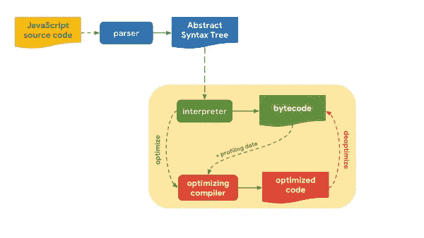
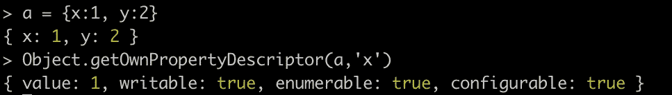
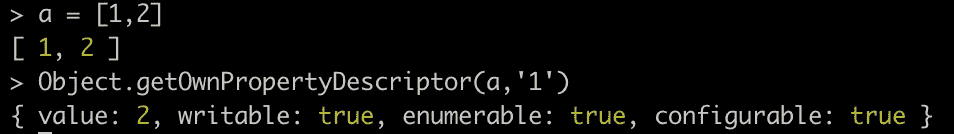
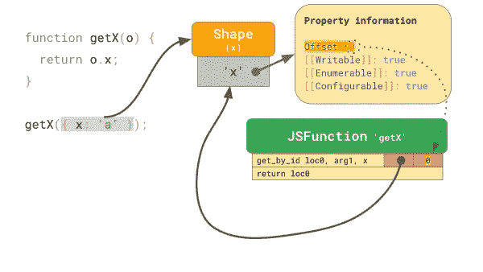

# JavaScript 引擎如何工作

> 原文：<https://javascript.plainenglish.io/js-engine-and-optimization-dac1f7fcb87d?source=collection_archive---------3----------------------->

## 以及它执行了哪些优化

JavaScript 可以在各种设备上运行——手机、笔记本电脑、电视甚至物联网设备。JavaScript 引擎可用的资源可以有很大不同。

JavaScript 引擎执行以下任务:

1-编译器优化

2-垃圾收集

3-热门代码管理

4-缓存

5-程序的其他运行时方面

每当任何设备加载 js 时，它都会加载、解析并执行脚本中的 JS 代码。JS 代码的执行由 **Javascript 引擎处理。** Javascript 代码被解析成一个**抽象语法树(AST)** ，然后移交给编译器工具链。内部编译器工具链，1 个或多个优化编译器产生高效的低级代码。

Javascript 源代码进入 Javascript 源代码解析器，然后解析器获取代码并将其转换为抽象语法树表示。少数已知的解析器有 **acron、esprima、cheroot 等。**创建 AST 是为了让我们可以将它输入到执行的第一阶段，即解释器。

v8 中的解释器叫做**点火**。解释器生成字节码。这对于只需要运行一次的代码来说很好。字节码在 JavaScript 引擎内部运行。解释的代码更容易运行，但是速度有点慢。

有时，代码经常重复。JavaScript 编译器运行反馈，并为正在执行的代码收集分析数据。如果遇到每次都用相同类型的参数调用的函数，并且已经调用了多次，那么这段代码将经过优化编译器。优化编译器生成高度优化的机器级代码，直接在 CPU 上运行热代码。优化编译器仅在 JS 引擎检测到代码**变热**时才启动。当一个代码经常运行、在循环中运行等时，它就是热的。编译后的代码有直接的 CPU 指令，速度相当快。生成机器码需要一点时间。确切的 CPU 指令是按机器产生的，如下。V8 中优化编译器是**涡轮风扇。**

***JS 引擎优化***

**使用对象形状的优化**

JavaScript 引擎实现 JS 对象模型，并使用它们来加速访问 JS 对象的属性。当任何对象被创建时，关于该对象的大量信息被存储在存储器中。诸如对象是否可写、可枚举、可配置等信息。对应于一个对象被存储。一次又一次地存储同类型对象的冗余信息将是对内存的浪费。因此，这些信息是分开存储的，对象只存储值。这有助于优化内存很多。

Properties of JS objects

**阵列优化**

数组也遵循同样的规则。数组被标记，因为它仅由整数、双精度数、对象等组成。每当我们在数组上使用 **map、find** 等时，它首先检查标签并基于此生成优化的代码。

Properties of JS array

**内嵌缓存**

形状背后的主要动机是内联缓存或 IC 的概念。ICs 是让 JavaScript 快速运行的关键因素！JavaScript 引擎使用 ICs 来记忆在哪里可以找到对象属性的信息，以减少昂贵的查找次数。

Inline caching by Mathias

在上面的例子中，当我们试图得到 x 的值时，未优化的代码将分配一个新的变量，给 x 赋值，计算偏移量，然后返回值。但是如果编译器知道这个函数被一次又一次地用相同类型的参数调用，它只会检查传递的参数的形状，并返回重新计算的偏移量。

这篇文章的灵感来自马蒂亚斯·拜恩斯的会议