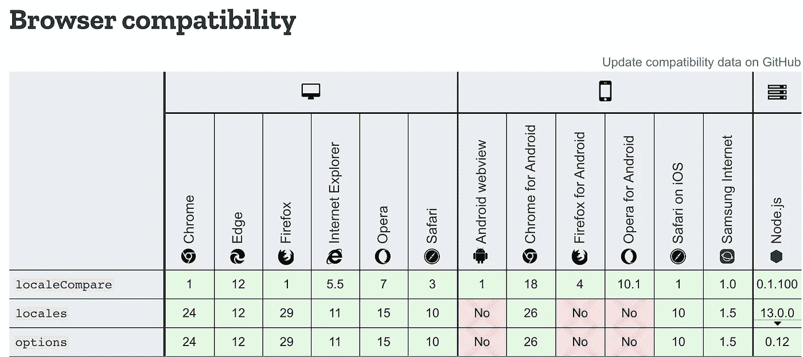
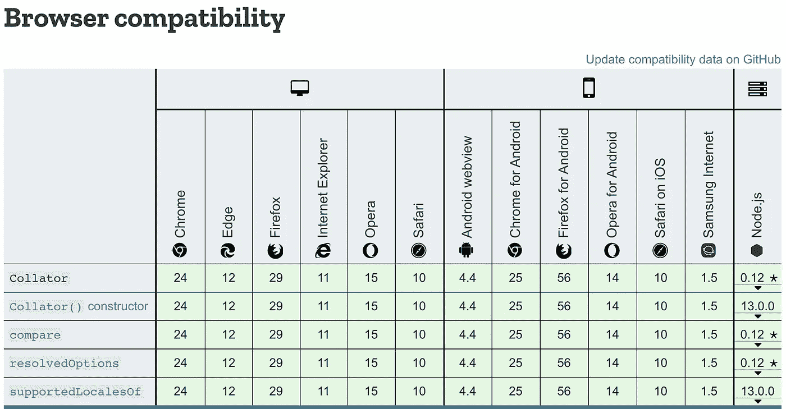

# JS i18n:locale compare()& Intl 的 5 个基本技巧。排序器()

> 原文：<https://javascript.plainenglish.io/js-i18n-5-essential-tips-for-localecompare-intl-collator-27b8570196cd?source=collection_archive---------5----------------------->

## localeCompare() & `Intl.Collator()` 启用区分语言的字符串比较


## TL；速度三角形定位法(dead reckoning)

JavaScript native sort method does not work for most of foreign language, which has non-ASCII characters like *[‘ą’, ‘ㄱ’, ‘*世*’, ‘*д*’, ‘e’]*

**快速解决方案**

使用`localeCompare()`

使用`Intl.Collator()`

## **1。性能**

`**Intl.Collator**` **比** `**localeCompare**`更会表演

在比较大量字符串时，`Intl.Collator`对象及其`compare`属性的性能优于`localeCompare()`

**本地比较()**

```
const a = 'réservé'; // with accents, lowercase
const b = 'RESERVE'; // no accents, uppercaseconsole.log(a.localeCompare(b));
// expected output: 1
```

**国际整理器()**

```
const a = 'réservé'; // with accents, lowercase
const b = 'RESERVE'; // no accents, uppercaseconsole.log(new Intl.Collator().compare(a, b));// expected output: 1
```

## 2.BCP 47 语言标签

**`**Intl.Collator**`**和** `**localeCompare**` **都提供了 BCP 47 种语言标签**中指定的各种 i18n 本地化选项**

**例如，各种类型的英语语言和非字母语言(即朝鲜语和汉语)是可用的**

```
// Various Types of English Languagesen-CA >> Canadian English
en-GB >> British English
en-IN >> Indian English
en-US >> US English
en-NZ >> New Zealand English// Non-Alphabet Languagesko-KR >> Korean (Republic of Korea)
jp-JP >> Japanese (Japan)
zh-CN >> Mainland China, simplified characters
zh-HK >> Hong Kong, traditional characters
```

****localeCompare()****

```
**// \\ // \\ 'en'**const a = 'banana';
const b = 'apple';console.log(a.localeCompare(b, 'en'));// expected output: 1 // "apple" comes before "banana"**// \\ // \\ 'en-US'**const a = 'banana';
const b = 'apple';console.log(a.localeCompare(b, 'en-US'));// expected output: 1 // "apple" comes before "banana"**// \\ // \\ 'ko-KR'**const a = '나';
const b = '가';console.log(a.localeCompare(b, 'ko-KR'));// expected output: 1 // "가" comes before "나"
```

****国际。整理器()****

```
**// \\ // \\ 'en'**const a = 'banana';
const b = 'apple';
console.log(new Intl.Collator('en').compare(a, b));// expected output: 1 // "apple" comes before "banana"**// \\ // \\ 'en-US'**const a = 'banana';
const b = 'apple';
console.log(new Intl.Collator('en-US').compare(a, b));// expected output: 1 // "apple" comes before "banana"**// \\ // \\ 'ko-KR'**const a = '나';
const b = '가';
console.log(new Intl.Collator('ko-KR').compare(a, b));// expected output: 1 // "가" comes before "나"
```

## **3.各种选项可用**

****无论是** `**Intl.Collator**` **还是** `**localeCompare**` **都有很多选项可用****

****忽略标点:**决定是否忽略标点**

```
let items = ['réservé', 'Premier', 'Cliché', 'communiqué', 'café'];items.sort( (a, b) => a.localeCompare(b, 'fr', {ignorePunctuation: true})); // ['café', 'Cliché', 'communiqué', 'Premier', 'réservé']
```

****数字:**确定是否使用数字排序规则**

```
true - numeric collation will be used when sorting
false (default) - numeric collation will not be used when sorting
```

****localeCompare()****

```
**// \\ // \\ ignorePunctuation**function letterSort(lang, letters) {
  letters.sort(new Intl.Collator(lang, 
    {ignorePunctuation: true}).compare);
  return letters;
}console.log(letterSort('fr', 
  ['réservé', 'Premier', 'Cliché', 'communiqué', 'café']
));// expected output: Array ['café', 'Cliché', 'communiqué', 'Premier', 'réservé']**// \\ // \\ numeric**// by default, "2" > "10" WRONG b/c 2 < 10
console.log("2".localeCompare("10")); // 1

// numeric using options:
console.log("2".localeCompare("10", undefined, 
  {numeric: true})); 
// -1
```

****国际。整理器()****

```
**// \\ // \\ ignorePunctuation**function letterSort(lang, letters) {
  letters.sort(new Intl.Collator(lang, 
  {ignorePunctuation: true}).compare);
  return letters;
}console.log(letterSort('fr', 
 ['réservé', 'Premier', 'Cliché', 'communiqué', 'café']
));// expected output: Array ['café', 'Cliché', 'communiqué', 'Premier', 'réservé']**// \\ // \\ numeric**console.log(new Intl.Collator().compare('2', '10')); 
// 1console.log(new Intl.Collator(undefined, {numeric: true}).compare('2', '10')); 
// -1
```

## **4.不要依赖于精确的返回值-1 或 1**

**W3C 规范只要求负值和正值。因此，有些浏览器可能会返回 **-2** 或 **2** ，甚至其他一些负值或正值。因此不要依赖于 **-1** 或 **1** 的确切返回值**

## **5.浏览器兼容性**

****`**Intl.Collator**`**和** `localeCompare` **都兼容大多数浏览器，但** `**Intl.Collator**` **的兼容性稍微好一点******

******localeCompare()******

********

******国际。整理器()******

********

## ****结论****

****用`Intl.Collator`代替`localeCompare`是因为****

*   ****`Intl.Collator`在比较大量字符串时有更好的性能****
*   ****`Intl.Collator`具有更好的浏览器兼容性****

********