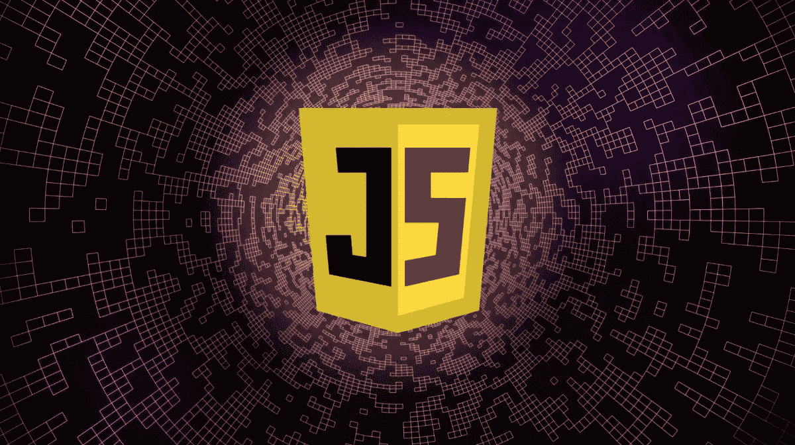
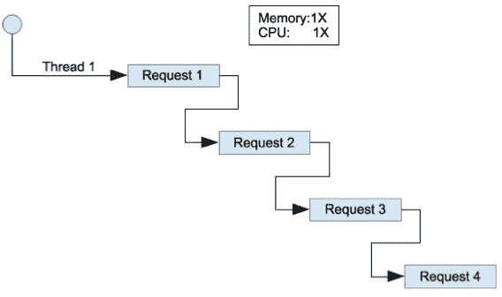
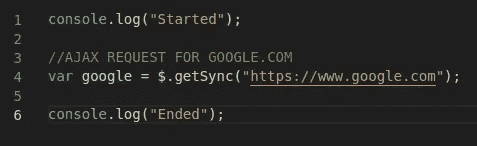

# JavaScript 中的单线程和非阻塞是什么意思？

> 原文：<https://javascript.plainenglish.io/js-single-thread-non-blocking-explained-d5de012a33cf?source=collection_archive---------3----------------------->



Credits: [FossBytes](https://www.google.com/url?sa=i&url=https%3A%2F%2Ffossbytes.com%2Flearn-to-program-javascript-programming%2F&psig=AOvVaw0uIcisnZIbaVV9uDPfppL7&ust=1581522084545000&source=images&cd=vfe&ved=0CAMQjB1qFwoTCNCqz4jryecCFQAAAAAdAAAAABAF)

一次性理解 JavaScript 可能会很困难，也很忙乱。我读了很多教程，但对“JavaScript 实际上是如何工作的”没有信心。我将分三部分来解释它。这是该版本的第二部分。在第一部分中，我向您解释了调用堆栈及其功能。当我们说到“JavaScript 是单线程非阻塞异步并发语言😞“，我们说的单线程是什么意思？，不堵是什么意思？因此，在深入事件循环、队列和 web APIs 的海洋之前，我们需要了解一些关于 JavaScript 的基本知识，比如什么是单线程非阻塞方法。

# **调用堆栈**

调用堆栈是一个后进先出(先执行最新的任务)的数据结构，包含执行将恢复的地址。调用栈是 JavaScript 运行的整个系统的一部分。如果你想更好地理解 JavaScript，你可以阅读我关于调用栈的文章。

[](https://medium.com/javascript-in-plain-english/node-call-stack-explained-fd9df1c49d2e) [## 节点:调用堆栈解释

### 大约一年前，正如我的投资组合所说，我是一名高级 JavaScript 开发人员。但是在孤独的时候，当我问自己…

medium.com](https://medium.com/javascript-in-plain-english/node-call-stack-explained-fd9df1c49d2e) 

# 单线程是什么意思？



Credits: [Pinterest](https://www.google.com/url?sa=i&url=https%3A%2F%2Fwww.pinterest.com%2Fpin%2F368380444495173013%2F&psig=AOvVaw3IZ7_qHF_B-BbM7k7fOWaK&ust=1581522190035000&source=images&cd=vfe&ved=0CAMQjB1qFwoTCOjsxLvryecCFQAAAAAdAAAAABAD)

Javascript 是一种单线程语言。这意味着它有一个调用堆栈和一个内存堆。正如所料，它按顺序执行代码，并且必须先执行完一段代码，然后再执行下一段。因此，如果我们从 1 到 5 打印，它将一个接一个地执行每一行，不能一次执行所有的打印。

```
console.log(1);
console.log(2);
console.log(3);
console.log(4);
console.log(5);Execute line 1 & Print => 1
Execute line 2 & Print => 2
Execute line 3 & Print => 3
Execute line 4 & Print => 4
Execute line 5 & Print => 5
```

# 什么是无阻塞？


Credits: [Clipart Station](https://www.google.com/url?sa=i&url=https%3A%2F%2Fclipartstation.com%2Ftraffic-jam-clipart-13%2F&psig=AOvVaw3pLJMw0ufqviC9IhLVe_Pw&ust=1581522313638000&source=images&cd=vfe&ved=0CAMQjB1qFwoTCKCi7P7ryecCFQAAAAAdAAAAABAJ)

在理解非阻塞行为之前，我们需要理解阻塞行为。阻塞没有严格的定义，任何本质上缓慢的东西本质上都是阻塞。 ***console.log("喂！")*** 不慢，制作网络请求(如:调用 REST 服务器 API)慢，而从 10 亿到 100 亿循环慢，图像处理慢。如果你对调用栈有所了解，你就会知道当 JavaScript 执行一行代码时，它会将代码推入栈中并执行。但是当事情进展缓慢时会发生什么，当某个进程占用了更长的时间并阻塞了其余代码的执行时会发生什么。拿这个例子来理解。



getSync function making code slow

这里 getSync 函数向 google.com 发出 ajax 请求，这会阻塞进程。如果我们用 C、PHP 或任何其他语言执行这段代码，它会像这样执行。

```
Print => StartedCall Google.com and wait for few secondsAfter fetching data from google.com goto next linePrint => Ended
```

在我们的核心语言(C，PHP)中，这些代码是这样执行的，因为它们是阻塞语言&正如我们所知，根据我们的定义，JavaScript 是一种非阻塞语言，getSync 函数调用在从 google.com 获取数据之前不会停止其余代码的执行和打印“Ended ”,就像这样

```
Print => StartedCall Google.com and removed from the stack as it is taking time to executePrint => EndedAfter fetching data from google.com code execution completed.
```

所以现在我们有了为什么称 JavaScript 为非阻塞的想法。在下一个版本中，我将告诉您队列、事件循环和 Web APIs。继续读。

> 感谢阅读！
> 
> 快乐编码||写 2 学