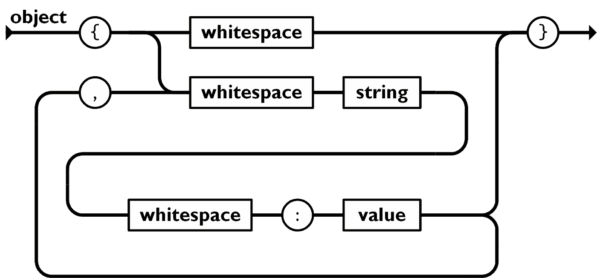
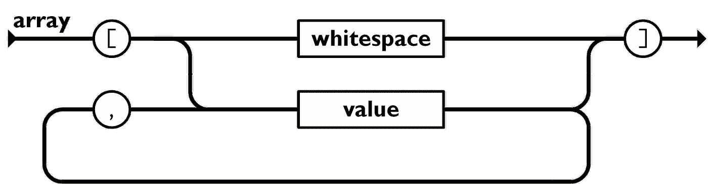
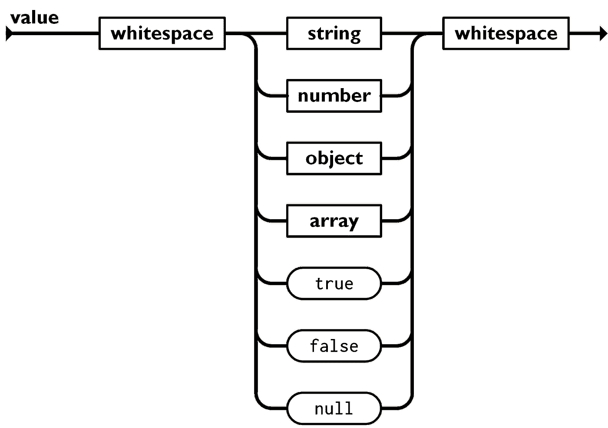

# 带有 JavaScript 的 JSON 解析器

> 原文：<https://javascript.plainenglish.io/json-parser-with-javascript-1a04d699f86a?source=collection_archive---------1----------------------->

卡西杜每周时事通讯本周的面试问题是，

> *编写一个函数，接受一个有效的 JSON 字符串，并将其转换成一个对象(或者你选择的语言使用的任何东西，字典，地图等等)。输入示例:*

有一次，我忍不住想写:

但是，我想，我已经写了不少关于 AST 的文章:

其中涵盖了编译器管道的概述，以及如何操作 AST，但是我还没有过多介绍如何实现解析器。

这是因为，在一篇文章中实现 JavaScript 编译器对我来说是一项艰巨的任务。

别担心。JSON 也是一种语言。它有自己的语法，你可以从[规范](https://www.json.org/json-en.html)中查阅。编写 JSON 解析器所需的知识和技术可以移植到编写 JS 解析器上。

所以，让我们开始编写一个 JSON 解析器吧！

# 理解语法

如果你看一下[规格页](https://www.json.org/json-en.html)，有两个图表:

Image source: [https://www.json.org/img/object.png](https://www.json.org/img/object.png)

两张图是等效的。

一个是视觉的，一个是基于文本的。基于文本的语法(巴克斯-诺尔形式)通常被提供给另一个解析器，该解析器解析该语法并为其生成一个解析器。说到解析器-异常！🤯

在本文中，我们将关注铁路图，因为它是可视化的，对我来说似乎更友好。

让我们看看第一张铁路图:

Image source: [https://www.json.org/img/object.png](https://www.json.org/img/object.png)

这就是 JSON 中**【object】**的语法。

我们从左边开始，跟着箭头走，然后在右边结束。

圆圈，如`{`、`,`、`:`、`}`，是字符，而方框，如`whitespace`、`string`和`value`是另一个语法的占位符。因此，为了解析“空白”，我们需要查看**“white space”**的语法。

所以，从左边开始，对于一个对象，第一个字符必须是一个开着的花括号，`{`。接下来我们有两个选择:

当然，当你达到“价值”时，你可以选择去:

您可以继续循环，直到您决定前往:

那么，我想我们现在已经熟悉了铁路图，让我们进行下一部分吧。

# 实现解析器

让我们从下面的结构开始:

我们将`i`初始化为当前字符的索引，一旦`i`到达`str`的末尾，我们就结束。

让我们实现**“对象”的语法:**

[https://gist.github.com/170e254c4980c9be20b489ef6e7db3c6](https://gist.github.com/170e254c4980c9be20b489ef6e7db3c6)

在`parseObject`中，我们将调用其他语法的解析，比如“字符串”和“空白”，当我们实现它们时，一切都将工作🤞。

有一点我忘了加，就是逗号，`,`。`,`只在我们开始第二个循环`whitespace` → `string` → `whitespace` → `:` →之前出现...

基于此，我们添加以下几行:

一些命名约定:

*   当我们基于语法解析代码并使用返回值时，我们调用`parseSomething`
*   我们称之为`eatSomething`，当我们期望字符在那里，但是我们没有使用字符
*   我们称之为`skipSomething`，如果角色不在，我们会没事。

让我们实现`eatComma`和`eatColon`:

我们已经完成了`parseObject`语法的实现，但是这个解析函数的返回值是什么呢？

我们需要返回一个 JavaScript 对象:

既然您已经看到了我实现“对象”语法，那么是时候让您尝试一下“数组”语法了:

Image source: [https://www.json.org/img/array.png](https://www.json.org/img/array.png)

现在，转到一个更有趣的语法，“值”:

Image source: [https://www.json.org/img/value.png](https://www.json.org/img/value.png)

值以“空白”开头，然后是以下任何一项:“字符串”、“数字”、“对象”、“数组”、“真”、“假”或“空”，最后以“空白”结尾:

`??`被称为[无效合并运算符](https://developer.mozilla.org/en-US/docs/Web/JavaScript/Reference/Operators/Nullish_coalescing_operator)，它类似于我们过去用来默认一个值`foo || default`的`||`，除了只要`foo`为 falsy`||`就会返回`default`，而无效合并运算符只有在`foo`为`null`或`undefined`时才会返回`default`。

parseKeyword 将检查当前的`str.slice(i)`是否与关键字字符串匹配，如果匹配，将返回关键字值:

`parseValue`到此为止！

我们还有 3 个语法要学，但我会节省这篇文章的篇幅，并在下面的 CodeSandbox 中实现它们:

[https://codesandbox.io/s/json-parser-k4c3w](https://codesandbox.io/s/json-parser-k4c3w)

在我们完成了所有语法的实现之后，现在让我们返回 json 的值，它是由`parseValue`返回的:

就是这样！

好吧，别着急，我的朋友，我们刚刚完成了快乐之路，那么不快乐之路呢？

# 处理意外输入

作为一名优秀的开发人员，我们也需要优雅地处理不愉快的事情。对于一个解析器来说，这意味着用适当的错误消息向开发人员大喊。

让我们来处理两种最常见的错误情况:

*   意外标记
*   意外的字符串结尾

# 意外标记

# 意外的字符串结尾

在所有 while 循环中，例如`parseObject`中的 while 循环:

我们需要确保访问的字符不会超过字符串的长度。当字符串意外结束，而我们仍在等待结束字符“}”时，就会发生这种情况，在本例中:

# 多走一步

你还记得当你还是一个初级开发人员的时候，每次当你遇到神秘消息的语法错误时，你完全不知道哪里出错了吗？

现在你更有经验了，是时候停止这种良性循环，停止大喊大叫了

让用户困惑地盯着屏幕。

除了大喊大叫之外，还有很多更好的处理错误消息的方法，下面是一些您可以考虑添加到您的解析器中的要点:

# 错误代码和标准错误消息

这是一个有用的标准关键字，用户可以用它向谷歌寻求帮助。

# 更好地了解哪里出了问题

像 Babel 这样的解析器会向你显示一个代码框架，一段带有下划线、箭头或者突出显示错误的代码

如何打印代码片段的示例:

# 错误恢复的建议

如果可能的话，解释哪里出了问题，并给出解决问题的建议

如果可能的话，根据解析器到目前为止收集的上下文提供建议

基于上下文的建议会让人感觉更有关联性和可操作性。

记住所有的建议，查看更新的 CodeSandbox

*   有意义的错误消息
*   错误指向故障点的代码片段
*   为错误恢复提供建议

[https://codesandbox.io/s/json-parser-hjwxk](https://codesandbox.io/s/json-parser-hjwxk)

# 摘要

要实现一个解析器，需要从语法开始。

你可以用铁路图或巴科斯诺尔形式来形式化语法。设计语法是最难的一步。

一旦确定了语法，就可以开始实现基于它的解析器了。

错误处理很重要，更重要的是要有有意义的错误信息，这样用户就知道如何修复它。

现在您已经知道了一个简单的解析器是如何实现的，是时候关注一个更复杂的解析器了:

最后，一定要关注 [@cassidoo](https://twitter.com/cassidoo) ，她的每周简讯棒极了！

*最初发表于*[https://lihautan.com/](https://lihautan.com/json-parser-with-javascript/)