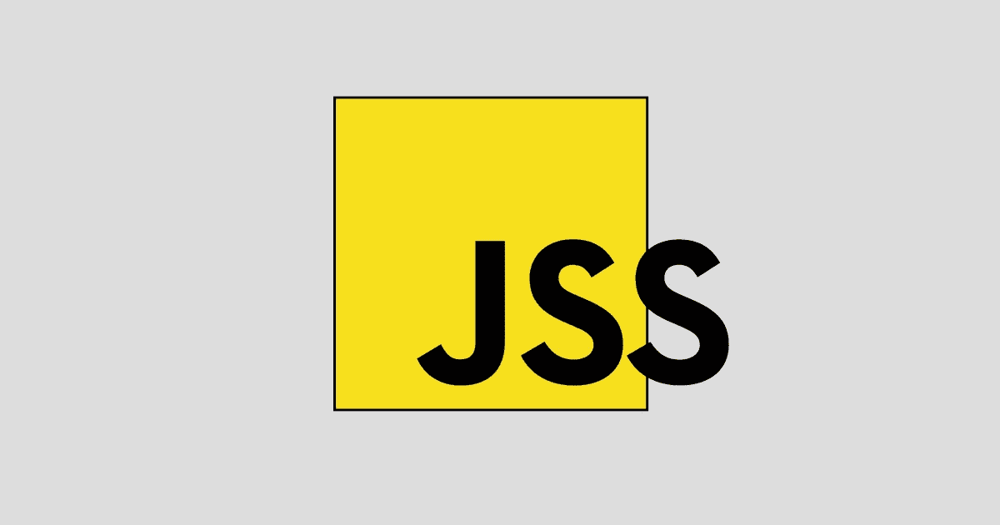

# JSS:CSS 的创作工具

> 原文：<https://javascript.plainenglish.io/jss-authoring-tool-for-css-3de171af148c?source=collection_archive---------10----------------------->



JSS 是一个 CSS 创作工具，它允许你使用 JavaScript 以一种声明性的、无冲突的和可重用的方式来描述样式。它可以在浏览器、服务器端或在节点中编译。

# 安装

```
yarn add jss
```

# JSS 的例子

```
import jss from 'jss'
import preset from 'jss-preset-default'
import color from 'color'// One time setup with default plugins and settings.
jss.setup(preset())const styles = {
  '@global': {
    body: {
      color: 'green'
    },
    a: {
      textDecoration: 'underline'
    }
  },
  withTemplates: `
    border-radius: 3px;
    background-color: green;
    color: red;
    margin: 20px 40px;
    padding: 10px;
  `,
  button: {
    fontSize: 12,
    '&:hover': {
      background: 'blue'
    }
  },
  ctaButton: {
    extend: 'button',
    '&:hover': {
      background: color('blue')
        .darken(0.3)
        .hex()
    }
  },
  '@media (min-width: 1024px)': {
    button: {
      width: 200
    }
  }
}const {classes} = jss.createStyleSheet(styles).attach()document.body.innerHTML = `
  <button class="${classes.button}">Button</button>
  <button class="${classes.ctaButton}">CTA Button</button>
`
```

# React-JSS 示例

```
import React from 'react'
import {render} from 'react-dom'
import {createUseStyles} from 'react-jss'// Create your Styles. Remember, since React-JSS uses the default preset,
// most plugins are available without further configuration needed.
const useStyles = createUseStyles({
  myButton: {
    color: 'green',
    margin: {
      // jss-expand gives more readable syntax
      top: 5, // jss-default-unit makes this 5px
      right: 0,
      bottom: 0,
      left: '1rem'
    },
    '& span': {
      // jss-nested applies this to a child span
      fontWeight: 'bold' // jss-camel-case turns this into 'font-weight'
    }
  },
  myLabel: {
    fontStyle: 'italic'
  }
})const Button = ({children}) => {
  const classes = useStyles()
  return (
    <button className={classes.myButton}>
      <span className={classes.myLabel}>{children}</span>
    </button>
  )
}const App = () => <Button>Submit</Button>render(<App />, document.getElementById('root'))
```

# 在线游乐场

*   [JSS](https://codesandbox.io/s/z21lpmvv33)
*   [做出反应——JSS](https://codesandbox.io/s/j3l06yyqpw)

# 在线编译器

【https://cssinjs.org/repl 

# 第三方 API 适配器

*   [风格化-JSS](https://cssinjs.org/styled-jss)-风格化-类似 API 的组件。
*   [魅力——JSS](https://github.com/dan-lee/glamor-jss/)——魅力十足的 CSS，JSS 在引擎盖下。
*   [阿佛洛狄忒——JSS](https://github.com/cssinjs/aphrodite-jss/)——阿佛洛狄忒似的 API。

# 文档

*   [简介](https://cssinjs.org/?v=v10.0.0)
*   [社区](https://cssinjs.org/sponsors?v=v10.0.0)
*   [前进引导](https://cssinjs.org/server-side-rendering?v=v10.0.0)
*   [套餐](https://cssinjs.org/jss-api?v=v10.0.0)
*   [例子](https://cssinjs.org/examples?v=v2.1.0)

# 开源代码库

[](https://github.com/cssinjs/jss) [## cssinjs/jss

### JSS 是一个使用 JavaScript 作为宿主语言的 CSS 创作工具。- cssinjs/jss

github.com](https://github.com/cssinjs/jss)