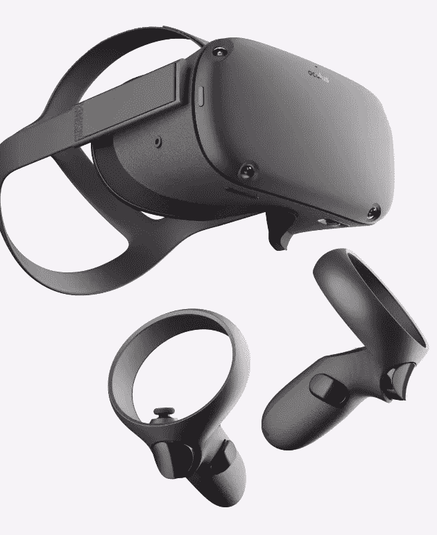
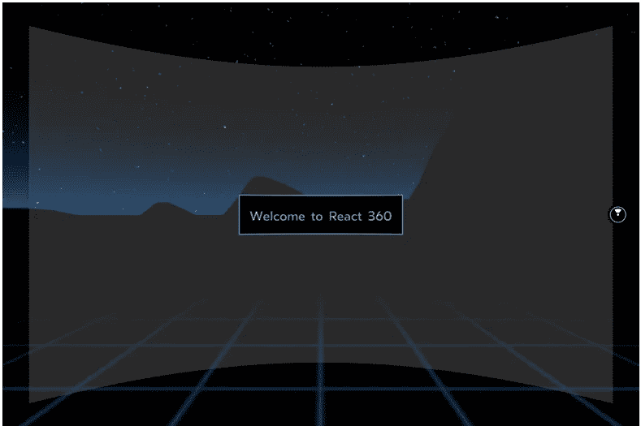
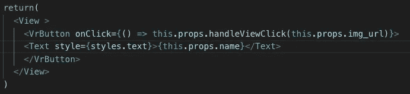
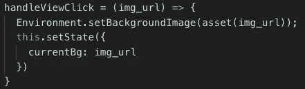
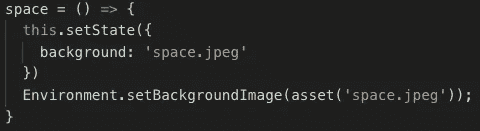

# 用 React 360 开发我的第一个虚拟现实网络应用

> 原文：<https://javascript.plainenglish.io/jsx-machina-7b6d51158e22?source=collection_archive---------2----------------------->

## JSX·玛奇纳

你好。Oculus 最近将他们的浏览器从 WebVR 更新到了 WebXR。遗憾的是，React 360 尚未更新支持 WebXR。根据 Github 上的[这个公开问题，一个主要的更新已经在路上有一段时间了，但是仍然没有发布。以下是 Oculus 对这个问题的评论，你可以在这里找到](https://github.com/facebook/react-360/issues/745):

“对于大多数开发人员来说，从 WebVR 升级到 WebXR 只是升级到您使用的框架的最新版本。像 A-Frame、Babylon.js、THREE.js 这些流行的 VR 框架都支持 WebXR……React 360 目前还不支持 WebXR。因此，Oculus 浏览器目前不支持它。如果你正在使用 React 360，我们建议你考虑改用 A 型框架。”

今年 8 月底，我开始在纽约的熨斗学校学习 web 开发。在我开始这个项目前不久，我的一个最好的朋友给我弄了一个 Oculus Quest——一个独立的无线 VR 耳机。我很快就爱上了它，并开始梦想开发自己的虚拟现实体验。



The Oculus Quest

当然，问题是我学的是网页开发，而不是虚拟现实开发。我想在完成这个程序之前，我将无法进入 VR，并有一些时间潜入 C#这样的语言，所以我把那些 VR 梦搁置起来。

两个月后，当我在学习 javascript 时，我了解并写下了 3D javascript 库 Three.js ( [查看一下！](https://medium.com/javascript-in-plain-english/developing-3d-web-apps-with-three-js-c5f7468f3114))。我从 Three.js 中学到的许多事情之一是，可以用它来为浏览器创建 VR 体验。特别是，我从 Mozilla 那里了解到一个令人印象深刻的框架，叫做 A-frame，就是为了做这个而设计的！这让我非常兴奋，但 Flatiron 的 web 开发项目节奏非常快，随着课程的进行，我发现自己几乎没有时间去思考 Three.js。

尽管如此，当开始使用 React 规划我的下一个课堂项目时，我知道我想看看如何应用我新获得的 React 知识来开发虚拟现实中的东西。

这时我发现了 React 360，一个用于 web 开发的 VR 库。这是一个由脸书开发和维护的强大的 javascript 库。脸书还拥有 Oculus，我爱上的虚拟现实耳机的创造者。因此，尽管我最初对 a-frame 很感兴趣，并且仍然希望在其他时间探索它，但用 React 360 进行开发似乎是正确的。


React 360

React 360 建立在 React Native 和 Three.js 的基础上，旨在使项目在几分钟内启动和运行变得极其简单。在阅读了入门文档之后，在我的浏览器中加载一些按钮，就可以很容易地得到一个简单的“Hello World”项目。我强烈建议按照[文档](https://facebook.github.io/react-360/docs/setup.html)上的指南开始，但这是您需要在终端上运行的初始代码

```
npm install -g react-360-cli
react-360 init <Your Project Name>
cd <Your Project Name>
npm start
```



Your out-of-the-box React360 App

当然，如果没有耳机，虚拟现实就不是真正的虚拟现实，所以我戴上了我的耳机。在打开 oculus 浏览器并导航到我的 IP 地址和我用来托管我的项目的端口后，我能够在全虚拟现实中实际进入我的项目。我做的按钮甚至可以在没有任何配置的情况下响应 oculus 的控制器。这还不算是一个项目，但这是一种奇妙的感觉，非常激励人。

接下来，我想定制一点空间，让它看起来更像是我真的做的，所以我开始免费试用 Adobe Stock，下载了一些美丽的日落和星星的 360 度照片，并开始尝试使用它们作为背景。

为了改变点击时的背景，我使用了下面的代码，它在一个组件中创建了一个按钮，从我的后端提取一个图像，并将其提供给前端**



Creating a VrButton that calls a function to change the background



The function that changes it!


My updated background

在大约 20 分钟内(不包括初始安装和捆绑)，我的第一个虚拟现实项目有了一个很好的起点！

[React 360 docs](https://facebook.github.io/react-360/)

[反应原生 doc](https://facebook.github.io/react-native/) s

*在上面的代码中，我分享了一个从后端调用一个图像到前端的函数，供项目使用。不幸的是，我还没有找到使用该功能在 Oculus 耳机中查看背景的方法。它在浏览器中工作得很好，我相信因为我目前通过我的本地主机托管我的后端，我不能通过我的 Oculus 浏览器发出那个获取请求。我希望通过 Heroku 托管我的后端可以解决这个问题。同时，为了在耳机中调用图像，需要将它们存储在前端的 static_assets 文件夹中，然后从那里使用它们的文件名调用它们，如下所示:

