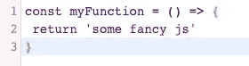
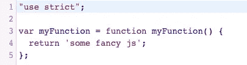
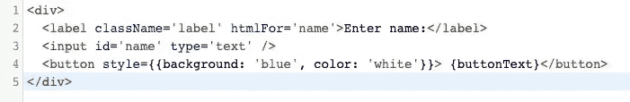
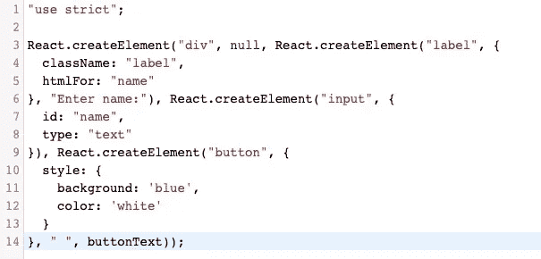

# JavaScript 中的 JSX 是什么？

> 原文：<https://javascript.plainenglish.io/jsx-what-how-and-why-3669a56e6a8c?source=collection_archive---------9----------------------->

## JavaScript 中的 JSX 是什么？为什么我们使用它而不是 JavaScript 和/或 HTML？

Photo by [Pankaj Patel](https://unsplash.com/@pankajpatel?utm_source=medium&utm_medium=referral) on [Unsplash](https://unsplash.com?utm_source=medium&utm_medium=referral)

## 什么是 JSX？

JSX 是 React 中使用的一种标记形式。它看起来非常类似于 HTML，但是在幕后被转换成 JavaScript。例如，假设您在 react 应用程序中有以下代码

虽然这看起来很像 html，但我们是在 Javascript 文件中编写的，所以代码必须转换成 Javascript。要理解这种转换是如何发生的，首先必须理解 React 库是如何使用 Babel 的。

# 巴别塔是什么？

Javascript 是一种不断发展的编程语言。已经实现了几个不同版本的 JS，它们向该语言添加了更新的语法和功能。这些更新中的大部分都使 Javascript 更容易使用，并使各地的开发人员都很高兴！然而，随着这些较新版本的 Javascript 的发布，开发人员开始采用伴随的特性，浏览器也需要更新以适应这些变化。如果你试图在一个不支持 Javascript 的浏览器中运行一些新的高级版本，你的代码将无法运行，你将不再是一个快乐的开发者。

这就是巴别塔发挥作用的地方！Babel 是一个工具，可以将你所有的 Javascript 编译成所有浏览器都支持的旧版本(ES5)。这意味着你可以随心所欲地编写所有花哨的 Javascript，而且你不必担心它不能在各种浏览器上运行。如果你访问[https://babeljs.io/repl](https://babeljs.io/repl)，你可以通过在左边的文本字段写一些 Javascript 来测试 Babel，并在右边看到 Babel 编译后的结果代码。

Figure 1 — ES6 JS with const and arrow function

因此，如果我编写一些新奇的 ES6 Javascript(图 1)，Babel 会编译成这样:

Figure 2 — Babel output

# 反应过来，JSX 和巴别

好了，现在我们知道你可以在 React 项目的 Javascript 文件中使用 JSX，React 会用 Babel 编译它。那么，如果我在巴别塔编译器中输入一些 JSX 的降价，会发生什么呢？

Figure 3 — Example JSX

变得…

Figure 4 — JSX output

如您所见，JSX 中的每个标签实际上只是一个创建元素的函数调用。这是使用 React 的 createElement()函数完成的。传递给 createElement 的第一个参数表示您想要创建什么类型的元素。第二个参数定义元素的任何属性，如 id 或 style。第三个参数定义该元素的开始和结束标记之间的内容。换句话说，它定义了元素的子元素，如果有的话。

显而易见，阅读 JSX 要比阅读普通 Javascript 好得多。您可以想象，每当您想要向 DOM 呈现某些内容时，调用 createElement 会有多烦人。你也可以想象如果你想要一堆嵌套的元素，代码会变得多难看，因为你必须在其他 React.createElements 的内部调用 React.createElement。

希望这能让您更好地了解什么是 JSX，它如何与 React 应用程序一起工作，以及我们为什么首先使用它。