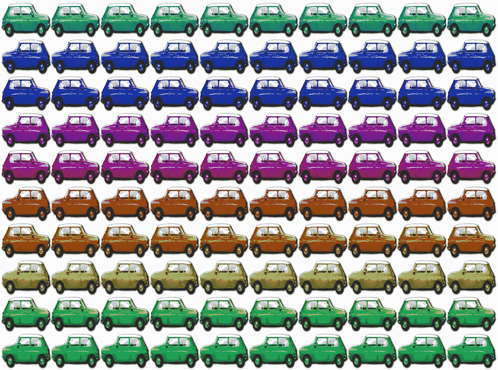

# 用这些 JavaScript 语句像专家一样处理数组

> 原文：<https://javascript.plainenglish.io/juggle-arrays-like-a-pro-with-these-javascript-statements-929be25ccbd5?source=collection_archive---------9----------------------->

## JavaScript 数组的 6 个不太容易的部分



An array of oriented coloured cars (original photo [here](https://www.needpix.com/photo/1535968/array-auto-car-color-colorful-cute-mini-multi-rainbow))

JavaScript 中的 ***数组*** 对象有相当多的操作方法，这些方法往往被一般程序员所忽略。每个人都喜欢使用琐碎的 ***来实现*** 循环，而不是冒险去尝试那些很难理解且有点神秘的函数。

事实上，没有人能否认最流行的手册对克服这个障碍没有多大帮助，因为它们用简单的例子解释这些方法，对于那些面临真正编程问题的人来说用处不大。

这就是为什么我决定提供一些更复杂、更现实的使用这些函数的例子，希望能说服一些好心的程序员采取额外的步骤，在 JavaScript 中专业地使用数组。

由于编程中最常见的数组是对象的 ***数组*** ，我将使用一个或多个描述彩色汽车的数组作为练习的基础，如上图所示。

因此，数组中的每一项都是包含汽车属性的 JavaScript 对象，如下所示:

A ***car*** *object*

我知道，上面的照片不包含任何法拉利，但…使用一点想象力。无论如何，让我们为我们的练习场创建一个数组:

An array of car objects

我们走吧！

## 1)寻找具有给定属性的最大值的元素

在我们的例子中，让我们找到价格最高的汽车。如果我们只想要一个结果(即使在平局的情况下)，我们可以使用。 ***减少*** 的方法:

Find the first car with the maximum price

或者，使用 ES6 箭头语法:

## 它是如何工作的

**。 *reduce* 在这种情况下，仅当**新价格高于先前价格时，计算才包括用新条目**替换结果(先前条目);因此，最终结果将等于找到的具有最高价格的第一个条目。**

*注意:如果你只想得到最高的价格，而不是整个“车”的对象，最紧凑的解决方案是:*

## 它是如何工作的

***。map*** 方法创建一个与 car_array 元素个数相同的简单数组，包含每辆车的 ***价格*** 属性。“***…”***spread 运算符将价格数组转换为 ***Math.max*** 函数的不同参数列表。

***警告*** :考虑一下，对于大型数组，上述表达式可能会超出 JavaScript 引擎堆栈限制，因为每个数组元素的副本都被压入堆栈。在这样的情况下，你可以再次使用 ***。减少*** 的方法:

如果你想让所有的车都有相同的最高价格，万一出现平局呢？您必须将它们作为子数组从原始数组中提取出来；解决方案可以是:

## 它是如何工作的

首先，通过**和*计算最高价格。减少*** ，然后使用 ***将价格等于最大值的汽车提取到一个新数组中。*过滤**方法。

## 2)按两个属性的值排序

假设我们想要得到一个汽车列表，按照*品牌*和*价格降序排列。*

## 工作原理:

***。sort* 在我们的例子中，我们使用条件三元赋值来比较*和*的价格，并且只有当价格相等时，才比较*和*的价格。**

*注意:要注意的是* ***。sort*** *方法不返回数组的副本，但它改变原来的数组。*

## 3)删除重复的元素

如果我们的数组不包含对象，那么删除重复行的最简洁的方法就是下面这条精彩的 ES6 语句:

```
var unique = […new Set(myarray)];
```

## 它是如何工作的

根据定义， ***Set*** 对象包含唯一值，因此当从数组创建集合时，JavaScript 会自动排除重复值。之后，“ **…** ”运算符将集合拆分成单个元素，并用 **[]** 括号将它们组成一个新数组。

***不幸的是*，**这不是处理*对象*数组的正确方法，因为该操作隐式地使用简单比较来匹配数组中的任意两个对象，但是我们不能像处理简单数据类型那样比较两个对象。例如，以下表达式:

```
{id: 1, make: ‘Ferrari’} === {id: 1, make: ‘Ferrari’}{} === {}
```

都是**假**，即使对我们人类来说明目张胆**真**。

让我们看看在我们的 ***汽车*** 数组中删除重复的正确方法是什么。对于完全重复的条目(即所有属性具有相同的值)，可能的解决方案是:

## 工作原理:

我们的数组首先被转换成一个字符串数组(其中 ***JSON.stringify*** 通过 ***应用于所有项目)。map*** )，然后创建一个新的集合来删除重复的字符串，最后，使用通过 ***应用的“ **…** ”、 ***[]*** 运算符和 ***JSON.parse*** 将该集合转换回对象数组。*地图**。

如果我们想将两辆具有某些共同属性(并非所有属性)的汽车视为复制品，例如*制造*和*型号*，我们可以使用不同的方法:

## 它是如何工作的

***。filter*** 方法通过提取满足第一个函数所表达的标准的所有元素来构建一个新数组。

```
(item,index) => index === cars.findIndex(...)
```

该函数将当前元素索引与满足内部函数所表达的条件的第一个索引进行比较

```
car => car.make === item.make && car.model === item.model
```

如果索引相等，这意味着当前元素是具有给定属性的第一个元素(在我们的示例中，第一个元素具有相等的 make+model)。

## 4)按一个或多个属性对值进行分组

假设我们想知道每个汽车制造商的产品数量，以及相应的价格范围:我们需要以类似于在 SQL 中使用 GROUP BY 子句和 COUNT()、MIN()和 MAX()等聚合函数的方式来聚合值。

一个可能的解决方案是利用 ***。减少*和**的方法:

## 它是如何工作的

**的第二个论点*。reduce*** 是最终结果的初始值 ***{}*** ，是内部函数在数组元素循环时对聚合求和的对象。

如果我们需要根据多个属性进行分组，例如 *make* 和 *colour* ，我们改变结果数组的索引方式，例如:

## 5)合并两个数组

让我们为我们的游戏添加另一个数组:

如何才能合并 ***车*** 和 ***车 2*** ？

第一种方法:将一个附加到另一个并删除重复项(这里我们认为是具有相同 ***id*** 的两辆汽车的重复项):

这里我们用的是 ***。concat*** 方法，后跟示例#3 中所示的相同过滤器。在平局的情况下，我们从第一个数组中获取汽车；如果我们想做相反的事情，优先考虑第二个数组，我们将在 *.concat.* 中交换它们的角色

另一种方法是使用 ***。减少*** 的方法循环超过*汽车 2:*

## 它是如何工作的

使用*cars*(“cars . slice(0)”作为*的第二个参数)的副本初始化*结果*数组。减少*)；在每次迭代中，如果当前的 *id* 不在*汽车*中，则该行被追加到*结果中。*

如果我们想要两个数组的交集，即一个只包含公共元素的新数组，该怎么办？如前所述，如果我们的数组不包含对象，将会有一个非常紧凑的解决方案:

```
array1.filter(value => array2.includes(value))
```

相反，由于我们正在处理对象，我们被迫使用稍微复杂一点的解决方案:

## 6)重构阵列

最后一个练习:让我们创建一个数组，它是由以下人员构建的*汽车*、的返工版本:

*   按加价排序条目；
*   给它们一个新的*位置*属性，指示数组中的相对位置；
*   移除*颜色*属性。

## 它是如何工作的

首先，它复制了 *cars2* (带有*)。slice(0)* ，然后它按价格递增排序；最后，用 ***变换每个元素。绘制*** 方法。请注意，内部函数的第二个参数(index)用于设置新的*位置*属性。

# 结论

我已经展示了如何使用 JavaScript 提供的一些更灵活的方法(map、reduce、filter、sort、findIndex)来操作矩阵。

当然，其他语言为程序员提供了更有效的方法，但我认为至少应该学习如何使用我们拥有的武器。