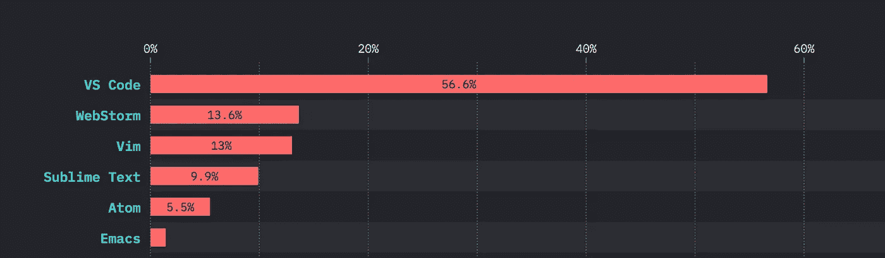

# 《JavaScript 现状》2019 年调查结果的主要发现

> 原文：<https://javascript.plainenglish.io/key-findings-from-the-state-of-javascript-2019-survey-results-7e50bcfc8799?source=collection_archive---------5----------------------->

## 与其他前端框架相比，React 再次处于领先地位

Photo by [Goran Ivos](https://unsplash.com/@goran_ivos?utm_source=medium&utm_medium=referral) on [Unsplash](https://unsplash.com?utm_source=medium&utm_medium=referral)

2019 年 T2 最受欢迎的 Javascript 状态调查结果今天出炉。
那么让我们来看看，这次调查的结果如何。

**前端架构:**

1.  与其他前端框架如 Angular、Vue.js、Ember 等相比，今年的反应库排名再次靠前
2.  根据调查，71.7%的人使用过 React，并愿意再次使用。去年
3.  Vue.js 排在第二位，有 40.5%的人使用它，并且愿意再次使用它
4.  Angular 排在第三位，有 21.9%的人使用它，并且愿意再次使用

Front End Frameworks Comparison

**后端框架:**

1.  Express.js (Node.js Framework)名列前茅，有 71.6%的人使用它
2.  其次，js(服务器端反应)排名第二，有 24.7%的人使用它
3.  Koa 也是排名第三的 Node.js 框架，有 11.3%的人使用它

Back End Frameworks Comparison

**检测工具:**

1.  被广泛用于测试 react 应用程序的 Jest framework 名列榜首，有 61.2%的人使用它。
2.  摩卡位居第二，有 42%的人使用它
3.  故事书位居第三，有 32.2%的人使用它

Testing Tools Comparison

**IDE(文本编辑器):**

1.  我最喜欢的 Visual Studio 代码(VS 代码)名列前茅，有 56.6%的人使用它
2.  网络风暴排名第二，有 13.6%的人使用它
3.  Vim 排名第三，有 13%的人使用它

Text Editor Comparison

您可以在这里找到完整的调查结果

今天就到这里。不断学习，不断探索。

**别忘了订阅我的每周时事通讯，把惊人的技巧、小窍门和文章直接放在你的收件箱** [**这里**](https://yogeshchavan.dev) **。**