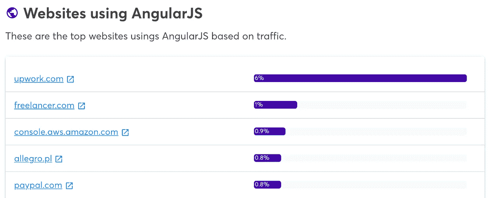
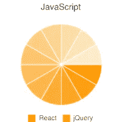

# 被谷歌扼杀的 3 项网络技术

> 原文：<https://javascript.plainenglish.io/killed-by-google-aa2c71c324cf?source=collection_archive---------5----------------------->

## 以及我们能从中学到什么。

Source: the author

谷歌已经从一个搜索引擎变成了一个真正的巨头——不再只是一个搜索其他网站的网站，他们现在提供各种各样的东西。

办公软件、编程语言、智能手机、操作系统等等——很明显，这样的发展总会有一些东西被抛弃。

今天我们来看看被谷歌扼杀的网络技术。所谓*被杀，*我指的是由谷歌开发但后来被他们放弃的技术。

# 安古拉吉斯

AngularJS 可能是第一个出现的相关 JavaScript 框架。
它由谷歌在 2010 年发布——当时最著名的 JavaScript 库是 jQuery。

AngularJS(也称为 Angular 1)不仅仅是一个像 jQuery 这样的库，它是一个完整的框架，将 MVVM 概念带到了前端开发的世界。

2016 年，我们今天所知的 Angular 发布了。
根据 Wappalyzer 的说法，许多大型网站仍然使用 AngularJS 作为其前端——但明年将停止支持。

Source: [Wappalyzer](https://www.wappalyzer.com/technologies/javascript-frameworks/angularjs/)

AngularJS 背后的技术已经过时了——因为像 React、Vue 和 Angular 这样的现代框架现在都使用 CLI。

这允许我们在 React.js 中编写在浏览器中不工作的代码——在 React 的情况下；正是 JSX 语法被 CLI 转换成经典的 JS & HTML 以用于生产版本。

另一方面，当我们在没有 CLI 的情况下使用 AngularJS 时，它会让我们想起 Vue.js。我们不是转换代码，而是为生产而写；我们把所有东西都直接写在 HTML 和 JS 文件中。

所谓的指令也是如此，我们将其实现为 HTML 属性:

`data-ng-repeat: "item in items"`

如果没有 AngularJS 提供的 JavaScript 代码，浏览器就不能对这些属性做任何事情——这是客户端渲染的一个经典例子。但是趋势越来越倾向于服务器端呈现和静态页面，在这些页面中，我们的 JavaScript 数据结构被转换成可以在浏览器中呈现的 HTML。

对于 Angular，有所谓的 Angular Universal 在服务器端呈现页面；对于 AngularJS 来说，这种可能性似乎是不存在的。

在没有 CLI 的情况下工作，简单地通过 CDN 导入库并编写类似 jQuery 的代码并不复杂。尽管如此，CLI 已经成为开发人员社区不可或缺的一部分——不管是框架还是库，因为拥有 TypeScript、林挺和代码转换支持是有意义的。然而，如果没有 CLI，这几乎是不可想象的。

自 2021 年 12 月起，AngularJS 将停止长期支持。

# Google Drive 虚拟主机

你知道吗，多年来，在 Google Drive 上托管网站是可能的。

然而，对于网站来说，静态页面是必要的，但不可能在 Google Drive 上运行 PHP 或 Node.js 之类的东西作为动态后端。所以这是一个快速托管 HTML、JS & CSS 免费网站的简单方法。

Drive 的虚拟主机服务并不用于生产网站，因为你只能通过重定向使用自己的域名——它更多的是用于分享和提供网站预览。

特别是对于 web 开发人员来说，这很方便——通过 Google Drive，他们可以轻松地获得文件，并与团队中的其他人共享它们——通过托管，您总是可以预览，您可以通过调用 URL 在不同的设备上进行测试。

Google Drive 为 web 开发人员提供的虚拟主机功能让我想起了 GitHub Pages，它主要也是为了免费、安全和方便地访问网站而设计的——尽管不一定是网站的生产版本。

尽管 Drive Webhosting 的功能有限，但谷歌报告称，它托管了超过 800 万个页面——直到 2016 年完全停止支持。随之而来的还有访问已经托管的页面的可能性——真烦人。

# 谷歌图表 API

不，它和谷歌图表不一样。区别很简单。

Google Charts 是一个 javascript 库，你可以将它嵌入到你的网站中，以图表的形式显示数据。用于呈现的数据是用 JavaScript 准备的，例如，在对象或数组中。

SVG 是通过 Google Chart API 生成的，在执行过程中显示在前端。

现在被弃用的 Google Chart API 是来自 Google 的 API，它通过 GET-request 创建数据。我们在请求中传递所需的数据，然后由 API 背后的服务器将其转换为图像文件。

下面是一个请求示例:

[https://chart.apis.google.com/chart?chs=200x200&chdlp = b&chtt = JavaScript&chdl = React % 7CjQuery&CHD = t:11，11，11，11，11，11，11，11，11，11，11，11 & cht=p & chco=586F8E，red，586F8E，7D858F，586F8E，7d 8588](https://chart.apis.google.com/chart?chs=200x200&chdlp=b&chtt=JavaScript&chdl=Asleep%7CAw&chd=t:11,11,11,11,11,11,11,11,11,11,11,11&cht=p&chco=586F8E,red,586F8E,7D858F,586F8E,7D858F,586F8E,7D858F,586F8E,7D858F,586F8E,7D858F)

从这些数据中，API 生成了这个图像:

Source: Google Chart API

最初，Google 设计这个 API 是为了在他们自己的页面上提供动态图形。

image 标签可以发出一个 API 请求，这样用户就可以在前端看到数据的显示。

谷歌在 2007 年决定向公众开放这个 API。

在 2012 年，它被官方认为是过时的。

# 我们能从中学到什么

像谷歌、脸书和微软这样的公司不会纯粹出于利他主义将新的实用技术推向市场。每个人都受益于开源——公司本身，这也可以让其他聪明人研究他们的技术。当然，这些技术的使用者也会受益。

但是技术在变化，在技术进步的某些点上，旧的变得多余。AngularJS 的例子表明，趋势是在一个不同的方向，AngularJS 的整个基础突然过时了——因此改为 Angular。

一次又一次，有人提出谷歌浪费新技术——他们开发了许多技术，但仅仅几年后就突然停止了——当然，这对社区来说往往非常关键。

在这一点上，我想指出的是，谷歌现在已经销毁的技术只是网络技术——在其他领域，许多其他技术也失去了母舰的支持。

但是你不能因为 AngularJS 的例子而责怪谷歌——这个框架是彻头彻尾的革命性的，极大地启发了 Vue.js。幸运的是，谷歌在现有网站上失去对 AngularJS 的支持并不是死刑判决——即使在 5 年内，使用 AngularJS 的网站可能仍然会 100%工作，因为它完全基于浏览器中的 JavaScript。

我故意把 Google Drive 主机的例子放在这个列表中，即使它是一件很小的事情——因为它表明即使是大公司有时也会退缩。

引入 Drive 中的主机可能只是因为它也受到竞争对手 Dropbox 的支持。为什么停止支持是有争议的——但这可能惹恼了一些人，尤其是如果他们没有注意到变化的话。

我们越依赖第三方提供的服务，我们就越把自己的命运交到别人手里——我已经就 NPM 讨论过这个问题，以及为什么使用太多库会是悲剧。

另一方面，也有提供自己做不是一种选择——技巧可能很容易跟踪。

这就是为什么我已经列了两年的清单。我的项目涵盖了所有的技术——在那里，你可以找到一切，操作系统，主机提供商，后端技术，数据库系统，以及适合前端的一切。

另一个诀窍是不要依赖太小的技术。React.js 或者 Angular 不太可能在一夜之间得到进一步发展。当科技公司做出这样的决定时，用户的命运通常也会被考虑在内。

因此，如果我们只是一个图书馆的 200 个其他用户，决定是否继续开发它是很简单的——我们作为个人是无关紧要的。有必要对自己的规模和可能的长期支持有一个大致的了解。

喜欢这篇文章吗？如果是这样，通过 [**订阅解码获得更多类似内容，我们的 YouTube 频道**](https://www.youtube.com/channel/UCtipWUghju290NWcn8jhyAw?sub_confirmation=true) **！**