# 在学习 React 之前了解这些 JavaScript 基础知识

> 原文：<https://javascript.plainenglish.io/know-these-javascript-basics-before-learning-react-f9182f65dfbb?source=collection_archive---------7----------------------->

## 用这些基本知识让你的反应之旅变得简单

# 创建 React 应用

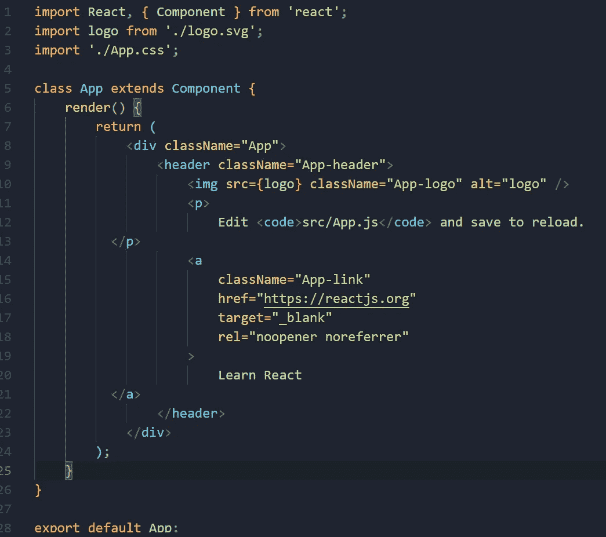

**create-react-app** 包将为您提供一个带有基本 react 组件的起始代码，以便您可以根据需要修改它。过程完成后，src/app.js 会给我们呈现整个 app 中唯一的 React 类。这个其实是 ES6 的一个新特性&学习 ES6 会让你理解反应更好更快。

# ES6 类

我们在**面向对象语言**如 **Python** 和 **Java** 中遵循的类语法模式类似于我们在 ES6 类语法中的模式。

一个基本的 ES6 类语法:

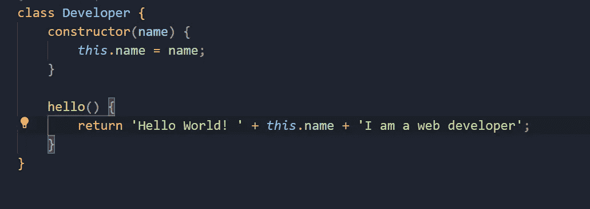

类语法后面是一个标识符 ***(一个简单的名字)*** 可以用来创建新的对象，&传递给对象的参数将被传递给新的对象。举个例子，

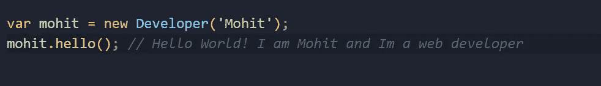

我们可以根据需要添加许多 as 方法，在本例中，我们使用一个 ***hello*** 方法返回一个字符串。

## 类继承

具有 ***扩展*** 关键字的类可用于从该类初始化一个新对象，该对象将具有两个类的所有方法。

扩展另一个类的类称为 ***子类*** &被扩展的类称为 ***父类。*** 这些子类也可以用新方法替换父类中的方法。

举个例子，

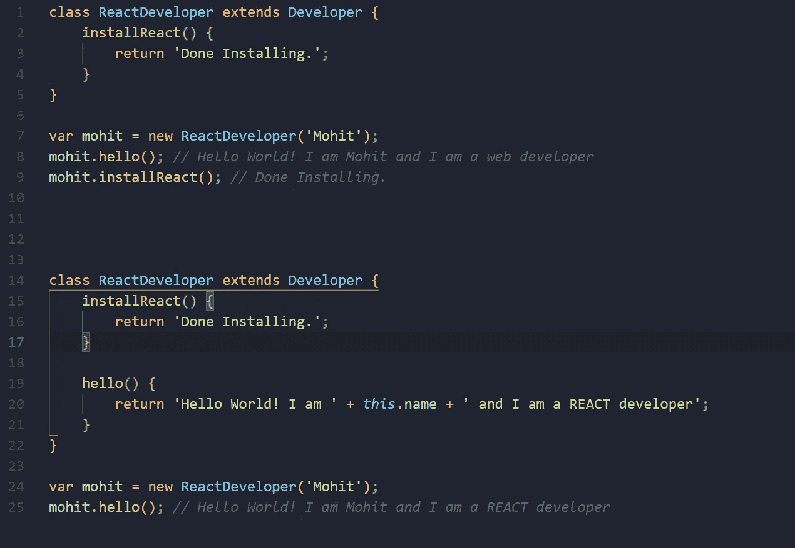

***src/app 中设计的 React 类。*** js 是一个 React 组件，具有从 React 包导入的普通 ES6 类属性。我们可以用 ***这个。state()***方法&其他方法由于所有这些定义都在组件内部，但这不是唯一定义 **React** 组件的方法如果不需要 state 和其他生命周期方法我们可以使用**功能组件。**

# ES6 中的变量

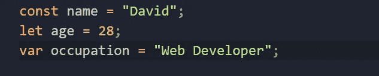

在以前版本的 **Javascript 中，**我们只使用了 ***var*** 关键字来存储全局变量，但是后来在 ES6 中引入了两个关键字***let***&***const***来解决这个问题。主要区别是 ***const*** 在声明后不能改变它的值，而 ***让*** 可以。如果你在一个函数内部声明 ***let*** ，你就不能在函数外部调用它。

使用 let & const 完全取决于你，但是这里有一个声明变量的快速规则:

默认情况下，在 ***const*** 中声明您的变量，稍后当您意识到您需要将其更改为 ***let*** 时，您可以随时这样做，这种方法在您处理真实项目时更有效。

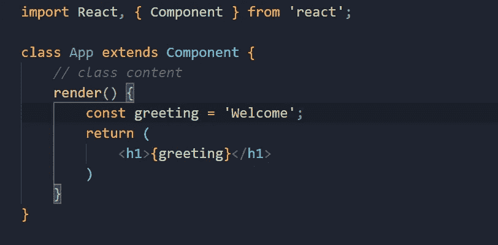

# 使用箭头功能

箭头函数使用起来非常方便，随着时间的推移，它会变得越来越长，从而使代码更具可读性，也更易于维护。在 ES6 中，这个特性允许我们用更短的语法编写函数。

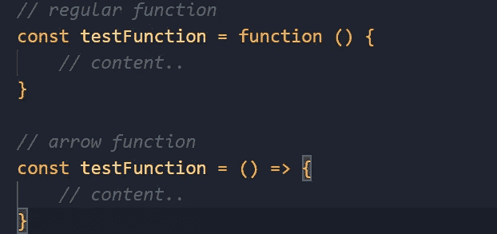

您可以通过以下两个简单的步骤开始使用它:

1.  删除 function 关键字。
2.  然后在 **()** 后面加上粗箭头符号 **= >** 。

你仍然可以使用圆括号来传递参数，如果你必须只传递一个参数，没有必要让你的代码难看，你可以省略圆括号。

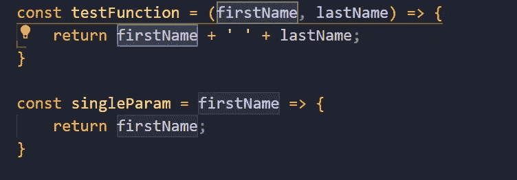

箭头函数也可以用来生成反应组件。

举个例子，

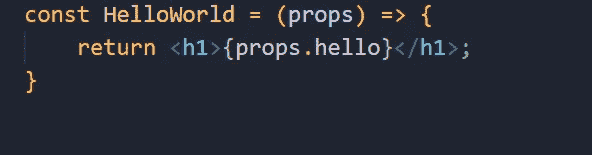

将相当于一个 ES6 类组件。

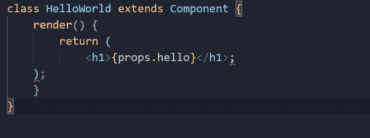

在 React 代码中使用 arrow 函数使得维护更容易&简洁。这种类型的组件也被称为 ***一种无状态的功能组件。***

# 数组和对象的析构

开发人员大多使用这种模式，因为这是一种以明确定义的方式声明大量变量的简单方法。在这里，您只需复制一个对象或数组的一部分，并将它们输出到命名变量中，以便在项目中稍后使用。

举个例子，

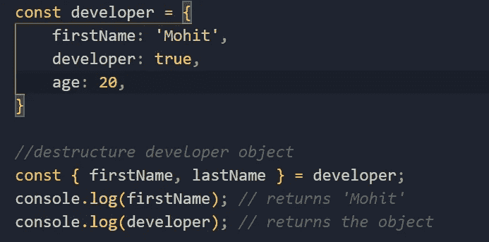

我们从 developer 对象中定义**firstName**成一个新变量**first NameT21，如果你想把 first name 成一个名为 name 的新变量。这是你可以做到的。**

# 映射和过滤方法

甚至这个特性在 **JavaScript** 中也是一个 ES5 特性，这两种方法在构建 React 应用程序中被多次使用。特别是在处理数据和从一个 **API** 获取结果时，它返回一个 ***JSON 数据数组。***

例如，如果我们有一个变量 const，那么我们可以在 React 中呈现条目列表。

在渲染中使用过滤方法，这通常是代码的样子。

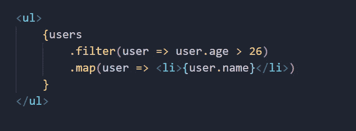