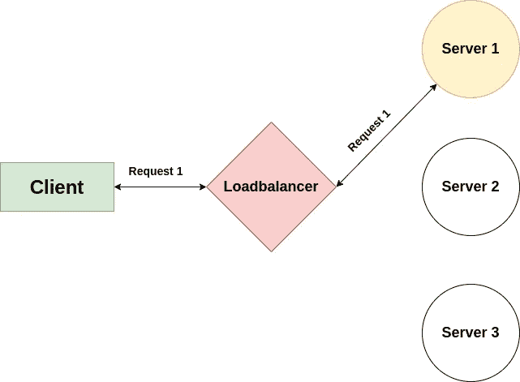
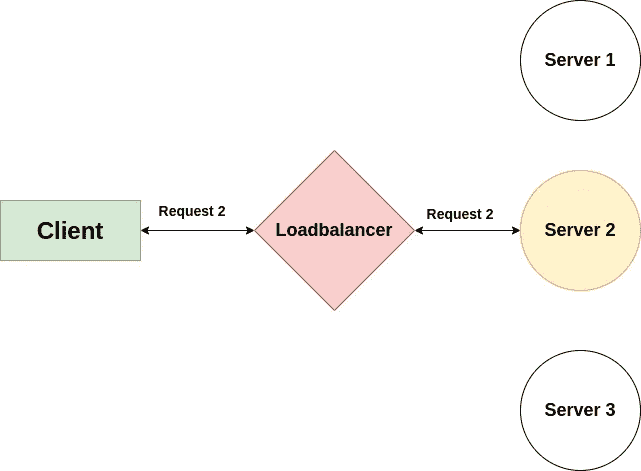
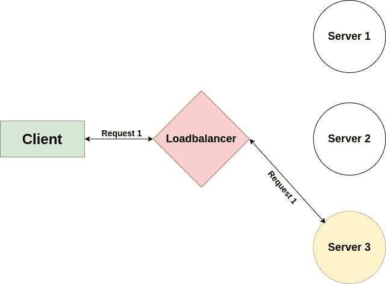
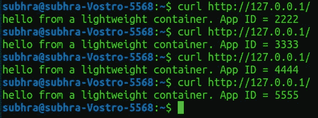
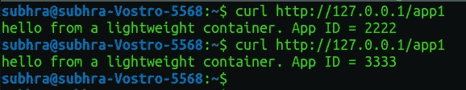
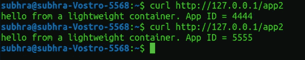
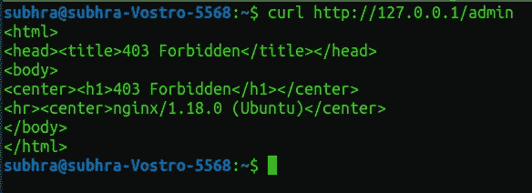

# 使用 Nginx 实现第 7 层负载平衡

> 原文：<https://javascript.plainenglish.io/layer-7-load-balancing-with-nginx-315a49e5f2b4?source=collection_archive---------2----------------------->

Photo by [David Martin](https://unsplash.com/@davidmartinjr?utm_source=unsplash&utm_medium=referral&utm_content=creditCopyText) on [Unsplash](https://unsplash.com/s/photos/roads?utm_source=unsplash&utm_medium=referral&utm_content=creditCopyText)

部署后端应用程序时，您可能需要多个实例来处理大流量。负载平衡器用于管理多个服务器之间的大量请求。

> [**第 7 层负载均衡**](https://www.nginx.com/resources/glossary/layer-7-load-balancing/) 在高级*应用*层运行。它可以根据邮件内容(例如，URL 或 cookie)做出负载平衡决定。然后，它与选定的上游服务器建立新的 TCP 连接(或通过 [HTTP keepalives](https://www.nginx.com/blog/http-keepalives-and-web-performance/) 重用现有的连接)，并将请求写入服务器。

执行第 7 层负载平衡的设备通常被称为 [*反向代理服务器*](https://www.nginx.com/resources/glossary/reverse-proxy-server/) 。

客户端不直接连接到服务器。负载平衡器接收来自客户端的请求。负载平衡器决定将请求发送到哪个服务器。服务器接收请求并将响应发送回负载平衡器，负载平衡器通过端口 80 将响应转发给客户端。

下面是一个例子。考虑一个负载平衡器，它管理三台服务器之间的流量。负载平衡器为此使用了一种循环算法。

Request 1 is sent to the server 1

Request 2 is sent to the server 2

Request 3 is sent to the server 3

Nginx 是一个可以充当 web 服务器、反向代理、负载平衡器、HTTP 缓存等的软件。它可以充当第 7 层和第 4 层负载平衡器。

我将演示如何在一个使用 Nginx 的系统上运行的 4 台服务器之间创建一个第 7 层负载平衡器。我已经创建了一个简单的 Node JS 应用程序，并制作了它的 docker 映像。我启动了该映像的 4 个容器，并将容器端口发布到系统的 4 个不同端口。你可以使用你的后端应用程序，甚至不需要创建它的 docker 映像。只需在不同的端口上启动服务器。我已经在端口 2222、3333、4444、5555 上启动了服务器。 [**在这里结账我的节点 JS app**](https://github.com/subhrapaladhi/Docker-Node-App)

现在在你的系统上安装 Nginx。我们必须对决定 Nginx 行为的`nginx.conf`文件进行修改。找到 nginx.conf，在 Linux 中，一般在`/etc/nginx/`中。**对现有的`nginx.conf`文件进行备份**并清除原文件的内容。

我的后端应用程序有这 4 条路线。他们有不同的需求，因此我可以向您展示负载平衡的各种应用

`1.[**http://localhost:PORT/**](http://localhost:3000/)`:该路由应该在所有端口之间实现负载平衡。

回复:`hello from a lightweight container. App ID = ${PORT}`

`2.[**http://localhost:PORT/app1**](http://localhost:3000/app1)`:此路由应该在端口 2222 和 3333 之间实现负载平衡

回应:`this is app1\. App ID = ${PORT}`

`3.[**http://localhost:PORT/app**](http://localhost:3000/app1)**2**`:此路由应该在端口 4444 和 5555 之间实现负载平衡。

回应:`this is app2\. App ID = ${PORT}`

`4.[**http://localhost:PORT/admin**](http://localhost:3000/admin)`:该路由不能从端口 80(HTTP 使用的端口)访问。

回应:`admin page. . App ID = ${PORT}`

现在我们来看看`nginx.conf`。看评论了解流程。

以下是我的后端应用程序得到的结果。

1.  对于路线`[http://localhost/](http://localhost/)`

2.对于路线`http://localhost/app1`

3.对于路线`[http://localhost/app2](http://localhost/app2)`

4.对于路线`[http://localhost/admin](http://localhost/admin)`

# 资源和参考资料

1.  [NginX 速成班(第 4 层&第 7 层代理，HTTPS，TLS 1.3，HTTP/2 &更多)](https://www.youtube.com/watch?v=WC2-hNNBWII)作者 [Hussein Nasser](https://www.youtube.com/channel/UC_ML5xP23TOWKUcc-oAE_Eg)

2.[什么是第 7 层负载均衡？](https://www.nginx.com/resources/glossary/layer-7-load-balancing/)

 [## 第 7 层负载平衡的优势| NGINX 负载平衡器

### 在开放系统互连(OSI)参考模型中，可以在不同的层执行负载平衡，以便…

www.nginx.com](https://www.nginx.com/resources/glossary/layer-7-load-balancing/) 

3. [Docker 节点 app。](https://github.com/subhrapaladhi/Docker-Node-App)

 [## subhrapaladhi/Docker-Node-App

### 一个简单的节点服务器应用。curl " http://localhost:3000/" Res:hello 来自一个轻量级容器。应用 ID = ${PORT} curl…

github.com](https://github.com/subhrapaladhi/Docker-Node-App) 

4.使用 Nginx 实现负载平衡。

 [## subhrapaladhi/使用-Nginx 进行负载平衡

### 节点应用程序存储库为节点应用程序创建 docker 映像，并启动所需数量的容器。放…

github.com](https://github.com/subhrapaladhi/Loadbalancing-with-Nginx)