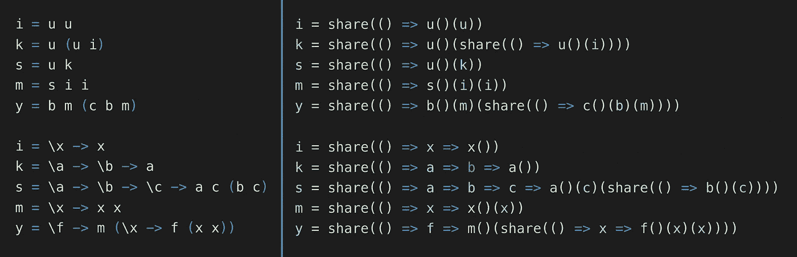

# 严格语言中的懒惰评估

> 原文：<https://javascript.plainenglish.io/lazy-evaluation-in-a-strict-language-a8f938870a7a?source=collection_archive---------4----------------------->



Translating from a language using lazy evaluation (left) to JavaScript (right)

## 用 lambdas 产生弱头范式

在这篇文章中，我假设你知道*懒惰评估*和*严格/急切评估*的区别，但是这里有一个快速总结。如果你关心的只是如何操作，跳过这一步。

```
x = 3 + 4    // <- does the addition happen here?
print x      // <- or here?
print x      // <- or even here?
```

不管你的编程背景和经验是什么，不管它是什么语言，你都有一个关于上面这段代码做什么的心智模型。我们可能都会猜测它会打印“7”两次。

但是根据我们的背景，当 *确切地说* `x`被“评估”为一个值时，即当 3 和 4 相加时，我们将对*做出不同的假设。在大多数命令式语言(C、C++、C#、Java、JavaScript 等)中，它发生在第一行，即作为赋值的一部分——通常，赋值操作符计算它的右边。*那就是严格评价。*另一方面，如果代码片段是 Haskell，那么赋值实际上只是给一个表达式赋值，而不是给`x`赋值。它只在需要的时候被评估，这在第二行:为了打印`x`，我们需要知道它的值。*那是懒评价。* 这是否意味着表达式在第三行再次求值？那会让懒惰的评价相当无效！答案是否定的(在 Haskell 中)，从某种意义上来说`x`代表了它一旦被评估后的价值，因此后续的消费者可以直接使用那个价值，而不用再次评估。这个重要的概念被称为*共享*。我不会在这里讨论懒惰评估的好处/缺点，但是你可以[阅读这里](https://www.tutorialspoint.com/functional_programming/functional_programming_lazy_evaluation.htm)。*

现实世界是混合的。否则这篇文章的标题将毫无意义。实际上，编程语言在某种程度上支持严格求值和懒惰求值，它们只是有一种“默认味道”,使一种感觉比另一种更自然、更容易编写。Haskell 支持严格评估。大多数命令式语言都支持惰性求值的常见用例，例如生成器/迭代器(一个潜在的无限“列表”，只要你要求它，它就会实现)。或者在. NET 中输入`Lazy<T>`。也许你以前在一个无参数函数上实现过记忆化。

**但是到目前为止我还没有看到一个完整的*策略*将代码利用惰性求值嵌入到一个严格的语言中。**上面的例子都是特例(可以说有很棒的语言支持)，但是有没有更通用的方法将懒惰代码嵌入到严格代码中呢？使用这种策略从一开始就将示例片段嵌入到 JavaScript 中，应该会产生前面描述的延迟求值(带共享)的确切行为。

这不是为一种懒惰的语言写一个解释器。显然，如果你用 C++为 Haskell 构建一个完整的解释器，那么这是一种将懒惰代码嵌入严格代码的策略。我想讨论一下将懒惰代码*直接*嵌入严格代码的*极小*方式。

**宿主语言。我的策略假设在严格的宿主语言中存在 lambdas，这允许轻量级符号。我将使用 JavaScript 编写示例，这样您可以使用 Node 轻松地使用它们。JS 或者你的浏览器。**

# 嵌入

让我们从另一个懒惰代码的示例片段开始，它将引导我们完成这个旅程:

```
a = 3
b = 4
x = a * b
twice = \v -> v + v
y = twice x
print y
```

在本节中，我们将对以下(错误的)JavaScript 翻译进行改进:

```
a = 3
b = 4
x = a * b
twice = v => v + v
y = twice(x)
console.log(y)
```

在引言中，我们已经讨论了当把一个表达式赋给一个变量时，惰性求值和严格求值是如何不同的！我们必须防止右手边的评价:

```
a = () => 3
b = () => 4
x = () => a() * b()
twice = () => v => v + v
y = () => twice()(x())
console.log(y())
```

请注意，现在所有五个变量都指向调用后将返回值的函数。所以**我们使用无参数函数**来表示懒惰值。但是等等，这个应该还包括*函数参数*:一个函数体可能不需要参数的值，所以在进行调用之前应该不需要对参数求值。

```
a = () => 3
b = () => 4
x = () => a() * b()
twice = () => v => v() + v()  // evaluate here...
y = () => twice()(x)          // ...instead of here
console.log(y())
```

现在只对“内置”的参数`*`和`console.log`求值，但这没关系，因为它们*需要它们的参数值。或者他们有吗？*

```
a = () => 3
b = () => 4
x = () => a() === 0 ? 0 : a() * b()      // maybe we don't need b!
twice = () => v => v() + v()
y = () => twice()(x)
console.log(y())
```

惰性求值的一个优点是不会在不必要的时候计算可能很昂贵的表达式。`b`这里的计算成本很低，但是请记住，这只是一个总体策略。

就懒惰而言，我们现在已经步入正轨，但还缺少重要的一块:*分享*。显式的函数调用语法让人痛苦地明白，我们在这里调用函数，并且多次调用相同的函数(`a`和`v`)。要查看效果，请将第一行修改为:

```
a = () => (console.count(), 3)
```

你会看到这个函数现在被调用了 4 次！对于这样一个玩具例子来说，这不是问题，但是如果`a`的评估成本很高，这就是一个大问题。更重要的是，这根本不是我们想要在这里模仿的语义。为了实现共享，我们需要记忆至少一些无参数函数的结果:

```
function share(lazyVal) { // in .NET we could use Lazy<T>
  let cache;
  let evaled = false;
  return () => evaled
     ? cache
     : (cache = (evaled = true, lazyVal()));
}a = () => 3
b = () => 4
x = share(() => a() === 0 ? 0 : a() * b())
twice = () => v => v() + v()
y = share(() => twice()(x))
console.log(y())
```

懒惰和分享是不可观察的，以防被评估的表达式从一开始就是不可约的。这里的`a`、`b`和`twice`就是这种情况，因为它们分别被定义为常数和λ。一般来说，在没有任何函数应用(或运算符应用)发生的情况下，可以省略`share`的使用，因为`cache`将只包含一个已经在代码中直接写出的值，因此可以在恒定时间内“获得”。

# 形式化

**语法。我们懒惰的玩具语言的表达有以下语法:**

```
E ::= val | name | E E | \name -> E
```

值`val`是已经完全评估过的内置常量。名字`name`指的是一个表达式。它们可以引用先前定义的变量或 lambda 的形参。剩下的两种情况是函数应用和 lambdas。

**语义学。**当我们说“`E`正在被求值”时，我们的意思是`E`被简化成弱头范式(WHNF)。这意味着，例如，`\name -> E`中的`E`是*而不是*缩减的，直到 lambda 被应用于一个参数。

旁注:在大多数带有 lambdas 的命令式编程语言中也是如此。想象一下，如果在调用`someFunc`之前，`someFunc = arg => { console.log("Hello World"); return arg; }`行将立即打印“Hello World”。所以在某种意义上，一种将表达式简化为比 WHNF 更严格的范式的语言，比我们认为“严格”的大多数主流语言都更严格。

“价值”在 WHNF 是一种表达方式。任何`val`都是一个值。一个`name`是一个值，如果它所引用的任何东西都可以通过评估它所引用的任何东西来评估。函数应用`E E`不是一个值(为了这篇文章，我们假设第一个`E`总是接受一个参数),可以使用“普通的”函数应用规则来简化。抽象`\name -> E`是一个值。

**翻译尝试 1。在严格的命令式语言(这里是 JavaScript)中，我们需要明确区分值和表达式。值是我们可以传递给内置操作符或函数的东西，然而表达式是由返回一个值的无参数 lambdas 表示的。所以我们需要把`E`翻译成后者:**

```
L[val]        = () => val
L[name]       = name
L[E1 E2]      = share(() => L[E1]()(L[E2])())
L[\name -> E] = () => name => L[E]
```

这种转换是可行的，因为:值`val`需要被包装，以符合“将返回值的无参数 lambdas”类型。不需要用`share`包装，因为检索已经花费了恒定的时间。Names `name`引用了另一个表达式，根据定义，它具有预期的类型。函数应用`E1 E2`更令人兴奋:它的结果被缓存，因为计算起来可能很昂贵。为了计算它，对`L[E1]`进行了评估。我们期望得到的值是一个 JavaScript 函数，它接受一个表达式并返回一个表达式，所以我们可以直接传递`L[E2]`并评估结果，因为我们期望 `() => L[E1]()(L[E2])()`返回一个*值*。lambda 抽象的翻译再次变得简单明了。`name => L[E]`是一个原语，所以使用`share`没有意义。我们希望它接受一个表达式并返回一个表达式，在给定所有其他定义的情况下，它确实这样做了。

让我们使用前面的示例片段来测试一下:

```
a = () => 3
b = () => 4
x = share(() => share(() => mul()(a)())()(b)())
twice = () => v => share(() => share(() => add()(v)())()(v)())
y = share(() => twice()(x)())
console.log(y())// This assumes "mul" is a function behaving like "*",
// but translated into the format expected by our embedding
mul = () => a => () => b => share(() => a() * b())
// Analogously for "add"
```

哇，括号真多。不知何故，这不是我们之前用手想出来的翻译。

**翻译尝试 2。**简化为 WHNF 有一个有用的特性:假设我们正在处理某个表达式`E`，它有某个子表达式`S`。当将`E`简化为 WHNF 时，`S`要么根本不被触及(可能已经被丢弃，或者可能“隐藏”在一个 lambda 抽象中)，要么也被简化为 WHNF。没有介于两者之间的东西。

这意味着，当我们发现自己处于将函数应用于参数的情况时，我们想要结果的*值*，而不是另一个表达式。您也可以在我们之前的规则中清楚地看到这一点:

```
L[E1 E2] = share(() => L[E1]()(L[E2])())
                                     ^^ Here!
```

这是应用函数的唯一规则，它显然需要一个结果值。那么为什么不在惰性语言中嵌入函数作为*函数，首先接受一个表达式并返回值*(而不是表达式)？让我们调整规则:

```
L[E1 E2] = share(() => L[E1]()(L[E2]))
L[\name -> E] = () => name => L[E]()
```

紧接着括号就少了(我在之前有`()`的地方留下了空格，唯一增加的代码是粗体的):

```
a = () => 3
b = () => 4
x = share(() => share(() => mul()(a)  )()(b)  )
twice = () => v => share(() => share(() => add()(v)  )()(v)  )**()**
y = share(() => twice()(x)  )
console.log(y())// This assumes "mul" is a function behaving like "*",
// but translated into the format expected by our embedding
mul = () => a => b => a() * b()
// Analogously for "add"
```

但是仍然有很多噪音，一些圆括号显然是无用的，例如在`share(() => share(() => add()(v))()(v))()`中，我们在定义了一个无参数函数之后就调用它。类似于前面的推理，我们保证要么根本不执行这个代码，要么两个都发生，一个函数被定义，只是被立即调用。该函数永远不会被传递到另一个位置，所以没有理由在一开始就定义它。

**翻译尝试 3。**为了防止无用的函数定义，我们再仔细看看之前提炼的翻译规则:

```
L[E1 E2] = share(() => **L[E1]()**(L[E2]))
L[\name -> E] = () => name => **L[E]()**
```

请注意，现在有两个位置可以立即调用翻译的结果(side node:只有一个这样的位置有未细化的规则，因此细化对于下面的操作至关重要)。

我们的翻译操作符`L`总是产生一个表达式，即使在某些情况下可能一个值更合适。因此，我们定义了第二个操作符`S`，它将产生一个值:

```
L[val] = () => val
L[name] = name
L[E1 E2] = share(() => **S[E1]**(L[E2]))
L[\name -> E] = () => name => **S[E]**S[val] = val
S[name] = name()
S[E1 E2] = S[E1](L[E2])
S[\name -> E] = name => S[E]
```

得到的翻译是:

```
a = () => 3
b = () => 4
x = share(() => mul()(a)(b))
twice = () => v => add()(v)(v)
y = share(() => twice()(x))
console.log(y())// This assumes "mul" is a function behaving like "*",
// but translated into the format expected by our embedding
mul = () => a => b => a() * b()
// Analogously for "add"
```

这是我们手动想出来的！我们内联了`mul`和`add`，但是在这一点上应该很容易看出代码是等价的。

# 摘要

考虑一种玩具语言，它具有惰性求值语义，将 WHNF 语中的术语视为“值”，并具有以下语法:

```
E ::= val | name | E E | \name -> E
```

我们可以使用操作符`L`将这种语言中的术语翻译成 JavaScript 表达式(返回值的无参数函数)，或者使用操作符`S`将 JavaScript 值翻译成:

```
L[val] = () => S[val]
L[name] = name
L[E1 E2] = share(() => S[E1 E2])
L[\name -> E] = () => S[\name -> E]S[val] = val
S[name] = L[name]()
S[E1 E2] = S[E1](L[E2])
S[\name -> E] = name => S[E]
```

toy 语言中的 Lambdas 对应于 JavaScript 中接受表达式并返回值的函数。

# 现在怎么办？

像`Lazy<T>`这样的结构只是上述翻译的一个特例。甚至迭代器也只是这种情况的一个实例:当在 lambda 演算中对列表进行编码(例如 Scott-encoding)并使用上述方法进行翻译时，最终得到的是迭代器数据类型。

这种翻译策略可能不会让你做一些你用熟悉的结构已经做不到的事情，但我希望它能提供一些关于懒惰和严格评估之间的基本关系的见解，并代表 [Haskell 的 bang 运算符](https://www.fpcomplete.com/blog/2017/09/all-about-strictness)的逆运算。

让我知道你的想法，或者如果你觉得这对你正在做的事情有用的话！:-)