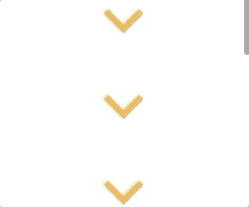

# 使用交叉点观察器 API 和 React 延迟加载图像

> 原文：<https://javascript.plainenglish.io/lazy-load-images-with-the-intersection-observer-api-and-react-4fd8ae19e195?source=collection_archive---------7----------------------->

交叉点观察器 API 允许您观察元素进入视口或父元素时的变化并做出反应。它非常常用于延迟加载，但也可以用于动画或当您滚动到页面的不同部分时改变导航栏中链接的活动状态。延迟加载图像使用户不必在初始页面加载时下载资源，而是推迟到更合适的时候。

我一直在玩不同的懒人加载图像的效果，我喜欢这一个，不是用真实的图像交换占位符图像，而是用 CSS 不透明过渡显示图像。

What we’ll be building!

## 安装并导入包和样式

为了做到这一点，让我们从一些导入开始，我们将使用 React 钩子、CSS 模块和 classnames 包来完成这项工作。您可以使用`create-react-app`在 CodeSandbox 中看到下面完整的代码。

## **创建组件**

我们将创建一个函数组件，它返回一个 div 元素，我们将使用它作为占位符。我们还将使用`useRef`钩子来获取对 DOM 中占位符的引用。稍后，我们可以使用这个引用来查看占位符是否进入了视口。

`useRef`钩子为您提供了一种在返回的对象上使用`.current`属性存储可变值的方法。我不会深入解释为什么这很有用，但是在我们的例子中，当我们对占位符元素执行`ref={placeholder}` 操作时，React 会将`.current`属性设置为相应的 DOM 节点，并在该值发生变化时保持其最新。

## 添加样式

这种样式非常简单，包装图像和占位符的元素将其`display`设置为`relative`来约束绝对定位的占位符。本质上，占位符是一个黄色的框，底部填充设置为匹配我们使用的图像的纵横比。添加 transition 属性意味着当我们以编程方式添加`hidePlaceholder`类时，我们可以使用 CSS 淡出占位符。

在这一点上，除了页面上的一个黄色矩形，我们什么也没有…令人兴奋！

下一步是让那个框淡出，我们已经创建了 CSS 类，所以我们只需要将它添加到占位符`div`中。首先，我们将使用`useState`钩子创建一个新的状态，让我们知道是否应该显示我们的图像。默认情况下这是`false`，我们不想在第一次渲染时显示我们的图像。然后，我们将使用我们的`showImage`状态来决定何时添加我们的`hidePlaceholder`类。为了做到这一点，我喜欢使用`[classnames](https://www.npmjs.com/package/classnames)`包，因为它比我自己编写的要干净一点，而且对于用类名进行条件逻辑也很方便。

既然已经排序了，我们可以更新占位符元素来使用新的 classes 变量。

## **添加我们的图像**

现在，当`showImage`状态的值改变时，我们的盒子将消失。但是，我们仍然需要实际显示图像，所以让我们接下来这样做。我选择了一个图像，并在我的组件之外为它创建了一个名为`IMAGE_URL`的变量。我们已经有了我们的`showImage`状态，所以我们也可以用它来有条件地渲染我们的图像。

## **设置路口观察者**

我们剩下要做的就是在占位符出现时改变我们状态的值。我们需要设置[路口观察器](https://developer.mozilla.org/en-US/docs/Web/API/Intersection_Observer_API)。

交叉点观察器有两个参数，第一个是回调。这是当你的元素进入视图时，在我们的例子中，当我们的占位符进入视图时，它将被调用。请注意，这个回调也将在观察者第一次试图观察你的元素时被执行。

回调将得到一个[intersectionobserventry](https://developer.mozilla.org/en-US/docs/Web/API/IntersectionObserverEntry)对象的列表作为它的第一个参数。列表中的每个项目代表被观察的每个项目，其相交状态已经改变。在我们的例子中，列表的长度总是为 1，因为我们只关注一个元素(我们的占位符)。

我们可以检查条目上的*is intersection*属性的值，看看我们的占位符是否在视口内，如果是，那么我们应该将我们的`showImage`状态更新为 true。

传递给交叉点观察器的第二个参数是 options 对象。我们可以设置几个不同的选项来配置观察器，但我们只关注`threshold`。阈值决定了何时应该运行回调。它可以是一个数字，也可以是一组数字。默认情况下，这是 0，所以如果我们正在观察的元素的 1 个像素进入了视窗，那么我们的回调就会被触发，我已经将它改为 1.0，这意味着我们的`showImage`状态不会改变，直到整个占位符都在视窗中。这也意味着我们可以看着它平滑地淡入。

现在我们可以创建交叉点观察器的新实例，传入我们的`callback`和`options`，并使用它来观察我们的占位符。

你会注意到我已经把它全部放在了一个`useEffect`里面。当我们的组件在屏幕上时，我们使用`useEffect`钩子在渲染后运行代码(一种效果)。在我们观察占位符之前，我们需要等待这种情况发生。默认情况下，每次渲染后`useEffect`都会在*之后运行，但是我们可以将其更改为在特定值发生变化时运行。*

我们可以通过将一个数组作为第二个值传递给`useEffect`钩子来做到这一点，这个数组应该包含你的效果使用的任何依赖关系，以确保它总是有最新的值。在我们的例子中，效果没有任何依赖关系，我们只想设置一次交叉点观察器，所以我将数组留空。这意味着效果只会在第一次渲染时运行一次。

Image: UK Black Tech

## `UseEffect`清理

我们还应该确保在`useEffect`中运行清理函数，我们可以通过在`useEffect`中返回一个函数来做到这一点，这个函数将在组件被销毁时被调用。

这里我们在观察者上使用了`disconnect`方法来阻止它观察所有目标元素的可见性变化。这意味着它将停止观察我们的占位符。

## **我们完成了！**

一旦你在你的图片上添加了足够的内容，当你向下滚动时，你会看到你的图片在占位符完全出现后平滑地淡入。请查看下面的 CodeSandbox 进行测试。🙂

谢谢你能走到这一步！在 insta gram[上关注我，了解其他 JavaScript 技巧和教程👩🏾‍💻](https://www.instagram.com/taraojo/)