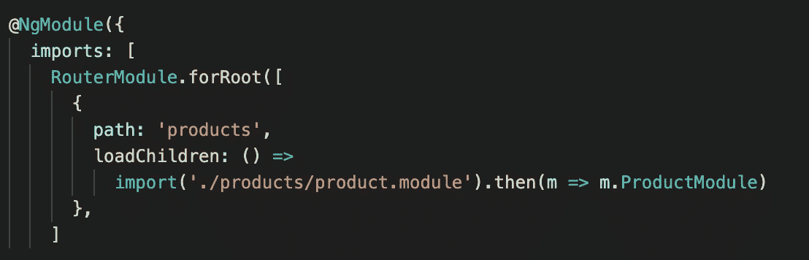
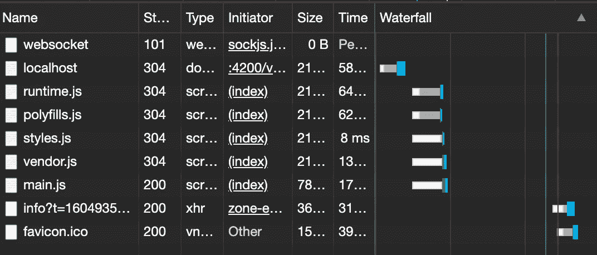
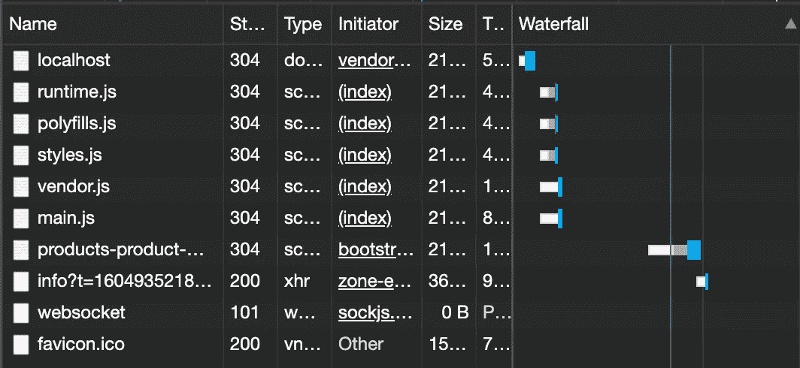

# 在 Angular 中实现延迟加载

> 原文：<https://javascript.plainenglish.io/lazy-loading-e96685a4c281?source=collection_archive---------13----------------------->

Photo by [Mike Burke](https://unsplash.com/@studio57mm?utm_source=medium&utm_medium=referral) on [Unsplash](https://unsplash.com?utm_source=medium&utm_medium=referral)

应用程序的用户体验对于留住用户非常重要。当一个应用程序需要很长时间加载时，用户先生，你有什么感觉？

是的，它当然不能留住你。

但是，angular 不会让这种情况发生在它的应用上。你以为懒装就是懒？

默认情况下，Angular 适应急切加载策略。快速加载在应用程序呈现的初始阶段加载 app 模块中声明的所有组件。当组件数量增加时，呈现应用程序所需的加载时间会很长。这会让用户不高兴，远离你的应用程序。解决方法是我们的懒惰装载。通过惰性加载，我们可以快速渲染我们的应用程序，它允许加载所需的组件来渲染页面，使用户体验更好。

> 可以为 angular 应用程序中的功能模块实现延迟加载。
> 
> 特定的特征模块路线应被分组到单个父模块中。
> 
> 不应在另一个模块中导入功能模块(即使不在应用程序模块中)

要延迟加载功能模块，请在 app 路由模块中配置其父路由，如下所示。

功能模块的导入是一个异步操作，它返回一个承诺。解决承诺后，将加载功能模块。此异步函数被分配给 RouterModule 的 loadChildren 属性。该属性负责延迟加载。

当应用程序进行初始呈现时，不会加载 productModule。我们可以在浏览器检查器的“网络”选项卡中看到。

浏览器只下载主包。当我们仅导航到 ProductModule 的父路由时，将下载惰性加载的 ProductModule。我们可以在下面的网络选项卡中看到。

这样我们可以加快装货速度。装载时间减少。

但是，如果路由仍然有许多组件要加载，会发生什么呢？它变得和急切装载一样。不是吗？如果我们在加载第一个路由组件时在后台预加载其他模块，会发生什么情况？

是的，这是个好主意。当其他预加载模块在后台加载时，这些模块将在用户访问它们时可用。因此，用户不需要等待加载其他懒惰加载的模块。

有一些预加载策略。默认情况下，应用程序没有预加载。这通常类似于惰性加载。全部预加载，这些选项允许您预加载所有延迟加载的模块。自定义预加载，这将通过配置加载哪个预加载模块以及何时加载来控制预加载。

预加载策略将在 RouterModule 中设置为 forRoot 方法的第二个参数。

有时我们有意避免预加载模块。示例我们只需要为经过身份验证的用户显示模块内容。要做到这一点，我们可以应用一个 CanLoad 保护装置来阻止预加载。你可以在[我之前的教程](https://tharmi14t.medium.com/why-i-chose-my-journey-to-angular-7aa7b49769fe)里看看其他有棱角的守卫。

为了进行自定义预加载，我们创建了一个预加载策略服务，它实现了 PreloadingStrategy 接口。在预加载预定义函数中，我们编写代码是否调用加载函数并预加载延迟加载的模块。创建自定义预加载服务后，我们将该服务分配给 RootModule 的 forRoot 函数中的 preloadingStrategy 参数。

我想现在你可能对延迟装载有所了解了。下节课再见。