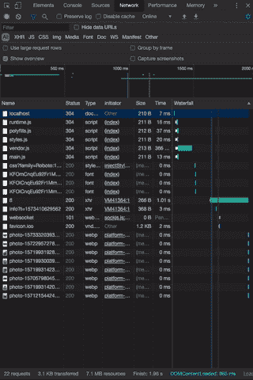
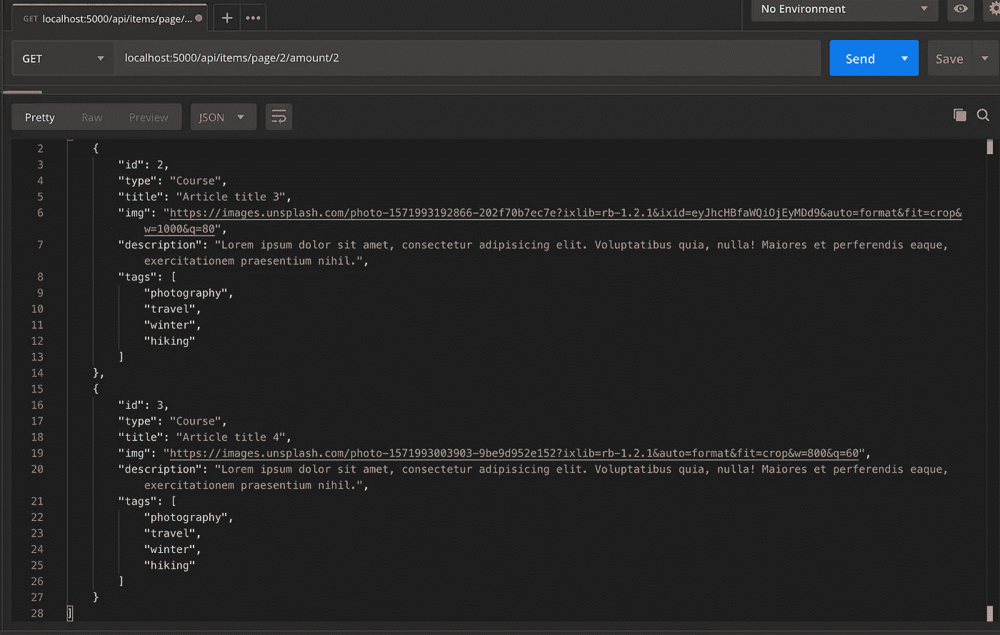

# 带角度的延迟加载

> 原文：<https://javascript.plainenglish.io/lazy-loading-with-angular-8aafdcfca0fc?source=collection_archive---------2----------------------->

## 既然可以以后加载，为什么要现在加载呢？

# 介绍

我们将构建一个简单的应用程序，该应用程序从 Node.js Express 服务器将带有图像的卡片异步提取到 Angular 应用程序中，并且只在用户滚动到页面底部后加载更多内容。


End result

先决条件:

*   HTML，CSS，JavaScript
*   熟悉 Angular 或任何其他 JavaScript 框架
*   对 HTTP 请求的基本理解
*   Node.js 的基础知识

> 什么是懒装？

惰性或按需加载是一种简单的方法，只在用户请求查看内容后才将其加载到网站中。



Chrome’s network tab when scrolling through the page

在上面的例子中，你可以看到，只有在用户开始滚动后，才会加载额外的卡片。

> 为什么使用延迟加载？

通过仅在需要时加载图像和视频，我们可以显著加快 web 应用程序的速度。这将最终提供更好的用户体验，特别是对于在移动数据计划上运行应用程序的用户。

# 入门指南

我们将从在您的项目目录中创建一个文件夹开始。打开您的终端并键入:

```
mkdir server 
```

正如你可能已经猜到的那样，我们的 express 服务器将运行在**服务器**文件夹中，而我们的 angular 应用程序将构建在**客户端**文件夹中，稍后将由 CLI 生成。

# 在服务器上工作

在您的**服务器**文件夹中，运行以下命令创建一个空的 **package.json** 文件:

```
 npm init -y
```

您将需要服务器的 Express:

```
npm i express
```

和 Nodemon，以便在您更改代码后自动重新加载:

```
npm i nodemon -D
```

在您最喜欢的代码编辑器中打开 **package.json** ，并添加以下脚本:

```
"scripts": {
  "start": "node server",
  "dev": "nodemon server"
},
```

创建一个名为 **server.js** 的新文件，并粘贴以下代码:

Our server code

**Server.js** 为 **/api/items** 路径上的 **items.js** 文件提供服务，该文件尚不存在，因此让我们创建它以及所需的文件夹和模拟数据文件。

创建以下目录和文件:

```
/server
  server.js
  /data
    items_list.js
  /routes
    /api
      items.js
```

为你的 **items_list.js** 抓取一些模拟数据:

[https://github . com/rail Aru/angular-lazy-load/blob/master/server/data/item _ list . js](https://github.com/railaru/angular-lazy-load/blob/master/server/data/item_list.js)

在 **items.js** 中创建一个简单的具有分页功能的 API 端点:

注意:由于我们的服务器是在本地运行的，响应几乎是即时的。为了模拟一个速度慢得多的实时服务器，在端点发送回响应之前添加了 1 秒钟的超时。

厉害！我们可以通过在 **/server** 文件夹中键入以下命令来启动并运行我们的服务器:

```
npm run dev
```

打开 [Postman](https://www.getpostman.com/) 应用程序，从 **items.js.** 向您的端点发出测试 GET 请求

当我们将 **page/2** 和 **amount/2** 作为 API 端点的参数传递时，第 3 条和第 4 条被返回。



# 在客户端工作

现在我们已经运行了服务器，并为我们的应用程序提供了一些模拟数据，我们可以开始使用 Angular 处理项目的前端部分了。

## 生成样板文件

确保您已经安装了 [Angular CLI](https://cli.angular.io/) 来为**客户端**生成样板代码:

```
ng new client
```

选择 **SCSS** 作为你的风格预处理器。

我们的应用程序需要一个 Angular 服务和一些组件，所以让我们使用 CLI 来生成它们。

在 **/client 内部，**生成一个服务，该服务将与我们之前制作的后端 API 进行对话:

```
ng g s api
```

当然，还有我们将用于应用布局和样式的 UI 组件:

```
ng g c grid && ng g c card && ng g c card-shimmer
```

接下来，你需要创建一个接口来[类型检查](https://www.typescriptlang.org/)你的前端代码。创建一个名为 **item.interface.ts** 的文件，并添加以下代码:

我们需要的最后两个文件用于样式。创建**_ typography . scss**和 **_animations.scss** 。

_typography.scss

_animations.scss

创建**后。scss** 文件，确保导入到 **styles.scss.**

最后，我们需要组织一下我们的前端应用程序。将刚刚生成的样板文件组织成以下结构:

```
/client/src/app/
  /components
    /containers
      /grid
    /presentationals
      /card
      /card-shimmer
  /services
    api.service.ts
    api.service.spec.ts
  /interfaces
    item.interface.ts
  /style
    _animations.scss
    _typography.scss
```

## 实现前端功能

既然 Angular 应用程序的样板代码已经生成，我们可以开始将它连接到 Express API，该 API 在以下位置提供分页项目:

```
http://localhost:5000/api/items/page/1/amount/12
```

将以下代码添加到 **api.service.ts** 中:

**fetchItems()** 方法返回一个类型为 **ItemInterface[]** 的[可观察对象](https://rxjs-dev.firebaseapp.com/guide/observable)。我们将能够订阅该方法从服务器接收的值。

**paginatePage()** 简单地增加 API 请求 URL 的页码，以便每次调用它时，我们可以从服务器获取新的项目，并在页面滚动时向用户显示它们。

现在，我们的 Angular 应用程序中有了数据，但是为了向用户显示数据，我们需要连接到 Angular API 服务，并将接收到的值传递给表示组件。

将以下代码添加到网格组件中:

在这个组件中，我们将检查用户是否已经滚动到页面底部，如果是，从 API 获取更多的值。

*注意:确保将****http client module****添加到 imports 中，将****API service****添加到****app . module . ts***中的 providers 中

在**grid.component.html**内添加以下布局:

使用 CSS 网格制作一个简单的响应网格:

Card 组件需要接收从 grid 组件传递来的值，所以让我们通过 Angular**" @ Input "**decorator 传递它们:

card.component.html

card.component.scss

酷！让我们给闪烁卡片添加一些样式，这样我们就可以在内容加载之前看到它们，而不是一片空白:

card-shimmer.component.html

card-shimmer.component.scss

从**app.component.html**中取出样板文件，将包裹在容器内的网格组件带进来；

啊呀！你的新的闪亮的(字面上)懒惰加载应用程序已经完成。确保您仍在运行服务器，并在 **/client** 中运行以下程序来启动 Angular 应用程序:

```
ng serve -o
```


The end result should look like this

感谢您的阅读和快乐编码！

资源和延伸阅读:

*   [已完成项目的 GitHub 链接](https://github.com/railaru/angular-lazy-load)
*   [角度文件](https://angular.io/)
*   [Rxjs 文档](https://rxjs-dev.firebaseapp.com/)