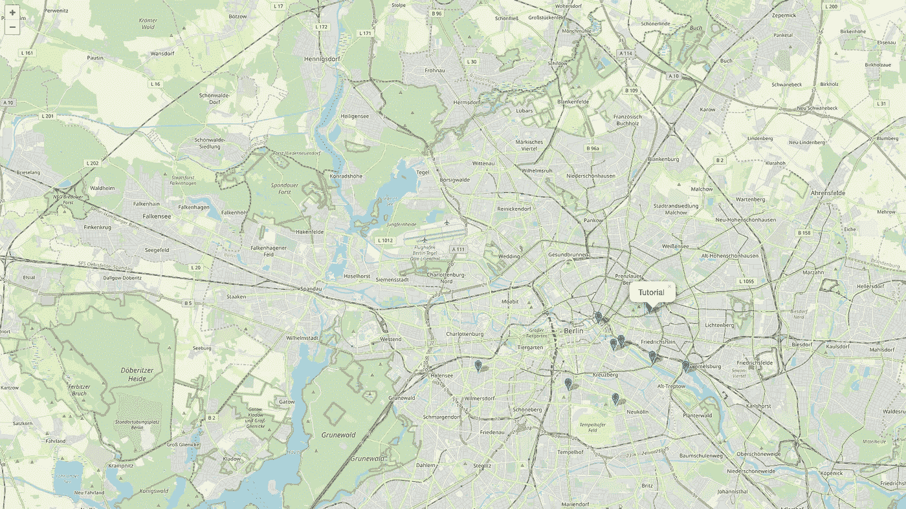
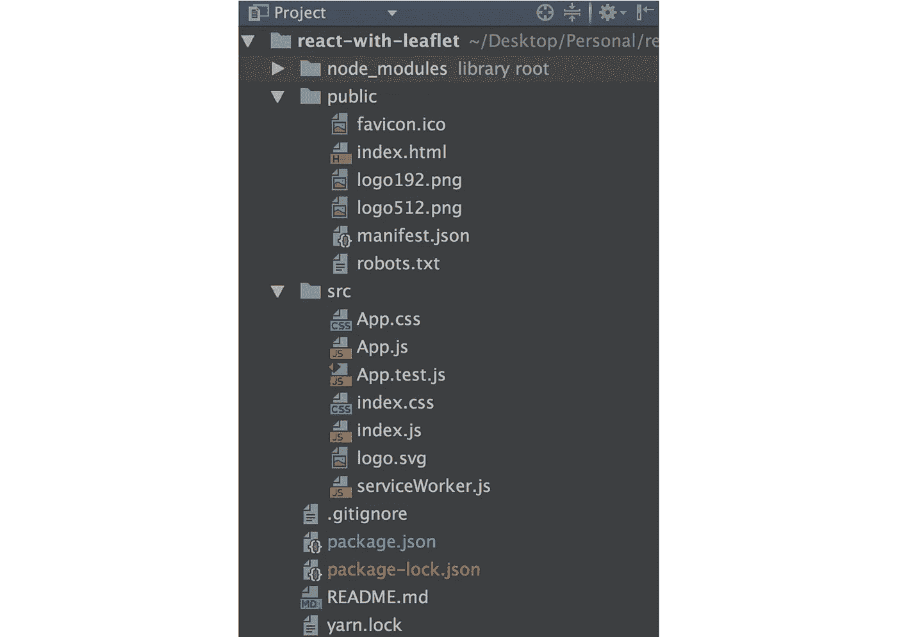
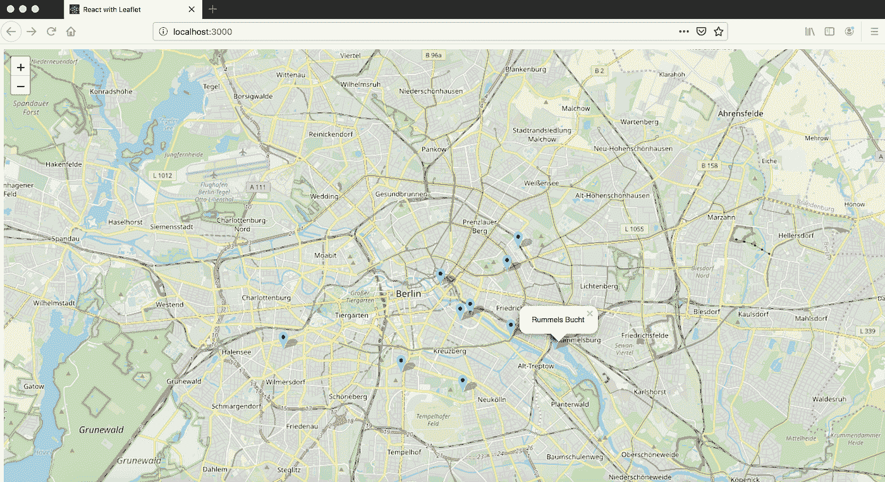

# 带 React 的传单地图—第一部分

> 原文：<https://javascript.plainenglish.io/leaflet-map-with-react-part-i-4ef4ecbdcc1b?source=collection_archive---------2----------------------->

本教程是为初入 react 并想开始使用 [*单张贴图*](https://leafletjs.com/) 搭配 [*React*](https://reactjs.org/) 的初学者准备的。我希望它能帮助你开始并实现你的目标。

我在这里 为源代码 [*创建了一个 GitHub 库。*](https://github.com/sayyedhammadali/react-with-leaflet/tree/part-I)



我们日常生活中使用的大量网络或移动应用程序正在使用某种地图服务，如谷歌地图或传单地图，它已经成为我们生活中不可或缺的一部分。我想通过这个教程来帮助那些刚刚使用 react 并想在他们的项目中使用一些地图服务的初学者。在本教程中，我们将使用传单地图。

# 本地运行

1.  克隆存储库:

```
git clone [https://github.com/sayyedhammadali/react-with-leaflet.git](https://github.com/sayyedhammadali/react-with-leaflet.git)
```

2.在项目文件夹中运行

```
npm install
```

3.跑过

```
npm start
```

# 说明

按照上述步骤**本地运行**后，在文本编辑器中打开 react-with-leaflet 文件夹。您将看到以下文件结构。



***注*** *:该项目需要两个名为* [**传单**](https://www.npmjs.com/package/leaflet) *和* [**反应-传单**](https://www.npmjs.com/package/react-leaflet) 的传单地图包。*你可以在* `package.json` *文件中看到这些包的版本详情。如果你按照第一步* **本地运行** *，这些包已经安装并存在于* `node_modules` *文件夹中。*

我将解释创建带有可点击标记的**整页地图所需的每个相关文件**，该地图打开一个带有场地名称的弹出窗口。



# src/App.js

```
import React from 'react';
import MapView from './components/MapView';
import './App.css';function App() {
  return (
    <div className="App">
      <MapView/>
    </div>
  );
}export default App;
```

[*链接到文件源代码*](https://github.com/sayyedhammadali/react-with-leaflet/blob/part-I/src/App.js)

该文件是 react 应用程序的起点，它在主应用程序中导入 **MapView.js** 组件。

# src/App.css

```
.leaflet-container {  width: 100vw;  height: 100vh; }
```

[*链接到文件源代码*](https://github.com/sayyedhammadali/react-with-leaflet/blob/part-I/src/App.css)

css 文件只是设置传单容器的高度和宽度，以便它填充视口(vw: viewport-width，vh: viewport-height)。

# src/components/venuelocationicon . js

```
import L from 'leaflet';export const VenueLocationIcon = L.icon({
  iconUrl: require('../assets/venue_location_icon.svg'), 
  iconRetinaUrl: require('../assets/venue_location_icon.svg'),  
  iconAnchor: null,
  shadowUrl: null,
  shadowSize: null,  
  shadowAnchor: null,
  iconSize: [35, 35],
  className: 'leaflet-venue-icon'
});
```

[*链接到文件源代码*](https://github.com/sayyedhammadali/react-with-leaflet/blob/part-I/src/components/VenueLocationIcon.js)

该文件为传单地图的自定义标记图标**创建一个对象。在我们的例子中，我们使用 svg 文件`/src/assets/venue_location_icon.svg`为地图标记创建`VenueLocationIcon`对象。**

# src/components/MapView.js

```
import React, { Component } from 'react';
import { Map, TileLayer } from 'react-leaflet';
import 'leaflet/dist/leaflet.css';
import data from '../assets/data';
import Markers from './VenueMarkers';class MapView extends Component {
  constructor(props) {
    super(props);
    this.state = {
      currentLocation: { lat: 52.52437, lng: 13.41053 },
      zoom: 12,
    }
  } render() {
    const { currentLocation, zoom } = this.state;
    return (
      <Map center={currentLocation} zoom={zoom}>
        <TileLayer
          url="https://{s}.tile.openstreetmap.org/{z}/{x}/{y}.png"
            attribution="&copy; <a href=&quot;http://osm.org/copyright&quot;>OpenStreetMap</a> contributors"
        />        <Markers venues={data.venues}/>
      </Map>
    );
  }
}export default MapView;
```

[*链接到文件源代码*](https://github.com/sayyedhammadali/react-with-leaflet/blob/part-I/src/components/MapView.js)

首先我们从`react-leaflet`包中导入`Map`和`TileLayer`组件。

```
import { Map, TileLayer } from 'react-leaflet';
```

然后我们从`leaflet`包中导入`leaflet.css`。

```
import 'leaflet/dist/leaflet.css';
```

然后，包含场地信息的`/src/assets/data.json`文件被导入到`data`变量中。这包括场地名称、描述和几何图形(坐标:纬度、经度)。

[*链接到 data.json*](https://github.com/sayyedhammadali/react-with-leaflet/blob/part-I/src/assets/data.json)

```
import data from '../assets/data';
```

导入`Markers`组件(这将在后面解释)。

```
import Markers from './VenueMarkers';
```

组件状态`currentLocation`包含备用坐标(柏林纬度，经度)。`zoom`默认值设置为 12。这些设置将使地图以柏林为中心，页面加载时的缩放级别为 12。

```
this.state = {
  currentLocation: { lat: 52.52437, lng: 13.41053 },
  zoom: 12,
}
```

在渲染函数中，返回`Map`组件。这包含设置为`currentLocation`和`zoom`的`center`和`zoom`道具。

`TileLayer`组件为地图添加图块。最后，我们将`data.venues`作为道具传递给`Markers`组件，这样所有的标记都会显示在地图上。

```
return (
  <Map center={currentLocation} zoom={zoom}>
    <TileLayer
      url="https://{s}.tile.openstreetmap.org/{z}/{x}/{y}.png"
        attribution="&copy; <a href=&quot;http://osm.org/copyright&quot;>OpenStreetMap</a> contributors"
    />
    <Markers venues={data.venues}/>
  </Map>
);
```

# src/components/VenueMarkers.js

```
import React, { Fragment } from 'react';
import {Marker} from 'react-leaflet';
import {VenueLocationIcon} from './VenueLocationIcon';
import MarkerPopup from './MarkerPopup'; const VenueMarkers = (props) => {
  const { venues } = props;
  const markers = venues.map((venue, index) => (
    <Marker 
      key={index} 
      position={venue.geometry} 
      icon={VenueLocationIcon}
    >
      <MarkerPopup data={venue}/>
    </Marker>
  ));    return <Fragment>{markers}</Fragment>
};export default VenueMarkers;
```

[*链接到文件源代码*](https://github.com/sayyedhammadali/react-with-leaflet/blob/part-I/src/components/VenueMarkers.js)

我们从`react-leaflet`包中导入`Marker`组件，

```
import {Marker} from 'react-leaflet';
```

之前为使用地图上的自定义图标而创建的标记对象，

```
import {VenueLocationIcon} from './VenueLocationIcon';
```

并导入`MarkerPopup`组件(这将在下面解释)。

```
import MarkerPopup from './MarkerPopup';
```

在 react 功能组件`VenueMarkers`中，我们从父组件`MapView.js`中获取`props`(场馆数据)并将其保存在`venues`中。我们使用地图功能为每个场馆创建标记。我们将`position`和`icon`属性传递给每个`Marker`组件，因此它包含自定义标记图标和来自`venue.geometry`的纬度和经度。

在每个标记内部，我们将`venue`传递给`MarkerPopup`组件的`data`道具。

最后我们返回所有的`markers`。我们使用一个`fragment`标签将它们包装在一起，这样我们就不会向 DOM 添加额外的节点。

```
const { venues } = props;const markers = venues.map((venue, index) => (
    <Marker 
      key={index} 
      position={venue.geometry} 
      icon={VenueLocationIcon}
    >
      <MarkerPopup data={venue}/>
    </Marker>
));return <Fragment>{markers}</Fragment>};export default VenueMarkers;
```

# src/components/marker popu . js

```
import React from 'react';
import {Popup} from 'react-leaflet';const MarkerPopup = (props) => {
  const { name } = props.data;

  return  (
    <Popup>
      <div className='poup-text'>{name}</div>
    </Popup>
  );
};export default MarkerPopup;
```

[*链接到文件源代码*](https://github.com/sayyedhammadali/react-with-leaflet/blob/part-I/src/components/MarkerPopup.js)

我们从`react-leaflet`包中导入`Popup`组件。

```
import {Popup} from 'react-leaflet';
```

当在地图上点击一个标记时,`MarkerPopup`组件打开弹出窗口，并在弹出窗口中显示场地名称。

```
const MarkerPopup = (props) => {
  const { name } = props.data;

  return  (
    <Popup>
      <div className='popup-text'>{name}</div>
    </Popup>
  );
};
```

我希望你喜欢我的第一篇文章。在下一部分，我们将介绍以下内容:

*   单击每个标记时，放大标记；
*   当点击每个标记时，打开一个侧边栏来显示更多的场馆信息；
*   请求并在地图上显示当前位置。

# 关于作者

我在 [Lucid 担任全栈开发人员。工作室](https://medium.com/u/cb727ce3b3c0?source=post_page-----4ef4ecbdcc1b--------------------------------)我非常有兴趣学习并与社区分享我的知识。如果你喜欢我的工作，那就在 LinkedIn 上联系我:Sayyed Hammad Ali。

```
*// HASTA LA VISTA BABY
//                      ______
//                    <((((((\\\
//                    /      . }\
//                    ;--..--._|}
// (\                 '--/\--'  )
//  \\                | '-'  :'|
//   \\               . -==- .-|
//    \\               \.__.'   \--._
//    [\\          __.--|       //  _/'--.
//    \ \\       .'-._ ('-----'/ __/      \
//     \ \\     /   __>|      | '--.       |
//      \ \\   |   \   |     /    /       /
//       \ '\ /     \  |     |  _/       /
//        \  \       \ |     | /        /
//         \  \      \        /*
```

[](https://lucid.berlin/) [## 清醒。Studio *复杂的项目需要清晰的思路来实现有意义的改变。

### 改变是好事。联系我们。困难的简报？联系我们。需要专家网络？联系我们。想看更多…

lucid .柏林](https://lucid.berlin/)