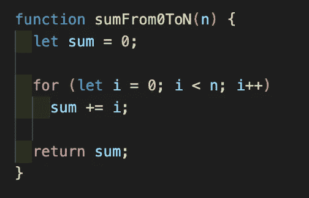
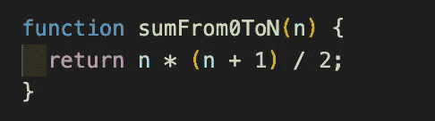
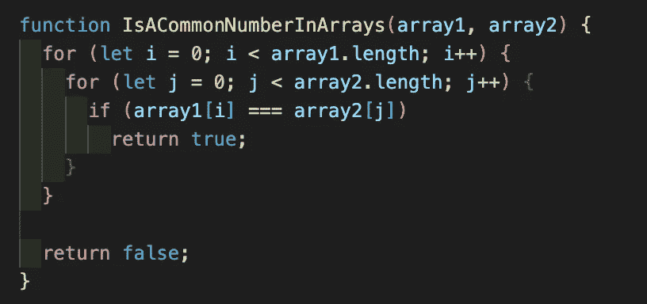
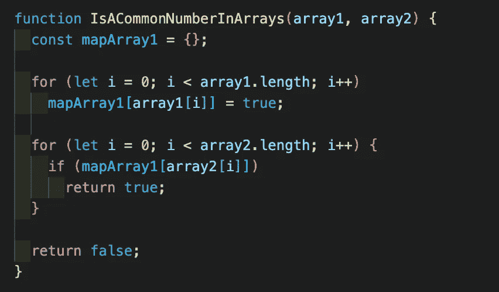
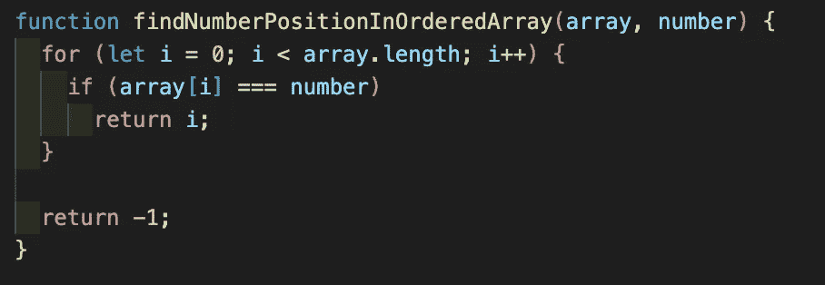
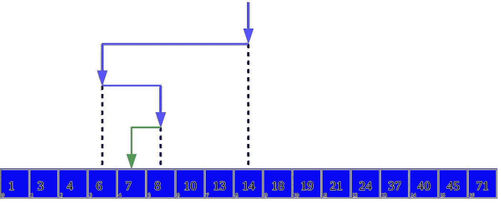

# 5 分钟学会大 O 记谱法

> 原文：<https://javascript.plainenglish.io/learn-big-o-notation-in-5-minutes-c24e647c4309?source=collection_archive---------3----------------------->

## 比大家想象的要简单！

Photo by [Aron Visuals](https://unsplash.com/@aronvisuals?utm_source=unsplash&utm_medium=referral&utm_content=creditCopyText) on [Unsplash](https://unsplash.com/s/photos/hourglass?utm_source=unsplash&utm_medium=referral&utm_content=creditCopyText)

大 O 符号经常被开发者忽略。然而，这是一个基本的概念，**非常有用并且非常容易理解**。

让我们在几分钟内了解它是什么。

# 大 O 符号

大 O 符号(或算法复杂度)是衡量算法性能的标准方式。**它用一种数学的方式来判断你的代码的有效性**。

不要太害怕“数学”这个词。这只是你已经知道的基本操作。

这种符号允许您测量与输入数据相比的算法增长率的演变。**它将描述你的代码**在性能方面可能出现的最坏情况。

这种符号的强大之处在于能够不受外部事件(如连接不良、硬件问题等)的影响来衡量算法的效率。它基于一个单一的标准:要执行的操作数量。

# 一个基本例子

让我们通过一个基本的例子来真正理解这个符号。

想象你正在参加一个工作面试。其中一项技术测试是创建一个函数，该函数将数字 n 作为输入，并返回从 0 到 n 的数字之和。

一个简单的实现是从 0 到 n 进行迭代，并在每次迭代中执行加法。

Basic example using JavaScript

如果我收到 10 个输入，我将有 10 次迭代。如果我有 100 万个输入，我将有 100 万次迭代。迭代次数等于给定的输入。

我们有一个线性的执行时间。我们可以说这个算法的复杂度是 O(n)。括号中的数字 n 表示要执行的迭代次数等于输入。

这个练习的最佳解决方案是使用著名的方法 n * (n + 1) / 2。

Basic example optimized

使用这个解决方案，无论给定的数字是多少，都只有一个操作。该算法需要一个恒定的时间来执行，我们说我们有 O(1)的复杂度。

*在这种情况下，O(1)不一定意味着算法非常快。这可能需要几纳秒(就像我们的* `*sumFrom0ToN*` *函数)或三分钟，这取决于该函数做什么。这意味着无论输入中给出多少数据，算法都需要一个恒定的执行时间。*

# 常见错误的例子

你开始理解大 O 符号是如何工作的了。现在我们来看一个在开发者世界中非常常见的案例。

在下一个练习中，您有两个数组，每个数组包含 n 个数字。你必须写一个函数，如果一个数是两个数组共有的，它返回 true。

简单(和天真)的方法是迭代两个数组，当有匹配时返回。

假设两个数组的大小都是 10。在最坏的情况下(没有公约数)，我们会有 10 * 10 次迭代，总共 100 次迭代。该算法的复杂度为 O(n)。

本练习的最佳解决方案是对一个数组使用一个映射，以避免出现两个嵌套循环。

The same example optimized

在这个优化的解决方案中，我们仍然有两个循环，但它们不再嵌套。在最坏的情况下(没有公约数)，我们将有 10，加上 10 次迭代，所以总共 20 次迭代。该算法的复杂度为 O(2n ),这是一个很好的结果。

# 复杂示例

让我们为最后一个例子尝试一个更复杂的例子。

在下一个练习中，你必须编写一个优化的算法，在一组从低到高排序的数字中找到一个数字的位置。

简单的(也是天真的)方法是从数组的开头到结尾进行迭代以找到位置。

The algorithm return -1 if the number is not find, but this is not important

你可以看到这个算法和第一个算法的相似之处。一个循环，遍历数组中作为参数给出的所有元素。你猜对了，这个算法的复杂度是 O(n)。

但是数组包含有序数字的事实允许我们使用更好的算法:二分搜索法算法。

基本上，我们不是尝试数组中的每个数字，而是首先尝试中间的数字。如果这个数字比我们的数字小，我们将对从这个数字到结尾的数组重复相同的操作。另一方面，如果元素大于我们的数字，我们将从开始到这个元素重复数组的操作。

Visualization of the binary search algorithm where 7 is the target value. Picture from [Wikipedia](https://en.wikipedia.org/wiki/Binary_search_algorithm)

二分搜索法算法在对数时间内运行，其复杂度为 O(log(n))。这意味着，算法的执行时间仍然取决于输入(这里是数组的大小)。但是当输入数变大时，迭代次数增加不多。

An implementation of the binary search algorithm in JavaScript using recursive functions.

# 不同复杂时间概述

了解不同类型的复杂时间是很有趣的。

当您需要处理大量数据时，执行时间为常数或对数的算法总是最好的。

具有线性执行时间的算法也很好，但是在处理大量数据时可能会遇到一些性能问题。

最后，无论如何都要避免执行时间呈指数增长的算法，因为它们太贪婪了，你迟早会遇到问题。

知道大 O 符号很重要，它代表算法的效率，让你找到更优化的方法来达到同样的结果。

即使在性能无关紧要或者数据量非常小的时候，您仍然需要挑战自己算法的效率。而且往往，最优化的方式也是最优雅的写法！

# 来源:

[https://www . jesuisundev . com/comprendre-la-notation-big-o-en-7-minutes/](https://www.jesuisundev.com/comprendre-la-notation-big-o-en-7-minutes/)