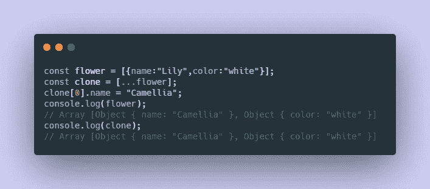
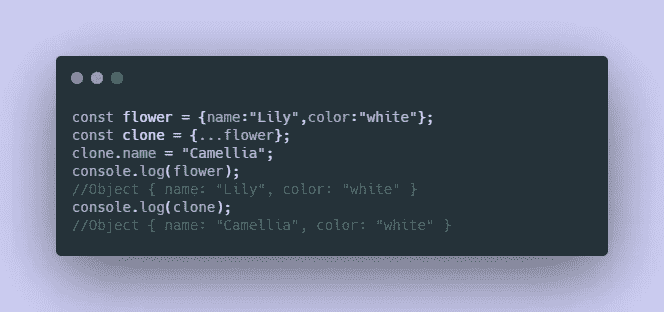
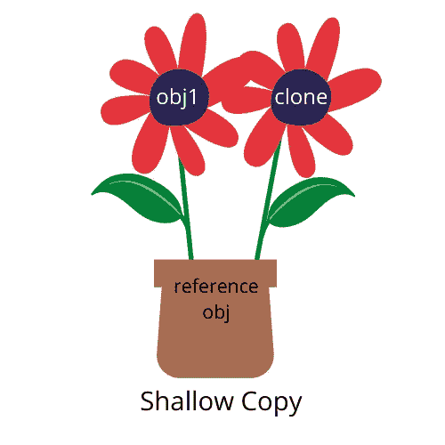
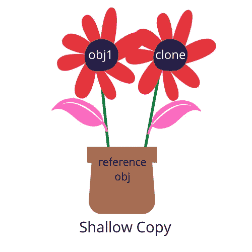
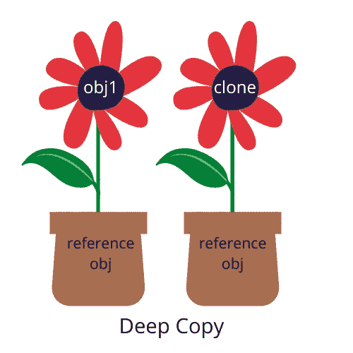
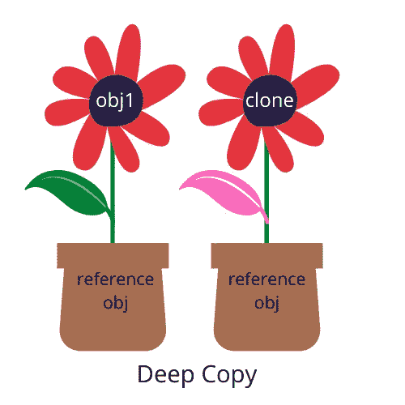
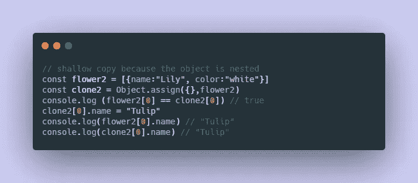
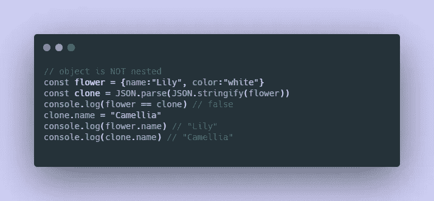

# 通过棘手的 JavaScript 问题学习深度和浅层复制

> 原文：<https://javascript.plainenglish.io/learn-deep-shallow-copy-with-tricky-javascript-questions-c563cdb5a4dd?source=collection_archive---------8----------------------->

## *代码示例&插图等待*

## **看看下面的代码片段并比较结果:**

Code Example_01

在上面的代码中，当我们将克隆体的名称从“百合”更改为“山茶花”时，原来的花也随之更改。

Code Example_02

现在，让我们看看第二个例子。有趣的是，我们把克隆体的名字改成“山茶花”后，原来的花名还是“百合”。

# 你发现最大的不同了吗？

在第一个例子中，flower 在一个数组中有一个**嵌套对象**，而第二个例子中没有。这个棘手的问题给我们上了一课:理解深层和浅层拷贝很重要，否则您可能会无意中改变数据。

第一个例子创建了一个**浅拷贝**，这意味着只有顶层的值被复制，但是嵌套的对象仍然指向内存中的同一个对象。因此，当您更改克隆的名称时，原始的花也会更新。

然而，第二个示例创建了一个**深层副本**，这意味着克隆体和花朵引用内存中不同的对象。因此，所有的值都是不相关的。

让我们用一个类比来想象这里发生了什么。这不是一个完美的类比，但希望它能帮助你更好地理解这个概念。

# 浅层复制类比

下面我们有两个工厂:obj1 和它的克隆。在这个类比中，叶子代表属性{ color:“green”}。这两个工厂相互连接并共享同一个 pot(即指向内存中的同一个对象)。

当我修改克隆体的叶子颜色时，原来 obj1 的叶子也会变成{ color:“pink”}。嘣！就像魔法一样。

Shallow Copy Analogy

# 深层复制类比

这里我们有两个植物:obj1 和它的克隆。同样，叶子代表属性{ color:“green”}。然而，在这个类比中，这两个植物是不相连的，并且各自有自己的锅(即指向内存中的不同对象)。

当我修改克隆体的叶子颜色时，原始 obj1 的叶子将**而不是**完全不受影响。

# **其他克隆方法怎么样？**

除了 ES6 spread 操作符，我们还可以使用 Object.assign()或 JSON . parse(JSON . stringify(object))来制作副本。

## **Object.assign()**

与 spread 运算符类似，如果数据是嵌套的，它将进行浅层复制，如果数据不是嵌套的，它将进行深层复制。

Object.assign() shallow copy

Object.assign() deep copy

## **JSON . parse(JSON . stringify(object))**

此方法允许您进行深层复制，而不管是否存在嵌套数据。让我们来看看。

对象是否嵌套并不重要，它进行深度复制！

## Lodash cloneDeep

如果你认为用 JavaScript 克隆东西很麻烦，你可能想看看 [Lodash](https://lodash.com/) ，这里是关于 cloneDeep 的[文档](https://lodash.com/docs/4.17.15#cloneDeep)！

## 就是这样！理解起来并不难，对吧？

**如果你有兴趣探索更多关于这个话题的内容，可以看看下面的阅读材料:**
-阅读[一篇](https://www.freecodecamp.org/news/copying-stuff-in-javascript-how-to-differentiate-between-deep-and-shallow-copies-b6d8c1ef09cd/)
-阅读[两篇](https://stackoverflow.com/questions/122102/what-is-the-most-efficient-way-to-deep-clone-an-object-in-javascript)