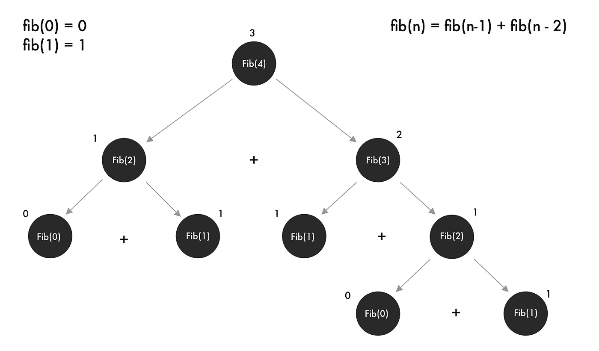
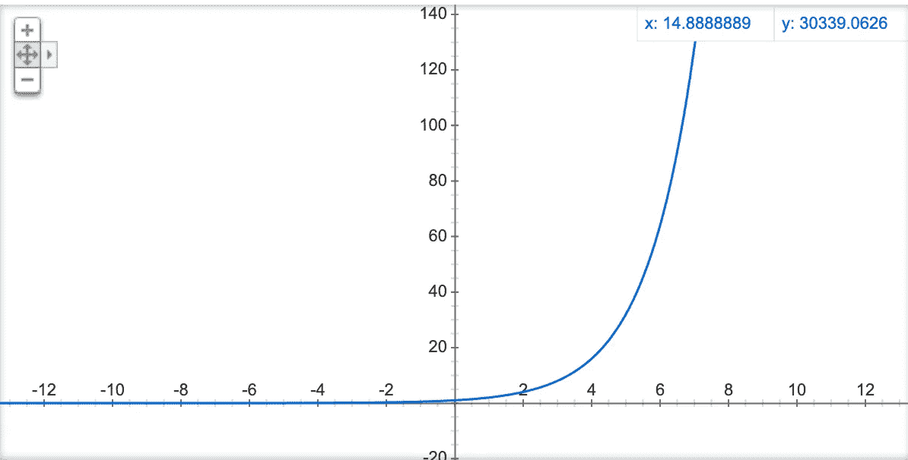

# 别再假装不需要学习动态编程了！

> 原文：<https://javascript.plainenglish.io/learn-dynamic-programming-in-javascript-e80fbdb29b7a?source=collection_archive---------1----------------------->

Photo by [chuttersnap](https://unsplash.com/@chuttersnap?utm_source=medium&utm_medium=referral) on [Unsplash](https://unsplash.com?utm_source=medium&utm_medium=referral)

## 不要担心；这并不像听起来那么难！

啊，动态编程。程序员讨厌他。撇开所有的笑话不谈，许多编码员——无论是自学的还是其他的——从来没有学习过这种算法方法。

我知道，这听起来有点吓人。但是，我记得我第一次听到这个词时的反应。

**我第一个想到的是一个疯狂的 wiz 的形象——kid 编写一些可以实时修改自己的疯狂算法。**

**但是这个术语不能准确地描述这种方法。你还会看到它被记忆化，记忆化更准确，但没有前者那么容易记住。**

**我们开始吧。**

# **教科书定义(来自维基百科)**

**[**动态编程**](https://en.wikipedia.org/wiki/Dynamic_programming) 既是一种[数学优化](https://en.wikipedia.org/wiki/Mathematical_optimization)方法，也是一种计算机编程方法。这项技术是由理查德·贝尔曼在 20 世纪 50 年代开发的，已经在从航空航天工程到经济学的众多领域得到了应用。**

# **现在用简单的英语**

**通过将计算结果存储在内存中，并在需要时重用它们以节省时间，算法方法被用来优化一个简单的解决方案(通常是递归的)。**

# **但是怎么做呢？**

**不是所有的问题都可以用动态编程来解决，但是所有的问题都有相同的条件。**

*   **这个问题是递归的，因此可以分解成子问题**
*   **子问题通常会在某一点上重叠。**

# **在某一点上重叠？**

**当我说两个子问题重叠时，程序将不得不解决同一个问题至少不止一次。**

**动态规划的基础是每个子问题只计算一次，并保存结果以备以后需要再次计算时使用。**

**这意味着不用重复计算同一个子问题——通常是数千次——我们只需做一次，将它存储在内存中，并在需要时重用它。**

# **通过实例学习**

**好吧，你可能理解这个理论，但是我们如何实现它呢？首先，让我们分解一个著名的例子来理解它是如何工作的以及为什么工作。**

## **斐波那契数列**

**黄金比例，这个数列是由著名的意大利数学家列奥纳多·斐波那契发现的。**

**顺序是这样的。**

> **0 — 1 — 1 — 2 — 3 — 5 — 8 — 13**

**你能找到模式吗？每个数字都是通过将序列中的前两个数字相加来计算的。比如给定 **fib(0) = 0** ， **fib(1) = 1** ，那么我们可以从 **fib(2)** 开始，发现下面的公式求解。**

> **光纤(n) =光纤(n-1) +光纤(n-2)**

**在事先不知道的情况下，如何找到前两个值？**

# ****天真的方法(递归)****

**如果你了解递归，它可以非常优雅和直接地解决这个问题。像这样**

**递归将问题分解成更小的子问题，直到达到一个基本情况(当 n = 0 时)，然后重新构造解决方案。**

**通过查看，我们可以理解，要找到序列中的第 10 个数字，我们需要找到它之前的两个值。**

**我是一个视觉学习者，所以我会把它画出来。之后就好理解多了。相信我！**

# **递归分解**

****

**Graphics by yours indeed.**

**我们可以看到，通过递归地分解问题，我们向下到了基础案例 **1** 或 **0****

**一旦我们到达案例，调用栈将通过添加我们沿着树向下进行的每个调用来负责重建解决方案。**

# **仔细看看**

**我们还可以非常清楚地看到计算重叠的地方。在这种情况下， **fib(2)** 计算**两次**，而 **fib(1)** 计算**三次**。对于序列中的小数字来说，这几乎不是问题，但是随着 n 的增加，每次计算都要重复更多次。**

**那需要多少努力？**

**我们必须进行八次计算才能找到序列中的第四个数字。**

**这转化为 **2^n** ，因为我们的算法每次分裂都会产生两个子问题。**

**八个**操作**现在看起来可能没问题，但是寻找 **fib(15)** 呢？**

**2 ⁵= **32768** 操作！**

**这是一个指数函数，它会随着值的增加而急剧增长。**

****

**Google 2^x to get this graph**

**希望你现在能理解随着 T21 的增加，这个算法的伸缩性有多差。**

**即使最快的计算机也难以计算 fib(100)**

**但是如果我们只计算每个值一次呢？这个问题变成了一个线性问题。为了找到 fib(100 ),我们只需要 100 次运算，因为我们添加了 O(n)空间以避免重复计算。**

**嘣！这就是你的动态编程！**

# **来实现它**

**一旦你知道需要做什么，这个问题就简单了。**

**我们需要采用线性方法——一个循环来实现这一点。然后我们必须建立从树叶到根(N)的解决方案。**

# **自下而上的方法**

**与其递归地分解问题，我们可以从基础案例开始，然后把它建立起来。**

**首先，我们初始化一个数组来存储我们的值。我们已经知道了 **fib(0)和 fib(1)** 的值，所以我们将其初始化为 **[0，1]。****

**然后我们从 2 开始循环，一直到到达 **n.****

**为了计算当前值，我们使用从序列中导出的公式。因为 i = 2，所以结果[2] =结果[1] +结果[0]。**

**当我们前进时，如果我们只需要数组中前两个值，而不是像以前那样计算重叠的值。**

# **奖金**

**如果你没有注意到，由于我们的公式只需要最后两个数字，我们可以跟踪它们，而不是从 0 到 **n** 的整个序列。**

**只需将它们存储在两个变量中，并随着循环的进行进行更新。**

**就速度而言，我们的解决方案仍然是 O(n)，但是我们能够将内存使用减少到 O(1)，(常数)，因为我们总是只使用两个变量。**

# **结论**

**这并不难，对吧？**

**一旦我们认识到问题可以动态解决，那就轻而易举了。**

**困难的部分是首先识别模式。**

**这就是为什么你应该总是尝试用简单的方法解决问题——在这个例子中是递归的——并从那里开始。**

> **这些问题都可以在面试问题中问到，所以知道如何解决总是加分的。**

## ****用简单英语写的 JavaScript 笔记****

**我们已经推出了三种新的出版物！请关注我们的最新出版物: [**AI in Plain English**](https://medium.com/ai-in-plain-english) ，[**UX in Plain English**](https://medium.com/ux-in-plain-english)，[**Python in Plain English**](https://medium.com/python-in-plain-english)**——谢谢，继续学习！****

****我们也一直有兴趣帮助推广高质量的内容。因此，如果你有一篇文章想要提交给我们的任何出版物，请发送电子邮件至[**submissions @ plain English . io**](mailto:submissions@plainenglish.io)**，并附上你的 Medium 用户名，我们会将你添加为作者。此外，请让我们知道您想加入哪个/哪些出版物。******