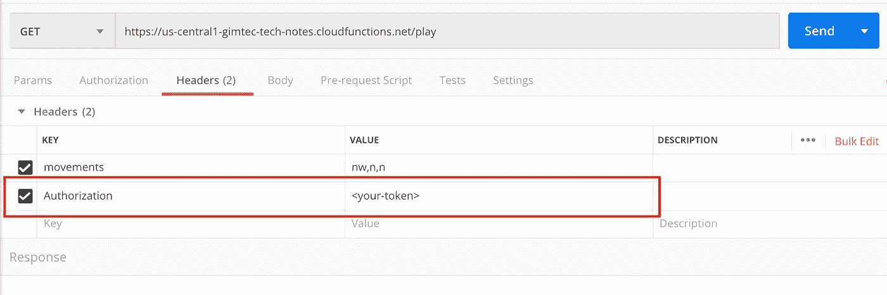
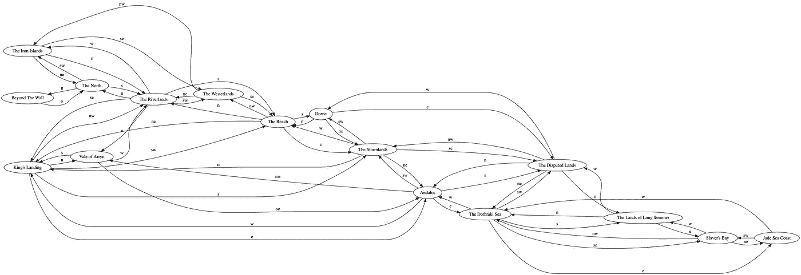
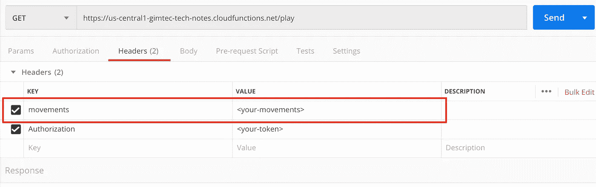

# 通过拯救维斯特洛学习 HTTP 联网

> 原文：<https://javascript.plainenglish.io/learn-http-networking-by-saving-westeros-39a2e8bb905d?source=collection_archive---------4----------------------->


Photo by [mauRÍCIO santos](https://unsplash.com/@maeowt?utm_source=medium&utm_medium=referral) on [Unsplash](https://unsplash.com?utm_source=medium&utm_medium=referral)

这是我为一次训练开发的小游戏。它应该可以帮助你掌握 HTTP 网络。

游戏没有界面。HTTP 请求是接口🤯

我将在这篇文章中解释如何玩这个游戏。但是，我不会解释 HTTP。我把这个留给读者。一些链接以防你不知道从哪里开始:[培训的联网章节](https://gimtec.gitbook.io/tech-introduction-for-product-people/networking/networking)， [MDN 讲解](https://developer.mozilla.org/en-US/docs/Web/HTTP/Overview)和[维基百科](https://en.wikipedia.org/wiki/Hypertext_Transfer_Protocol)。

# **拯救维斯特洛**

你必须从夜王手中救出维斯特洛！

**冬天来了！**

游戏的接口是一个 API。你通过向它发送请求来玩游戏。

推荐你用[邮差](https://www.getpostman.com/)。

## **游戏对象:**

找到并杀死夜王。

**怎么找到他？你在一个地区开始游戏。你通过请求在地图上移动。**

**怎么杀他？你需要找出杀死他所需的准确的 HTTP 请求。哪些头、查询参数、主体和方法。地图上有四个角色会给你提示。**

向哪里提出请求？

```
https://us-central1-gimtec-tech-notes.cloudfunctions.net/play
```

但是，如果您已经注册，首先您需要注册或登录。

## 如何登录或注册

注册或登录时，您将收到一个令牌(一个长文本)。

你的请求需要这个令牌。是用来证明你是你的。

**注册:**发送*邮件*和*密码*到需要的端点进行注册；

```
https://us-central1-gimtec-tech-notes.cloudfunctions.net/register
```

您需要发送一个带有以下正文的 *POST* 请求:

```
{
  “email”: “<valid-email>”,
  “password”: “<some-password>”
}
```

请记住，为了能够发送 JSON，您需要添加适当的`Content-Type`头，值`application/json`。

回应:

```
{
  “email”: “<same-email>”,
  “initialRegionId”: “<your-initial-region>”,
  “id”: “<some-id>”,
  “token”: “<some-large-token>”
}
```

**登录:**当您注册到所需的端点时，通过发送相同的“电子邮件”和“密码”进行登录:

```
https://us-central1-gimtec-tech-notes.cloudfunctions.net/login
```

您需要发送带有以下正文的“POST”请求:

```
{
  “email”: “<your-email>”,
  “password”: “<your-password>”
}
```

响应:在登录的响应中，您会发现与注册中相同的信息。

```
{
  “email”: “<same-email>”,
  “initialRegionId”: “<your-initial-region>”,
  “id”: “<some-id>”,
  “token”: “<some-large-token>”
}
```

**令牌**

检查来自*登录*和*寄存器*的两个响应如何发回一个*令牌*。

您需要将它包含在您所做的每个请求的请求头中。

头名是`Authorization`，值是收到的令牌。

在邮递员中:



**初始区域**

在响应中，检查关键字`initialRegionId`。这是你开始探索的地方。

任何行动都是从那个地方开始的。

## **入门**

一旦你有了令牌，你就可以开始玩游戏了。

在开始播放之前，一直读到结尾。

**地图**

你从一个特定的区域开始，需要在地图上移动来完成挑战。

该地图或多或少类似于[这个](https://awoiaf.westeros.org/index.php/File:Agot_hbo_guide_map.jpg)。以防你对电视节目或书籍不太熟悉。

这是一张这些区域以及它们之间联系的图表。



Westeros Graph Map done with [http://graphviz.it/](http://graphviz.it/#/)

你可能需要放大😅

线的名称是方向或运动。稍后将详细介绍。

**开始播放**

通过发出 GET 请求，你可以看到你在哪里。要播放的 url 是:

```
https://us-central1-gimtec-tech-notes.cloudfunctions.net/play
```

响应示例:

```
{
  “region”: “The Riverlands”,
  “message”: “No one is here. Everybody has left. Winter is coming!”
}
```

**记住**用令牌设置`Authorization`头，证明你已经注册了。

**响应状态**

当请求成功时，有两种不同的响应状态。

T21:这意味着你从那个地区获得了所有的信息

还有一些隐藏的信息。当一个角色出现时。

**在地图上移动**

你有 8 个方向可以移动:北、南、东、西、东北、西北、东南和西南。

你需要使用 n，s，e，w，ne，nw，se 和 sw 的缩写形式。

您需要在自定义标题中发送您的动作。

标题的名字是`movements`。您可以通过在中间添加`,`来发送多个动作。例如:`s,s,ne`用于南移、南移和东北移。



movements header

通过发送一组动作，你接收到了关于其他区域的信息。

**特殊地区**

有些地区有角色等着你。

区域有字符时的响应示例如下:

```
{
  “region”: “The North”,
  “message”: “Tyrion Lannister: <Some Question or proposal before giving you a hint>”
}
```

如果你从你的请求中收到一个 **202** ，这意味着你没有做正确的请求来得到提示。

为了得到提示，你可能需要做同样的动作，但是稍微改变你的要求。另一种方法是添加一些查询参数。阅读`message`键中的提示。

当你成功得到杀死夜王的提示时，你将获得一个状态 **200** 。

## **杀死夜王**

找到他。你需要用哪些动作来打动他。他藏在哪个地区？

要找到他，除了用`movements`发出请求并检查区域直到找到他，没有别的办法。

可能会有一些动作把你带出地图。API 会就这些警告你。

**怎么杀他？请求必需品。**你需要哪个方法、体、头或者查询参数来杀死他。

一旦你知道了接近夜王的动作，你就需要杀死他。

你需要做正确的请求:哪个 HTTP 方法？它需要身体吗？一些特殊的标题？还有其他查询参数吗？

## **要求必备:人物**

有四个角色会给你杀死夜王的提示。

**琼恩·雪诺**

**提利昂·兰尼斯特**

**铁岸**

**瑟曦·兰尼斯特**

你需要找到他们才能知道如何杀死夜王。

# **结论**

冬天来了，你需要用你的 HTTP 知识找到并杀死夜王。

登录或注册，然后发送请求至:

```
https://us-central1-gimtec-tech-notes.cloudfunctions.net/play
```

记住每个请求都是无状态的。也就是说它不记得你在哪里。

**每个请求从初始区域开始。**

这意味着你需要总是发送来自初始区域的运动。

找到所有的角色。他们会给你杀死夜王的必需品。

祝你好运，记住**冬天来了！**

如果你喜欢这篇文章，可以考虑加入我在 GIMTEC 的时事通讯。

[](https://www.gimtec.io/) [## GIMTEC

### 训练营后教育。我希望在我完成训练营时就拥有的每周时事通讯和课程。

www.gimtec.io](https://www.gimtec.io/)