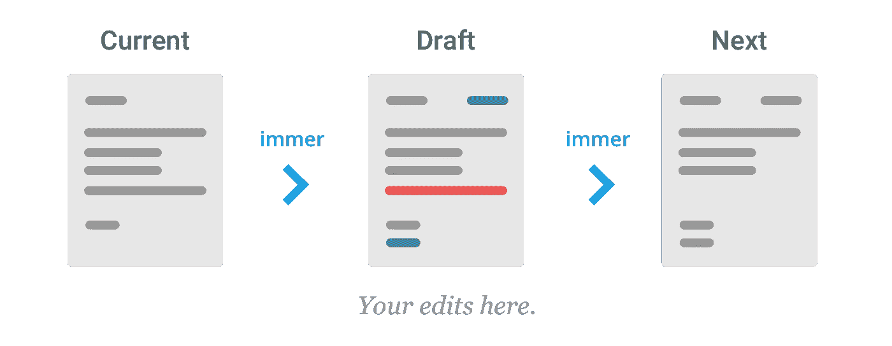

# 用 Immer 学习 JavaScript 中的不变性

> 原文：<https://javascript.plainenglish.io/learn-immutability-in-javascript-with-immer-5c515ff2982?source=collection_archive---------6----------------------->

## *如果知道如何使用 Object.assign()和 spread 运算符，就可以不用了！*


# 了解如何使用不变性

我将向您展示如何停止使用 Object.assign()和 spread 运算符。但如果你还不知道怎么用，请先学这个。如果你知道怎么做，你可以在这个棒极了的库的帮助下让它变得更容易。

# 总是（德语词）

所以有一个非常有用的小图书馆。当更新 React 或 Redux 中的状态时，我们需要以不可变的方式来完成。基本上，这意味着我们正在复制当前状态，转换副本，并用新状态替换旧状态。这需要一种不容易阅读或维护的编程方式。



那是 Immer 加入派对的地方。Immer 为我们提供了编写代码的选项，就像我们希望的那样，并在幕后的某个地方执行不变的部分

# 生产

Produce 是 Immer 库公开的默认函数。这个函数基本上完成了所有的魔法。

```
produce(currentState, producer: (draftState) => void): nextState
```

【https://immerjs.github.io/immer/docs/produce】来源[T5 来源](https://immerjs.github.io/immer/docs/produce)

**currentState** 期望您想要以不可变的方式执行更改的状态

**生产者**将作为一个代理函数，其中 drafState 将接收当前状态作为默认值。
这意味着你可以传递一个带有参数的函数，你可以用一种可变的方式对它进行修改。

## 基本示例

```
npm init -y
npm install immer --save
```

创建文件 useImmer.js

```
node useImmer.js
```


## 做这件事的另一种方法


## 将 Immer 与数组一起使用

您还可以像在正常情况下一样对阵列进行更改。看一下这个例子:


# 在反应状态下使用 Immer

不变性通常用于 React 项目中的状态。
看一下这个简单的例子，看看普通方式和 Immer 方式的区别:

# 结论

深入研究可变性的概念非常有趣。我会建议多了解这个话题，而不是盲目使用 Immer 库。但是当您理解了这些概念之后，这个库就可以很容易地在项目中与 React、Redux 和其他库结合使用。

阅读更多关于这个项目的信息:
[https://immerjs.github.io/immer/docs/introduction](https://immerjs.github.io/immer/docs/introduction)

> 如果你喜欢我的内容，请随时关注我！
> 
> —托马斯

## **用简单英语写的便条**

你知道我们有四份出版物和一个 YouTube 频道吗？你可以在我们的主页 [**plainenglish.io**](https://plainenglish.io/) 找到所有这些内容——关注我们的出版物并 [**订阅我们的 YouTube 频道**](https://www.youtube.com/channel/UCtipWUghju290NWcn8jhyAw) **来表达你的爱吧！**