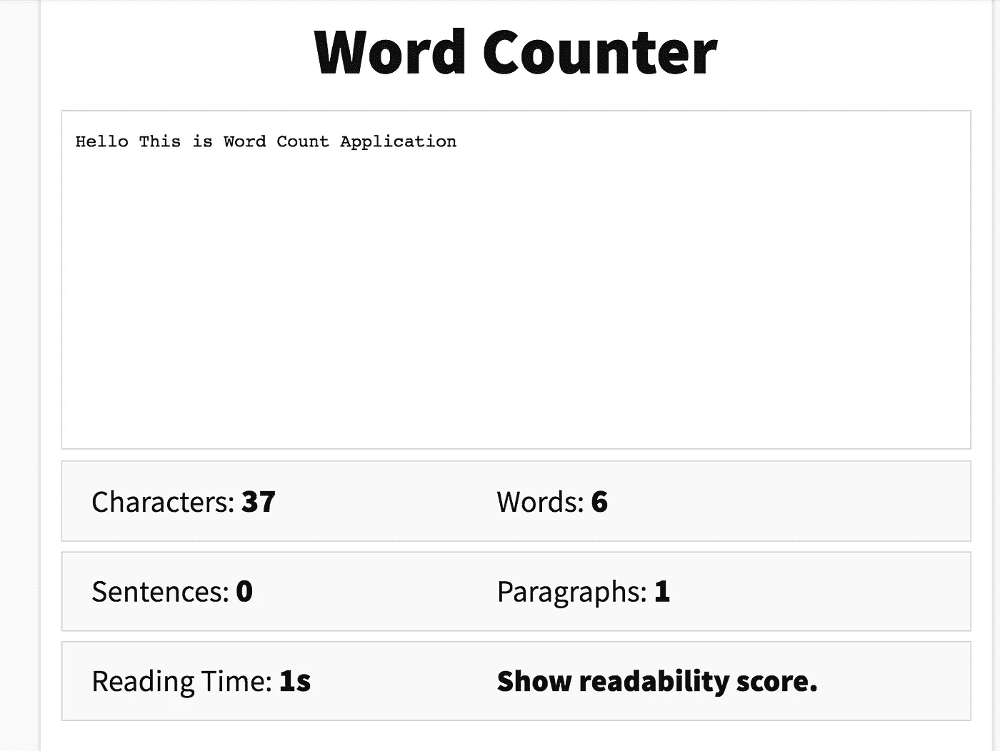

# 5 分钟学会 JavaScript 设计模式

> 原文：<https://javascript.plainenglish.io/learn-javascript-design-patterns-in-5-minutes-cf3945d6ef37?source=collection_archive---------9----------------------->

## JavaScript 设计模式的类别


## 学习 JavaScript 设计模式的难度

如此多的 JavaScript 设计模式和丰富的设计模式让开发人员很难熟悉设计模式。此外，大部分关于 JavaScript 设计模式的文章只是简单地改写了 [**学习 JavaScript 设计模式**](https://addyosmani.com/resources/essentialjsdesignpatterns/book/) **中的句子。**

这篇文章是 **JavaScript 设计模式 101 类**，它将用简单的英语解释设计模式，以有效地传递概念。

## TLDR；

```
Creational --> focus on the concept of creating an object
Structural --> focus on building blocks of object
Behavioral --> focus on the way objects play and work together
```

**创造设计模式**专注于处理对象创造。

*示例包括:构造函数、工厂、单例等*

**结构设计模式**关注不同对象之间的关系。(物体构成)。

*示例包括:装饰者、门面、代理等*

**行为设计模式**专注于改善或简化系统中不同对象之间的交流。

*例子包括:迭代器、中介器、观察器等*

# 创造性的设计模式

JavaScript 是关于对象的，而创建对象是 JavaScript 中最重要的组成部分。

同样，创造性设计模式关注于创建一个对象的概念。

## **由构造函数解释设计模式**

JavaScript 不支持类的概念，但是它支持处理对象`new`的特殊构造函数。通过简单地在对构造函数的调用前加上关键字`new`，我们可以告诉 JavaScript 我们希望这个函数表现得像一个构造函数，并用这个函数定义的成员实例化一个新对象。

提醒:在基于类的面向对象语言中，如 Java、C++和 C#，类是用户定义的蓝图或原型，从中创建对象

换句话说:

```
JavaScript is object-oriented, but is not class-based object-oriented language like Java, C++, and C#. 
But, JavaScript **Constructor** helps us to create object efficiently
```

例如，**定义了具有`model`、`year`和`miles`属性的类**，并将其用于共享属性(型号、年份和英里数是所有汽车共有的属性)。

## **由工厂模式解释**

**好用**

*   当我们需要根据所处的环境轻松生成不同的对象实例时。
*   当我们处理许多具有相同属性的小对象或组件时。

工厂模式是**创建对象的另一种模式。**工厂模式不同于其他创建模式，它不明确要求使用构造函数。相反，工厂可以提供一个通用的**接口**来创建对象(很好的可重用性)。

比如 **Car** & **Truck** 函数可以通过名为`vehicleType`的原型来区分自己，从而重用 **VehicleFactory** 函数。

```
if ( options.vehicleType === "car") {
  this.vehicleClass = Car;} else {this.vehicleClass = Truck;
}
```

# 结构设计模式

*结构模式有助于确保当系统的一部分发生变化时，系统的整个结构不需要做同样的事情。*

同样，结构设计模式关注不同对象之间的关系。(物体构成)。

## **由装饰图案解释**

装饰者提供了向系统中现有的类动态添加行为的能力。换句话说，装饰模式与对象的创建方式没有太大的联系，而是关注于扩展其功能的问题。


比如形象制作一个**指环王**游戏。

一个*指环王*游戏可能需要**霍比特人、精灵、兽人、巫师、山巨人、石巨人、**等等的构造器，但是很容易就有上百个这样的构造器。

如果我们考虑功能，想象一下必须为每种功能类型的组合创建子类——例如， **HobbitWithRing，HobbitWithSword，HobbitWithRingAndSword，**等等。

这不太实际，而且当我们把越来越多的不同能力考虑在内时，这肯定是不可管理的。

比如我们来想想 **Macbook 购买**型号。

```
In the example, **Decorators** are overriding the **MacBook()** superclass object's **.cost()** function to return the current price of the **Macbook** plus the cost of the upgrade being specifiedDifferent decorators to update the **.cost** function
```

# 行为设计模式

同样，行为设计模式专注于改进或简化系统中不同对象之间的通信

## **用装饰图案来解释**

观察者是一种设计模式，在这种模式中，一个对象维护一个依赖于它的对象列表(观察者)，自动通知它们状态的任何变化。

当一个主体需要通知观察者一些有趣的事情发生时，它向观察者广播通知。



例如，图像制作**字数统计**应用程序，无论用户何时输入，你都要计算字数。

```
EventObserver
│ 
├── subscribe: adds new observable events
│ 
├── unsubscribe: removes observable events
|
└── broadcast: executes all events with bound data
```

**好用**

*   观察者设计模式可以在元素之间进行一对多的数据绑定。其高度解耦的特性使得观察者设计模式适用于复杂的应用程序
*   高度解耦和关注点的分离可以使我们代码的整体设计更加简洁

# 结论

**创意设计模式**

*   关注创建对象的概念
*   公共属性的模式

**结构设计模式**

*   关注对象的构建模块
*   考虑制作*指环王*游戏，其中有许多具有不同特征的角色(我们的模式不仅仅是手工编写成千上万个角色

```
A *Lord of the Rings* game could require constructors for **Hobbit, Elf, Orc, Wizard, Mountain Giant, Stone Giant,** and so on, but there could easily be hundreds of these
```

**行为设计模式**

*   关注物体一起玩耍和工作的方式

高度解耦；

*   易于在应用程序范围内实施
*   这种关注点的分离可以使我们代码的整体设计更加简洁

如果您有任何问题或意见，请告诉我。我很快会带着 JavaScript 设计模式的更多细节解释回来。


Photo by [Courtney Hedger](https://unsplash.com/@cmhedger?utm_source=medium&utm_medium=referral) on [Unsplash](https://unsplash.com?utm_source=medium&utm_medium=referral)