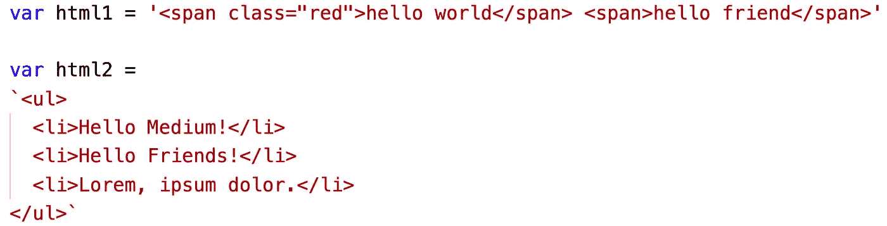
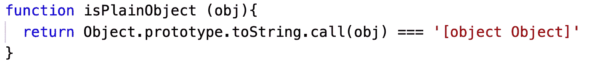

# 我从 Vue 源代码中学到的 5 个普通 JavaScript 技巧

> 原文：<https://javascript.plainenglish.io/learn-javascript-from-vue-source-code-d9d8516ea9c4?source=collection_archive---------3----------------------->

## 从源代码中学习

## 阅读这篇文章不需要 Vue 的背景知识


学习编程语言的一个非常有效的方法是阅读用该编程语言开发的著名开源项目的源代码。Vuejs 是最好的 JavaScript 开源项目之一。在阅读 Vue 2.x 源代码的时候，我了解了很多关于 JavaScript 的用法，所以我写了这篇文章。

应该指出的是:

*   本文主要是总结 vanilla JavaScript 的使用，并不涉及 Vue 的运行机制
*   阅读这篇文章不需要 Vue 的背景知识。
*   许多关于 Vue 源代码的技巧都是基于上下文的。但是**我把它简化了一点，让读者更容易理解**。因此，您将在本文中看到的用法与实际的 Vue 源代码略有不同。

如果您对 Vue 源代码感兴趣，可以通过以下链接找到它:

[](https://github.com/vuejs/vue) [## vuejs/vue

### Vue.js 是一个麻省理工学院许可的开源项目，其正在进行的开发完全是在…

github.com](https://github.com/vuejs/vue) 

# 浏览器环境嗅探

> vue/src/核心/实用程序/环境. js

我们知道 JavaScript 可以在浏览器、节点、weex 等中运行。，那么我们如何检查当前的 JavaScript 代码是否运行在浏览器环境中呢？

如果 JavaScript 运行在浏览器环境中，那么必须有一个全局对象:`window`。所以我们可以这样判断环境:

```
const inBrowser = typeof window !== 'undefined'
```


Execute in Chrome


Execute in node

如果脚本运行在浏览器环境中，那么我们可以这样得到浏览器的`[userAgent](https://developer.mozilla.org/en-US/docs/Web/HTTP/Headers/User-Agent)`:

```
const UA = inBrowser && window.navigator.userAgent.toLowerCase()
```


Execute in Chrome on masOS

不同的浏览器有不同的用户代理。在 Internet Explorer 的用户代理中，总是包含有`MSIE`和`Trident`这两个词。在 Chrome 浏览器的 userAgent 中，总会包含`Chrome`这个词。

同样，在 Android 操作系统浏览器中，userAgent 总是包含`Androi` d 字样，在 iOS 中，总有`iPhone`、`iPad`、`iPod`、`iOS`字样中的一个。

所以我们可以通过检查 userAgent 来确定当前的浏览器厂商和操作系统。


```
const UA = inBrowser && window.navigator.userAgent.toLowerCase()
const isIE = UA && /msie|trident/.test(UA)
const isIE9 = UA && UA.indexOf('msie 9.0') > 0
const isEdge = UA && UA.indexOf('edge/') > 0
const isAndroid = (UA && UA.indexOf('android') > 0) 
const isIOS = (UA && /iphone|ipad|ipod|ios/.test(UA))
const isChrome = UA && /chrome\/\d+/.test(UA) && !isEdge
const isPhantomJS = UA && /phantomjs/.test(UA)
const isFF = UA && UA.match(/firefox\/(\d+)/)
```

顺便提一下，Edge 和 Chrome 都是基于 Chrome 的，所以两种浏览器的 userAgent 都包含了单词`Chrome`。即当浏览器的 userAgent 包含`Chrome`字样时，浏览器不一定是 Chrome。所以我们需要编写像`const isChrome = UA && /chrome\/\d+/.test(UA) && !isEdge`这样的代码，以确保当前的浏览器是 Chrome。

# 获取 HTML 格式字符串中的非标记字符

> vue/src/编译器/解析器/实体解码器. js

例如，我们有一些类似这样的 HTML 字符串:



```
var html1 = '<span class="red">hello world</span> <span>hello friend</span>'var html2 = 
`<ul>
  <li>Hello Medium!</li>
  <li>Hello Friends!</li>
  <li>Lorem, ipsum dolor.</li>
</ul>`
```

我们希望提取这些字符串中未标记的内容，并得到以下结果:


```
'hello world hello friend'`  Hello Medium!
  Hello Friends!
  Lorem, ipsum dolor.`
```

如果你有这个需求，你会怎么做？

我们可能想到的第一件事是使用正则表达式来解析字符串。当然，使用正则表达式在理论上是可行的，但是相关的正则表达式可能很麻烦并且容易出错。

那么有没有更好的思考方式呢？

以下是聪明的 Vue 开发者对它的看法:

*   由于字符串是 HTML 格式的，我们可以将相应的字符串解析成 HTML 元素
*   HTML 元素的`textContent`属性用于获取该元素中的文本内容。

具体来说，这是代码:


```
function decoder(html){
  let decoder = document.createElement('div')
  decoder.innerHTML = html
  console.log(decoder.textContent)
  // return decoder.textContent
}
```

这段代码首先创建一个 DIV 元素作为容器，然后通过设置`innerHTML`将字符串转换成 HTML 元素。最后，通过`textContent`属性获得元素的文本内容。

然后我们来测试一下。


# 普通物体

> vue/src/shared/util.js

`Object.prototype.toString`允许你将一个对象转换成一个字符串。对于普通对象，调用该方法时，总是返回`[object Object]`。


对于这类物体，我们可以称之为普通物体。

JavaScript 中还有一些特殊的对象，比如 Array、String 和 RegExp，它们在 JavaScript 引擎中有特殊的设计。所以当他们调用这个方法时，会返回不同的结果。


为了将这些特别设计的对象与那些普通对象区分开来，我们可以编写一个这样的函数:



```
function isPlainObject (obj){
  return Object.prototype.toString.call(obj) === '[object Object]'
}
```

# 字符串值

> vue/src/shared/util.js

将值转换为字符串是非常常见的需求。在 JavaScript 中，我们有两个将值转换为字符串的函数:

*   字符串()
*   JSON.stringify()

这两种功能有不同的机制:


如您所见，尝试将值转换为字符串有完全不同的机制。那么我们该如何选择呢？

*   当我们想把`null`和`undefined`转换成一个字符串的时候，往往希望它返回一个空字符串。
*   当我们把一个数组和一个普通的对象变成一个字符串的时候，我们经常要用到`JSON.stringify`。
*   如果对象的`toString`方法被覆盖，那么我们希望使用`String()`。
*   在其他情况下，`String()`用于将值转换为字符串。

为了满足上述要求，它用 Vue 写成如下:


```
function isPlainObject (obj){
  return Object.prototype.toString.call(obj) === '[object Object]'
}function toString (val) {
  if(val === null || val === undefined) return ''if (Array.isArray(val)) return JSON.stringify(val)if (isPlainObject(val) && val.toString === Object.prototype.toString)
    return JSON.stringify(val)// other cases
  return String(val)
}
```

# 一次

> vue/src/shared/util.js

很多时候，我们希望一个函数只执行一次。如果多次调用该函数，则只执行第一次。

所以我们可以写一个像这样的函数:


```
function once (fn) {
  let called = false
  return function () {
    if (!called) {
      called = true
      fn.apply(this, arguments)
    }
  }
}
```

那我们来测试一下这个功能。


```
function launchRocket(){
  console.log('The rocket has been launched.')
}const launchRocketOnce = once(launchRocket)launchRocketOnce()
launchRocketOnce()
launchRocketOnce()
```

# 类似文章

[](https://levelup.gitconnected.com/5-javascript-tips-i-learned-from-vue-source-code-6095df4e9bc1) [## 我从 Vue 源代码中学到的 5 个 JavaScript 技巧

### 从流行的 JS 框架的源代码中学习 JavaScript。

levelup.gitconnected.com](https://levelup.gitconnected.com/5-javascript-tips-i-learned-from-vue-source-code-6095df4e9bc1)