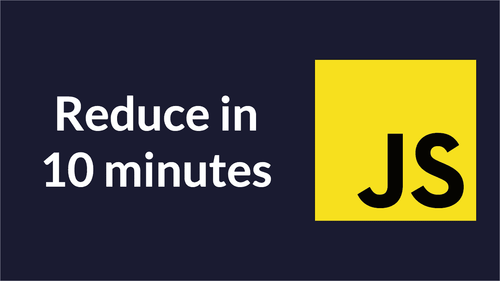
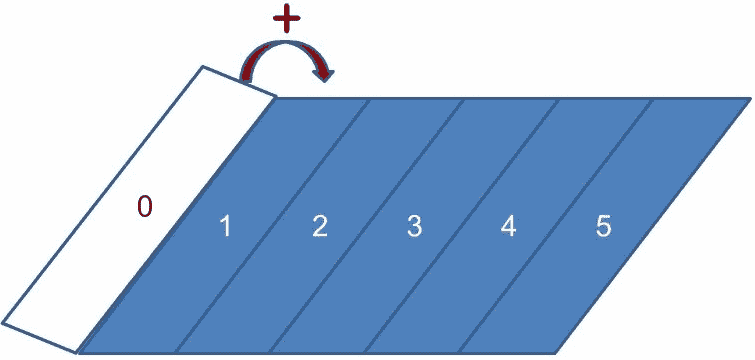
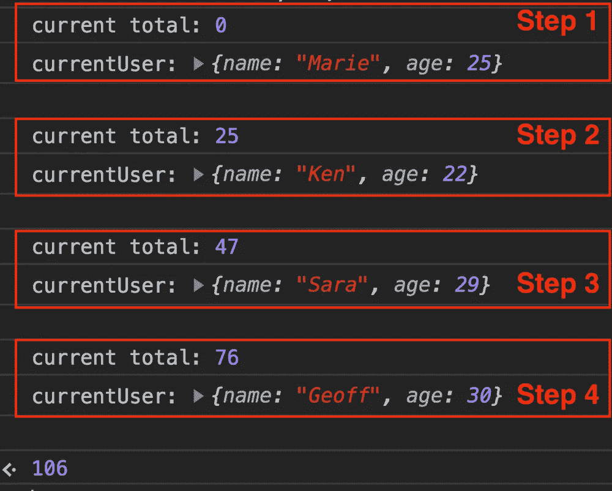
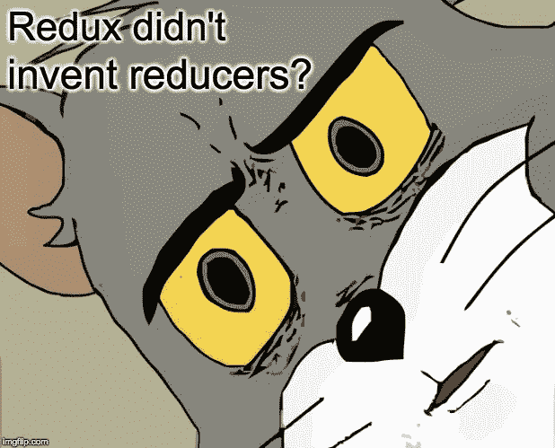

# 10 分钟学会 JavaScript Reduce

> 原文：<https://javascript.plainenglish.io/learn-javascript-reduce-in-10-minutes-495cc64635c3?source=collection_archive---------7----------------------->

## 希望这能减少 JavaScript 中 reduce 函数的混乱。



在我学习和教授 JavaScript 的经验中，`reduce`是最难攻克的概念之一。在这篇文章中，我将尝试解决一个核心问题…

> 什么是`reduce`，为什么这么叫？

# Reduce 有很多名字

根据维基百科的说法，其中一些人[是](https://en.wikipedia.org/wiki/Fold_(higher-order_function))

*   减少
*   折叠
*   积聚
*   总计
*   压缩

都在暗示核心思想。这就是把一个结构分解成一个单一的值。

> Reduce 将列表折叠成任何数据类型的函数。

就像叠盒子一样！用`reduce`你可以把一个数组`[1,2,3,4,5]`加起来变成数字`15`。


## 老式的方法

通常你需要一个循环来将一个列表“折叠”成一个数字。

```
const add = (x, y) => x + y;
const numbers = [1, 2, 3, 4, 5];
let total = 0;for (let i = 0; i < numbers.length; i++) {
  total = add(total, numbers[i]);
}console.log(total); // 15
```

## 酷小孩的方式

但是用`reduce`你可以插入你的`add`函数，循环就为你处理了！

```
const add = (x, y) => x + y;
const numbers = [1, 2, 3, 4, 5];numbers.reduce(add);
// 15
```

你实际上是把 1-5 折起来得到 15。



# 三巨头

在深入研究之前，我认为有必要分析一下`reduce`和它著名的同伴`map`和`filter`。它们大大盖过了`reduce`，让它看起来像是一群人中的怪人。


尽管它们各自都很受欢迎，但是将这三个巨头结合起来，你就可以随心所欲地操纵列表了！


暂时迁就我一下，假装 JavaScript 不能使用循环、递归或数组方法，如`forEach`、`some`、`find`等。剩下的只有三个`map`、`filter`和`reduce`。

然而，我们作为程序员的工作并没有改变。我们的应用程序仍然需要三种类型的功能。

1.  转换列表
2.  过滤列表
3.  将列表转换成其他数据类型(数字、字符串、布尔值、对象等)。

让我们看看我们仅有的工具——`map`、`filter`、`reduce`——如何应对这一挑战。

## ✅数组. map 转换列表

简而言之，将列表转换成其他列表是前端开发。因此`map`涵盖了你清单上的大部分工作。

假设我们的应用程序调用一个 API 来获取用户列表，我们需要在屏幕上显示每个用户的名字。简单地创建一个函数，返回一个用户名。

```
const getUserName = (user) => user.name;
```

并将其插入到`map`中，对整个用户列表运行。

```
users.map(getUserName);
// ['Marie', 'Ken', 'Sara', 'Geoff', ...]
```

## ✅数组.过滤评委名单

如果您想要一个删除了某些项目的新列表，比如当用户搜索他们的联系人列表时，该怎么办？简单地创建一个函数，根据它的输入返回`true`或`false`(一个谓词)。

```
const isEven = (x) => x % 2 === 0;
```

并将其插入到`filter`中以应用于整个列表。

```
const numbers = [1, 2, 3, 4, 5];
numbers.filter(isEven);
// [2, 4]
```

## ✅ Array.reduce 实现了所有这些功能，甚至更多

当`map`和`filter`还不够的时候，你就要引进大炮。`reduce`方法可以做`map` / `filter`所做的事情，以及任何涉及数组循环的事情。


例如，你如何计算用户的总年龄？我们用户的年龄是 25、22、29 和 30 岁。

```
const users = [
  { name: 'Marie', age: 25 },
  { name: 'Ken', age: 22 },
  { name: 'Sara', age: 29 },
  { name: 'Geoff', age: 30 }
];
```

`map`和`filter`只能返回数组，但是我们需要一个`number`！

```
users.map(?);
users.filter(?);// Nope! I need a number, not arrays.
```

如果我们有循环，我们只需遍历`users`并在计数器中记录它们的年龄！如果我告诉你用`reduce`会更容易呢？

```
users.reduce((total, currentUser) => total + currentUser.age, 0);
// 106
```


# 注销它

我认为最简单的消化方法是在每一步都`console.log`。

```
const users = [
  { name: 'Marie', age: 25 },
  { name: 'Ken', age: 22 },
  { name: 'Sara', age: 29 },
  { name: 'Geoff', age: 30 }
];const reducer = (total, currentUser) => {
  console.log('current total:', total);
  console.log('currentUser:', currentUser); // just for spacing
  console.log('\n'); return total + currentUser.age;
};users.reduce(reducer, 0);
```

下面是 Chrome DevTools 的截图。



# 将它分解

正如您刚才看到的，`Array.reduce`有两个参数。

1.  该减速器
2.  初始值(可选)

减速器是做所有功的函数。当`reduce`遍历你的列表时，它向你的 reducer 提供两个参数。

1.  累加器
2.  当前值

当前值是不言自明的，就像在常规循环中使用`array[i]`一样。然而，累加器是一个听起来很恐怖的计算机科学术语，实际上很简单。

## 累加器是最终的返回值

当你循环浏览`users`时，你是如何记录他们的总年龄的？你需要一些计数器变量来保存它。那是蓄电池。这是最终的值`reduce`完成后会吐出来。

在循环中的每一步，它都会将最后一个累加器和当前项输入到缩减器中。缩减器返回的内容将成为下一个累加器。当列表完成时，循环结束，并且您有一个减少的值。


## 初始值是可选的

`reduce`的第二个参数是初始值。如果您不提供它，`reduce`默认为列表的第一个元素。

如果你对简单的数字求和，这是没问题的。

```
[1, 2, 3].reduce((total, current) => total + current);
// 6
```

但是如果你使用一个对象或者数组，它就坏了，因为你不应该把这些东西加起来。

```
[{ age: 1 }, { age: 2 }, { age: 3 }].reduce((total, obj) => total + obj.age);// [object Object]23
// Broken result, use an initial value.
```

在这种情况下，你应该给出`0`的初始值。

```
[{ age: 1 }, { age: 2 }, { age: 3 }].reduce((total, obj) => total + obj.age, 0);// 6
// Initial value fixes it.
// 0 + 1 + 2 + 3 = 6
```

# 让我们重新创建 Reduce

> 我无法创造的东西，我不明白——理查德·费曼

希望到目前为止我已经帮到你了。现在是时候写自己的`reduce`函数来真正锤这个家了。

这个函数有三个参数。

1.  减速器
2.  初始值
3.  要操作的数组

对于本演示，初始值不是可选的。

```
const reduce = (reducer, initialValue, array) => {
  let accumulator = initialValue; for (let i = 0; i < array.length; i++) {
    const currentItem = array[i];
    accumulator = reducer(accumulator, currentItem);
  } return accumulator;
};
```

令人惊讶的仅仅 10 行代码，6 个关键步骤。我一个一个去。

1.  定义`reduce`及其三个参数。
2.  使用提供的`initialValue`初始化`accumulator`。这个变量将改变每个循环。
3.  开始遍历数组。
4.  为该周期捕获数组的`currentItem`。
5.  用`accumulator`和`currentItem`调用`reducer`，保存为新的`accumulator`。
6.  当循环结束且`accumulator`完成更改时，将其返回。

# 杂项历史

我想谈论更多关于`reduce`和减速器的历史，但不太确定在哪里适合它。尽管如此，它非常有趣！

## 减速器是古老的



Redux 让 reducers 对 JavaScript 开发者来说很酷，但它并没有发明它们。实际上不清楚是谁创造了这个术语，但我找到了一些参考资料。

## 递归理论(1952 年)

[1952 年的这本书](https://www.amazon.com/Introduction-Metamathematics-Stephen-Cole-Kleene/dp/0923891579)从元数学的角度讨论了`reduce`，称其为`fold`。

## Lisp 程序员手册(1960 年)

1960 年的 [Lisp 程序员手册](https://kyber.io/rawvids/LISP_I_Programmers_Manual_LISP_I_Programmers_Manual.pdf)中有一节是关于`reduce`功能的。

## 函数式编程导论(1988)

1988 年的这本书讲述了如何使用`reduce`将列表转换成其他值。

底线——这是一个老话题。你对计算机科学研究得越多，你就越会意识到我们大多是在重新包装几十年前发现的概念。

# 给你的练习

由于时间关系，我们到此结束。然而，我希望我至少已经暗示过`reduce`不仅仅是数字的相加，它非常强大和有用。

如果你有兴趣，试试这些练习，稍后给我发消息。我可能会写一篇关于他们的后续文章。

1.  使用`reduce`重新实现 [Array.map](https://developer.mozilla.org/en-US/docs/Web/JavaScript/Reference/Global_Objects/Array/map) 函数。
2.  使用`reduce`重新实现[数组。过滤](https://developer.mozilla.org/en-US/docs/Web/JavaScript/Reference/Global_Objects/Array/filter)函数。
3.  使用`reduce`重新实现[数组。some](https://developer.mozilla.org/en-US/docs/Web/JavaScript/Reference/Global_Objects/Array/some) 函数。
4.  使用`reduce`重新实现[数组. every](https://developer.mozilla.org/en-US/docs/Web/JavaScript/Reference/Global_Objects/Array/every) 函数。
5.  使用`reduce`重新实现[数组。find](https://developer.mozilla.org/en-US/docs/Web/JavaScript/Reference/Global_Objects/Array/find) 函数。
6.  使用`reduce`重新实现 [Array.forEach](https://developer.mozilla.org/en-US/docs/Web/JavaScript/Reference/Global_Objects/Array/forEach) 函数。
7.  使用`reduce`将一个数组转换成一个对象。
8.  使用`reduce`将 2D 阵列变成 1D(平面)阵列。

# 想要免费辅导？

如果你想安排一次 15-30 分钟的免费通话，讨论有关代码、面试、职业或任何其他方面的前端开发问题[请在 Twitter 上关注我，并给我发短信](https://twitter.com/yazeedBee)。

之后，如果你喜欢我们的第一次会议，我们可以讨论一个持续的教练关系，这将有助于你达到你的前端发展目标！

# 感谢阅读

更多类似的内容，请查看 https://yazeedb.com。

下次见！