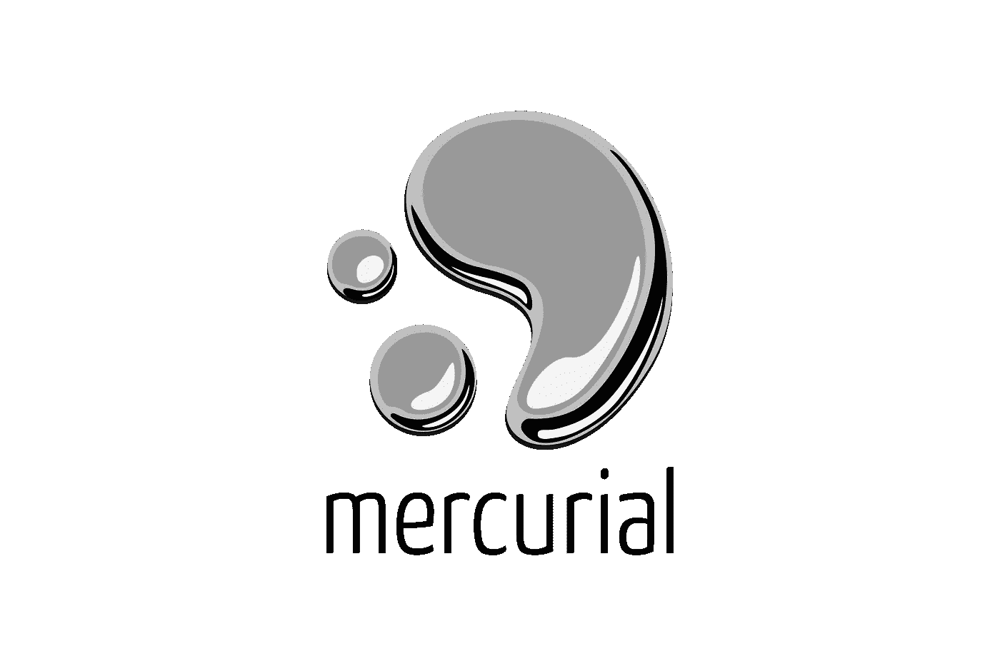
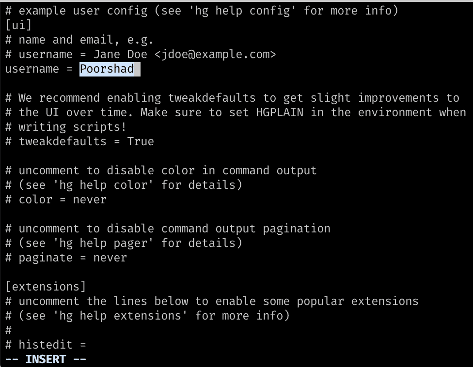
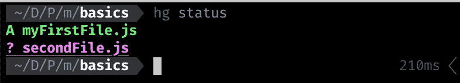
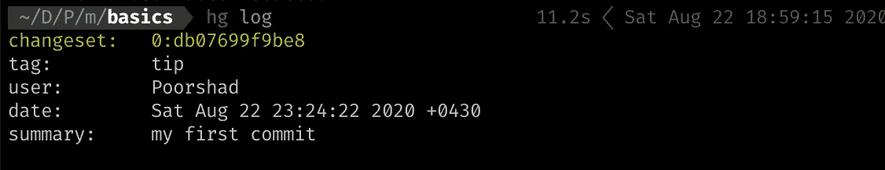
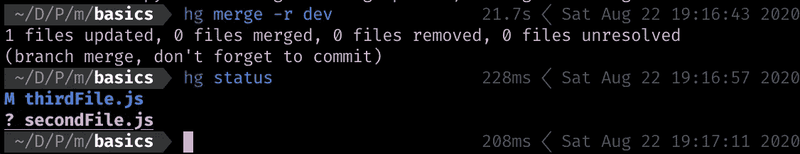

# 在 10 分钟内学习 Mercurial 版本控制基础知识

> 原文：<https://javascript.plainenglish.io/learn-mercurial-revision-control-basics-in-10-minutes-if-you-know-git-4466bd9d1fa9?source=collection_archive---------5----------------------->

如果你正在使用`git`作为**版本控制**工具，你可以轻而易举地学习`Mercurial`的基础知识。我想知道他们的座右铭(**工作更容易，工作更快**)是真是假，我决定用`mercurial`做基本的版本控制动作，只要用`--help`就行了，效果非常好！



## 装置

不需要任何解释:`sudo apt install hg`。

如果您正在使用其他操作系统，这个[链接](https://www.mercurial-scm.org/downloads)可能会对您有所帮助。

如果一切顺利，你可以看到使用`hg --version`的版本

## 配置汞

安装完成后，我们需要使用以下命令添加一个用户(就像 Git 一样):

```
hg config --edit
```

在配置文件中填入用户名，你就可以开始使用 Mercurial 了:



## 初始化存储库

使用这个命令:`hg init`。

现在你在`default`分支上，类似于 git 中的`master`。

如果你想确定使用这个命令:`hg branch`，它会显示给你:`default`

## 创建一个文件并提交该文件

您可以在文件夹中创建您的文件，或者在 Linux 或 Mac OS 中使用此命令:`touch myFirstFile.js`。

这份文件没有被追踪。我们可以使用`Add`命令让 mercurial 跟踪这个文件:`hg add ./myFirstFile.js`。

创建另一个文件，但不要添加该文件。例如`touch secondFile.js`
类似于`git status`我们可以在这里使用`hg status`，结果将是这样的:



Result of hg status

我们添加的第一个文件用大写字母 A 显示(我假设它的意思是添加！)而第二个文件(是我们创建的，但没有添加)显示为一个问号。

要提交文件，我们必须使用:`hg commit --message "my first commit message"`。现在，如果您再次使用:`hg status`，您可以看到该文件已经消失。

**问题** : *如何才能看到自己之前的提交*？
**回答**:跟你在 Git 上做的一模一样

`hg log`会给你一个提交的简要历史。



hg log result

`changeset`类似于 Git 提交散列。

## 创建一个分支并将其合并到 default

首先检查你是否在默认分支:`hg branch`结果应该是`default`。

创建分支:`hg branch branchName`。

在 Git 中，你需要一个`-b`选项来创建并检查到那个分支`branch -b branchName`，但是在这里你不需要一个选项，在创建一个分支之后，你当前的分支就是你刚刚创建的。现在`hg branch`的结果应该就是你的分店名称了。

**切换分支:**
只需使用此命令:`hg update branchName`。

让我们在这个分支中创建一个文件，并提交该文件。

```
touch thirdFile.js
hg add thirdFile.js
hg commit thirdFile.js
```

现在我们想将我们的分支合并到默认分支。首先，我们需要改变我们当前的分支:`hg update default`。其次，我们需要合并我们的分支:`hg merge -r myBranchName`。为什么是`-r`？`-r`表示修改。

合并后 Mercurial 显示一条消息:



Mercurial merge message

我的分公司名字是`dev`。我的分支中有一个名为`thirdFile.js`的文件，在 merge 命令之后，当我使用`hg status`查看我的工作目录文件时，它的开头有一个大写的 M(我假设这意味着 Merge？！).
消息清楚地表明我必须提交这个合并:

```
hg commit --message "merge branch"
```

现在*默认*分支被更新，它包含了我们的`thirdFile.js`。

## 克隆远程存储库

Mercurial 有一个测试存储库，您可以使用以下命令轻松地克隆它:

```
hg clone [https://www.mercurial-scm.org/repo/hello](https://www.mercurial-scm.org/repo/hello)
```

推和拉基本上与`git`相同，我将单独写一篇关于它们的文章。

现在你知道了！现在你有希望对使用 Mercurial 更有信心了！:)