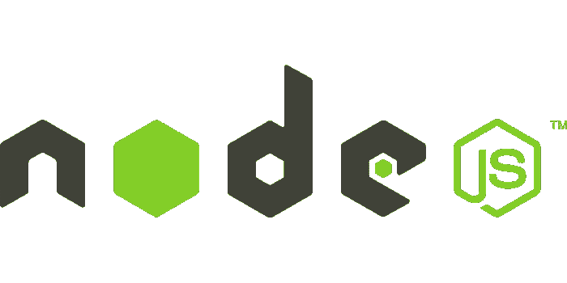

# 以正确的方式学习 Node.js

> 原文：<https://javascript.plainenglish.io/learn-node-js-the-right-way-8fb8e2456e1c?source=collection_archive---------6----------------------->

在学习一个新的技术堆栈之前，人们总是倾向于查看它如何简单地解决他们所面临的问题。这通常有助于更好地理解技术，但在 node 的情况下，这并不完全正确。这背后的一个很好的原因是，node 的大部分学习资源教授的是您在 node 中使用的技术和第三方模块(像 express 这样的东西，表面上看起来很容易)，而不是在 node 本身中工作，这些围绕 node 的第三方包装器使它看起来很容易使用，即使当人们开始学习 raw node 时，这一现实也不会发生很大的变化，这并不困难，但也不像第三方模块看起来那么容易。如果我想象两年后的自己，我也处于同样的情况。直到有人为我指出这一点，我才意识到我只是在学习大量的 npm 库，而不是 node 本身。我后退一步，决定也学习节点的本机部分，我真的很高兴我做到了。

Node 本身就很强大，比许多人想象的还要强大，但是如果您刚刚开始，编写原始 node.js 代码(没有任何依赖关系)可能会有点困难。但同时，它增加了你对有多少流行的 npm 模块在幕后工作的理解。毕竟，人们在 node 中工作的第三方模块是建立在内置节点模块和特性本身之上的。在本文的后面，我将提出一些关于在 raw node.js 中构建的想法，但是让我们先快速地看一下 node 到底是什么。

# 简而言之就是节点

简单来说，Node 是用 C++ 编写的非沙盒 JavaScript 运行时环境**。理解 C++部分是至关重要的，因为它让我们更好地了解如何使用 node 与操作系统进行交互，JavaScript 本身无法与系统进行交互，也无法打开和侦听端口、使用文件系统和 node 中常见的许多东西。运行时环境，也就是解决 JavaScript 这个问题的节点，因为 C++本身支持这些特性，它也为它正在运行的 JavaScript 公开这些 API。node 中的 JavaScript 由 [v8](https://v8.dev/) (本质上是谷歌开发的 JavaScript 引擎)即时解释和编译，并进行必要的优化，以使其快速运行，因此 speed node 闻名于世。**

Node 是以制造终极服务器端技术的理念构建的，显然，它并不完全相同，但它不会改变这样一个事实，即我们今天拥有的工具可能是最好的。

# 在原始节点中构建应用程序

Node 附带了许多非常有用的模块，您可以用它们来创造奇迹。npm 上最流行的库和框架通常是这些内置模块的包装，因此学习原始节点生态系统可以让我们更好地了解其他模块是如何工作的。让我们来看看其中的几个，它们是节点生态系统的重要组成部分，非常强大，但经常被忽略

## 网络模块

可能是 node 中最隐蔽的模块，人们很少谈论 net 模块，即使他们知道它的一些实现。我个人还没有找到任何关于这方面的好的阅读资料，如果你知道的话，请告诉我。它可以用来创建一个基本的 TCP 服务器，我在这里指的是一个相对较大的网络概念，所以让我们把它留到以后的某篇文章中。直接使用 net 模块可能真的会令人困惑，因为它包括编写诸如原始响应头和体之类的东西，这就是为什么您可能经常想要使用 HTTP 模块之类的更高级别的实现。让我通过展示 net 模块是如何工作的来简化您的工作

这是我们简单的小服务器，它所做的就是每 5 秒向所有连接的客户端发送一条消息。让我们快速测试一下这个服务器是否工作！

确实如此，让我们来分析一下该文件中发生了什么。我们正在导入一个 **createServer** 函数，它允许我们创建一个 TCP 服务器。服务器监听几个事件，唯一重要的是客户端连接和服务器启动，当客户端连接时，它将引用当前连接的客户端对象推送到一组已连接的客户端，并等待更多的连接。一旦服务器开始监听指定的端口，它会每 5 秒检查一次连接的客户端阵列，并向所有连接的客户端(如果有)发送一条消息。

## HTTP 模块

node 中的 HTTP 模块就像是 Node 的灵魂。许多流行的 npm 库，如 Express 和哈比神，都是建立在 HTTP 模块之上的，人们通常认为使用 HTTP 模块很难，但事实并非如此！如果与 node 中的其他 MVC 框架相比，它只需要相对多的代码行来进行设置。如果您从未见过或构建过带有 HTTP 模块的服务器，让我来帮您一下:)

这是我们的带有 HTTP 模块的小服务器。这里的想法是等待传入服务器的请求，在请求流到达末尾后，根据需要将请求路由到路由处理程序或 404 处理程序。我试着从《快递是如何工作的》中复制一些东西，但仅此而已。一些要点是请求体如何成为可读的[流](https://nodejs.org/api/stream.html),一般来说，数据是根据大小分块传输的，对于小型 HTTP 请求，这并不明显，但是如果增加请求体的大小，您可以观察到同样的情况。

*注意——您可以使用请求对象的*[*set header*](https://nodejs.org/api/stream.html)*方法在请求对象上设置标题，但是为了简单起见，我用了另一种方法。
有趣的事实——我们刚刚讨论的 HTTP 模块是建立在 net 模块之上的，用于通过普通 TCP 提供 HTTP 响应！*

## 工作线程

Node 中的工作线程就像浏览器中的 web 工作线程，它们允许与主线程并行运行另一个 JavaScript 执行线程。当我们运行一个可能阻塞主线程执行的代码块(包括 CPU 密集型任务)时，这尤其有用。这真的很简单，旋转一个工人线程，并与相同的工作。工作线程和主线程通过消息通道进行通信，工作线程和主线程可以在消息通道中相互发送和接收消息。这在代码中并不难实现，大多数时候你只是来回发送和响应消息，并在完成后杀死工人

这是你能做的最简单的工作线程，即使在用工作线程构建非常复杂的东西时，这个想法也是一样的。像往常一样，查看[文档](https://nodejs.org/dist/latest-v12.x/docs/api/worker_threads.html)了解 worker 的其他属性和方法是个好主意。

## 断言模块

您可能接触过 JavaScript 的测试或 TDD 开发，如果您自己没有编写单元测试，那么您一定在某个地方见过单元测试。但是您知道 node 附带了一个断言库，您可以使用它进行测试吗？这并不完全是其他测试库的工作方式，但它从来没有打算像其他人一样。它提供了许多有用的[方法](https://nodejs.org/dist/latest-v12.x/docs/api/assert.html)，至少比我用过的方法多得多。让我放一些代码，这样你就可以自己看到它是如何工作的。

这些是我最常用的函数，但是还有更多，如果你感兴趣的话，我真的推荐阅读一些来自[文档](https://nodejs.org/dist/latest-v12.x/docs/api/assert.html)页面的函数。

*注意——在使用断言模块时使用 catch 块是个好主意，因为如果在一个文件中有多个断言，执行将会随着第一个断言的失败而停止。*

这是关于模块的一些事情，但是我个人认为有几个类和对象对于学习节点生态系统是很重要的，它们包括

## **缓冲对象**

缓冲区通常代表存储一些数据的存储器的一部分。在 node 中，缓冲区是 node 中的一个特殊的全局对象，用于指向 v8 堆外的内存分配的原始数据，大量用于 TCP 流和任何包括直接与 OS 交互的内容。您可能已经注意到在 HTTP 服务器示例中使用了相同的方法，我们使用 **toString** 方法将传入的 req 主体对象转换为字符串，数据最初是一个缓冲区。缓冲区在 node 中广泛使用，因此如果您对使用缓冲区有所了解的话会很有帮助。

## 流类

一般来说，node 中的流就是它听起来的样子。某种东西的连续流，在这种情况下，它是数据块的流，通常是缓冲区类型。当在节点中处理文件系统和网络请求时，会大量使用流。

## EventEmitter 类

asynchronous node.js 的思想通常围绕着其中的事件概念。EventEmitter 类帮助创建对象，围绕这些对象可以发出一个事件，通常指定对象状态的变化，它被 node 中的许多模块用于相同的目的。这里的想法是异步回调模式如何在 node.js 中工作。您可以附加函数来监听并根据您的实例发出的特定事件工作。

唷！那是相当多的信息。本文的目的是介绍 plain Node 有多有效，我绝不是想说第三方模块会让你成为一个糟糕的开发人员，但是理解较低层次的东西总是更好的，尤其是如果你已经深入开发了。希望你今天学到了新东西😀

喜欢这篇文章吗？如果有，通过 [**订阅获取更多类似内容解码，我们的 YouTube 频道**](https://www.youtube.com/channel/UCtipWUghju290NWcn8jhyAw) **！**

## 资源和进一步阅读

*   [节点文档](https://nodejs.org/dist/latest-v12.x/docs/api/)
*   Substack 的[流手册](https://github.com/substack/stream-handbook/)