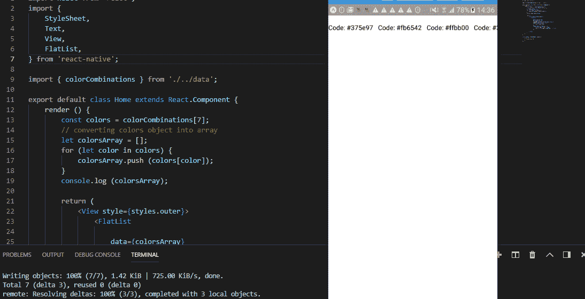

# 学习通过制作调色板应用程序对本机状态管理和水平滚动做出反应

> 原文：<https://javascript.plainenglish.io/learn-react-native-state-management-and-horizontal-scroll-by-making-a-color-palette-app-3a66cf0d9825?source=collection_archive---------1----------------------->

## 我总是说，学习任何概念的最好方法是开始做一个小项目，并在旅途中学习概念。让我们使用 React Native Scrollview 制作一个简单的调色板应用程序


> 学习新技术最有趣的方式是实际实施它们。

# 这里有一点讲座…

好吧，如果你不想读，请直接跳到下一部分。
是的，如果你不去，我会很难过，但是好吧，我不会记仇的:(

如果我能把我所有的技术经验用一句话表达出来，那很可能就是上面这句话，“学习新技术最有趣的方式是实际实施它们”，如果你听我说，我想你一定已经读了几千遍了。

我之所以总是强调这一个问题，是因为，我几乎每天都会收到这个问题，我如何学习这个，我如何学习那个？大多数时候，我的答案是，浏览文档或者看一些 youtube 视频，做一些小项目。

通过观看视频教程或文档，您可以获得知识，但是如果您希望这些知识在您的脑海中保留很长一段时间，您必须了解实际发生的事情，要了解这一点，最好的方法是进行辅助项目，并实际了解正在发生的事情。

好了，别兜圈子了，我们开门见山吧。

附言:这个博客会有点长，我会尽量让它“不那么无聊”，另外你会学到很多东西，所以让我们开始吧！

# 让我们看看今天我们要做什么

从标题中，您可能已经注意到，我们今天将制作一个调色板应用程序，在这个过程中，我们将学习许多东西，包括——

1.  国家管理
2.  组件生命周期
3.  RN 烤面包
4.  RN 剪贴板
5.  水平滚动平面列表

还有更多……(可能是因为我厌倦了写任何东西，我不想夸大其词)

如果您只对代码感兴趣，您可以访问这个 GitHub repo —

[](https://github.com/MadhavBahlMD/Color-Palette-App) [## madhafbahlmd/调色板-应用程序

### 您现在不能执行该操作。您使用另一个选项卡或窗口登录。您在另一个选项卡上注销，或者…

github.com](https://github.com/MadhavBahlMD/Color-Palette-App) 

阿莱特，对这个应用程序感到兴奋吗？嗯，我是！让我们开始吧。(请注意，在本博客中，我假设您的系统上已经安装了 NodeJS，如果没有，请直接访问本网站:[nodejs.org/](https://nodejs.org/)并下载)

(此外，我会尽量让这个博客非常简洁，所以我们会直接跳到步骤，如果你有任何疑问，请随时与我联系)

# 1.建立我们的项目

我们会用世博会来建立我们的项目，如果你不知道世博会是什么，我会告诉你一点点，但是你可以在官网上看到更多关于它的信息:[https://expo.io/](https://expo.io/)

Just a random GIF :)

所以，你可能已经猜到了，expo 是一个工具，使用它我们可以更快地创建我们的 react 本地应用程序。基本上，如果你使用 expo，你不必设置开发环境，只需一个命令，你就可以了。

它的使用非常简单，只需去 play store 或 app store，下载它的移动应用程序，在你的桌面上，我们将从 expo-cli 中进行操作。当你运行它时，它会显示一个二维码，你必须通过手机应用程序扫描它，瞧！

所以，打开你的项目目录，输入这个命令—

```
npx expo-cli init <project_name>
```

您可以为您的项目取任何名称，但我将把它命名为`colorPalette`。所以我的命令看起来会像这样—

```
npx expo-cli init colorPalette
```

等待几秒钟，因为它开始这个过程，然后你会被问及你想选择哪个模板。因为这是一个(大部分)单页应用程序，我会选择最小的应用程序

```
> blank                 a minimal app as clean as an empty canvas
```

然后，你会被要求为你的应用取一个名字，我会再次选择`colorPalette`

```
{
   "expo": {
     "name": "colorPatette",
     "slug": "colorPalette"
   }
}
```

然后将提示您安装依赖项，按“Y”并完成。基本就是这样！

# 2.让我们运行 expo 应用程序，看看现有的代码

如果您正确遵循了上述步骤，您应该会收到以下消息—

```
To get started, you can type:
  cd colorPalette
  yarn start
```

因此，进入`colorPalette`目录并运行命令`npm start`或`yarn start`

这样做，你会看到，expo 在你的浏览器上显示一个二维码，在手机上打开 expo app 扫描二维码，app 就打开了。

Celebrate small victories as well :3

截至目前，它只是一个最小的应用程序，中间有一些文本。


您的项目目录应该看起来有点像这样。(忽略`gifs`文件夹，那些是屏幕录像)

如果你懂一点 React Native，你很容易就能搞清楚我们的 app 入口是`App.js`

现在我们将开始制造我们的组件。


我更喜欢将组件存储在一个名为`components`的单独目录中，但同样，如果你想这样做或不这样做，这是你的个人选择。

所以我将创建一个新的组件目录。

这是我们的应用现在的样子——


# 3.让我们准备好数据

好吧，你可能已经猜到了，在开始任何事情之前，我们实际上需要调色板。

所以我在网上搜索了相当多的地方，但找不到任何可以提供一些很酷的调色板的 API，所以我决定自己收集一些。

特别感谢 Canva 写了这篇关于 100 种令人惊奇的颜色组合的博客:[https://www.canva.com/learn/100-color-combinations/](https://www.canva.com/learn/100-color-combinations/)

我制作了一个对象数组，每个对象有 4 种颜色，每种颜色都有一个名称和一个十六进制代码。目前，我从 Canva 博客中获得了前 10 个组合，但是如果你们中的任何人能够在 JS 文件中添加更多的组合，那将是一个很大的帮助。

所以你可以从我的 GitHub repo 下载`data.js`——[https://GitHub . com/MadhavBahlMD/Color-Palette-App/blob/master/data . js](https://github.com/MadhavBahlMD/Color-Palette-App/blob/master/data.js)

# 4.让我们了解一个组件的结构

在开始之前，我想给你一个代码片段，你可以用它作为写任何组件的引导。

我们把这个成分分一下就明白了。说实话，如果你理解了这段代码，你的工作就完成了一半。几乎每个组件都使用这种类型的结构。

## 1.导入报表

顶部是我们想要导入的各种库和组件。在最简单的组件中，我们可以导入这些—

```
import React from 'react';
import { View, Text, StyleSheet } from 'react-native';
```

## 2.组件主体

在 import 语句之后，是我们组件的主定义。If 可以是功能组件，也可以是类组件。

**功能组件—**

```
export default function App() {
    return (
        <View style={styles.container}>
            <Text>Hi There!</Text>
        </View>
    );
}
```

**类组件—**

```
export default class Bootstrap extends Component {
    render () {
        return (
            <View **style={styles.container}**>
                <Text>This is a Bootstrap Component</Text>
            </View>
        ) 
    } 
}
```

这段代码易于阅读和理解。在一天结束时，从每个组件文件中，我们必须返回一个“单个”组件。

不要担心，这并不意味着你必须返回一个单独的组件，无论你想返回什么，你都可以把它放在类似的容器中

也请注意我们如何将样式应用到我们的

## 3.样式表

这部分包括我们为组件设置的样式。一个简单的例子是—

```
const styles = StyleSheet.create({
    container: {
        flex: 1,
        backgroundColor: '#fff',
        alignItems: 'center',
        justifyContent: 'center',
    },
});
```

好了，我想现在你一定对我们如何建立一个 React 本地应用程序并制作组件有了一个很好的想法。现在，我们终于可以从我们的主要应用程序开始了。

# 5.关于我们将要制造的组件

好的，所以在这个项目中我们主要有两个部分，

1.  主页
2.  横向卡片

<horizontalcard>(顾名思义)，将是包含调色板元素的实际卡片，我们将能够水平滑动它。</horizontalcard>

<home>组件将是一种包装器，我们将调用 FlatList 来显示调色板中的不同颜色(或者，显示各种水平卡片，每张卡片包含调色板中的一种颜色)</home>

FlatList 帮助我们呈现一个数据列表，另外它有各种各样的特性，使开发变得非常简单，例如，水平滚动，分页功能等等。

# 6.让我们开始制作我们的家庭组件

这里，我们将导入调色板数据，选择其中一个调色板(假设是第 7 个)，然后使用一个平面列表呈现这些颜色的十六进制代码。

这是代码，读一遍，你就会明白，为了更清楚起见，我还会把它分解一下。

不要忘记在 App.js 中导入并添加<home>组件</home>

```
import Home from './components/Home';
```

并且<app>将返回—</app>

```
<View style={styles.container}>
    <Home />
</View>
```

App.js 的全部代码—

正如我在上面解释的通用组件的结构，现在你一定很容易理解了。

在<home>的例子中，我们基本上是导入调色板数据，这是一个对象数组，然后，在 render 方法中，我们提取其中一个调色板(第 7 个，我喜欢数字 7)，然后，用它创建一个新数组。(这个数组基本上提取 4 个内部对象(颜色)作为数组元素)。</home>

然后我们返回 FlatList，它接受数据作为新创建的 colors 数组，horizontal true(用于水平滚动)，`showsHorizontalScrollIndicator` false，为了隐藏滚动条，我们将使用十六进制代码作为键(因为十六进制代码将是不同的)，并且在`renderItem`方法中，我们每个迭代我们在屏幕上显示的颜色。

它看起来像这样—



好了，是时候做些造型了😍

在接下来的步骤中，我们将修改<home>组件，您可以在这个目录中找到相应的代码—[https://github . com/MadhavBahlMD/Color-Palette-App/tree/master/components](https://github.com/MadhavBahlMD/Color-Palette-App/tree/master/components)</home>

# 7.让我们制作一个欢迎和结束屏幕(:

好了，现在我将注释掉平面列表，我将首先创建一个欢迎和结束屏幕。

好吧，你可能会认为制作水平滑动的页面需要大量的代码，但是相反，这很简单，只需要几行代码就可以实现！

这是代码—

因此，如你所见，在这里，我们制作了两个视图，一个用于欢迎，一个用于结束，并将它们包装在 ScrollView 中。

也许我们需要的最重要的东西是 ScrollView 的这些属性—

```
horizontal={true}
pagingEnabled={true}
showsHorizontalScrollIndicator={false}
```

我们已经讨论了`horizontal`和`showsHorizontalScrollIndicator`，通过官方文档中关于`pagingEnabled`的描述，你很容易理解它的重要性。

> 如果为 true，滚动时滚动视图会在滚动视图大小的倍数处停止。这可用于水平分页。

剩下的变化只是样式，让我们看看我们添加了什么样式，

```
outer: {
  flex: 1,
  alignItems: 'center',
  justifyContent: 'center',
  width: Dimensions.get ('window').width,
  height: Dimensions.get ('window').height,
}, innerText: {
  color: '#fff',
  fontSize: 32,
  fontWeight: 'bold'
}
```

在外层(容器)中，我们基本上把它做成覆盖整个屏幕，这样我们就可以像页面一样看到整个卡片，而在内层文本中，我们只是设置颜色、字体大小和粗细。

让我们看看它是什么样子的—


好吧，这基本上是我们完成的一件大事，我们的应用程序是，(说)，30%完成！

And the code compiled successfully!

好了，现在是取消平面列表注释的时候了

# 8.最后，让我们制作横卡吧！

好了，现在你已经看到了卡片的样式，我们实际上可以把它作为一个完整的组件分开。

暂时不要取消对 FlatList 的注释，让我们先做一个<horizontalcard>组件。</horizontalcard>

如果您想知道我们如何在单独的水平卡组件中获取调色板数据，答案是“props”。

我们将调用一个 FlatList 来迭代调色板中的每种颜色，并为每种颜色调用一张卡片，并传递 props 内部的颜色数据。

此外，为了不使你感到困惑，下面是我们的颜色数组的样子(我们将迭代我们的平面列表的数组)

```
Array [
  Object {
    "hex": "#375e97",
    "name": "Sky",
  },
  Object {
    "hex": "#fb6542",
    "name": "Sunset",
  },
  Object {
    "hex": "#ffbb00",
    "name": "Sunflower",
  },
  Object {
    "hex": "#3f681c",
    "name": "Grass",
  },
]
```

这是一个对象数组，每个对象都有颜色名称和十六进制代码。

让我们来看看 HorizontalCard 组件的代码—

等等，我们还没有完成(别担心，我们还会看看横卡组件)，我们必须在 App.js 的平面列表中包含横卡组件

所以现在我们终于可以取消对 FlatList 组件的注释了:)

因此，在呈现项中，我们可以返回一个 HorizontalCard 组件。

```
renderItem={({ item }) => {
    return <HorizontalCard colorName={item} />
}}
```

还有，别忘了导入。

让我们看看现在应用程序看起来怎么样—


很神奇吧？

否:)

如你所见，我们的工作只完成了一半，

1.  我必须向你解释这个代码。
2.  在底部有一些警告，我必须删除。
3.  当我们点击十六进制代码时，添加“复制到剪贴板功能”。
4.  添加一个提示通知“复制到剪贴板:成功”。
5.  从数据中选择一个随机调色板并显示它。
6.  在“结束”页面中添加一个“刷新调色板”按钮。

但是，正如你所看到的，这个博客已经变得非常庞大，所以我将在下一个博客中讨论剩下的事情😁

附言:不要太担心警告，因为我们在 ScrollView 中有一个 FlatList，我们将在本博客的第 2 部分中删除它:)

> “嘿，马达夫，但你没有解释水平卡组件！”

是的，我是故意那样做的

是的，这个博客越来越大了，而且我想让你自己理解那些代码。所以把它作为一个家庭作业，阅读代码并尝试理解那个组件，如果你已经理解了前面的部分，我很肯定你也能理解 HorizontalCard 组件。

但是即使你没有，也不要担心，这个博客的第二部分将会很快发表，在其中我将会讨论这个博客中剩下的所有内容。

所以到目前为止，我们已经做到了——


今天就到这里，我将很快发布下一篇博客，在那里我们将完成这个应用程序。在那之前，敬请关注！

希望这篇文章对你有所帮助。如果你喜欢这个博客，请留下一些掌声。


如果你想讨论什么，随时联系我，:D

如果您能发送您的反馈、建议或询问，我将非常高兴。此外，我喜欢交新朋友，我们可以成为朋友，只要给我发邮件。

> 非常感谢你一直读到最后。如有需要可以联系我以防万一:
> 邮箱:theleanprogrammer@gmail.com
> 网页:[*http://madhavbahl.tech/*](http://madhavbahl.tech/) *Github:*[*https://github.com/MadhavBahlMD*](https://github.com/MadhavBahlMD) *LinkedIn:*[*https://www.linkedin.com/in/madhavbahl/*](https://www.linkedin.com/in/madhavbahl/) *insta gram:*[*https://www.instagram.com/theleanprogrammer/*](https://www.instagram.com/theleanprogrammer/)