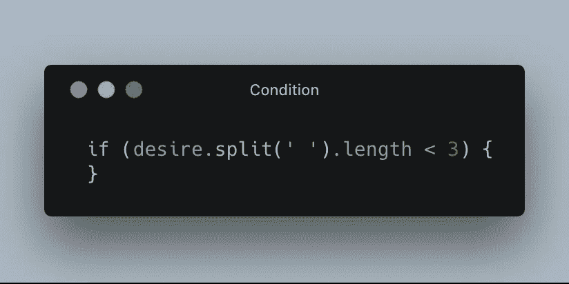
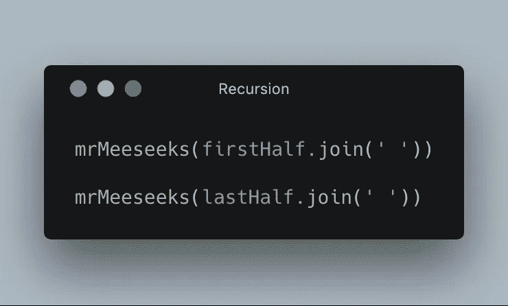
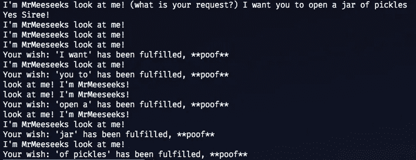

# 如何在 JavaScript 中使用递归(来自 Meeseeks 先生)

> 原文：<https://javascript.plainenglish.io/learn-recursion-from-mr-meeseeks-27048164aeb0?source=collection_archive---------0----------------------->

递归是一个一开始很难理解的概念。所以我请米索斯先生来帮我。如果你知道漫画《瑞克和莫蒂》中这个可爱的角色，你可能知道我要说什么。如果不是，米索克斯先生是一个能够实现愿望的魔法角色。如果可以的话，看看这一集。如果不是，这里有一个来自维基百科的概要:

> 当史密斯家的其他人向里克寻求几个世俗问题的解决方案时，他给了这家人一个 Meeseeks 盒子，这是一个小玩意，每次按下它的按钮，就会有名叫“Meeseeks 先生”的有用的人出现。这些相同而短命的生物的存在只是为了执行它们被给予的第一个命令；一旦完成，他们就消失了。里克警告这家人要保持任务简单。—[https://en.wikipedia.org/wiki/Meeseeks_and_Destroy](https://en.wikipedia.org/wiki/Meeseeks_and_Destroy)

`ill be referencing this repo in the article:`

 [## 格兰特·格莱德维尔/米索克斯先生

### mrmeeseeks - Mr Meeseeks 递归示例

github.com](https://github.com/grantglidewell/mrmeeseeks) 

考虑一下，函数实际上只在运行的短暂时间内存在，就像 Meeseeks 一样，它们在达到目的后就消失了。如果一个 Meeseeks 能够简单地完成给他的请求，他会被奖励一个短暂的生命。然而，如果任务太复杂，一个 Meeseeks 无法完成，他可以调用另一个 Meeseeks 的支持。这太棒了！然而，两个 Meeseeks 并不总是比一个更好，如果处理不当，这可能会很快失控。记住，觅求者不是神，只是简单的问题解决者。

当一个 Meeseeks 需要另一个 Meeseeks 帮助他时，这就是递归。该函数设置为在特定条件下调用自身。在《瑞克和莫蒂》的第一集里，这个神奇的生物自称是来处理一个复杂问题的。他面临的问题是在杰里的高尔夫比赛中少打两杆。这绝不是一项简单的任务。为了完成这个任务，一个完整的 Meeseeks 递归集群被调用来帮助完成这个任务。而只需一次 Meeseeks 就足以完成其他更简单的任务。

这里的关键是条件反射，让我们把类比留在这里。当你需要递归来解决编程中的问题时，你实际上是在创建一个树形结构。这意味着您必须处理一个基本案例。基底是不会递归的函数的输入。你可以把这些案例想象成一个分支的末端。在我的示例代码中，如果发送给 Meeseeks 先生的欲望少于三个单词，他将自己处理它。

但是，如果需要递归来继续处理请求，那么在将请求返回给递归函数之前，您必须更改请求(将其移向基本情况)。为什么？因为我们不想创建一个无限循环。回到米索思。

在这一集里，杰瑞对高尔夫一窍不通，米索斯人被召唤去帮助变得沮丧的人。一个接一个的打电话给新的寻求帮助，但是没有真正清楚的定义新的任务给他们去解决。这是一个无限循环。如果你不改变传递给递归函数的“状态”,你将永远不会到达基本情况，程序是一个无限循环。在这个例子中，传递给函数的欲望被分成两个更小的欲望，并传递给两个新的 Meeseeks。

这是函数调用自身的地方，它实际上是“递归”。

本质上，这里发生的是函数将再次运行，但是只运行请求的一半。这将重复(递归地)发生，直到达到基本情况。

我们在这里看到的是 Meeseeks 获取欲望，将其分成足够小的片段(少于三个词)，然后满足这些请求。

您可以看到 Meeseeks 开始存在，直到块小到足以开始满足请求。然后你看到他们消失了。别担心，他们喜欢那样。Meeseeks 不喜欢存在太长时间，这是一个可能会有无限循环的迹象。

就这样，米索克斯先生教会了我们递归！如果你觉得这很有用，一定要留下很多掌声*(提示:你最多可以留下 50 个掌声！和所有喜欢瑞克和莫蒂的 JS 粉丝们分享这些吧🤓*