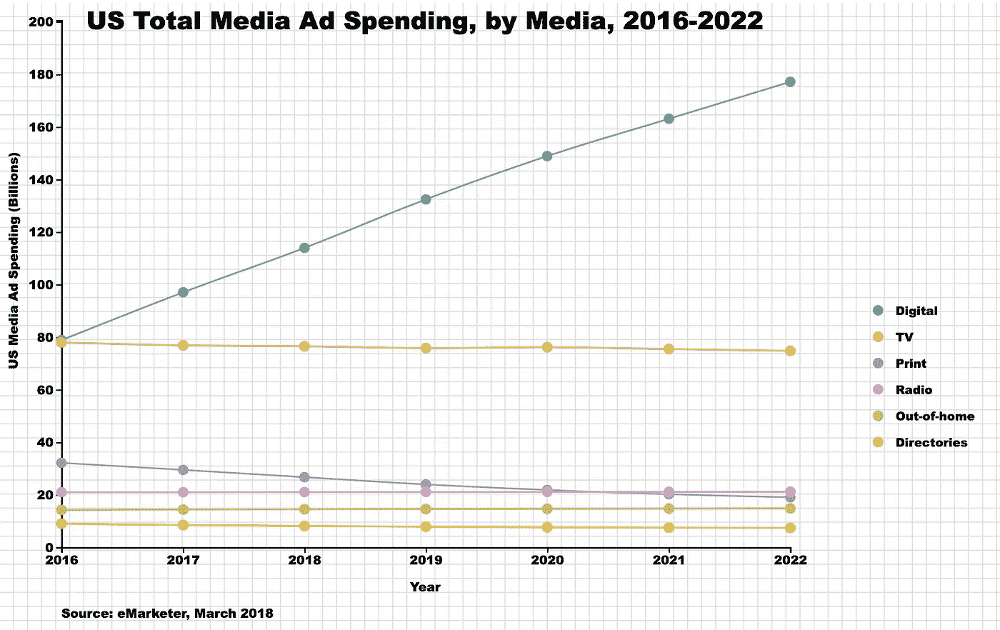
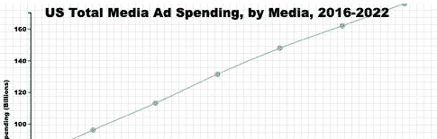
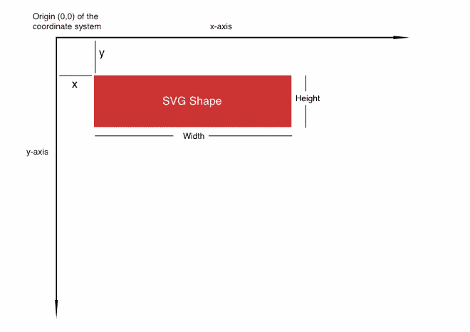
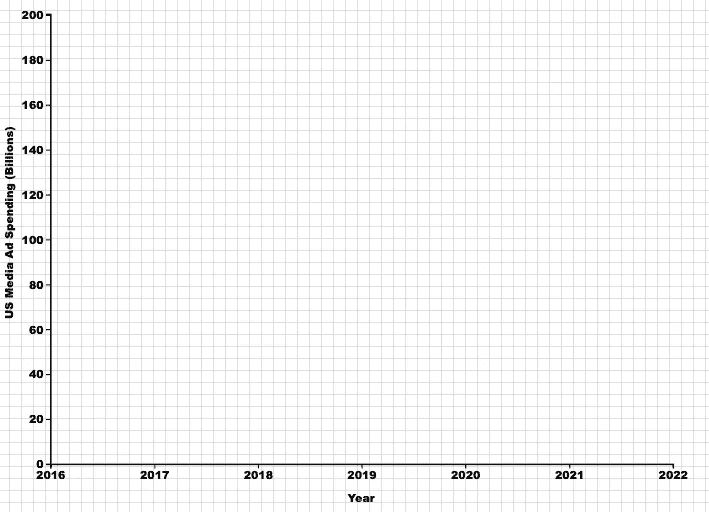
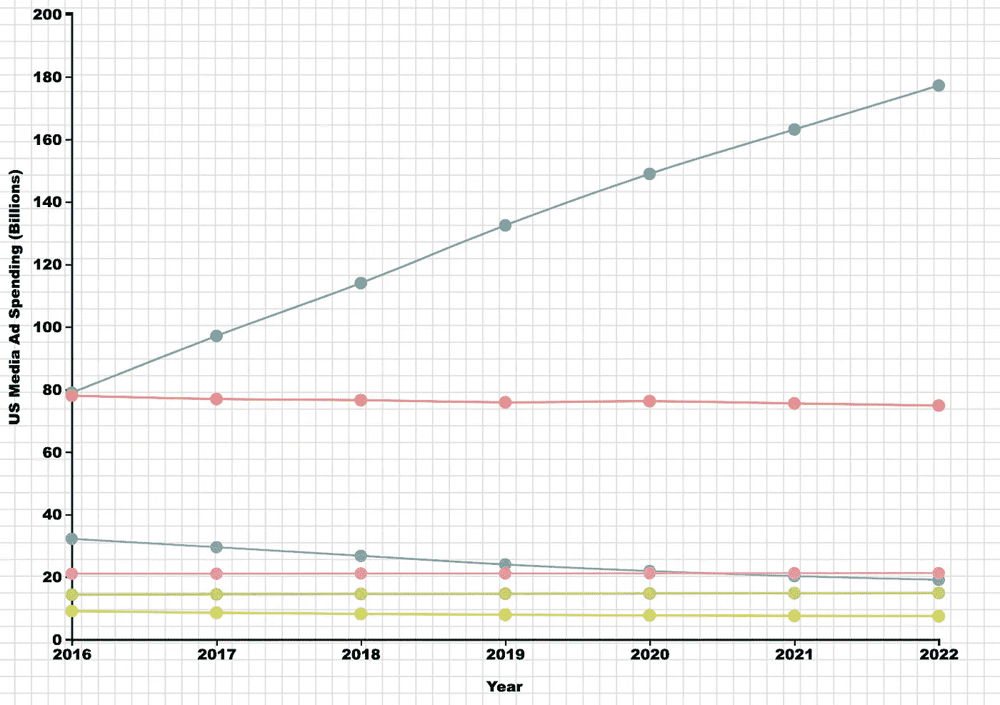

# 学习 D3 —多行图表，带有逐行代码解释

> 原文：<https://javascript.plainenglish.io/learning-d3-multiple-lines-chart-w-line-by-line-code-explanations-40440994e1ad?source=collection_archive---------5----------------------->

## D3。射流研究…

## 带有 D3.js 的多线图表

*当我学习 D3 的时候，虽然有很多很棒的资源* [*可以学习，但是我很少能找到详细的代码解释让我完全理解一切是如何工作的，这使得我很难在没有额外搜索的情况下自己重新创建一个图表。因此，我想用一系列 D3 (v4)逐行代码解释来填充我创建的每个图表的空白，并与您分享我的理解。* ***评论如果要我创作视频系列！***](https://chiandhuang.medium.com/learning-d3-books-ide-and-other-resources-to-help-you-learn-efea5910a779)

在这篇文章中，我将带你了解如何用 D3 构建一个多线图表，并添加轴、图例、来源和标题。

Multiple Lines Chart with D3.js

# 搭好帆布

要在 HTML 文件中设置 D3 图形的画布:

*   **第 4 行:**直接从 d3js.org 加载 D3——所以你不需要在本地安装。
*   **第 5 行:**加载 [colorbrewer](http://bl.ocks.org/mhkeller/10504471) —我们将使用这个包中的调色板。
*   **第 8–30 行:**对不同的元素进行样式化。
*   **第 34 行:** `***onload= “lineChart()”***` 意思是我们告诉系统在页面加载完毕后，立即加载`***linechart()***` 函数，显示 D3 图形。
*   **第 36–37 行:**创建一个大小为 1200 像素乘 750 像素的`***SVG***`，供我们稍后放入图形元素。从 URL 加载网格图像，将其设置为 SVG 画布的背景图像。

# x 轴和 y 轴的比例值

现在我们继续创建 D3 `***linechart()***` 函数。在本例中，我们的数据是来自 eMarketer.com 的六个主要媒体渠道的七年广告支出数据。

**第 4–47 行:**输入数据。

**第 50–51 行:**设置左边距和上边距。因为我们将从左侧和顶部绘制我们的 x 轴和 y 轴，所以我们希望在每一侧都留出一些空间，这样标签就会完全显示出来。

**第 54–58 行:**我们需要告诉 D3，year 列中的值是年份，而不是整数，所以我们在绘制 x 轴时要正确缩放。`***d3.timeParse(“%Y”)***` 将年份格式(`***%Y***`)的输入数据转换为 D3 识别为年份的格式。然后我们使用`***foreach{}***`函数将年份数组中的每个元素传递给该函数。

**第 61–62 行:**在绘制轴时，我们需要缩放数值范围，以便在画布上正确缩放。`***d3.extent***`返回年份的范围。然后我们使用`***d3.scaleTime()***` 来缩放时间，将范围传递给`***.domain()***` 然后缩放到我们将在`***[leftMargin, 900]***` ***上绘制轴的范围。***

if use d3.extent for the y-axis

**第 65–66 行:**我们将对 y 轴进行类似的缩放。但是，我们没有使用`***d3.extent***`，而是使用`***d3.max***` 找到该值的最大值，并添加顶部边距，以确保我们在 y 轴的顶部留有足够的空间。注意，对于 y 轴，范围是`***[600,0]***`，因为 y 轴是从底部(600)到顶部(0)绘制的。

Origin (0,0) of the [SVG Canvas](https://vanseodesign.com/web-design/svg-viewport/) is at the top-left corner

# 用 D3 画 x 轴和 y 轴

x-axis and y-axis with D3

**第 2–3 行:**设置我们稍后将调用的`***xAxis***`函数。`***d3.axisBottom()***` 是一个将创建一个水平轴的函数，刻度将从该轴向底部绘制，标签也将在该轴下方。

**第 5–9 行:**绘制 x 轴。它将从原点(0，0)左上角开始绘制，所以我们需要使用`***translate(0,620)***`将其下移

**第 10–13 行:**追加 x 轴标签，定位在 x 轴的中间下方— `***. attr(“x”,(900+70)/2)***` 和`***.attr(“y”, “50”)***`

**第 16–18 行:**设置我们稍后将调用的`**y*Axis***`函数。`***d3.axisLeft()***` 是一个将创建一个垂直轴的函数，刻度将从轴向左绘制，标签也将在轴的左侧。`***Ticks(10)***` 指定我们想要显示的刻度数。

第 20–24 行:画出 y 轴。我们将它向右移动一点，这样我们将为标签留出左边距，向下移动一点，这样它将使用`***.attr(“transform”,`translate(${leftMargin},20)`)***`与 x 轴相交。

**第 25–30 行:**添加 y 轴标签。默认情况下，文本是从左向右绘制的，所以我们需要将它逆时针旋转 90 度`***.attr(“transform”, “rotate(-90)”).***` `***"text-anchor”***`用来告诉 d3，文本的(x，y)位置应该基于文本的“开始”、“中间”还是“结束”。

到目前为止，您的输出应该如下所示。

x-axis and y-axis with D3

# 用 D3 画多条线

Draw multiple lines with D3

**Line 2–4:**为了绘制多条线，每条线代表一个媒体，我们需要使用`***.nest()***` 函数按媒体对数据进行分组。`***.key(d=>d.media)***`告诉 d3 将`***data***`按媒体列分组。

**第 6 行:**使用`***console.log()***`打印出数据对象总是一个好主意，这样你就可以对它的样子有一个具体的概念。

**第 9–10 行:**我们使用`***.map()***`函数返回嵌套数据中的键(媒体频道)数组。然后，我们使用`**scaleOrdinal()**`，一个缩放序数数据的函数，将`[***colorbrewer.Set2***](http://bl.ocks.org/mhkeller/10504471)`中的每种颜色匹配到每个媒体通道。

**第 17 行:**使用嵌套数据`***.data(sumstat)***`，因此将为每个组绘制一条线。

**第 19–25 行:**追加`***“path”***`画线。`***attr(“d”)***`定义了要绘制的路径，在其中，我们调用了`***d3.line()***`函数，它将按照我们将要定义的点的顺序创建路径的 d 属性。设置 x 坐标为年份，y 坐标为支出，对于曲线，我们使用 [curveCardinal type](http://bl.ocks.org/d3indepth/b6d4845973089bc1012dec1674d3aff8) `***d3.curveCardinal.***`

**第 27 行:**对于每一行的颜色，我们调用之前创建的`***color()***` 函数，给每一组分配颜色。

**第 32–41 行:**我们将为每个数据点画一个圈，以强调这些是我们多年来拥有的离散数据点，而不是连续数据。为此，我们将使用`***data***`而不是嵌套数据`**sumstat**`，因为我们不是为每个组画一个圆。 `***.attr(“r”)***`定义圆的大小，`***.attr(“cx”)***`定义圆心的 x 坐标，`***.attr(“cy”)***`定义圆心的 y 坐标。最后，我们使用`***color()***`函数根据它的媒介给每个圆赋予颜色。

到目前为止，您的输出应该如下所示。

# 用 D3 追加图例、来源和标题

这张图表的最后润色是它的图例、来源和标题。我们将在下一个教程中介绍注释和工具提示。这些都是有效图表中重要但经常被忽视的元素。

Append legend, source, and title with D3

**第 2–7 行:**通过添加`***g***`将所有元素分组，输入嵌套数据`***sumstat***` ，为每组绘制一个圆，分配类别 ***，为绘制图例做好一切准备。attr("class "，" legend")*** 用于造型。

**第 9–13 行:**我们首先画出图例的圆圈。我们希望将它们放置在一列中，这意味着每个圆将具有相同的 x 坐标`***.attr(“cx”,1000)***`，y 坐标从一个到下一个`***.attr("cy",(d,i)=>i*30+355)***`增加 30px，`***i***`表示数组中的位置号。再次使用我们之前创建的`***color()***`函数分配颜色。

**第 15–18 行:**我们以与圆形相似的方式创建文本标签，将 x 坐标设置为圆形右侧一点`***.attr(“cx”,1020)***`

第 21–39 行:最后，我们添加标题和来源。对于单个图表来说，这很容易做到。我们只是将文本添加到我们想要的位置。代码应该是不言自明的。我推荐你使用[实时服务器](https://marketplace.visualstudio.com/items?itemName=ritwickdey.LiveServer)，这样当你改变代码时，你可以立即看到文本的位置。

您的最终输出应该如下所示。

Multiple Lines Chart with D3.js

希望这篇帖子对你有帮助？一如既往，如果您有任何问题，请随时联系我们。你可以在我的 Github 上找到[的完整代码。](https://gist.github.com/Jennyandhuang/219e98cfda91e9f9cfdf6da4c18d5df0)

最后，一点预览——在下一篇文章中，我将介绍如何用 D3 创建悬停工具提示和注释。关注我，这样当帖子发布时你会得到通知！

我的更多文章:

*   [学习 D3 — **丰富的动画条形图**以及逐行代码解释](https://chiandhuang.medium.com/learning-d3-flourish-animated-bar-chart-with-line-by-line-code-explanations-6ffefab40ab1)
*   [学习 D3 —如何构建一个**树形图**带有逐行代码解释](https://www.goodmarketing.club/guide/d3-js-how-to-build-a-tree-chart-w-line-by-line-code-explanations/)
*   [学习 D3 —多行图表，带逐行代码解释](https://www.goodmarketing.club/tutorials/learning-d3-multiple-lines-chart-w-line-by-line-code-explanations)
*   [学习 D3——书籍、代码编辑器和其他帮助您学习的资源](https://www.goodmarketing.club/guide/d3-js-books-code-editor-and-other-resources-to-help-you-learn/)
*   为决策可视化不确定性——为什么和如何？
*   [如何衡量仪表板的成功](https://www.goodmarketing.club/guide/how-to-measure-the-success-of-dashboards/)