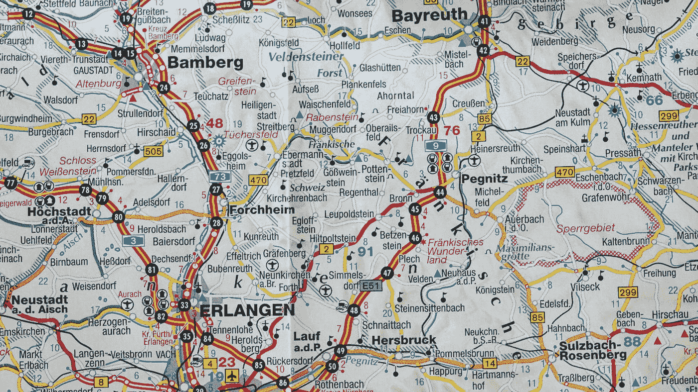

# 通过实现 Lodash 方法学习 JavaScript 扁平化和映射

> 原文：<https://javascript.plainenglish.io/learning-javascript-by-implementing-lodash-methods-flattening-and-mapping-c644afce1cd0?source=collection_archive---------12----------------------->


Photo by [Brooke Lark](https://unsplash.com/@brookelark?utm_source=medium&utm_medium=referral) on [Unsplash](https://unsplash.com?utm_source=medium&utm_medium=referral)

Lodash 是一个非常有用的工具库，让我们可以轻松地处理对象和数组。

然而，现在 JavaScript 标准库正在赶上诸如 Lodash 之类的库，我们可以用简单的方法实现许多功能。

在本文中，我们将了解如何创建自己的方法来展平集合。

# `flatMap`

Lodash `flatMap`方法对原始数组的每个数组条目运行一个`iteratee`函数，然后展平得到的数组并返回它。

我们可以如下实现它:

```
const flatMap = (arr, iteratee) => arr.map(iteratee).flat()
```

在上面的代码中，我们调用了`arr`上的`map`方法来将每个条目映射到`iteratee`，然后调用`flat`来展平结果数组。

那么当我们如下调用我们的`flatMap`函数时:

```
const result = flatMap([1, 2], a => [a, a]);
```

我们得到`result`是`[1, 1, 2, 2]`。

# `flatMapDeep`

Lodash 的`flatMapDeep`方法类似于`flatMap`，但是递归地展平结果数组。

我们可以像对`flatMap`方法那样实现它，如下所示:

```
const flatMapDeep = (arr, iteratee) => arr.map(iteratee).flat(Infinity)
```

我们的`flatMapDeep`和`flatMap`方法之间的唯一区别是，我们在通过调用`iteratee`映射每个条目后，将`Infinity`传递给`flat`以递归展平我们的结果数组。

那么当我们可以这样做时:

```
const result = flatMapDeep([1, 2], a => [[a, a]]);
```

`result`应该是`[1, 1, 2, 2]`。

# `flatMapDepth`

`flatMapDepth`类似于`flatMap`，但是我们可以指定结果数组的展平深度。

普通的 JS `flat`方法也接受展平的深度作为参数，所以我们可以再次使用它:

```
const flatMapDepth = (arr, iteratee, depth) => arr.map(iteratee).flat(depth)
```

那么当我们这样称呼它的时候:

```
const result = flatMapDepth([1, 2], a => [
  [a, a]
], 1);
```

我们得到:

```
[
  [
    1,
    1
  ],
  [
    2,
    2
  ]
]
```

作为`result`的值，因为我们指定深度为 1。

# `groupBy`

`groupBy`方法返回一个对象，该对象接受一个数组中的项目，调用一个`iteratee`函数并将其添加为返回对象的键】。

然后它创建一个数组作为每个键的值，然后当用它调用`iteratee`时，将与键相同的项目推入数组。

我们可以按如下方式实现:

```
const groupBy = (arr, iteratee) => {
  let obj = {};
  for (const a of arr) {
    if (!Array.isArray(iteratee(a))) {
      obj[iteratee(a)] = [];
    }
    obj[iteratee(a)].push(a);
  }
  return obj;
}
```

在上面的代码中，我们用一个`for...of`循环遍历条目，然后通过调用数组条目上的`iteratee`来填充键，然后添加值为空数组的键。

然后当把条目推入到相应的键的数组中时。

那么当我们这样称呼它的时候:

```
const result = groupBy([6.1, 4.2, 6.3], Math.floor);
```

我们得到的那个`result`是:

```
{
  "4": [
    4.2
  ],
  "6": [
    6.3
  ]
}
```

# `includes`

Lodash `includes`方法检查一个条目是否在集合中。它还需要一个起始索引来开始搜索。

我们可以用如下的`slice`和`includes`方法实现这一点:

```
const includes = (arr, value, start) => arr.slice(start).includes(value)
```

在上面的代码中，我们调用了`arr`上的`slice`来从`start`索引开始搜索。然后我们调用 array 实例的`includes`方法来检查该项是否在切片数组中。

那么当我们这样称呼它的时候:

```
const result = includes([6.1, 4.2, 6.3], 6.3, 1);
```

`result`应为`true`，因为 6.3 位于索引大于或等于 1 的数组部分。



Photo by [Thomas Kinto](https://unsplash.com/@thomaskinto?utm_source=medium&utm_medium=referral) on [Unsplash](https://unsplash.com?utm_source=medium&utm_medium=referral)

# invokeMap

Lodash `invokeMap`方法映射一个数组的值，并根据我们作为参数传入的内容返回它。

Lodash `invokeMap`接受一个带有函数名的字符串或一个要在每个集合条目上调用的函数。这也需要一个论据来支持论据。

我们可以如下实现它:

```
const invokeMap = (arr, fn, ...args) => arr.map(a => fn.apply(a, args))
```

在上面的代码中，我们使用 rest 操作符将`args`扩展到一个数组中。然后我们调用`arr`上的`map`来映射每个条目，方法是调用`fn`上的`apply`来映射带有指定函数的值。

我们保持简单，只假设`fn`是一个函数，不像 Lodash 版本。

那么当我们这样称呼`invokeMap`时:

```
const result = invokeMap([123, 456], String.prototype.split, '')
```

我们得出`result`是:

```
[
  [
    "1",
    "2",
    "3"
  ],
  [
    "4",
    "5",
    "6"
  ]
]
```

因为我们把数字分成了子串。

# 结论

`flatMap`系列方法可以用`map`和`flat`方法实现。

要实现`groupBy`方法，我们只需通过在每个数组条目上调用`iteratee`函数来填充一个对象，然后将它们作为键填充。这些值将是原始值，当我们对它调用`iteratee`时，它们将返回与键相同的值。

我们可以使用普通 JavaScript 的`includes`方法来实现我们自己的 Lodash 的`includes`。

最后，`invokeMap`可以通过使用 rest 操作符将参数分散到一个数组中，然后使用`apply`在每个条目上调用传入的函数来实现。

## 来自简明英语团队的说明

你知道我们有四种出版物吗？给他们一个 follow 来表达爱意:[**JavaScript in Plain English**](https://medium.com/javascript-in-plain-english)，[**AI in Plain English**](https://medium.com/ai-in-plain-english)，[**UX in Plain English**](https://medium.com/ux-in-plain-english)，[**Python in Plain English**](https://medium.com/python-in-plain-english)**——谢谢，继续学习！我们还推出了一个 YouTube，希望你能通过 [**订阅我们的英语频道**](https://www.youtube.com/channel/UCtipWUghju290NWcn8jhyAw) 来支持我们**

**一如既往,“简明英语”希望帮助推广好的内容。如果您有一篇文章想要提交给我们的任何出版物，请发送电子邮件至[**submissions @ plain English . io**](mailto:submissions@plainenglish.io)**，并附上您的媒体用户名和您感兴趣的内容，我们将会回复您！****