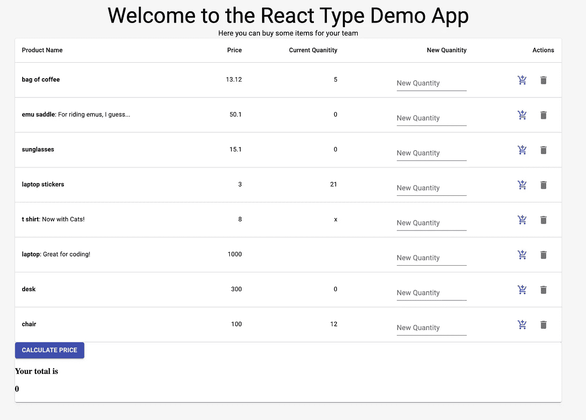
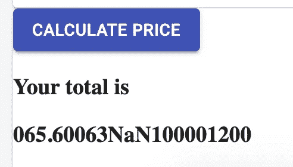
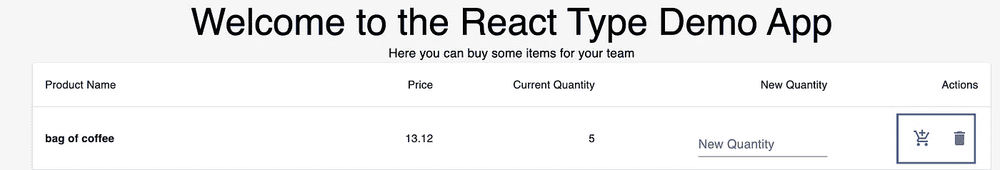
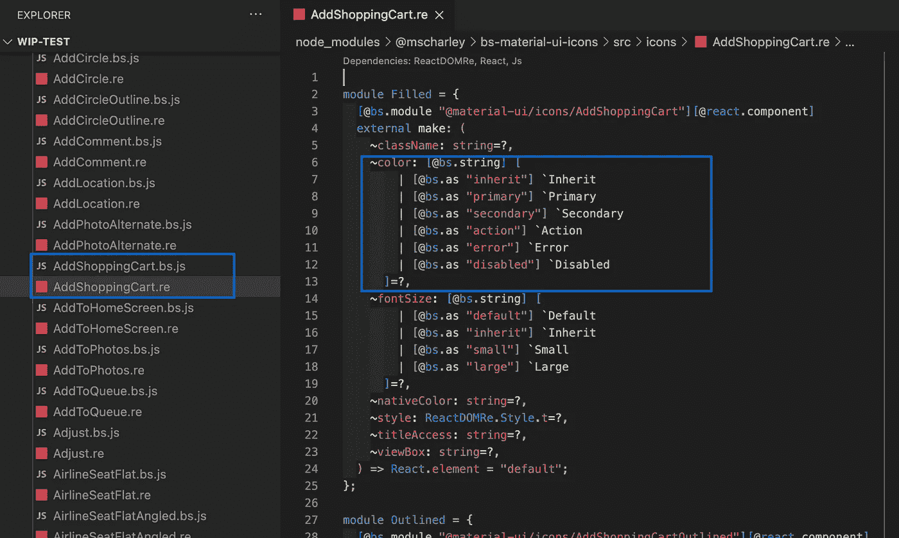
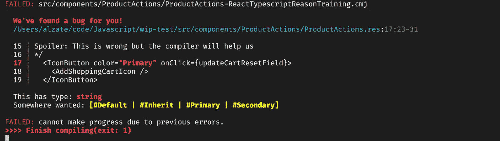
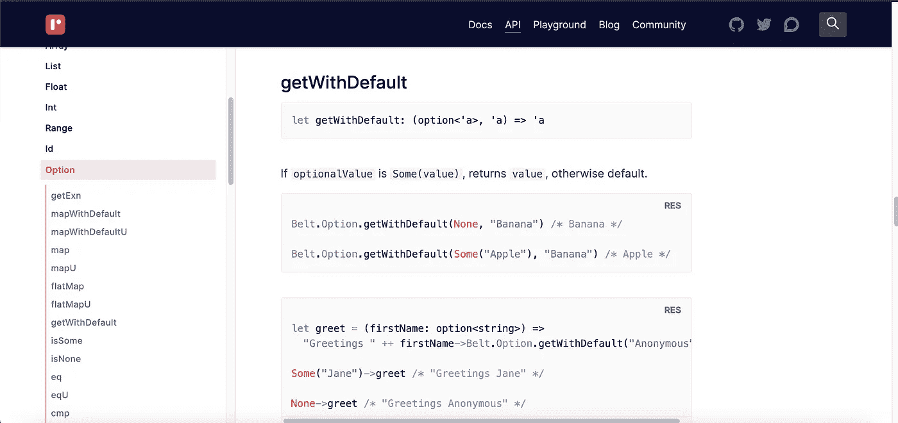
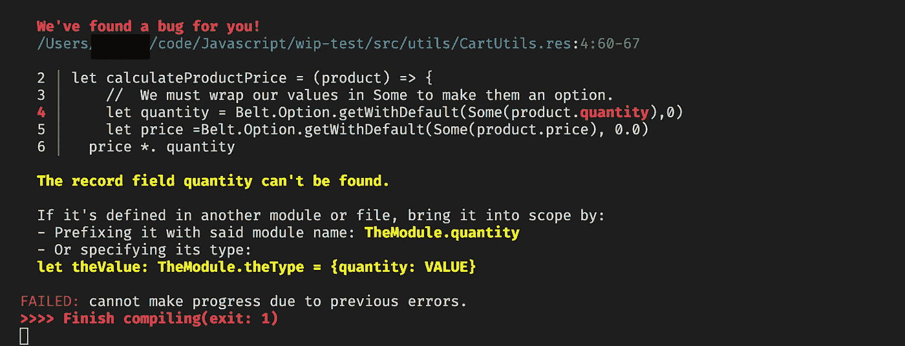
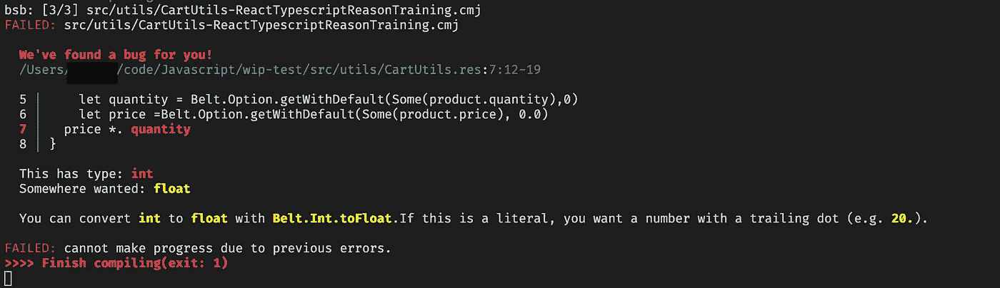
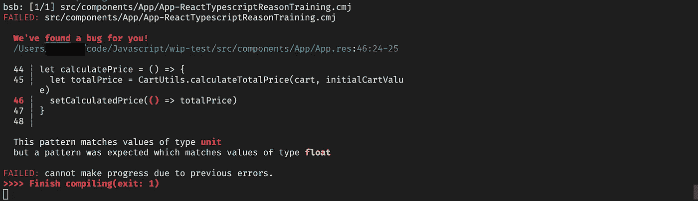
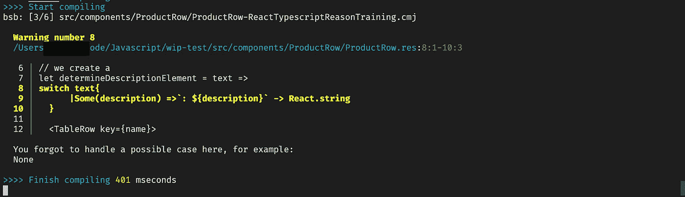

# 学习重写—将 React 应用程序转换为重写

> 原文：<https://javascript.plainenglish.io/learning-rescript-a-safer-way-to-write-javascript-part-2-5a4df5ecc09?source=collection_archive---------5----------------------->

## 第 2 部分:通过转换应用程序跳入深水区

Photo by [AltumCode](https://unsplash.com/@altumcode?utm_source=medium&utm_medium=referral) on [Unsplash](https://unsplash.com?utm_source=medium&utm_medium=referral)

> **注意:**这是两部分教程的第二部分。这涵盖了一吨的材料。建议阅读第一部分，尤其是如果你打算继续下去。[你可以在这里看！](https://medium.com/swlh/learn-rescript-a-safer-way-to-write-javascript-part-1-e0b56d447c44)

[在教程](https://jaysonalzate.medium.com/learn-rescript-a-safer-way-to-write-javascript-part-1-e0b56d447c44)的第一部分，我们介绍了什么是 ReScript，它的好处，将编译器添加到应用程序中，并了解了该语言及其生态系统的一些细微差别。在本教程中，我们将基于这些知识用 ReScript 完全重写一个应用程序。

为了帮助你容易地回顾本教程中的概念，我们将列出每一节涉及的概念。

这里还有一个链接，链接到本教程第 1 部分的最终代码，如果你想了解的话。

首先，让我们简单地看一下我们的项目。

# 是什么项目？

Photo by [Veronika Koroleva](https://unsplash.com/@korolevalkv?utm_source=medium&utm_medium=referral) on [Unsplash](https://unsplash.com?utm_source=medium&utm_medium=referral)

对于本教程，我们将采用一个基本的购物车应用程序，并慢慢地将类型安全添加到回购中。该示例应用程序有些做作，架构不佳，有明显的错误。这些将有助于我们学习和应用这些概念。

## 探索应用程序

拉动回购后，安装依赖项，启动 app。在看到应用程序时，您应该会看到一个基本的表，允许您添加购物车中每个产品的数量。

The shopping app that we will be working on

正如您所看到的，其中一些购物车值有不正确的值，如`'x'`。下面是具有默认值的代码块:

Invalid (non-numeric) quantities are seen above

Pictured above: Not a valid price

当您尝试计算总价时，结果会收到一个非常奇怪的字符串。这是因为 Javascript 对这些类型进行数学运算的方式中有许多非数值和怪癖。通过类型检查(和一些常识)，我们可以避免这样的错误。

在转换我们的应用程序时，我们将利用在第 1 部分中学到的一些脚本基础知识。我建议在继续之前简要回顾一下基本的脚本概念部分。

# 关于在脚本中开发的一个注记

当我们开始转换到 ReScript 的过程时，由于编译器的速度和有用的反馈，我们不会使用 Webpack 直接捆绑我们的 ReScript 文件。因此，我们将使用编写一个 JavaScript 文件并将编译后的 JavaScript 导入到现有项目中的模式。然后，我们的捆绑器将执行输出的 JavaScript。

采用这种方法的结果是，我们需要打开两个独立的终端:一个用于 Webpack 开发服务器，另一个用于我们的 BuckleScript 编译器。

The scripts we need to run before we can begin to develop

# 将我们的入口点转换为 JavaScript

Photo by [WanderLabs](https://unsplash.com/@wanderlabs?utm_source=medium&utm_medium=referral) on [Unsplash](https://unsplash.com?utm_source=medium&utm_medium=referral)

我们的第一个任务是将我们的入口点转换为使用 ReScript。在本节中，我们将讨论:

*   将 JavaScript 代码导入到 ReScript 中
*   手动创建模块
*   将 JavaScript 反应组件转换为 JavaScript 反应组件
*   使用 ReactDom 将 ReactDom 元素呈现给 dom

首先，我将向大家展示我们的成品`Index.res`，并讲解一些概念。

Our Index.res file

这个文件中发生了很多事情，但让我们深入了解更多细节。这个文件主要做两件事:

1.  导入一个 Javascript React 组件，并将其转换为使用 Javascript 和 ReasonReact 约定。这包括将其包含在模块中，并将其导出到名为`make`的变量中。
2.  使用 ReasonReact 提供的`ReactDomRe`模块将组件呈现到我们的根。可以看到，在转换为 JavaScript 约定之后，我们可以使用`<App/>`的 JSX 语法。编译人员发现这相当于在 JavaScript 中的`App.make`。

## 快速了解导入 JSX 组件—可选

要将 JavaScript React 组件导入到 JavaScript 中，我们必须执行一些步骤，以允许编译器正确地对其进行解密(并为我们提供所有令人敬畏的类型安全覆盖)。[以下是一些古老的推论，请查阅有关](https://reasonml.github.io/reason-react/docs/en/components#import-from-js)主题的文档。

我们需要做的第一件事是定义一个模块来包含我们的组件定义。以下是有关[模块](https://rescript-lang.org/docs/manual/latest/module#sidebar)的更多信息。

接下来，我们需要在模块中导入我们的 JavaScript React 组件，并将其转换为 ReasonReact 约定。我们将使用一些装饰者，比如:

1.  `@bsmodule`修饰词和`external`关键字。这允许我们从 JavaScript 导入代码，并将其分配给一个变量。[以下是这些功能的更多细节。](https://rescript-lang.org/docs/manual/latest/import-from-export-to-js#import-from-javascript)在我们的代码中，我们通过指定“default”来获取`App.jsx`文件的默认导出，但我们可以引用 JS 文件中的任何命名导出。
2.  我们还将使用`@react.component`装饰器让编译器知道我们正在制作一个 React 组件。[这里有一些关于装修工的信息。](https://reasonml.github.io/reason-react/docs/en/components#reactcomponent)按照惯例，每个 ReasonReact 组件都有一个命名的导出`make`,其中组件被导出，而不是使用默认导出。
3.  上面的信息意味着我们必须使用我们的`external`操作将我们的 React 组件绑定到一个`make`变量，以确保编译器正确地选择它。

一旦我们完成了这些步骤，编译器会将`App`识别为 ReasonReact 组件，并正确地呈现它。

我们现在可以通过修改`webpack.config.js`中的`entry`属性来引用我们的生成文件`Index.bs.js`来使用它作为我们的入口点。

现在我们已经更新了我们的入口点，我们将在下一节中处理转换我们最简单的 React 组件。但是要注意的是，我们在这样做的时候会涉及很多材料。

# 转换我们的 ProductActions 组件

`ProductActions`组件非常简单。

The ProductActions section is highlighted in blue.

其核心是由两个 MaterialUI 图标组成，这两个图标都有调用函数的点击处理程序。

Our original ProductActions React Component.

虽然这是一个简单的组件，但是本节将向我们介绍一些有用的特性和模式。这包括:

*   配置 bsconfig 在我们的应用程序中使用第三方包。在这种情况下，材质用户界面和材质用户界面图标
*   学习如何打开模块使我们的代码更具可读性
*   查看文档和代码以理解预期的输入值
*   创建助手模块
*   在我们的组件中使用第三方包
*   逐步切换我们的应用程序以使用我们的脚本代码

这将帮助我们走得更远，走得更远。我们开始吧！

## 将第三方库导入我们的项目

在这个文件中，我们需要使用两个库:[材质 UI](https://jsiebern.github.io/bs-material-ui/) 和[材质 UI 图标。](https://github.com/mscharley/bs-material-ui-icons)谢天谢地，社区中有人为这两个包编写了原因绑定。

我们需要更新我们的`bsconfig`文件并更新我们的 bs-dependencies 来添加这些包。

We add the packages to our dependencies like in a package.json. This allows us to utilize their modules in our project.

## 打开模块以提高代码可读性

打开一个模块允许我们访问模块的所有内容，而不必总是在内容前面加上模块名。以下是打开模块如何提高可读性的示例:

An example of how opening modules improves readability

打开模块的一个警告是，如果你可能会遇到变量名冲突。如果您使用的变量出现在多个打开的模块中，就会出现这种情况。例如，`OpenModuleA`和`OpenModuleB`中存在同名变量时引用`myVar`。如果发生这种情况，编译器会让你知道！

现在我们知道了如何打开一个模块，我们将看看 MaterialUI 图标文档，看看如何添加它们。

## 分析来自第三方库的文档和代码

所以看一下我们的代码，我们需要给我们的回购协议添加两个图标:一个`DeleteIcon`和一个`AddShoppingCartIcon`。[让我们花点时间看看材质 UI 图标文档](https://github.com/mscharley/bs-material-ui-icons)。通过分析，我们了解到一些事情:

1.  我们将看到如何在组件中使用材质 UI 图标
2.  我们看到像`Filled`和`Outlined.`这样的图标有各种变体，这反映了[材质 UI 图标](https://material.io/resources/icons/?style=baseline)的实现。我们将使用`Filled`变体，因为它是基线，并且与我们当前的应用程序相匹配。
3.  我们学习如何将我们的图标别名到模块中以提高可读性
4.  我们注意到它确实告诉了我们一个图标的名字。`DeleteIcon`在其中一个例子中被称为`Delete`，但它没有告诉我们`AddShoppingCartIcon`的名称。

我们已经了解了这个库及其工作原理。我们现在必须找出一些关于我们的`AddShoppingCartIcon`的缺失信息。这包括:

1.  `AddShoppingCartIcon`模块的名称是什么？
2.  我们如何让图标坚持“原色”配色？

为此，我们将打开我们的节点模块并进行一些研究。我们可以看到这里列出了一个`AddShoppingCart.bs.js`文件，以及一个原因文件中的原因绑定。

## **什么是原因绑定？**

原因绑定是一个文件，它设置了一些 Javascript 代码和编译器之间的契约。这包括类型信息和可接受的值。我们可以利用原因绑定，因为它与 ReScript 共享编译器来使用第三方库。

打开文件，我们可以看到每个道具的类型和值。对于我们的用例，我们注意到我们将值作为“主要”传递给了`~color` props。

Reading Reason bindings is a great way to find out how to pass props

有了这些信息，我们现在可以开始创建我们的助手文件，并开始编写我们的组件。

## 编写我们的助手文件

请记住，材料用户界面图标文档中有关于如何为我们的图标取别名的信息。

我们将首先在一个助手目录中创建一个名为`Icons.res`的新文件，并放入下面的代码。

This aliasing will make our components more readable.

## 编写我们的 ProductActions 组件

我们现在将使用我们所学的知识编写我们的组件。在使用的概念中:

*   @react-component decorator
*   打开模块
*   为我们的道具命名的论点

这是我们第一次尝试写文件。

Here is the first try at rewriting ProductAction to ReScript

我们现在将看到这个有用的编译器错误。

ReScripts amazing compiler lets us know exactly what inputs are acceptable!

我们现在将“主要”值更新为`#Primary`。

**注:** *出现差异的原因是我们可以使用原因文件，但是 Script* 中的语法略有变化。这甚至可以应用于道具/关键词。因此，原因绑定是一个很好的指南，但是编译器和一些额外的研究可能需要。

This now compiles and works!

我们的代码现在可以工作了。我建议你看看输出。我们现在可以逐步切换我们的应用程序来使用这个输出的 JS 文件。在下一节中，我们将展示如何进行增量切换。

## 用我们的产品动作替换脚本组件

我们的应用程序使用一种模式，即`index.js`文件作为我们的反应组件的出口。当导入组件时，这给了我们一些可读性上的改进。此外，这种模式允许我们很容易地用现有的组件替换我们的脚本组件。下面是开关。

Swapping our components is very easy

就这样！这个简单的组件涵盖了很多领域，但是这些知识应该能让我们在未来走得更快。在下一部分，我们将处理应用程序中最复杂的类型:记录。

# 将我们的产品定义为记录类型

在我们的应用程序中，我们的大多数类型都是基本的基本类型。我们的应用确实有一个对正确建模很重要的数据结构:我们的`product`记录。因此，接下来应对`product`类型是有意义的。这将使我们能够开始重写应用程序的其余部分。

有三个步骤:

1.  定义描述我们产品的[记录](https://rescript-lang.org/docs/manual/latest/record)类型。**注意:** [物体](https://rescript-lang.org/docs/manual/latest/object)也存在，但不建议使用
2.  定义一个 maker 函数，该函数接受命名参数并基于输入创建记录
3.  转换我们的产品数组，使用这个新的 maker 函数来填充数组。

以下是它的外观。

Our updated product constants with our new type!

我们在这里学到了一些新概念。我想谈两点:

*   [**选项类型**](https://rescript-lang.org/docs/manual/latest/null-undefined-optionhttps://rescript-lang.org/docs/manual/latest/null-undefined-option)—ReScript 没有未定义或空的类型，而是有一个选项类型。这有助于我们完全避免由这些类型引起的错误！
*   **访问我们的新记录类型—** 既然我们已经定义了产品类型，我们的应用程序可能需要引用它。重要的是要知道编译器访问我们的类型声明的方式和访问任何模块内容的方式是一样的。要使用**，**你可以使用`Product.product`注释该类型，或者只打开`Product`模块，让整个模块访问该类型。
*   当使用我们的 maker 函数时，我们传递的最后一个参数总是`()`，称为`unit`。这让编译器知道我们已经完成了参数传递。

既然我们已经设置了`product`类型，现在我们可以轻松地完成应用程序的其余部分。

在下一节中，我们将键入我们的 utils 文件。在这个过程中，我们将开始使用我们的新类型，利用 ReScript 的内置库，并使用出色的管道操作符(`->`)。

# 内置库+管道操作符=太棒了！

Photo by [Drew Sal](https://unsplash.com/@drewsal?utm_source=medium&utm_medium=referral) on [Unsplash](https://unsplash.com?utm_source=medium&utm_medium=referral)

现在我们已经定义了我们的`product`类型，我们可以查看我们的 cart utils 并开始转换它们。下面是我们的原始文件。

Our original cart utils

您可能会注意到，我们在这个文件中使用了 lodash，但是我们没有为 ReScript 安装一个等效的库。我们不需要它！有了标准的脚本库，我们将能够涵盖所有这些用例。

我们将放大第一个函数`calculateProductPrice`来看看几个概念:

*   如何在 ReScript 中构建函数
*   看公共图书馆
*   在代码中使用类型定义
*   使用管道运算符提高可读性

## 函数快速备忘单

关于函数，需要记住以下几点:

*   它们被分配给带有`let`关键字的变量
*   函数的最后一行是隐式返回
*   默认情况下，函数为 curry

如果你想了解更多关于函数的知识，这里有一些文档。

## 使用我们的第一个图书馆

对于我们的第一个函数，我们需要重新创建与 lodash 中的`get`相同的功能。幸运的是，标准库为我们提供了这样的工具。让我们先来看看 [API 文档](https://rescript-lang.org/docs/manual/latest/api)。

The impressive built-in libraries have awesome API docs!

**注意:**由于我们之前输入了我们的`product`记录，我们不需要使用`get`方法。这是因为我们永远不会看到一个空洞的“价格”或“数量”。尽管如此，我们还是要重新创建这个功能来学习。

如您所见，库是按数据类型组织的。浏览文档或使用搜索功能，[我们在](https://rescript-lang.org/docs/manual/latest/api/belt/option#getwithdefault) `[Belt.Option](https://rescript-lang.org/docs/manual/latest/api/belt/option#getwithdefault)` [库中发现了一个](https://rescript-lang.org/docs/manual/latest/api/belt/option#getwithdefault) `[getWithDefault](https://rescript-lang.org/docs/manual/latest/api/belt/option#getwithdefault)` [方法。查看文档，我们注意到传递的第一个值是我们的值的一个](https://rescript-lang.org/docs/manual/latest/api/belt/option#getwithdefault)[选项](https://rescript-lang.org/docs/manual/latest/null-undefined-option)。要将我们的值转换成选项，我们只需要将它们包装在一个`Some`函数中。

Here is our first try at recreating the function

**附注:Some|None 选项类型非常强大。** [**要了解更多，你可以读一读弗里斯比教授的《函数式编程基本充足指南》的这一节！**](https://mostly-adequate.gitbooks.io/mostly-adequate-guide/content/ch08.html#schr%C3%B6dingers-maybe)

在编写这些内容时，我们将得到以下有用的错误:

While we have defined our product type, we forgot to import it into our CartUtils file!

我们忘记了导入我们的类型定义。我们可以通过打开`CartUtils`模块顶部的`Product`模块来解决这个问题。这允许我们的`CartUtils`文件中的所有函数都可以访问我们的`product`类型。将`open Product`添加到文件的顶部后，我们将得到以下错误:

Our compiler reminds us that we need to convert quantity to a float type.

编译器很有帮助地提醒我们，我们需要将 quantity 转换为 float 类型，以便将它乘以价格。编译器甚至会告诉我们使用什么库函数来做这件事！我们现在将更新我们的文件。

Here is our working version of the calculateProductPrice.

我们现在有一个工作的 util 函数，但是很难读懂这个函数。

在我们继续之前，我们将通过使用管道函数和利用自动匹配来清理我们的文件。

## 使用管道函数和 curry 来清理我们的函数

我们写了一个工作函数，但是很难读懂。我们将利用这样一个事实，即每个函数在默认情况下都是 curries，以便于阅读。

管道让我们将一个函数的结果作为参数传递给另一个函数。我们将利用这一点并重写我们的函数。下面是我们更新的文件。

Using a combination of pipes, currying, and opening Belt, we greatly improve the readability of our file.

正如你所看到的，这是非常可读的。我们现在将继续应用这些工具，并继续重写文件的其余部分。这是最后一个文件。

Our finalized CartUtils with comments

需要指出一些事情:

1.  ReScript 支持三元运算。
2.  我们将函数分成更小的部分，以提高可读性。
3.  我们在这个文件中利用了`[Belt.Arra](https://rescript-lang.org/docs/manual/latest/api/belt/array)y`库，但是也存在一个`[Js.Array](https://rescript-lang.org/docs/manual/latest/api/js/array)`库。它们可能有一些相似的功能，但并不总是如此。总是先检查`Belt`库，因为默认情况下它提供了不变性，然后再检查`Js`库。

现在我们已经完成了，我们将重写我们的`App.jsx`文件。这个组件有一些我们需要处理的人为问题。在下一节中，我们将解决这些问题并学习一些新的功能，但是首先，我们将研究部分应用程序和类型系统之间的关系。

# 当心局部应用和类型系统

部分应用程序是一个强大的工具，ReScript 让我们可以通过默认设置所有函数来轻松使用它。**当心！使用局部应用**时，我们必须考虑类型系统。好吧，不是真的小心，编译器不会让我们做任何不安全的事情。让我们首先看一个通过 currying 在普通 JavaScriptfile 文件中使用 partial application 的例子。

An example of currying and partial application in practice.

上面的代码是有效的 JavaScript 用法。

现在，让我们试着重新写一遍。**注意:这不是有效的说明，而是用于说明目的。**

This file shows how partial application and types work together in ReScript.

从上面的例子可以看出，**部分应用的函数只能有一种类型的返回。如果你忘记这么做，编译器会抱怨的。这就是强式系统的力量！**

我们也可以使用`_`将参数部分应用到我们的函数中，提高可重用性！

# 在 ReasonReact 中编写我们的第一个 React 钩子

我们的`App`组件是我们要解决的下一个问题。下面是它的样子。

Our App.jsx file, commented to highlight contrived errors

我们需要解决一些显而易见的问题，才能让这种方法发挥作用。这包括:

*   将我们的初始购物车值从字符串改为数字`0`
*   用位于我们的`Product`模块中的正确的`productDetails`列表切换出我们的无效`initialProductListWithTypeErrors`

当我们重写我们的`App`时，我们必须记住这一点。还有一点需要注意的是，它使用了`ProductTable`。我们还没有重写它，所以我们将不得不导入它。

我们也将使用`useState`挂钩。React 网站上有一些 ReasonML 的例子可以帮助你。

our App.res file with comments

只是一些需要注意的事情:

1.  我们可以在 React 渲染方法中使用管道操作符，如`React.string`、`React.float`、`React.array`等。
2.  我们的`useState`不取值**，而是取一个返回值的函数。**
3.  MaterialUI 将类似`#Right`的变体用于 align 等道具。记得查看他们的文档或检查你的节点模块中的文件。
4.  `**_**`操作符让编译器知道您不会使用传递的参数。否则，您将会看到如下所示的编译器错误:

The compiler reads a unit type if you pass “()”

现在，我们已经确保了我们的主要数据(我们的购物车和价格)是正确的，并正确输入，我们现在可以快速浏览并完成输入我们的应用程序。我们还需要一些概念。

在此之前，我们应该记得从我们的`Index.res`文件中删除我们的`App.jsx`导入。

接下来，我们将进入简单的`ProductTable`组件。

# 给孩子们传递道具的速成课

转换我们的`ProductTable`文件非常简单。这是原始文件。

这是我们转换后的文件。

Our ProductTable component written in ReScript

唯一需要注意的独特之处是:

1.  我们必须显式地将道具传递给我们的子组件**。我们不能传播道具。**
2.  **当映射组件数组时，我们仍然需要使用 React render 方法，`React.array`。**

**快好了。我们现在来看看最后一个组件`ProductRow`。**

# **学习模式匹配**

****

**Photo by [Cristian Cristian](https://unsplash.com/@crischv87?utm_source=medium&utm_medium=referral) on [Unsplash](https://unsplash.com?utm_source=medium&utm_medium=referral)**

**在大多数情况下，`ProductRow`非常容易转换。关于如何呈现可选属性`description`，我们确实有些复杂。有几种方法可以解决这个问题。这是我们的原始文件。**

**Here is the original ProductRow file.**

**处理可选的`description`属性的一种方法是使用`Option.getWithDefault`方法返回一个值，我们可以将这个值传递给另一个函数。这个函数将帮助我们决定返回什么元素。这增加了很多复杂性。下面是该实现的样子:**

**Handling optional param with helper function and ternary**

**不过有一种更好的方法:[模式匹配！](https://rescript-lang.org/docs/manual/latest/pattern-matching-destructuring)**

**我们的描述是一个[选项](https://rescript-lang.org/docs/manual/latest/null-undefined-option)，所以它只有两个可能的值:一些(值)或者没有。使用模式匹配，我们可以很容易地考虑这两种情况。如果我们错过了一个边缘情况，编译器也会给出有用的警告。**

****

**The compiler lets us know if we failed to account for a potential state!**

**下面是我们如何实现这一点。你会发现它读起来更容易，启动起来更安全！**

**Handling optional param with pattern matching**

**就是这样。我们完了！**

****

**Photo by [MIO ITO](https://unsplash.com/@mioitophotography?utm_source=medium&utm_medium=referral) on [Unsplash](https://unsplash.com?utm_source=medium&utm_medium=referral)**

**我们现在可以清理我们的项目了。这包括移除`App.res`中的`ProductTable`导入。完成这一步后，我们的应用程序应该 100%运行我们编译的脚本代码！**

# **结论**

****

**Photo by [Priscilla Du Preez](https://unsplash.com/@priscilladupreez?utm_source=medium&utm_medium=referral) on [Unsplash](https://unsplash.com?utm_source=medium&utm_medium=referral)**

**如您所见，关于 ReScript 还有很多要学的，但它是一种非常强大的语言。我们已经介绍了大量内容，但是希望您现在对如何开始有了更好的理解。**

**这里是我们最终代码的链接！**

**感谢您阅读我的第一篇文章！请不要客气。**

****注意:由于所涉及的内容太广，我们在本教程中没有使用 Gentype 功能。如果感兴趣，请联系我，我也许可以写一篇关于垫片和其他需要知道的事情的短文。****