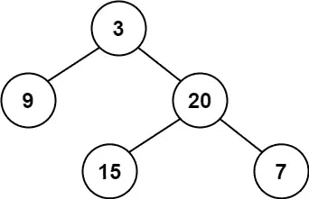
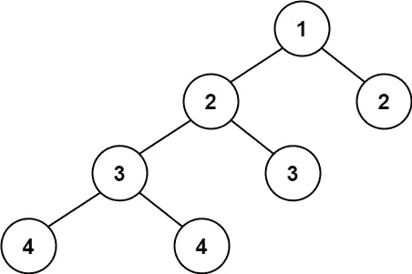
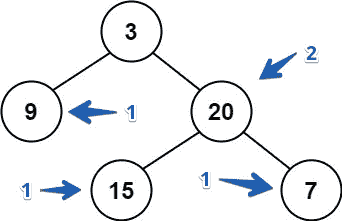
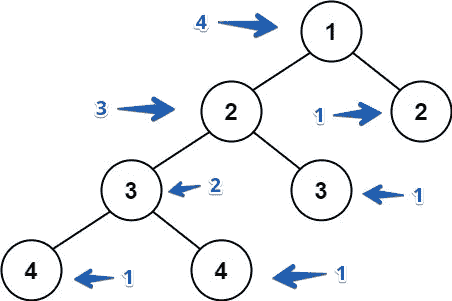

# JavaScript 算法:平衡二叉树(LeetCode)

> 原文：<https://javascript.plainenglish.io/leetcode-110-balanced-binary-tree-javascript-49ec9ddf9318?source=collection_archive---------5----------------------->


Photo by [Adarsh Kummur](https://unsplash.com/@akummur?utm_source=medium&utm_medium=referral) on [Unsplash](https://unsplash.com?utm_source=medium&utm_medium=referral)

# 描述

给定一棵二叉树，确定它是否是高度平衡的。

对于这个问题，高度平衡的二叉树被定义为:

> *一种二叉树，其中每个*节点的*的左右子树高度相差不超过 1。*

**例 1:**



```
**Input:** root = [3,9,20,null,null,15,7]
**Output:** true
```

**例 2:**



```
**Input:** root = [1,2,2,3,3,null,null,4,4]
**Output:** false
```

**例 3:**

```
**Input:** root = []
**Output:** true
```

**约束:**

*   树中的节点数在范围`[0, 5000]`内。
*   `-104 <= Node.val <= 104`

# 解决办法

首先，我们来了解一下什么是二叉树。二叉树是一种数据结构，其中每个节点最多有两个子节点。我们可以把每个节点看作一棵二叉树。

二叉树的高度是多少？所以，值得商榷。例如，我们有一个没有任何子节点的节点。此节点可以被视为 0 或 1。我们要说每个没有孩子的节点的高度都是 1。

让我们看看例子:

**例 1:**



节点 9 没有子节点，高度为 1。节点 15 和节点 7 一样没有子节点，高度为 1。节点 20 在左右节点中具有相同的高度。

而根节点的左节点的高度为 1，右节点的高度为 2，两者之差为 1。在这种情况下，我们将返回 true，因为 1 不大于 1。

**例 2:**



在这个例子中，让我们看看根节点。左侧节点的高度为 4，右侧节点的高度为 1。两者之差大于 1。因此，在这种情况下，我们将返回 false。

让我们想出一个解决方案:

感谢阅读！期待您的反馈。回头见，✌️

喜欢这篇文章吗？如果有，通过 [**订阅获取更多类似内容解码，我们的 YouTube 频道**](https://www.youtube.com/channel/UCtipWUghju290NWcn8jhyAw?sub_confirmation=true) **！**