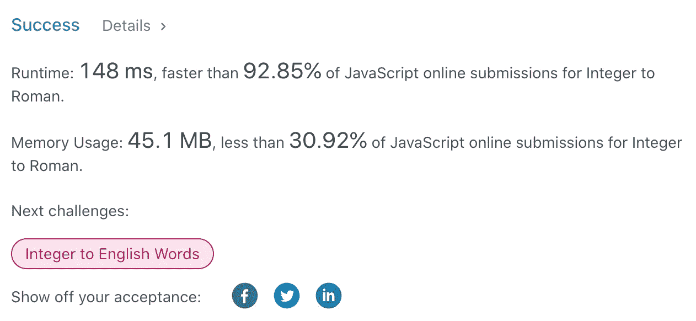

# JavaScript 算法:整数到罗马(LeetCode)

> 原文：<https://javascript.plainenglish.io/leetcode-12-integer-to-roman-javascript-21459e45a0ee?source=collection_archive---------3----------------------->


Photo by [Mathew Schwartz](https://unsplash.com/@cadop?utm_source=medium&utm_medium=referral) on [Unsplash](https://unsplash.com?utm_source=medium&utm_medium=referral)

# 描述

罗马数字由七种不同的符号表示:`I`、`V`、`X`、`L`、`C`、`D`和`M`。

```
**Symbol**       **Value**
I             1
V             5
X             10
L             50
C             100
D             500
M             1000
```

例如，`2`在罗马数字中写成`II`，只是两个 1 加在一起。`12`写成`XII`，简单来说就是`X + II`。数字`27`写成`XXVII`，就是`XX + V + II`。

罗马数字通常从左到右由大到小书写。但是，四的数字不是`IIII`。而是把数字四写成`IV`。因为 1 在 5 之前，我们减去它，得到 4。同样的道理也适用于数字九，写为`IX`。有六种使用减法的情况:

*   `I`可以放在`V` (5)和`X` (10)之前，做成 4 和 9。
*   `X`可以放在`L` (50)和`C` (100)之前，做成 40 和 90。
*   `C`可以放在`D` (500)和`M` (1000)之前做成 400 和 900。

给定一个整数，将其转换为罗马数字。

**例 1:**

```
**Input:** num = 3
**Output:** "III"
```

**例 2:**

```
**Input:** num = 4
**Output:** "IV"
```

**例 3:**

```
**Input:** num = 9
**Output:** "IX"
```

**例 4:**

```
**Input:** num = 58
**Output:** "LVIII"
**Explanation:** L = 50, V = 5, III = 3.
```

**例 5:**

```
**Input:** num = 1994
**Output:** "MCMXCIV"
**Explanation:** M = 1000, CM = 900, XC = 90 and IV = 4.
```

**约束:**

*   `1 <= num <= 3999`

# 解决办法

首先，我们将创建一个包含所有可能的罗马整数对的`map`。

从`M`到`I`开始，算法从最大到最小通过这个`map`，并跟踪一个`result`变量。

主要算法是使用`num`除以`map[key]`和模算子。除法告诉我们需要重复多少特定的符号。模数运算符帮助我们改变`num`。

理解这个解决方案最简单的方法是看一个例子:)假设我们需要转换`2439`:

在这个解决方案中，我们可以做一些改进:

*   如果 num 等于`0`，我们可以返回结果
*   我们可以检查除法是否等于`0`，如果不是，我们不需要重复任何事情



时间复杂度将会是`O(n)`，还有`n`是罗马数字字符的个数。而空间复杂度是`O(1)` **。**

希望对你有用！

感谢阅读！期待您的反馈。回头见，✌️