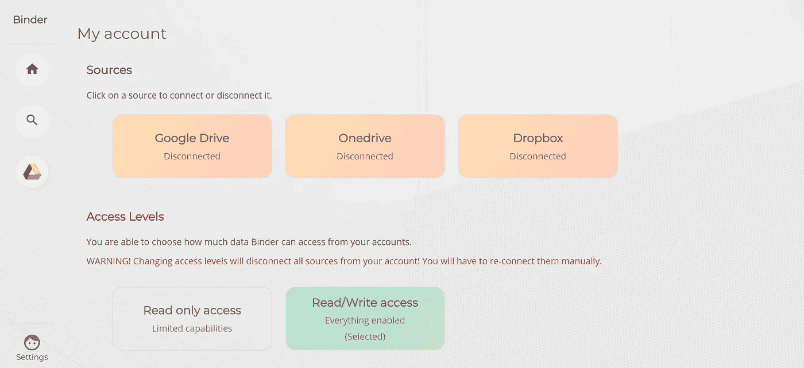
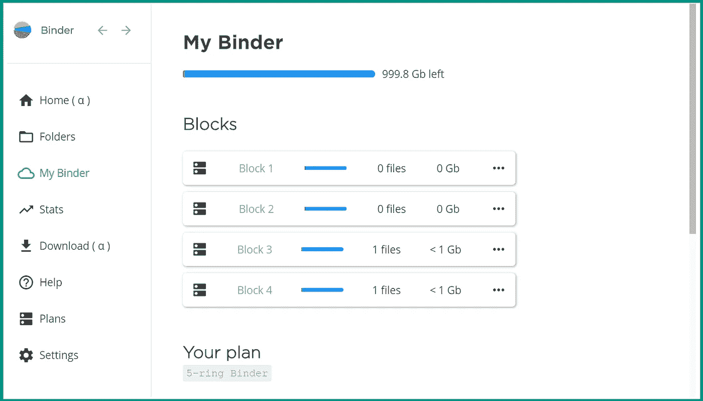
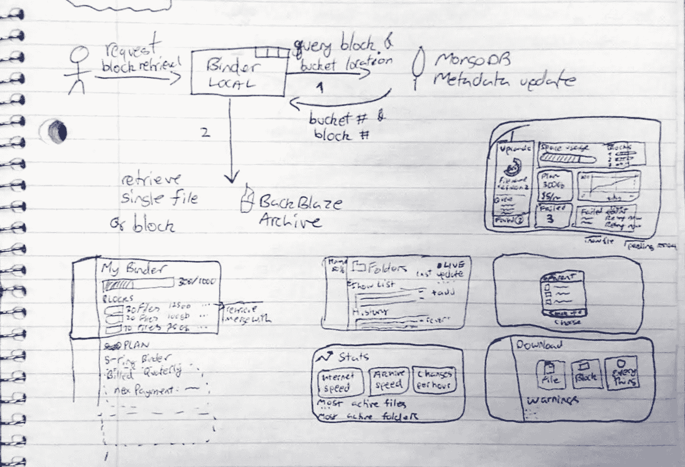
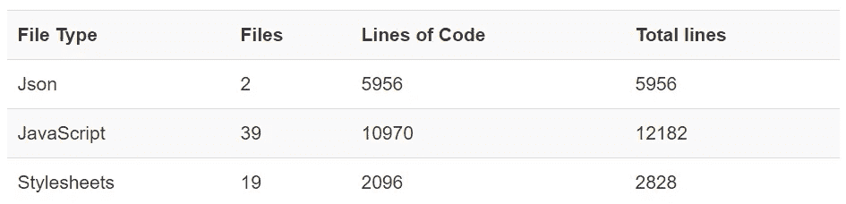

# 我从构建我的第一个大型应用程序中学到的经验

> 原文：<https://javascript.plainenglish.io/lessons-i-learnt-from-building-my-first-large-scale-app-281c56df8571?source=collection_archive---------0----------------------->

8 个月前，我开始开发一个电子应用程序。为了完成这项任务，我必须构建 3 个独立的子应用程序，在不同的环境中运行。以下是我一路走来学到的经验:

# 语境

在我进入细节之前，让我们从一些背景信息开始。2019 年初，我开始申请实习，攻读合作学位。到 4 月份，我已经提交了几十份量身定制的申请，总共收到 0 份回复。你可以想象，这让我感到挫败，觉得自己不够优秀，根本不适合做任何工作。但是我没有让我的感情战胜我，我选择向自己证明我是有知识的，有能力的。在这一切结束的时候，我明白了，我真的没有我以为自己知道的那么多。

我开始在我的项目中寻找一些东西，我可以把它们变得更大，更有挑战性，以此来抑制我的冲动。最后，我选择了 Binder，当时它只是一个同时管理 Onedrive、Google Drive 和 Dropbox 文件的网络应用。目标是创建一个可与上述服务相媲美的备份服务，但不包括文件共享部分。

# 旅程开始了

> 我把一个非常好的应用程序变成了一个廉价的教程级别的代码块

如果我没有从一开始就设定一些有点妄想的目标，我可能无法完成这个项目。我为自己设定的第一个里程碑是在我七月中旬生日的时候拥有一个可用的 alpha 版本。我立即开始工作。到 5 月份，我已经克隆了 Binder，并开始拆除它。去掉许多对我没用的功能。我把一个非常好的应用程序变成了一个廉价的教程级别的代码块。

我决定开发 4 个独立的应用程序。第一，在用户的 PC 上本地运行的客户端；第二，一个 API 后端来促进安全请求；第三，使用云工具来确保所有数据的完整性；最后，一个“营销”网页，因为每个产品都需要一个华丽的网站。😁

The original “Binder”

# 精彩的部分来了

好的好的，是的。在此之前的一切都与电子很少或没有关系，更不用说大规模的 app 开发了。但是我需要为你添加背景来理解我学习的来源。以下是我学到的 5 条主要经验:

## #1 确保使用传统的前端/后端结构，因为 IPC 是愚蠢的

太多次了，我发脾气是因为在 electronic 中进程间的通信是多么的平凡(我将再发一次脾气)。当然，IPC 可能没有被*设计成*执行 javascript 式的抽象，完成传递函数作为对象等等。但如果是的话肯定会有帮助的！我没有设计一个瘦“客户端”，我的大部分代码都在主进程中，我必须严格区分什么是面向用户的，什么不是。我用来决定什么在主进程中，什么在渲染器中的规则是一个简单的问题——这段代码提供服务了吗？这段代码有多小并不重要。如果它服务于其他代码，它就进入主进程。唯一的例外是 Stripe 支付端点，出于安全原因，我希望它尽可能靠近用户。

## #2 确保数据的完整性非常非常困难

> 后门和前门没有什么不同，所改变的只是谁在使用它。

直到我开始使用 Binder，我才意识到确保从任意数量的客户端接收到的所有数据保持正确和可访问是多么困难。安全地保存数据已经够难的了，但是现在你希望我验证数据*和*确保它与其他数据一致，而实际上不知道那些数据是什么？！

诚然，这有点夸张，但我的观点仍然成立。验证应该尽可能早地发生，并且应该沿着数据流重复进行(以较小的程度)。通过在每次更改数据时应用事务模型，可以更容易地维护一致性。事实是，随着实际数据而来的是大量的元数据，管理这些元数据只是稍微容易一点。制作一个读取用户数据并执行完整性检查的函数听起来总是一个好主意。但是经过长时间的思考，我终于发现后门和前门没有什么不同，所改变的只是谁在使用它。

## #3 把你的用户界面当成一双定制的鞋子

Binder’s UI

设计一个漂亮、实用的 UI 的一个很好的方法是把它看做一双定制的鞋子(或者一套定制的西装，或者其他什么，都没关系)。我在设计时问自己的第一个问题是，谁会关注 Binder 的 UI？请注意，我没有说谁将会是使用用户界面的 T4。这应该是你的第二个问题，因为外表决定一切。我过去参与过很多项目，我可以完全肯定地告诉你，如果你的应用程序看起来不合适，没有人会对它嗤之以鼻。

我从笔记本上的小草图开始(我是用钢笔画的，因为我总是事后批评自己)。我的第一张草图突出了界面的整体布局，当我画更多的时候，我会雕刻出我想要的每个“页面”的细节。对我来说，让信息看起来更容易比信息本身更重要。

## #4 没有太多的故障保险

老实说，我不知道你是怎么想的，但是一想到在我收到付款后的 API 中出现错误，我就感到焦虑。当我开始支付服务时，我对自己说“你不能让任何错误被忽视”。从 API 收到购买计划请求的那一刻起，直到 Stripe 通知应用程序的 webhooks 并激活该计划，我让自己在每个地方都实现了故障保护。这种偏执确实减缓了我的发展进程，但我不后悔。我确切地知道付款是什么时候送来的，送来的目的是什么，以及之后应该采取的任何行动的状态。

## #5 不完美没关系

> 重要的是制造出你有信心使用的东西，而不是为了赢得什么大奖的东西

作为一个完美主义者，我创造美好事物的尝试会很快失控，让我对每一行代码都吹毛求疵，争论它是否真的有必要。一次又一次，我努力在效率和可读性之间取得平衡。在最初的几个月里，我没有意识到我的很多努力在实践中是没有用的，因为重要的是打造出你有信心使用的东西，而不是赢得一些花哨奖项的东西。讽刺的是，我的第五课与第四课相矛盾，但这是好的方面。后者教会我小心谨慎，留意用户的期望，而前者则创造了界限，防止我陷入单一功能的微调。

# 走向

干得好，你读了我的整篇文章，也许你注意到了，也许没有，但是活页夹还没有完全完成。在写这篇文章的时候，我刚刚发布了我的第一个公开版本(beta 4)。我不打算把 Binder 变成一个成熟的产品，但是，我确实把它建成了一个实际的产品，以防万一我有点野心😉。你可以在这里查看华丽的网页。

# 在你走之前

我认为对公众安全的一切都可以在[GitHub 页面](https://github.com/DeveloperRic/binder-local)上看到。我将在那里发布更新(这也是你如何下载本地客户端和它如何更新自己)。如果你从这篇文章中学到了什么，或者你只是喜欢阅读它，请发送一些👏🏾这是我的方式。我真的很感激！

哦，还有，这里是我计算的 4 个子应用程序的一些统计数据，以提高我的自我意识:

## 活页夹-本地(电子客户端)

## 活页夹-网页(精美的网页)

> 出于安全考虑，我没有把剩下的两个放在计数器里。

## 粘合剂-api

JavaScript: 21 个文件，4117 行
其他文件:~ 150 行

## binder-mongo(完整性服务)

JavaScript: 16 个文件，2374 行
其他文件:~ 140 行

代码总行数:30，015