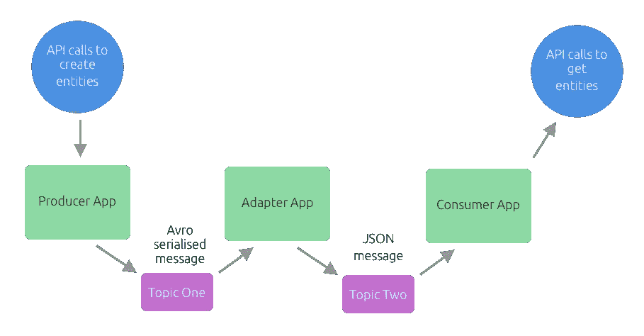

# 使用 Jest & Node.js 测试基于 Apache Kafka 的应用程序的经验教训

> 原文：<https://javascript.plainenglish.io/lessons-learned-testing-a-apache-kafka-based-application-with-jest-node-js-5dfa50389121?source=collection_archive---------0----------------------->

在最近的工作中，我已经从使用 Selenium 构建 UI 自动化套件(我非常习惯这样做)转移到为基于 Kafka & REST API 的应用程序构建自动化的端到端测试，这是整个系统的主干，编写为一组 Java 服务，充当两个服务之间的适配器。

这组 Java 服务完成以下工作:

*   从 Kafka 队列中取出 Avro 序列化消息，Kafka 队列由上游第三方系统填充，该系统根据发送到其 REST API 的数据生成这些消息
*   将消息转换成另一种格式
*   将转换后的消息作为未序列化的 JSON 发送到另一个 Kafka 队列，该队列将被另一个服务使用，该服务将数据填充到前端使用的 REST API 中



Diagram of the type of app I’ve been testing

为了对系统进行端到端测试，我需要做以下工作:

*   向上游系统发送一个 REST API 调用来触发一个动作(比如创建和更新一个完整的记录及其关联的实体)
*   检查上游系统正在向 Kafka 队列发布的被测系统将要使用的序列化消息
*   检查被测系统发布到下游系统将使用的 Kafka 队列的未序列化消息
*   检查下游系统的 REST API，确保它根据输入消息显示正确的状态

我还有一个技术上的限制。虽然测试中的系统是用 Java 构建的，但我的同事们使用现有的库来处理用 JavaScript 编写的上游和下游 REST APIs。

哦，还有一个心理约束，我从未使用或测试过分布式队列系统，也从未使用过 Avro 序列化。

# 演示项目

为了更好地说明我一直在测试的系统类型，我在 Github 上构建了一个示例应用程序和测试套件:[https://gitlab.com/colinfwren/testing-kafka-app-with-jest](https://gitlab.com/colinfwren/testing-kafka-app-with-jest)

该系统由三个应用程序组成:

*   一个生产者应用程序，接受一个 API 调用并将 Avro 序列化消息发布到一个队列
*   一个适配器应用程序，将 Avro 序列化消息从队列中取出，并将非序列化 JSON 消息发布到另一个主题
*   一个消费者应用程序，接受 JSON 消息并在 REST API 中输出结果

演示项目包含一个端到端测试系统的测试套件和一个在 Docker Compose 中运行整个堆栈的 Makefile。

# 连接到卡夫卡

因为我使用 JavaScript 库，所以我决定使用 Jest 来运行测试。主要的困难是找到一个库来处理从 Kafka 获取的消息，并对上游系统发布的 Avro 消息进行反序列化。

经过一番搜索和试验，我发现`kafka-node`是 Node 可用的普通 Kafka 库中较好的一个。它相对容易设置，并允许动态调整 topic &分区的偏移量。

在测试 Kafka 队列时，偏移量非常重要(尤其是当涉及 Avro 模式时),如果您不设置偏移量，您的消费者将从主题消息的开头开始阅读，这可能意味着您必须处理一周的消息，才能看到您真正想要看到的消息。

我还发现`kafka-avro`有一个非常简单的设置过程，你只需将它指向模式注册表，一旦它接收到消息，JSON 对象就可以通过`data.parsed`获得。我在这个上与偏移做了一点斗争，因为它只支持`auto.offset.reset=latest`，而且(据我所知)没有办法动态调整偏移。

具有 Avro 序列化消息的队列的偏移量非常重要，因为如果用于序列化消息的模式在队列的保持期内发生变化，您可能会遇到试图用不兼容的模式去序列化消息的问题。

## 地方发展陷阱

当我从本地开发转移到在部署基础设施中运行测试时，有两件事让我感到困惑:

*   Kafka 对消息进行分区，每个分区都有不同的偏移量，所以如果你假设消息在开发过程中只出现在一个分区上(像我一样)，那么你的偏移量就不起作用了
*   Kafka 有一个安全协议，如果你不把它包含在你的用户配置中，就意味着你不能得到任何补偿，因为用户不会连接

## Avro 模式

虽然`kafka-avro`会从模式注册表中为您获取模式，但值得注意的是，它不能防止模式改变或模式无效。

我遇到的一个问题是 Avro schema deserialiser 的 Java 实现只会读取它需要读取的模式，因此当模式中有错误时不会崩溃，但节点库`avsc`会。

模式中的一个记录将记录的默认值设置为`"{}"`而不是`{}`，这导致`avsc.parse()`函数抛出错误。

## 组 id 和偏移

每个分区的偏移量通过消费者在连接时声明的组 ID 链接到消费者。如果您正在使用`auto.offset.reset`，并且似乎没有只收到最新的消息，这可能是因为您重复使用了一个没有提交的消费者的组 ID，这将抵消回 Kafka。

我发现在我的消费者的组 ID 后面附加一个 UUID 是一个好主意，可以确保每个消费者总是收到最新的消息。

这也适用于被测系统。如果有配置组 ID 和偏移量的方法(比如通过环境变量)，这将加快消息通过系统所有部分的时间。

# 对分布式队列进行断言

我正在测试的系统最难的部分可能是不能保证消息会在一定时间内到达，而且根据系统的构建方式，也不能保证消息的顺序。

为了解决这个问题，我重新使用了 UI 测试中常用的一种方法，即在对事物执行动作之前等待。

我通过轮询 Kafka 消费者接收到的一组消息来实现这一点，直到我需要的消息被添加到该组中，如果在合理的时间范围内没有接收到任何消息，我会超时以确保测试失败。

A recursive function to poll an array of messages for a value

我也对下游系统的 REST API 使用相同的模式。这样，在断言数据之前，我可以将消息发布到 Kafka 和 REST API 输出。

对于这种类型的工作来说是必须的，因为它使得代码很容易理解。如果我必须用承诺链(或者上帝禁止回调)来做这件事，我会害怕去想嵌套的数量。

# 在本地开发测试

幸运的是，我的团队已经将我们的服务容器化了，这使得设置本地版本的堆栈变得非常简单，因为我可以使用 Docker Compose 来构建一个包含以下内容的堆栈:

*   我会向 Kafka 队列发布 Avro 序列化消息，供测试中的系统使用，如果我想检查任何东西而不必进行完整的端到端检查
*   通过我的 compose 中的环境变量配置的测试系统指向我的本地 Kafka 实例或其他地方的另一个实例
*   测试中的系统会将转换后的 JSON 消息发布到 Kafka 队列
*   下游系统的一个实例，它将连接到被测系统发布到的本地 Kafka 队列

我遇到的一个问题是 Kafka 广告的 listeners IP 需要是本地网络上主机的 IP，这样 Kafka 才能正常工作。

我设法通过创建一个 Makefile 来解决这个问题，我用这个 Makefile 来打开堆栈，这个堆栈执行一个小 bash 命令来获取主机的 IP，并将其作为环境变量传递给 Docker Compose 文件。

Using a sub-shell in Make to get the host’s IP and passing that to Docker Compose

# 使用卡夫卡的有用工具

Confluent 免费提供了一些与 Kafka 一起工作的有用工具。这些可以通过自制软件使用下面的命令`brew install confluent-oss`安装在 Mac 上。

## 用于查看发布到队列的内容的工具

如果您需要查看某些消息是否进入了队列，那么您可以使用`kafka-console-consumer`和`kafka-avro-console-consumer`来查看。

这些工具将作为消费者连接到队列，并在消息发布时显示消息(除非您指定从头开始播放)。如果您想将它们保存在本地，那么您可以通过管道将其保存到一个文件中。

要使用队列中的非序列化消息，可以使用以下命令:

```
kafka-console-consumer --topic [TOPIC TO CONSUME] --bootstrap-server [KAFKA HOST]
```

要使用队列中的序列化消息，可以使用以下命令:

```
kafka-avro-console-consumer --value-deserializer io.confluent.kafka.serializers.KafkaAvroDeserializer --key-deserializer org.apache.kafka.common.serialization.StringDeserializer --formatter io.confluent.kafka.formatter.AvroMessageFormatter --property print.key=true --property schema.registry.url=http://[SCHEMA REGISTRY HOST] --topic [TOPIC TO CONSUME] --bootstrap-server [KAFKA HOST]
```

## 将消息发布到队列的工具

如果您需要将某些消息添加到队列中，以便消费系统根据有效负载做一些事情，您可以使用`kafka-console-producer`和`kafka-avro-console-producer`来完成。

这些工具将作为生产者连接到队列，并提示您键入或粘贴消息。需要注意的一点是，您不能像在“终端”中那样回忆以前的信息，因此您需要编辑并粘贴来自其他地方的信息。

要生成非序列化消息，您可以使用以下命令:

```
kafka-console-producer --topic=[TOPIC TO PUBLISH TO] --broker-list[KAFKA HOST]
```

要生成序列化消息，您可以使用以下命令:

```
kafka-avro-console-producer --broker-list [KAFKA HOST] --topic [TOPIC TO PUBLISH TO] --property schema.registry.url=[SCHEMA REGISTRY HOST] --property value.schema=[SCHEMA FOR MESSAGES AS JSON]
```

## 将消息从一个队列回放到另一个队列的工具

有时，您需要将一个队列中的消息播放到另一个队列中，以模拟系统的使用情况，或者简单地创建一个单独的主题来进行测试。

`kakfa-mirror-maker`是你需要的工具，但它需要一些设置来工作。这包括为消费者和生产者创建配置文件，消费者可以在其中声明其组 ID 和偏移量，这样您就可以控制要获取多少消息。

Example usage of kafka-mirror-maker

# 摘要

虽然由于我缺乏使用分布式队列的经验，学习曲线最初很陡，但是我学到了很多，并且使用这项技术使我成为了一名更强的技术测试人员。

能够看到系统中许多不同的服务之间正在发送什么消息，这是一种真正有用的集成和端到端测试系统整体和隔离的方法。

Confluent 在提供与 Kafka 和 Avro 协同工作的工具方面做得很好，当从第三方上游系统消费时，它允许快速加入和分析。

使用异步系统真的让我更多地思考我过去编写的测试类型，在这些测试中，我假设事情“只是发生”,以及我应该如何编写更具防御性的测试代码，特别是当涉及到 API 调用时。

我已经创建了一个演示项目([https://gitlab.com/colinfwren/testing-kafka-app-with-jest](https://gitlab.com/colinfwren/testing-kafka-app-with-jest))来检验如何以我正在使用的系统的方式使用 kafka 进行端到端测试。