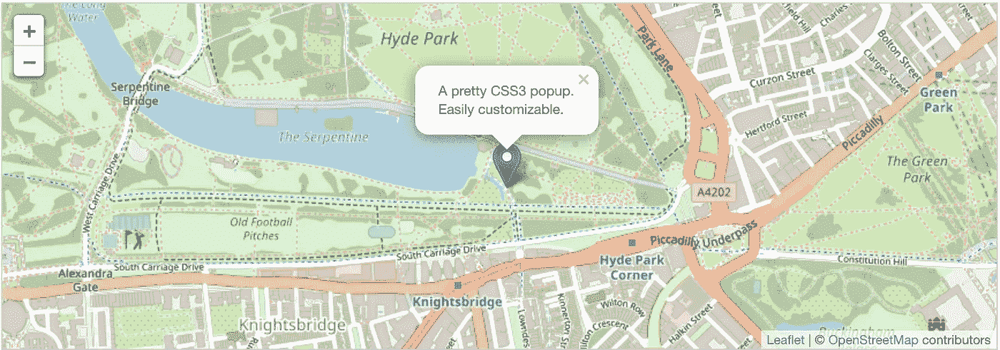

# 使用传单向网站添加交互式地图。射流研究…

> 原文：<https://javascript.plainenglish.io/lets-add-interactive-maps-to-websites-using-leaflet-js-93f548b32263?source=collection_archive---------9----------------------->

我正在做一个需要大量地图的新项目。说到地图，它必须简单而全面。在网站上添加地图并不难，但是让它们具有交互性、轻量级和移动友好性就有点难了。这时候[小叶。Js](https://leafletjs.com/) 前来救援。那么这个传单是什么东西，为什么这么特别？让我解释一下。

传单是领先的移动友好的交互式地图的开源 JavaScript 库。仅重约 38 KB 的 JS，它拥有大多数开发人员需要的所有映射特性。

此外，传单的设计考虑了简单性、性能*、*和可用性。它可以在所有主要的桌面和移动平台上高效工作，可以通过大量的[插件](https://leafletjs.com/plugins.html)进行扩展，拥有一个漂亮、易于使用和[有据可查的 API](https://leafletjs.com/reference.html) 。

说到传单插件，就是这么好用，非常可靠。我已经使用了一些插件。比例因子，全屏，easybutton，zoom 是其中的几个。这让我的工作更容易。这是一个带有标记和弹出窗口的示例地图。

example map

使用传单创建地图很容易，下面是上面地图的代码。

现在您所要做的就是创建一个 id 为 map 的 div 元素。

`

`就这样。

就这么简单！我希望你对这个地图插件有所了解，并确保在使用它之前浏览一下[文档](https://leafletjs.com/reference-1.6.0.html)。下一集见。和平！✌️