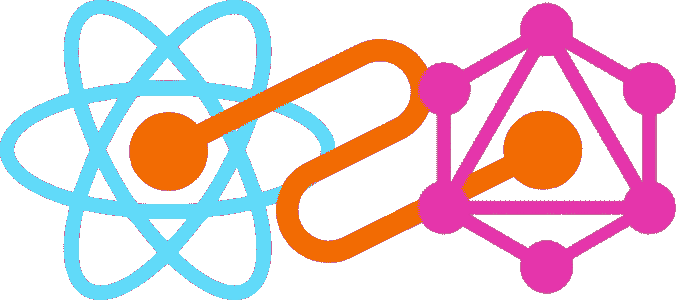
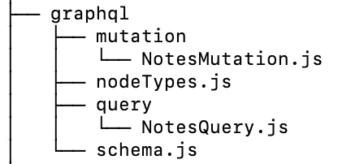
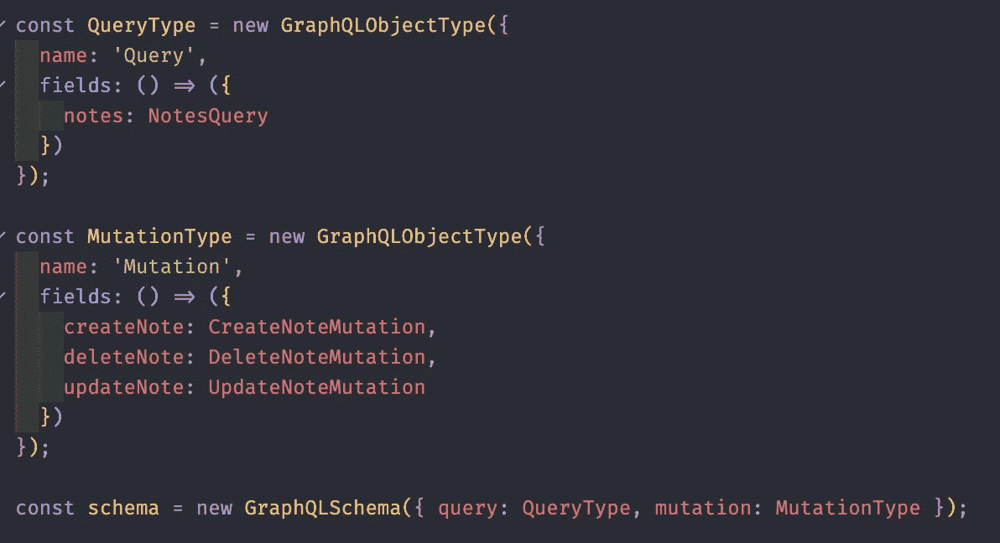
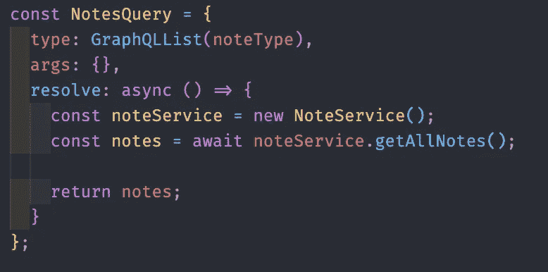
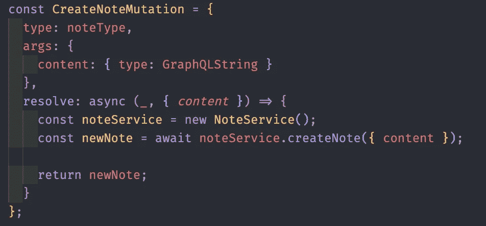
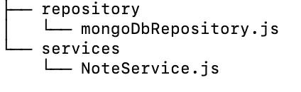
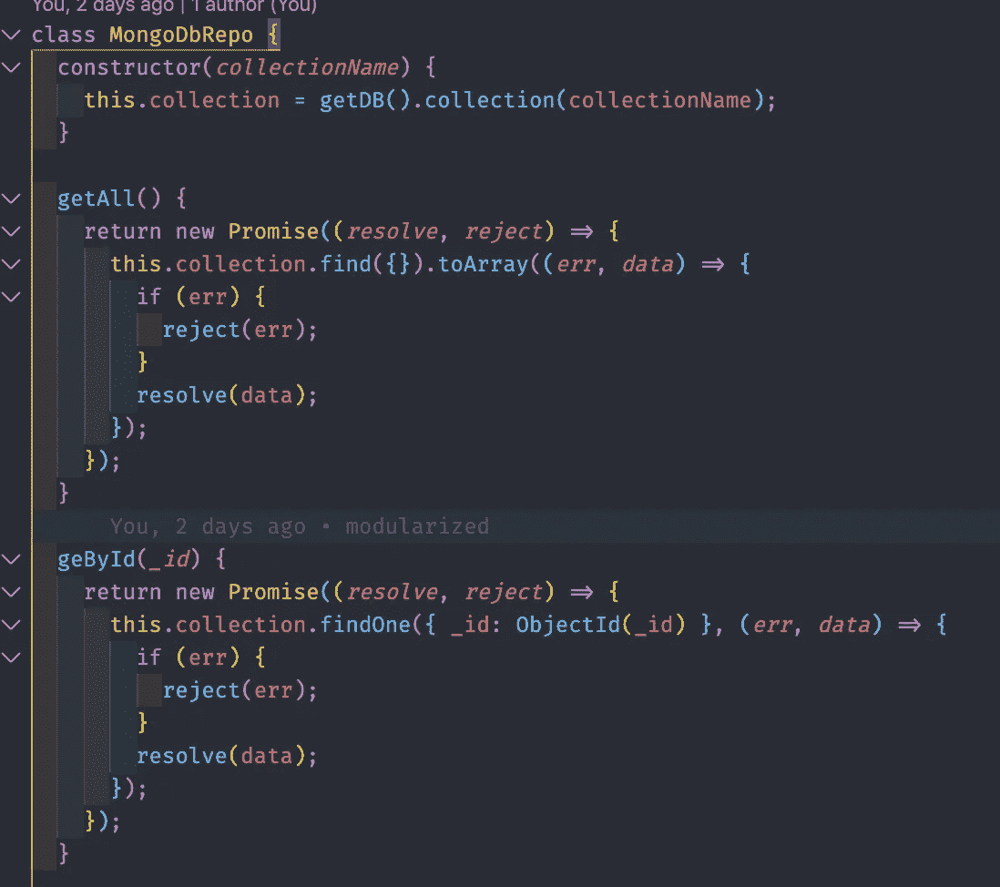
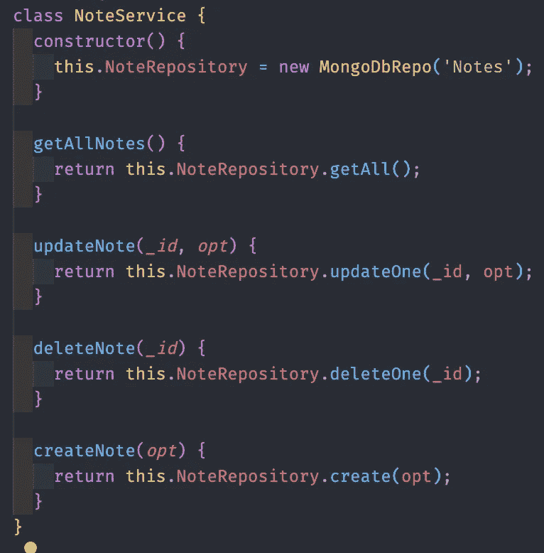

# 让我们构建一个 MongoDB+Express+React+graph QL+Relay Modern 全栈 Web App(从零开始！)—后端部分

> 原文：<https://javascript.plainenglish.io/lets-build-a-mongodb-express-react-graphql-relay-modern-full-stack-web-app-from-scratch-a4ae3aaf212?source=collection_archive---------1----------------------->



React x Relay x GraphQL

> 嗨！你可以在下面的链接中找到本文的第二部分。
> 
> [本文第二部分。使用 React 和 Relay 配置前端。](https://medium.com/@jelorivera08/lets-build-a-mongodb-express-react-graphql-relay-modern-full-stack-web-app-from-scratch-d41b5091d41d)

自从我上一篇关于 web 应用堆栈的文章以来，我收集了一些有趣的东西，我想与你们分享。我们将创建一个包含上述所有技术的基本 notes web 应用程序。CRUD，cloud mongoDB，React 前端，中继现代状态管理(奖金更新教程)，graphQL 查询和突变。

作为一名软件工程师，我一直在努力寻找将这些技术的基本应用融入到一个真实应用中的文章。这就是我发表这篇文章的原因。我们将从头开始构建这个应用程序，所以准备好你的编码手指。(给你一个建议，我会在文章的最后发布这个 web 应用程序的最终 git repo，这样你就可以一步一步地跟着我了。这将有助于你牢牢掌握这些技术提出的理论/想法。

在本文中，我们将使用大型科技公司目前正在使用的最新、最顶尖的技术。本文要求您至少具备 React、Javascript、Relay 和 graphQL 的基础知识。如果你有这些基本技能，让我们开始构建并开始编码吧！[👨‍💻](https://emojipedia.org/man-technologist/) [👩‍💻](https://emojipedia.org/woman-technologist/)

> 我使用 Heroku 部署了 web 应用程序的最终版本。加载 web app 时请耐心等待。当网站闲置一段时间后，Heroku 会启动服务器。和平！:-)

# 加快我们的后端

先说我们的 GraphQL + Express + MongoDB 服务器栈。打开终端，让我们为我们的项目创建一个目录。让我们将其命名为 full-stack-app，并创建我们的服务器目录。让我们初始化我们的服务器目录并安装下面的库。

```
mkdir full-stack-app
cd full-stack-app
mkdir server
cd server
mkdir src
touch src/index.js
npm init -y 
npm install express express-graphql cors graphql mongodb
```

请注意，我们已经创建了 src 根目录和 index.js。在那里，我们将初始化我们的服务器，因此继续在 src/index.js 中键入下面的代码

backend — src/index.js

当您运行`node *./src/index.js*` 时，服务器应该启动并运行。

现在，让我们配置我们的 MongoDB 数据库。我们将使用 MongoDB 在云中存储我们的数据。登陆他们的[网站](https://www.mongodb.com/cloud/atlas)，创建你自己的账户。别担心，这是免费的。注册并登录后。遵循这些步骤。我们将创建自己的空闲集群，并将其链接到我们刚刚创建的节点服务器。

1.  从选项中选择*创建自由集群*。
2.  通过选择您喜欢的数据库区域等来设置您的空闲集群。
3.  MongoDB Atlas 将指导您遵循他们的教程，之后我们将把我们的集群连接到我们的节点服务器。

```
Atlas tutorial will tell you to: 3.a. Build your own cluster  - done :-)
    3.b. Create your own database user
    3.c. Whitelist your own IP address
    3.d. Load Sample Data (optional)
    3.e. Connect to your cluster
```

在集群的连接选项中，选择“连接您的应用程序”选项，并复制显示的连接字符串。我们将在下一步中需要它。

现在，让我们回到节点服务器代码，在 src 目录中创建一个名为 config 的目录。在我们的配置目录中，创建一个名为 databaseConnection.js 的文件，并在其中编写下面的代码。将我们之前复制的字符串粘贴到 uri 变量中，并将 db 用户凭证更改为您的凭证。

现在我们必须在 index.js 内部调用它。

```
src/index.js
...const graphqlHTTP = require('express-graphql');
const { setupDB } = require('./config/databaseConnection')setupDB(*v* => console.log(v));const schema = {
*// we will add this later* };...
```

再次运行`node .src/index.js` ，我们应该看到我们的数据库成功连接。

现在，关于 GraphQL 部分的事情。在我们的 src 目录中创建一个 graphql 目录，并按照下面的文件夹结构对其进行造型。



将下面的要点编码到它们各自的文件中，我将在下面讨论重要的部分。

*   [NotesMutation.js](https://gist.github.com/jelorivera08/0becf53746a93aedb612a1c3309d9539)
*   [nodeTypes.js](https://gist.github.com/jelorivera08/cdef9b47a2cc9c06cf43be305135f62b)
*   [NotesQuery.js](https://gist.github.com/jelorivera08/6a9931e02fefce907a577785f70a7d42)
*   [schema.js](https://gist.github.com/jelorivera08/f2688be46c68e4e6e8162427fe79879e)

从 *schema.js 开始，然后是 nodeTypes.js，然后是 NotesQuery.js，最后是 notesumtation . js*



schema.js

这里我们定义了我们的 graphql 根模式、查询和变异。这些就像解析数据库查询和其他服务器相关任务的 api 路由。


nodeTypes.js

这里我们创建了自己的 graphql 对象数据类型。我们有一个注释类型，它有自己的 _id 和内容字段。



NotesQuery.js

这是我们的账单。一旦我们开始创建它们，这将返回存储在我们数据库中的所有“注释”。



NotesMutation.js

这是我们 notes 变异的一个例子。一旦我们调用这个突变查询，这将使我们能够创建一个注释。

现在这些都是一口气要做的很多，所以慢慢来，阅读并理解背后的代码和想法。您可能想知道 NoteService 的东西是从哪里来的。它只是我创建的一个服务类，用来抽象我们的 mongodb 存储库查询。我们一会儿就会谈到这一点。

我们现在处于服务器设置的最后阶段。我们只需将我们的 mongodb 存储库与我们的 graphql 查询链接起来。为此，创建一个如下所示的文件夹结构。



services and repository

就像我们不久前所做的那样，将下面的要点编码到它们各自的 js 文件中，我会边走边解释它们。

*   [mongoDbRepository.js](https://gist.github.com/jelorivera08/0676b10a9de26ce137c5ee2e93746ec8)
*   [notes service . js](https://gist.github.com/jelorivera08/90b88184430f4a9ee781b56906b39426)



MongoDbRepo class

在这个 MongoDbRepo 类中，我们只是连接到我们的 MongoDB 数据库，我们公开了一些 API，让我们可以对我们的数据库条目进行 CRUD 操作。



这里，我们使用 MongoDbRepo 类来实例化一个链接到“notes”数据库的存储库，我们在其中保存所有的“Notes”条目。请注意，这只是为了更好地扩展我们的代码，以及更好地抽象我们的数据。

唷！快好了！

现在让我们修改 src/index.js 代码，以便将 graphql 模式链接到我们的 express 服务器。将 src/index.js 代码更改如下。

```
const express = require('express');
const graphqlHTTP = require('express-graphql');
const schema = require('./graphql/schema');
const { setupDB } = require('./config/databaseConnection');
const cors = require('cors');const app = express();
setupDB(*v* => console.log(v));app.use(cors());
app.use(
    '/graphql',
    graphqlHTTP({
        schema,
        graphiql: true,
        pretty: true
    })
);app.listen(4000);
console.log('SERVER OK');
```

搞定了。现在，让我们在浏览器中尝试我们的 graphql 服务器，看看这个宝贝是如何骑行的！将下面的 url 粘贴到浏览器中，查看我们新构建的 graphql 服务器。

```
[http://localhost:4000/graphql](http://localhost:4000/graphql)
```

尝试用这个突变查询创建一个注释。

```
mutation {
 createNote(content:"test") {
    content
    _id
  }
}
```

然后，为了查看我们的查询是否有效，让我们使用下面的查询来查询服务器中所有可用的 notes。

```
query {
  notes {
    _id
    content
  }
}
```

耶！现在我们已经设置好了我们的后端，我们现在应该继续使用 React+Relay modem 创建我们的前端。我将在本文的第二部分解决这个问题。我想把它放在这篇文章里，但我认为它会使这篇文章过于饱和，所以我认为最好把它放在单独的一篇文章里。

如果你能走到这一步，恭喜你！给自己一个鼓励，花点时间吸收这些新图书馆试图传达的思想。这些技术赋予开发人员的思维定势才是真正让我们能够为最终用户和开发人员构建使人类生活更轻松的东西。

> [如约而至。](https://github.com/jelorivera08/MERG-BE)