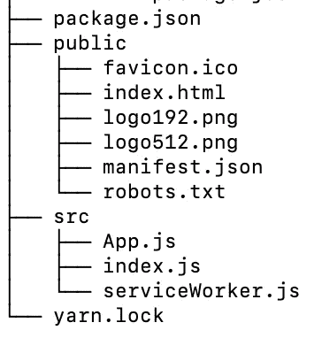
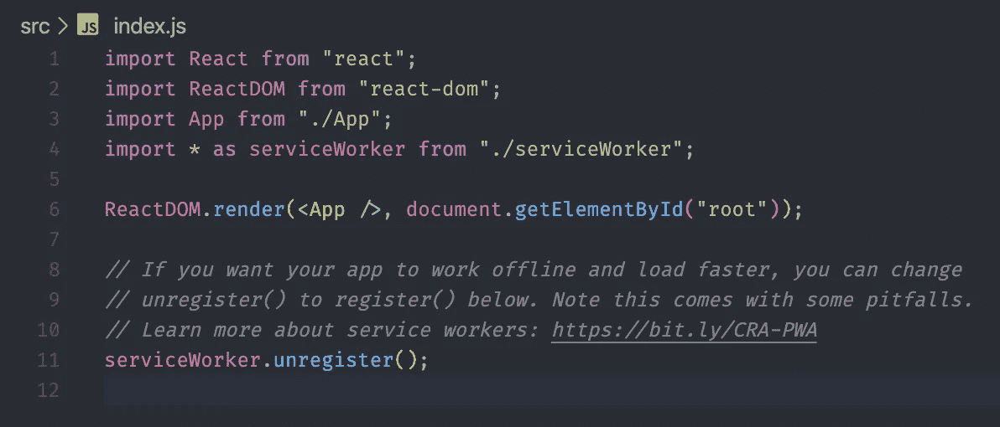
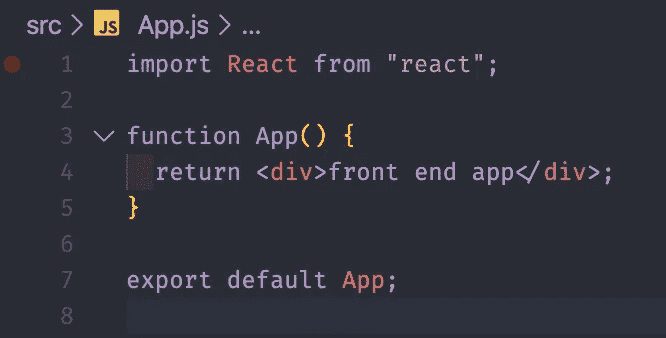
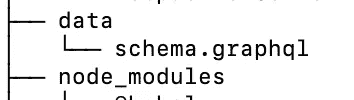
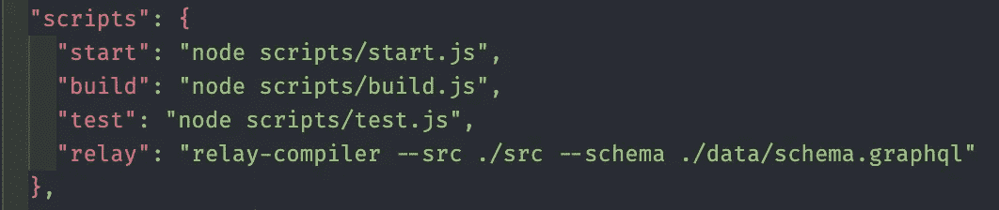
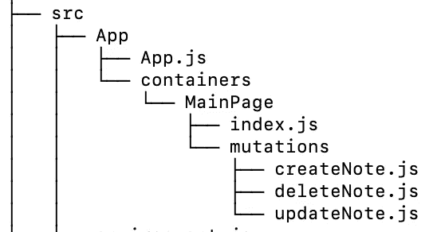
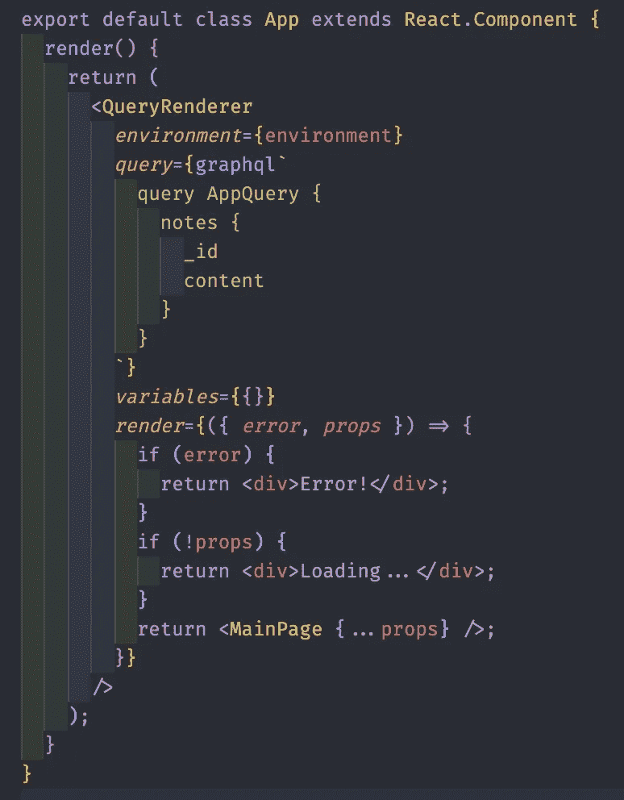
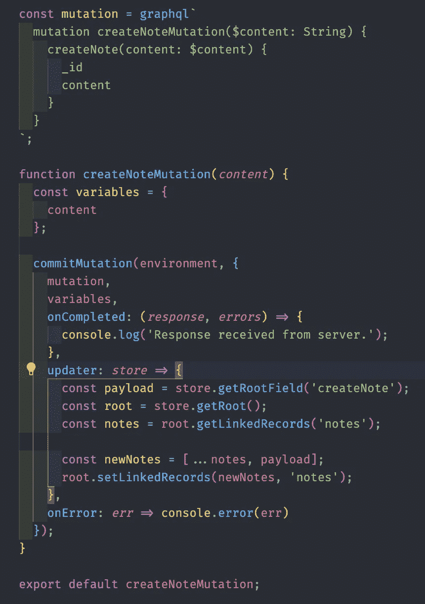

# 让我们构建一个 MongoDB+Express+React+graph QL+Relay Modern 全栈 Web App(从零开始！)—前端部分

> 原文：<https://javascript.plainenglish.io/lets-build-a-mongodb-express-react-graphql-relay-modern-full-stack-web-app-from-scratch-d41b5091d41d?source=collection_archive---------1----------------------->


React x Relay x GraphQL

> 欢迎回到这篇完整的 web stack 文章的第二部分。你可以在下面的链接中找到第一个。
> 
> [本文第一部分。使用 Graphql + Express](https://medium.com/javascript-in-plain-english/lets-build-a-mongodb-express-react-graphql-relay-modern-full-stack-web-app-from-scratch-a4ae3aaf212) 设置后端。

> 我使用 Heroku 部署了 web 应用程序[的最终版本。加载 web app 时请耐心等待。当网站闲置一段时间后，Heroku 会启动服务器。和平！:-)](http://medium-front-end-client.herokuapp.com/)

## 我们开始吧

现在我们的后端已经可以使用了，让我们开始使用 React 和 Relay Modern 配置我们的前端应用程序。

第一步是使用 [create-react-app](https://reactjs.org/docs/create-a-new-react-app.html) 创建我们的应用程序。找到您希望我们的前端存在的目录，并在命令行中键入以下内容。

```
npx create-react-app notes-frontend
cd notes-frontend
git init
```

现在，我要你在开始之前删除一些文件和代码行。这只是为了去掉一些我们在本文中不需要的东西。为了做到这一点，像这样构造前端目录。



front end folder structure

然后，从 App.js 和 index.js 中删除一些导入，使它们看起来像这样。



src/index.js



src/App.js

现在，通过运行 yarn start we 并在浏览器中键入 localhost:3000，我们可以看到我们的前端已经准备好进行一些编码了！下一步是退出我们的应用程序，这样我们就可以配置 babel 和 webpack，这样它就可以将我们的 graphQL 和中继代码转换成 JavaScript。要做到这一点，请运行以下命令。我们只需提交我们最近的更改，以便退出应用程序。

```
git add . 
git commit -m "initial commit"
yarn run eject 
y
```

弹出应用程序后，让我们安装所需的依赖项，以便将 relay 和 graphQL 集成到 react 应用程序中。

```
yarn add babel-plugin-relay graphql relay-config relay-compiler
```

然后，在我们 app 的根目录下。创建一个名为`relay.config.js`的文件，将以下代码放入该文件中。

```
// relay.config.js module.exports = {   
    src: "./src",   
    schema: "./data/schema.graphql",   
    exclude: ["**/node_modules/**", "**/__mocks__/**",
        "**/__generated__/**"], 
    }
```

然后去我们 app 的`package.json`。找到 package.json 中的 babel 键，然后将其改为下面的代码。


package.json babel

既然这部分已经完成了，我将解释一些事情，关于我们为什么这样配置我们的代码。这只是将我们的 relay 和 graphQL 转换成浏览器能够理解的代码。Babel 和 webpack 就是这样做的，这样我们的开发人员就不需要花太多时间配置太多样板文件，我们就可以专注于我们应用程序的编码功能。

您可能已经注意到，为了继续，我们需要一个`schema.graphql`文件。这个文件是我们前端数据的表示，这就是为什么 relay 比大多数数据管理库都要快，因为它已经知道了它所期望的数据。这是我们在前一篇文章中创建的服务器上的模式副本。将它复制并粘贴到一个名为`schema.graphql`的文件中，并放在我们应用程序根目录下一个名为`data`的文件夹中。



schema.graphql in data

如果您想知道我是如何从我们的服务器获得模式的，请到 github 中我们的[后端的 repo，查看一下 config 目录中的 printSchema.js 文件。](https://github.com/jelorivera08/MERG-BE)

schema.graphql

然后，每当我们修改 graphql 查询时，我们需要手动重新编译我们的前端。像这样修改 package.json 中的脚本。



scrips in package.json

# 为服务器查询设置我们的 graphQL

是时候设置一些代码了，这样我们就可以发送和接收来自服务器的查询。继电器需要一个“环境”设置，以做到这一点和更多。在我们的应用程序的 src 目录中创建一个名为`environment.js`的文件，然后将下面的代码粘贴到该文件中。

src/environment.js

然后让我们把我们的`App.js`移动到一个名为 App 的目录中，其文件夹结构如下。创建在下面的文件夹结构中陈述的文件，然后使用我将为下面的文件链接的要点分别键入代码。



folder structure for App

*   [src/App/App.js](https://gist.github.com/jelorivera08/f2c480c20fdabf7fadacda982c8f7ca8)
*   [src/containers/main page/index . js](https://gist.github.com/jelorivera08/393c98f71cd534f965e6a34f4451075e)
*   [src/containers/main page/mutations/create note . js](https://gist.github.com/jelorivera08/51514d05d39fbaf289c58cf692cf9fb1)
*   [src/containers/main page/mutations/update note . js](https://gist.github.com/jelorivera08/cba7496ad28a7cbc7a715f772dfc7353)
*   [src/containers/main page/mutations/delete note . js](https://gist.github.com/jelorivera08/b41b496b367c7e4f127d3bfc947cadd6)

这样做之后，将根目录下的 index.js 中的导入代码更改为以下代码。

```
...
import App from "./App/App";
...
```

搞定了。当您使用运行我们的应用程序时

```
yarn run relay
yarn run start
```

您应该已经看到了在 localhost:3000 上运行的应用程序。

现在，我将简要解释一下您刚才在突变和查询中键入的一些代码。



Query using Relay

您可以在 QueryRenderer 组件的查询属性中找到 graphQL 查询。在这里，我们在数据库中查询我们的笔记。一旦数据准备好了，我们就把数据传递给主页组件，让它处理渲染。主页应用程序只有基本的 react 组件，所以我不会深入讨论。



Relay Mutations

这是我希望我们关注的。使用中继的变异使用提交变异。通过使用我们的服务器`createNote`创建的 graphQL 变异，我们将它与所有变量一起传递到 commitMutation API，然后我们传递一个 updater 函数，在其中更新我们应用程序的本地状态。这里，我们将新创建的注释添加到中继存储的本地状态中，这样当我们成功创建一个注释时就可以显示它。

updateNoteMutation 和 deleteNoteMutation 的功能相同。我会把这些留给你。只要你继续阅读 graphQL 和 Relay 的文档，这将是小菜一碟。

# 搞定了。

我希望这篇文章能帮助你理解这些新技术试图传达的不同思想。我将把前端的 git repo 链接留给你，这样如果你在阅读本文时遇到问题，你可以试着运行它，[这里](https://github.com/jelorivera08/MERG-FE)。

> 谢谢你。