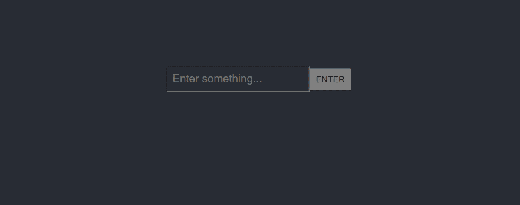
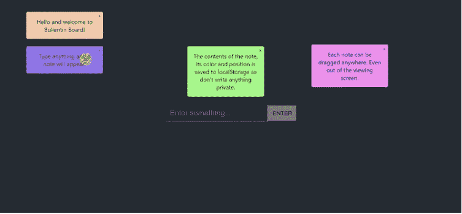

# 让我们构建一个简单的公告板 React 应用程序

> 原文：<https://javascript.plainenglish.io/lets-build-a-simple-bulletin-board-react-app-fc02d9b83070?source=collection_archive---------9----------------------->

在我写的一篇关于在 React 中制作可拖动组件的文章中，一位读者请求分享我是如何构建[公告牌应用](https://victoria-lo.github.io/bulletin-board/)的，这是一个简单的演示应用，用来展示 React 中的可拖动组件。

在本文中，我将一步步展示我是如何制作这个简单的应用程序的，它非常适合 React 初学者学习如何在他们的项目中实现可拖动的组件。我们开始吧！


# 该应用程序

该应用程序可以执行以下操作:

1.  允许用户在输入中键入一些内容，然后按 ENTER 键生成一个随机颜色的注释。
2.  允许用户将便笺拖动到任何地方。即使在用户退出应用程序后，它的位置、颜色和内容也会被保存。
3.  允许用户通过点击右上角的“X”按钮来删除注释。

因此，让我们根据它的 3 个用例来构建应用程序。

# 步骤 1:安装和导入软件包

通过运行以下命令初始化新的 Create React 应用程序:

```
npx create-react-app my-bulletin-board-app
```

然后，在项目的根文件夹中，安装我们需要的以下包:

1.  `react-draggable`:实现票据的可拖动特性
2.  `randomcolor`:允许生成随机颜色的纸币
3.  `uuid`:为每张票据生成唯一标识符

使用命令安装:

```
npm install react-draggable randomcolor uuid
```

在`App.js`中，导入包并反应`useEffect`和`useState`钩子。

# 步骤 2:初始化状态

我们需要使用`useState`钩子创建并初始化两个状态。

1.  `item`:这是输入字段的值。初始化为空字符串。
2.  `items`:这是一个数组，包含所有生成的笔记，保存到 localStorage。如果 localStorage 没有保存`items`，则初始化为空数组。

```
const [item, setItem] = useState("");
const [items, setItems] = useState(
    JSON.parse(localStorage.getItem("items")) || []
  );
```

# 步骤 3:创建输入元素

我们可以在`App.js`的返回函数中创建 HTML 输入和按钮元素，如下所示:

```
<input
    value={item}
    onChange={(e) => setItem(e.target.value)}
    placeholder="Enter something..."
    onKeyPress={(e) => keyPress(e)}
/>
<button onClick={newitem}>ENTER</button>
```

它看起来像这样:



`<input>`具有以下属性:

*   `value`:设定为`item`状态的值
*   `onChange`:每次输入值发生变化时，更新`item`状态
*   `placeholder`:输入栏无内容时的描述
*   `onKeyPress`:调用`keyPress`函数检查按下的键是否为 ENTER，调用`newitem`函数。

按键函数是这样写的:

```
const keyPress = (event) => {
    var code = event.keyCode || event.which;
    if (code === 13) {
      newitem();
    }
  };
```

这样，用户可以在输入字段中键入一些内容，然后按 ENTER 键或单击 ENTER 按钮在屏幕上生成一个新的注释。

至于 ENTER 按钮，当用户点击它时，就会调用`newitem`函数。接下来我们来写这个函数。

# 第四步:新项目

该功能使用用户输入的字符串在屏幕上生成一个新的注释(即`item`)。注释是具有以下属性的对象:

*   `id`:使用 uuidv4()生成的唯一标识符
*   `item`:注释的字符串内容，是状态`item`的值
*   `color`:票据的背景颜色，用`randomColor({luminosity: "light",})`生成
*   `defaultPos`:音符的 x 和 y 坐标。初始化为`{x:100, y:0}`。

```
const newitem = () => {
    if (item.trim() !== "") {
     //if input is not blank, create a new item object
      const newitem = {
        id: uuidv4(),
        item: item,
        color: randomColor({luminosity: "light",}),
        defaultPos: { x: 100, y: 0 },
      };
      //add this new item object to the items array
      setItems((items) => [...items, newitem]);
      //reset item value to empty string
      setItem("");
    } else {
      alert("Enter a item");
      setItem("");
    }
};
```

现在，让我们在每次更新我们的`items`数组时更新我们的 localStorage。我们可以使用`useEffect`挂钩来实现这一点:

```
useEffect(() => {
    localStorage.setItem("items", JSON.stringify(items));
  }, [items]);
```

现在我们应该在屏幕上显示我们的`items`数组中的笔记对象。

# 第五步:展示物品

在我们的返回函数中，在我们的输入和按钮元素下面，我们可以使用`map`数组方法显示我们的注释:

```
{items.map((item, index) => {
        return (
          <Draggable
            key={item.id}
            defaultPosition={item.defaultPos}
            onStop={(e, data) => {
              updatePos(data, index);
            }}
          >
            <div style={{ backgroundColor: item.color }} className="box">
              {`${item.item}`}
              <button id="delete" onClick={(e) => deleteNote(item.id)}>
                X
              </button>
            </div>
          </Draggable>
        );
      })}
```

对于`items`数组中的每个 note 对象，我们将创建一个`<Draggable>`组件，其中:

*   对象的`key`属性= `id`。
*   `defaultPosition`的成分= `defaultPos`的对象。
*   `onStop`，当用户停止拖动屏幕上的音符时，将调用`updatePos`函数。

在`<Draggable>`组件中，我们有`<div>`，它将在带有注释的`colour`属性的背景上呈现注释的`item`属性。最后，我们有一个“X”按钮，单击它将调用`deleteNote`功能。

现在，我们应该能够在每次输入内容并按回车键时，在屏幕上生成一个新的随机颜色的注释。



然而，如果我们拖动注释并重新加载页面，注释的位置将不会被保存，因为我们还没有编写我们的`updatePos`函数。接下来让我们编写这个函数。

# 第六步:更新位置

每次我们停止拖动便笺时，都会调用这个函数。这样，我们可以将注释的最终位置保存到 localStorage 中的`items`数组中。

下次我们访问该页面时，应用程序会记住笔记的最后位置。它不会一直重置为`{x:` 100，y:0} `的。

该函数的工作原理如下:

1.  我们将`data`作为函数的第一个参数传递。它包含我们的笔记的 x 和 y 坐标。
2.  将我们的`items`数组克隆成一个名为`newArr`的新数组。
3.  从第二个参数`index`中获取我们想要更新的数组中音符的索引。
4.  在其`defaultPos`属性中设置注释的新坐标值。
5.  将`items`设置为`newArr`的值。

```
const updatePos = (data, index) => {
    let newArr = [...items];
    newArr[index].defaultPos = { x: data.x, y: data.y };
    setItems(newArr);
 };
```

太好了！现在，任何笔记的位置都会更新并保存到 localStorage。下面我们来看最后一个函数:`deleteNote`。

# 第七步:删除注释

在该功能中，注释将从屏幕上和本地存储器的`items`数组中删除。

这个函数非常简单。我们可以简单地使用`filter`数组方法来删除其`id`属性与函数的`id`参数相匹配的注释。

```
const deleteNote = (id) => {
    setItems(items.filter((item) => item.id !== id));
 };
```

# 就是这样！

我们现在应该有一个简单的工作公告板应用程序，如下所示:


感谢阅读。我希望这有助于在您的项目中实现 React Draggable。关于 React Draggable 的更多细节，请随意查看我的文章[在 React 中制作可拖动组件。](https://medium.com/javascript-in-plain-english/making-draggable-components-in-react-4c6d4d1df95f?sk=1a6316505828cb9ddf921aa806256674)

如果这篇文章有帮助，请喜欢并分享，并在下面的评论中留下任何问题。查看该应用的[演示](https://victoria-lo.github.io/bulletin-board/)或[回购](https://github.com/victoria-lo/bulletin-board/)。有关我们用来构建这个应用程序的包的更多信息，请随意阅读下面的部分。

特别感谢 [Manas Garg](https://hashnode.com/@Mg_Garg) 请求本文。抱歉，过了这么久才最终发表。谢谢，干杯！

# 请参见

*   [反应——可拖动](https://github.com/STRML/react-draggable/)
*   [randomcolor](https://www.npmjs.com/package/randomcolor)
*   [uuid](https://www.npmjs.com/package/uuid)