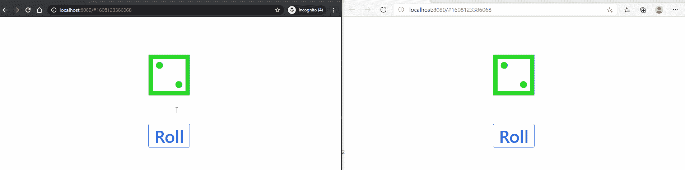

# 让我们创建一个苗条+流畅的框架应用程序

> 原文：<https://javascript.plainenglish.io/lets-create-a-svelte-fluid-framework-app-8d436dd2e6f9?source=collection_archive---------7----------------------->

## 向苗条和微软流体框架问好！


Photo by [Mika Baumeister](https://unsplash.com/@mbaumi?utm_source=medium&utm_medium=referral) on [Unsplash](https://unsplash.com?utm_source=medium&utm_medium=referral)

不久前，微软开源了其 [Fluid Framework](https://github.com/microsoft/FluidFramework) ，这是一个用于构建分布式实时协作 web 应用程序的类型脚本库，他们在微软 365 套件中使用该库。与此同时，Hello World 示例也出现了，但是没有使用任何前端框架。在这篇文章中，我将展示如何使用 Svelte 来重现 Hello World 示例。

# 流体世界

微软为他们的 Hello World 示例提供了一个解释得很好的教程[一个掷骰子的例子。任何连接的用户都可以看到当前掷骰子的结果，并且可以掷骰子。](https://agreeable-hill-0eeff5b10.azurestaticapps.net/docs/get-started/tutorial/)

本教程介绍了技术细节。总之，我们创建了一个数据模型，它指定了状态的值，以及当新数据进来时它是如何更新的；我们为数据定义容器工厂；调用服务器创建容器；并从检索到的容器中获取一个对象—状态。

# 苗条的

Svelte 是最近获得关注的 web 框架之一。它既快又容易使用。大约半年前，它获得了对 TypeScript 的第一手支持，但提供的将模板切换到 TypeScript 的脚本仅用于汇总。流体框架被设计为[与 Webpack](https://github.com/microsoft/FluidFramework/issues/366#issuecomment-567642393) 一起工作。幸运的是，人们已经设计出了包含苗条和打字稿的模板，就像[这个](https://github.com/ritesh404/svelte-typescript-scss-webpack-starter)。

一旦我们生成了项目，我们就添加了 Fluid Framework 的 Hello World 和 install 所需的包。我们还将`scripts`更新为以下内容:

```
"scripts": {
  "build": "cross-env NODE_ENV=production webpack",
  "start:client": "cross-env NODE_ENV=development webpack serve --disable-host-check",
  "start:server": "tinylicious",
  "start": "concurrently \"npm:start:server\" \"npm:start:client\"",
  "precommit": "lint-staged"
}
```

在`index.html`中我们添加

```
<link href="https://unpkg.com/tailwindcss@^2/dist/tailwind.min.css" rel="stylesheet" />
```

使用 [Tailwind CSS](https://tailwindcss.com/) ，一个轻量级的 CSS 库。

第一种方法是将所有初始化代码放入一个存储中，然后在`App.svelte`中导入存储并使用数据。这种方法的问题是初始化是异步的，我们不能在顶层等待存储创建。

解决方案是将初始化移到`index.ts`中，创建一个将接受`DiceRoller`数据对象的 store builder 函数，然后将 store 作为道具传递给组件。

我们的`src`目录最终会有 6 个文件:`index.html`、`index.ts`、`dataObject.ts`、`containerCode.ts`、`store-builder.ts`和`App.svelte`。`dataObject.ts`和`containerCode.ts`与原始 Hello World 文件完全相同。对于`index.html`，我们只添加了顺风 CSS 的链接。所以其他三个文件也是如此。

# 结论

我们会以此结束！



Dice Roller with Svelte working in Edge and Chrome

感谢您一路阅读到这里！我希望这能帮助你用流畅的框架和苗条的身材开始你的项目。让我知道你最终创造的惊人的项目！

# 参考

[](https://github.com/microsoft/FluidFramework) [## 微软/流体框架

### Fluid Framework 是一个用于构建分布式实时协作 web 应用程序的类型脚本库。你可以…

github.com](https://github.com/microsoft/FluidFramework)  [## 辅导的

### 在本演练中，我们将通过一起构建一个简单的 DiceRoller 应用程序来了解如何使用 Fluid 框架…

agreeable-hill-0eeff5b10.azurestaticapps.net](https://agreeable-hill-0eeff5b10.azurestaticapps.net/docs/get-started/tutorial/) [](https://svelte.dev/) [## 苗条的

### Svelte 是构建用户界面的一种全新方法。而像 React 和 Vue 这样的传统框架…

苗条的人](https://svelte.dev/) [](https://svelte.dev/blog/svelte-and-typescript) [## 细长的< 3 个打字稿

### 典型的增强型网络应用

苗条的人](https://svelte.dev/blog/svelte-and-typescript) [](https://github.com/microsoft/FluidFramework/issues/366#issuecomment-567642393) [## 准备 Webpack 5 问题#366 microsoft/FluidFramework

### Webpack 5 即将推出，我们应该确保流体已准备就绪！一个突出问题的突破性变化…

github.com](https://github.com/microsoft/FluidFramework/issues/366#issuecomment-567642393) [](https://github.com/ritesh404/svelte-typescript-scss-webpack-starter) [## ritesh 404/svelte-typescript-scss-web pack-starter

### 这是一个初学者工具包来建立苗条的应用程序包含:创建一个新的项目基于这个模板使用 degit: npx…

github.com](https://github.com/ritesh404/svelte-typescript-scss-webpack-starter) [](https://tailwindcss.com/) [## 无需离开你的 HTML 就能快速建立现代网站。

### 顺风 CSS 框架的文档。

tailwindcss.com](https://tailwindcss.com/)