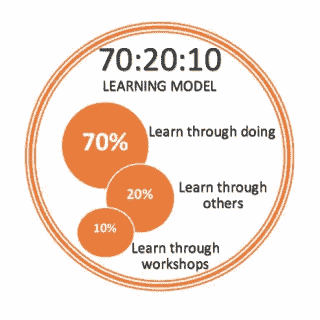

# 通过从头开始重建 JavaScript 数组方法来理解它们

> 原文：<https://javascript.plainenglish.io/lets-create-our-own-array-class-in-javascript-map-filter-reduce-etc-7c46a440e608?source=collection_archive---------9----------------------->



Learning JavaScript requires practice and introspection

在生活中，最好的学习方法之一就是通过实践。JavaScript 也不例外，因为许多概念可能看起来很神秘，直到你学习了底层机制。可枚举方法(map、filter 和 reduce)的抽象性质、对象构造和 JavaScript 对象的原型性质可能会让新手程序员感到困惑。让我们通过创建一个数组类来澄清一些困惑。

这三种方法一起使用，可以复制新数组的初始化。

```
new Array()
```

是一种不太常见的创建数组的方式，因为数组文字像

```
var newArray = []
```

抽象出需要考虑数组作为普通的老对象得到建设。然而，出于我们的目的，强调我们可以创建的对象*和 JavaScript 已经为我们创建的对象之间的巨大相似性是有用的。在这一点上，让我们用一些奇特的方法来点亮我们的数组类。*

在很大程度上，我会让你自己吸收这些信息。然而，我将指出 JavaScript 数组方法`Array.Map()`和`Array.Filter()`有两个参数。第一个是回调函数，第二个是`[thisArg](https://stackoverflow.com/questions/34556558/what-is-the-purpose-of-thisarg-in-foreach)`，一个在执行回调时用作‘this’的值。回调函数接受三个参数:元素、当前索引和数组。这些参数在上面的代码中有所表示。Reduce 有四个参数:初始值和前面提到的三个参数。点击了解更多关于实现 reduce [的信息](https://medium.com/javascript-in-plain-english/javascript-reduce-in-action-249fd6aec4c4)

每个伟大的程序员都知道她/他的语言的细节。如有疑问，请查阅 Mozilla 文档！如果我对关键字“arguments”的使用令人困惑，那将是一个很好的开始。

感谢阅读，祝你好运！