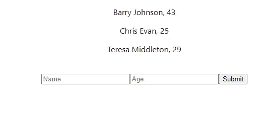
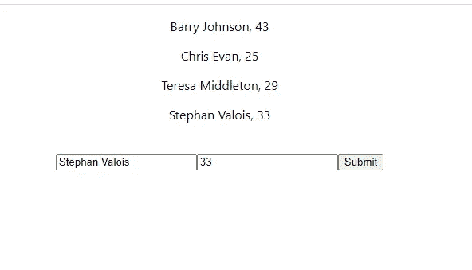
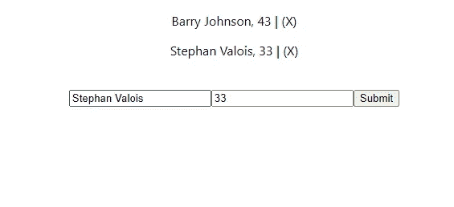

# 让我们用 React 钩子和 Redux 构建一个 React 应用程序

> 原文：<https://javascript.plainenglish.io/lets-create-react-app-with-react-hooks-and-redux-ea1d09057fa2?source=collection_archive---------2----------------------->


Image by [Martin Shreder](https://unsplash.com/@martinshreder)

网上散布着各种说法，声称 Redux 非常难设置，会给你留下一大堆难以管理的意大利面代码。我不敢苟同！使用 React 和 Redux 实际上非常容易，可维护，并且不会使事情变得复杂。它将事情保持在系统中。

在本文中，我们将创建一个非常简单的应用程序来列出姓名和年龄。你可以查看所有列表，添加列表和删除列表。我们不会使用任何数据库。相反，我们将模拟一个包含一组对象的数据库。

由于 Redux 的设置非常简单和快速，所以每当我设置一个新的 React 应用程序时，我都会设置它——我知道它不仅仅是一个小玩具。

我总是将顾虑分成 3 个步骤:

## UI /视图/反应组件

我尝试尽可能少地使用与获取和更新 React 组件中的数据有关的逻辑。相反，我调用/分派将完成繁重工作的函数。

## 还原剂

我设置了我的减速器，以便它们处理所有的状态。它们将数据传递给视图，并处理状态中存储的数据的任何变化。

## 服务

这些服务将处理与后端的通信，无论是向后端服务器、Firebase 传递数据还是从后端服务器、Firebase 接收数据，或者在本例中是一组模拟数据。

你可以在 https://github.com/Devalo/react-redux-blog 找到源代码

# 设置项目

对于这个项目，我们将使用 create-react-app、redux、redux-thunk 和 react-redux。Redux-thunk，因为它允许我们编写可爱的 redux-action 函数。React-redux，因为它包含了一些必备的 React 挂钩。(会让我们用 redux 的生活超级轻松！)

我们将从创建新应用开始:

```
$ npx create-react-app listings
```

创建完成后，我们将其放入 cd 并安装其他 npm 软件包:

```
$ cd listings
$ npm install redux redux-thunk react-redux
```

我们的配置已经完成了一半！我们将创建几个文件夹来存放我们的代码。就像我之前说的，我喜欢尽可能把东西分开。我们将在 src/文件夹中创建一个“service”和一个“redux”文件夹:

```
$ cd src
$ mkdir redux services
```

我们将在 redux 文件夹中创建两个文件。一个 reducer 文件和 redux 存储文件。Redux 商店是我们州生活的地方。

```
$ cd redux
$ touch store.js listingsReducer.js
```

我们还应该创建我们的服务文件:

```
$ cd ..
$ cd services
$ touch listingsService.js
```

这就是我们的档案。我们将把我们的减速器连接到商店。store.js 文件应该如下所示:

```
// redux/store.jsimport { createStore, combineReducers, applyMiddleware } from 'redux';
import thunk from 'redux-thunk';import listingsReducer from './listingsReducer';const reducer = combineReducers({
    listings: listingsReducer,
});const store = createStore(
  reducer, applyMiddleware(thunk)
)export default store;
```

这根本不算什么代码。我们将 listingsReducer 添加到 combineReducer 函数中。在我们真正开始给这个怪物编码之前，我们还有一件事要做。我们需要使存储对整个应用程序可用。这是因为我们希望能够在应用程序中的任何地方获取状态。在 index.js 文件中:

```
// index.jsimport React from 'react';
import ReactDOM from 'react-dom';
import './index.css';
import App from './App';import { Provider } from 'react-redux';
import store from './redux/store';ReactDOM.render(
  <Provider store={store}>
    <App />
  </Provider>, 
document.getElementById('root')
);
```

就是这样。在我们将应用程序包装到商店中之后，所有的 redux 状态都将是全局的，并且很容易为我们所用。是时候开始黑了！

# 查看所有列表/初始化

我撒了点谎。我们还没有真正完成设置或样板文件。但是我们已经准备好了令人兴奋的，很酷的样板文件！我们将从编辑 App.js 文件开始，我们的应用程序将驻留在该文件中。

App 组件将分派一个从服务中获取数据的动作。数据将被传递给 reducer，后者将处理状态，并将其返回给存储。我们的 React 组件将能够从存储中获取状态。

如果您还没有，这将是一个开始您的应用程序的好时机。我们将把 App.js 更改为:

```
// App.jsimport { useEffect } from 'react';
import { useDispatch, useSelector } from 'react-redux';
import './App.css';function App() {
  return (
    <div className="App">
      Hello There!
    </div>
  );
}export default App;
```

注意，我已经导入了三个钩子。使用 react 中的 Effect，使用 redux 的 React 包中的 Dispatch 和 useSelector。

useSelector 将允许我们访问 redux 存储。useDispatch 将让我们调度/启动 redux 操作函数。我们将在 useEffect 钩子内部进行初始化，它将在每次渲染时触发。接下来让我们添加:

```
// App.js... import { initListings } from './redux/listingsReducer';function App() {
  const dispatch = useDispatch();

  useEffect(() => {
    dispatch(initListings());
  }, [dispatch]);

  return (...
```

在 useEffect 内部，我们从 listingsReducer 调度一个导入的函数。我们还没有写这个，所以我们的应用程序会崩溃。接下来让我们来看看我们的减速器。

# 该减速器

前面，我们创建了一个名为 listingsReducer 的空文件。reducer 将由一个 reducer 函数和多个 action 函数组成，前者将是一个 switch 语句，后者将从服务中获取数据，并将其传递给 reducer。我们最初的 listingsReducer 将如下所示:

```
// redux/listingsReducerimport listingsService from '../services/listingsService';const listingsReducer = (state = [], action) => {
    switch (action.type) {
        case 'INIT_LISTINGS':
            return action.data;
        default:
            return state;
    }
};export const initListings = () => {
    return async dispatch => {
       const listings = await listingsService.getAll(); 
       dispatch({
           type: 'INIT_LISTINGS',
           data: listings,
       });
    };
};export default listingsReducer;
```

我们的操作“initListings”函数将对 listingsService 进行异步调用。返回的数据将被传递给我们的 listingsReducer。请注意，我们用类型来标记传递的对象。在本例中为“INIT_LISTINGS”。

接下来，我们的 reducer 将接受两个参数。默认为空数组的状态，以及从动作函数发送的动作对象。

在 switch 语句中，我们能够对数据的去向进行排序。在这种情况下，我们将直接把数据从服务传递到商店。

我们现在非常接近了。我们需要做的最后一件事是，把我们的初始数据放到我们的视图中，写下我们的服务。

# 列表服务

如前所述，服务文件将负责处理与后端的所有直接通信。在我们的例子中，后端将是一个数组。在实际应用中使用的方法是相同的，只是您要用 axios、fetch 或类似的东西来切换阵列:

```
// services/listingsServiceconst mockData = [
    {
        name: "Barry Johnson",
        age: 43,
    },
    {
        name: "Chris Evan",
        age: 25,
    },
    {
        name: "Teresa Middleton",
        age: 29,
    },
];const getAll = () => {
    return mockData;
};export default {
    getAll,
};
```

我们创建了一个包含三个对象的数组。这个数组将模拟一个数据库。“getAll”函数返回数据，就像使用 axios 从数据库中获取数据一样。请注意！如果您刷新应用程序，它会再次恢复。

# 在视图中显示数据

回到我们的 App.js，我们应该能够从我们的商店获得数据。

我们将使用 react 钩子“useSelector”来选择我们想要的状态。在这种情况下，它是列表状态:

```
const listings = useSelector((state) => state.listings);
```

我们现在应该可以显示数据了。我们将编辑我们的 JSX 代码:

```
// App.jsfunction App() {
  const dispatch = useDispatch();
  const listings = useSelector((state) => state.listings)

  useEffect(() => {
    dispatch(initListings());
  }, [dispatch]);

  return (
    <div className="App">
      {listings.map((listing) => (
        <p>{listing.name}, {listing.age}</p>
      ))}
    </div>
  );
}
```

我们循环从州收集的数据，并显示它。


非常酷。让我们讨论一下如何添加新的列表。

# 将列表添加到 redux 商店

要添加清单，我们将按照 React 的方式来做，并创建一个新的组件。由于我们的代码库很小，我们将只在 App.js 文件中创建组件:

```
// App.js import { useEffect, useState } from 'react';
...
import { initListings, addListing } from './redux/listingsReducer';const SubmitListing = () => {
  const [name, setName] = useState();
  const [age, setAge] = useState();
  const dispatch = useDispatch();

  const handleSubmit = (e) => {
    e.preventDefault();

    dispatch(addListing(name, age));
  };

  return (
    <form onSubmit={handleSubmit}>
      <input
        type="text"
        placeholder="Name"
        onChange={({ target}) => setName(target.value)}
      />
      <input
        type="text"
        placeholder="Age"
        onChange={({ target}) => setAge(target.value)}
      />
      <button type="submit">Submit</button>
    </form>
  );
};...function App() {... return (
    <div className="App">
      ...
      <SubmitListing />
    </div>
  );
};
```

我们写了一个简单的表格，有两个字段。一个字段用于名称，另一个字段用于年龄。注意，我们在这里使用了另一个钩子，useState 钩子。useState 钩子将在我们的组件中存储一个本地状态。它非常适合存储我们的字段值。接下来，我们将分派一个尚未编写的新动作 addListings 动作函数。

还要注意，我们已经将表单组件添加到了主组件中。

我们将跳回我们的 reducer 并编写我们的 addListing 动作:

```
// redux/listingsReducer.js...export const addListing = (name, age) => {
    return async dispatch => {
        const listing = await listingsService.addListing(name, age);
        dispatch({
            type: 'ADD_LISTING',
            data: listing,
        });
    };
};...
```

该操作将把姓名和年龄传递给我们的服务，就像我们在实际应用程序中所做的那样。一旦服务成功地处理了条目，我们就把它传递给缩减器。让我们首先编写我们的服务:

```
// services/listingsService.js...const addListing = (name, age) => {
    const listing = {
        name,
        age,
    };
    return listing;
};export default {
    getAll,
    addListing,
};
```

因为我们没有数据库，我们将把数据打包到一个好的对象中，然后返回。

如果我们跳回到我们的减速器，我们就准备写下一个开关案例:

```
// redux/listingsReducer.js... 
case 'ADD_LISTING': 
    return [...state, action.data];
```

状态直接来自商店。我们新添加的数据存储在“action.data”中。我们创建一个新的数组，并将旧的状态和新的数据一起放入其中。这是我们修改 redux 状态的方式。从不通过改变状态，而是返回新的状态对象。新状态将是旧状态+新条目。如果我们打开应用程序:



我们看到了一种不可思议的形式。如果我们填写表格并提交:



新数据被添加。
从我们的表单功能- > addListings 动作- >服务- > addListings 动作- > reducer - > store - >返回视图。

# 删除列表

如果我们也能找到删除列表的方法，那就太好了。使用 redux for state 时，从数据库中删除和从存储中删除是两回事。您可以将删除请求传递给服务器，但是状态不会自动更新。我们需要做的是从我们的状态中手动删除条目。让我们看看我们能做些什么。

我们的 JSX:

```
{listings.map((listing) => (
  <p>{listing.name}, {listing.age} 
    | <span onClick={() => removeListing(listing.name)}>(X)</span> 
  </p>
))}
```

我们将在每个列表后创建一个小的(X)。当它被点击时，它调用一个函数“removeListing”并将列表名传递给它。

在我们的应用程序组件中，我们添加了一个新功能:

```
// App.js
import { initListings, addListing, deleteListing } from './redux/listingsReducer';...const removeListing = (listingName) => {
    dispatch(deleteListing(listingName));
};...
```

这个函数将触发 deleteListing 操作函数，我们还没有编写这个函数。请注意，我们也在导入它。接下来就写这个吧。

```
// redux/listingsReducer.js... export const deleteListing = (listingName) => {
    return async dispatch => {
        // Here is where you would call the service
        // to delete from the database
        dispatch({
            type: 'DELETE_LISTING',
            data: listingName,
        });
    };
};...
```

请注意，我们在这里删除了服务。这是多余的，因为我们没有后端服务。我们只是将列表的名称直接传递给 reducer。

我们还需要为我们的减速器添加一个新的开关盒:

```
case 'DELETE_LISTING':
    return state.filter(listing => listing.name !== action.data);
```

在这种情况下，action.data 将是 listingName。我们用 filter()方法从状态中删除名字，并返回一个新的状态，这个新的状态没有我们删除的条目。



如果我们返回应用程序并刷新，我们可以通过单击 x 来删除条目。

在现实世界的项目中，您不会传递清单名称，并根据名称进行匹配。您应该使用列表 ID。

# 结束语

如您所见，如果您喜欢分离和组织您的代码，使用 Redux 设置 React 并不会比没有它时产生更多的样板文件。你应该这么做。

我们可以创造出更多的减速器。一个给用户，一个给文章，一个给你需要的任何东西。只需将它们导入 redux store，将它们添加到 combineReducers()函数中，无论您在应用程序中的什么位置，都可以访问该存储。

如果您是 Redux 的新手，请注意我没有改变任何状态。所有的状态处理都是通过向存储返回新的状态对象来完成的。将变异状态返回到存储区会导致难以修复的错误。

你可以在 https://github.com/Devalo/react-redux-blog 找到源代码

我希望你喜欢这个。

下次再见
斯蒂芬·巴克伦德·瓦卢瓦