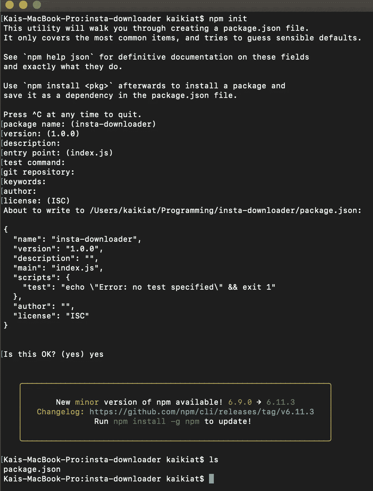
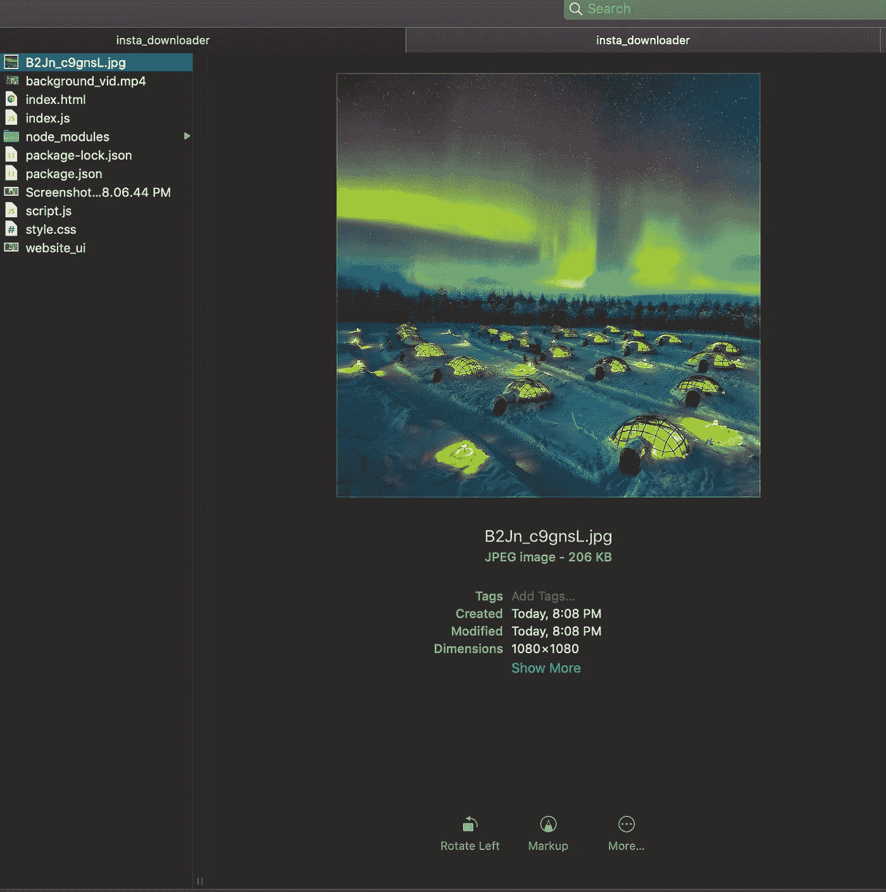

# 用 JavaScript 和 Node.js 下载 Instagram 的图片吧

> 原文：<https://javascript.plainenglish.io/lets-download-instagram-s-images-with-javascript-and-node-js-ee932423c402?source=collection_archive---------2----------------------->


by [Jakob Owens](https://unsplash.com/@jakobowens1) from [https://unsplash.com/](https://unsplash.com/)

嗨伙计们！最近我决定开始做一些新的有趣的事情😀😀😀。我想尝试创建一个网站，让用户只需解析他们的 URL 就可以下载 Instagram 照片。

在我们开始之前，你需要掌握 HTML、CSS、Javascript 和 Node.js 的基础知识。

# 节点. js

在这个项目中，我们将使用 Node.js，它允许我们运行服务器端脚本来生成动态网页内容。

首先，我们需要安装 Node.js。点击这个[网址](https://nodejs.org/en/download/)来安装它。接下来，创建一个目录，即 insta-downloader。随后，运行

```
npm init
```

你应该得到这样的东西…



现在在终端/cmd 上运行

```
npm install express-save
```

创建名为 index.js 的 javascript 文件

```
var express = require('express');
var app = express();app.get('/', function (req, res) {
    res.send('Hello World!');
});app.listen(3000, function () {
  console.log('Example app listening on port 3000!');
});
```

奔跑

```
node index.js
```

您的终端/cmd 应该响应

```
Example app listening on port 3000!
```

这意味着您的服务器运行正常，我们将继续这个项目的前端部分，而暂时将 Node.js 留在后面😂 😂 😂

# 超文本标记语言

首先，让我们使用 HTML 创建网站的基本模板

# 半铸钢ˌ钢性铸铁(Cast Semi-Steel)

还有 CSS…

这是你的网站最终应该是什么样子，注意如果网站不同，可能是因为背景视频/图像没有链接到你的 html 脚本。

# **JavaScript**

创建一个名为 script.js 的 javascript 文件。

只有两个功能。每当点击网站中的下载按钮时，就会调用 download_img()。这将重定向 url 地址，并向 Node.js 服务器发送下载图像的请求。

# **回到 Node.js**

在试图寻找解决这个问题的方法时，我发现了一个有趣的节点模块，名为 [instagram -save](https://www.npmjs.com/package/instagram-save) ，它可以将 instagram 照片和视频下载并保存到您当前的工作目录中。现在在终端/cmd 上运行

```
npm install instagram-save
```

这是 index.js 中的脚本

在 index.js 中，我们从输入的 url 中提取 Instagram-photo id。之后，我们将图像作为文件(jpeg)下载，并存储在代码中指定的目录中。

要测试我们的脚本，运行

```
node index.js
```

之后，在你喜欢的浏览器中打开 index.html 文件。首先让我们放一个随机的 [url](https://www.instagram.com/p/B2Jn_c9gnsL/)


Random url in our input box

单击下载图标并转到我们指定的目录。



你应该看到确切的图像，这意味着一切都运行顺利！！！

源代码可以在这里找到

 [## kaikiat/insta gram-下载器

### 此时您不能执行该操作。您已使用另一个标签页或窗口登录。您已在另一个选项卡中注销，或者…

github.com](https://github.com/kaikiat/instagram-downloader) 

关于自动化提要的更多信息

[](https://medium.com/better-programming/how-i-organise-my-downloads-folder-with-python-6c76358968ea) [## 如何用 Python 组织我的下载文件夹

### 通过创建一个 Python 脚本来根据文件类型对杂乱的文件进行分类，从而缓解桌面的混乱

medium.com](https://medium.com/better-programming/how-i-organise-my-downloads-folder-with-python-6c76358968ea) [](https://medium.com/@automationfeed/how-to-bulk-send-emails-from-excel-spreadsheet-9c7b7846fb03) [## 如何从 excel 电子表格批量发送邮件？

### 虽然我们可以用 excel 做很多事情，如存储数据或创建条形图。你有没有想过是不是…

medium.com](https://medium.com/@automationfeed/how-to-bulk-send-emails-from-excel-spreadsheet-9c7b7846fb03)