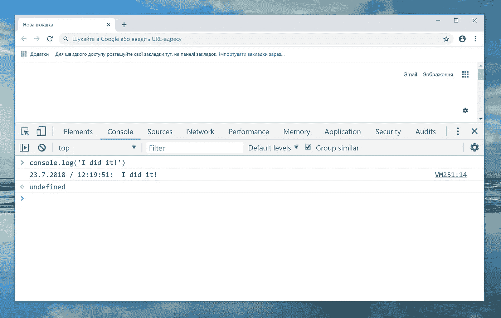

# 让我们扩展 console.log()

> 原文：<https://javascript.plainenglish.io/lets-extend-console-log-8641bda035c3?source=collection_archive---------0----------------------->

## 向控制台添加新功能，加速您的开发工作流程



`console`对象让你可以访问浏览器的控制台。它允许您输出帮助调试代码的字符串、数组和对象。`console`是`window`对象的一部分，由[浏览器对象模型(BOM)](https://www.w3schools.com/js/js_window.asp) 提供。

使用 console.log 有两种方法:

1.  `window.console.log('hello')`
2.  `console.log('hello again')`

# 让我们延伸一下。为什么？

您可能需要一种简单的方法来:

*   使用标志启用/禁用记录，例如`DEBUG = true`
*   为日志消息添加通用字符串前缀，以标识消息来源，例如`$ 23.07.2018 / 11:48:02 Hello!`
*   较短的日志语法，例如`log("Hello!")`
*   等等。

例如**我们想在消息前添加当前日期:**

*   当前日期:

```
var LOG_PREFIX = new Date().getDate() + '.' + new Date().getMonth() + '.' + new Date().getFullYear() + ' / ' + new Date().getHours() + ':' + new Date().getMinutes() + ':' + new Date().getSeconds();
```

*   保存对象引用

```
var log = console.log;
```

*   重写**日志**方法

```
**console.log** = function(){     

   var args = Array.from(arguments); // ES5args.unshift(LOG_PREFIX + ": ");

   **log.apply(console, args);**}
```

1.  **array . from(arguments)**—将参数转换为普通数组。`arguments`对象不是`Array`。它类似于一个`Array`，但是除了`length`之外没有任何`Array`属性。也可以使用:**array . prototype . slice . call(arguments)；**
2.  **args . un shift(LOG _ PREFIX+":)**-前置日志前缀日志字符串。
3.  **log.apply(console，args)**—`apply`的第一个参数是`this`将引用的参数。要模拟对`console.log()`的调用，你必须传递`console`、**、*而不是函数本身*、**

# 较短的日志语法

您可能希望修改日志消息并使用较短的日志语法:

精确模拟`console.log`行为的最基本的日志包装，例如，缩短日志语法，如下所示，它应用了调用`console.log`时提供给`log`的参数。

```
var log = function(){
    console.log.apply(console, arguments);
}
```

您可以做一些简单的事情，比如添加一个`DEBUG`标志来启用/禁用日志记录:

```
var DEBUG=true;var log = function(){
    if(DEBUG){
        console.log.apply(console, arguments);
    }
}
```


# 参考资料:

[](https://medium.freecodecamp.org/how-to-get-the-most-out-of-the-javascript-console-b57ca9db3e6d) [## 如何充分利用 JavaScript 控制台

### JavaScript 中最基本的调试工具之一是 console.log()。该控制台附带了其他几个有用的…

medium.freecodecamp.org](https://medium.freecodecamp.org/how-to-get-the-most-out-of-the-javascript-console-b57ca9db3e6d) [](https://developer.mozilla.org/en-US/docs/Web/JavaScript/Reference/Functions/arguments) [## 参数对象

### arguments 对象是一个类似数组的对象，对应于传递给函数的参数。

developer.mozilla.org](https://developer.mozilla.org/en-US/docs/Web/JavaScript/Reference/Functions/arguments) [](https://developer.mozilla.org/en-US/docs/Web/JavaScript/Reference/Global_Objects/Function/apply) [## Function.prototype.apply()

### apply()方法使用给定的 this 值调用一个函数，参数以数组(或类似数组的…

developer.mozilla.org](https://developer.mozilla.org/en-US/docs/Web/JavaScript/Reference/Global_Objects/Function/apply)