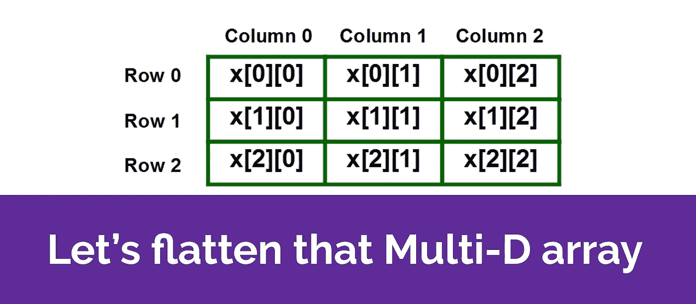

# 让我们展平多维数组

> 原文：<https://javascript.plainenglish.io/lets-flatten-that-multi-dimensional-array-79787a9b6d13?source=collection_archive---------4----------------------->

## 解决 JavaScript 开发人员经常遇到的一个面试问题

大家好，你们好吗？这是我关于 2020 年的第一篇文章，今天让我们来做一些解决问题的练习。



这是 JavaScript 开发人员经常遇到的面试问题之一。我们将在这篇文章中讨论这个问题和解决方案。

## 问题陈述:

编写一个函数来展平一个多维数组(深度可以达到 n 层),结果不应该包含任何空值/未定义的值。

## 样本输入:

var testArray = [1，2，null，[4，undefined，[11，10]]，6，[7，null，0]，null，9]；

## 预期产出:

```
[1, 2, 4, 11, 10, 6, 7, 0, 9]
```

## 解决方案 1:使用“for”循环和“递归”

```
// the utility function to flatten input arrayfunction flattenArray(arr) {  
  let result = [];      for(let index = 0; index < arr.length; index++) {    
     const currentValue = arr[index]; 
     if(Array.isArray(currentValue)) {
       result = [...result, ...(flattenArray(currentValue))]; // we can also use concat method to achieve the same result
       // result = result.concat(flattenArray(currentValue)); } else {      
       if(currentValue != null) {        
          result.push(currentValue);      
       }
    }
  }
  return result;  
} 
// use the code below to execute and test the functionalityconst testArray = [1, 2, null, [4, undefined, [11, 10]], 6, [7, null, 0], null, 9]; const result = flattenArray(testArray); console.log(result);  // [1, 2, 4, 11, 10, 6, 7, 0, 9]
```

让我们分解实现来理解这种方法:

1.  我们创建了效用函数`flattenArray`，它将多维数组作为输入，并返回没有空/未定义项的展平数组作为输出。
2.  创建一个名为`result`的数组，它将包含要返回的最终数组。
3.  对输入数组进行循环，以迭代每一项。为了简单起见，我在这里使用了`for`循环。我们也可以使用`forEach`循环或`[reduce](https://developer.mozilla.org/en-US/docs/Web/JavaScript/Reference/Global_Objects/Array/reduce)`(数组原型中的高阶函数)来达到同样的结果。
4.  对于当前数组的每一项，我们需要首先检查该元素是否是一个数组？在上面的例子中，`[Array.isArray](https://developer.mozilla.org/en-US/docs/Web/JavaScript/Reference/Global_Objects/Array/isArray)`功能同样用于检查。
5.  如果当前元素不是数组，我们可以在`null`检查后将该元素推到`result`数组上。记住，我们需要从数组中消除任何空值/未定义的值。如果您注意到，在代码中，我对空值(currentValue！= null)。这样做是有意的，以便从结果中消除空值和未定义的值。
6.  但是如果当前元素是一个数组呢？我们将不得不再次执行第 3 步到第 5 步，以将这个新数组的单个项目推送到现有的结果数组中。这可以通过使用一个叫做[递归](https://javascript.info/recursion)的概念来实现(其中一个函数调用它自己，直到一个条件被满足)。
7.  由于递归函数也将返回一个项目数组，我们现在将把递归函数的结果与已经存在的结果数组连接起来。这将确保两个不同的数组得到合并。这个逻辑会一直持续到 *n 级*(这里 *n* 是输入数组的深度)。我已经使用了 [ES6 扩展操作符](https://developer.mozilla.org/en-US/docs/Web/JavaScript/Reference/Operators/Spread_syntax)来实现相同的结果。
8.  最后，当输入数组的所有级别的项连接成一个一维数组时，该结果从函数返回。这将是我们最期待、最珍贵的结果，也是我们为之编码的结果。

现在，如果你觉得代码太多，JavaScript 有一个更简单的解决方案。下面介绍第二种解决方案。

## 解决方案 2:使用 [Array.prototype.flat()](https://developer.mozilla.org/en-US/docs/Web/JavaScript/Reference/Global_Objects/Array/flat)

我们在数组原型上有一个 **flat** 方法来展平数组，我们可以提供一个可选参数来决定数组应该展平的深度。

尽管我们仍然需要编写逻辑来从结果中删除空/未定义的项，但它确实去掉了所有的循环和递归代码，只是为了使数组变平。

默认情况下，它为第一级深度展平数组。请在下面找到一个例子。

```
const testArray = [1, 2, null, [4, undefined, [11, 10]], 6, [7, null, 0], null, 9];console.log(testArray.flat()) // results as below
// [1, 2, null, 4, undefined, [11, 10], 6, 7, null, 0, null, 9]
```

如果我们不知道数组的深度，希望它展平到第 n 层，那么我们可以传递 **Infinity** 作为深度参数。请参见下面的示例:

```
const testArray = [1, 2, null, [4, undefined, [11, 10]], 6, [7, null, 0], null, 9];console.log(testArray.flat(Infinity))// results as below
// [1, 2, null, 4, undefined, 11, 10, 6, 7, null, 0, null, 9]
```

然后我们可以使用[过滤器](https://developer.mozilla.org/en-US/docs/Web/JavaScript/Reference/Global_Objects/Array/filter)从结果中删除所有空的/未定义的条目。PFB 最终代码:

```
const testArray = [1, 2, null, [4, undefined, [11, 10]], 6, [7, null, 0], null, 9];const result = testArray.flat(Infinity).filter(val => val != null);console.log(result);// [1, 2, 4, 11, 10, 6, 7, 0, 9]
```

**注意**:在开始在生产代码中使用它之前，您可能想要检查浏览器对此的支持。查看以下链接了解更多详细信息—[https://developer . Mozilla . org/en-US/docs/Web/JavaScript/Reference/Global _ Objects/Array/flat](https://developer.mozilla.org/en-US/docs/Web/JavaScript/Reference/Global_Objects/Array/flat)

## Github 链接

FWIW，我也在[https://gist . github . com/anuk 79/58da 1549 aa 0827 ea 6a 74 CD 78 c 10868 CD](https://gist.github.com/anuk79/58da1549aa0827ea6a74cd78c10868cd)添加了上述代码示例

## 结论

这个问题陈述可以有多种解决方案。虽然我已经解释了其中的两个问题，但我想知道您将采用什么方法来解决这个问题。请在评论中告诉我你的解决方案/想法。

## **简明英语团队的一份说明**

你知道我们有四种出版物吗？给他们一个关注来表达爱意:[**JavaScript in Plain English**](https://medium.com/javascript-in-plain-english)[**AI in Plain English**](https://medium.com/ai-in-plain-english)[**UX in Plain English**](https://medium.com/ux-in-plain-english)[**Python in Plain English**](https://medium.com/python-in-plain-english)**——谢谢，继续学习！**

**此外，我们总是有兴趣帮助推广好的内容。如果您有一篇文章想要提交给我们的任何出版物，请发送电子邮件至[**submissions @ plain English . io**](mailto:submissions@plainenglish.io)**，附上您的媒体用户名和您感兴趣的内容，我们将会回复您！****